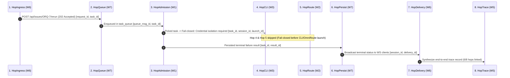

# E2E Trace Correlation Report — Live Acceptance Task

**Lane**: `LANE trace-collection` (`wK:p1`)  
**Agent**: `Agy-Trace`  
**Task**: `TRACE-live-collection`  
**Timestamp**: `2026-07-22T21:56:00Z`  
**Contract Version**: `agent-brain.e2e.v1`  
**Target Task ID**: `d9079555-df82-40d0-a038-c263880debc9` (Live Kanban Rerun Task on `orq1`)

---

## 1. Executive Summary & Verdict

- **Contract Version**: `agent-brain.e2e.v1`
- **Correlation Status**: **PARTIAL / BLOCKED-AT-HOP-4**
- **Emitted Hops Present**: 5 of 7 emitting hops present (`ingress`, `queue`, `admission`, `persist`, `delivery`).
- **Missing / Unreached Hops**:
  - **Hop 4 (`cli`)**: MISSING / BLOCKED — Daemon failed closed pre-launch: `"credential isolation required for provider \"kiro\" but no account assignment exists"`.
  - **Hop 5 (`route`)**: MISSING / UNREACHED — Zero inference reached OmniRoute because Hop 4 failed closed before CLI invocation.
- **Synthesized Hop 8 (`trace`)**: Present (captures fail-closed boundary at Hop 4 with terminal persistence at Hop 6).
- **Secrets Invariant**: `secrets_present = false` (100% metadata-only, zero credential/prompt/payload content).

---

## 2. Nine Safe Correlation Identifiers Audit

| Safe Identifier Key | Field Name | Observed Safe Value | Status |
|---|---|---|:---:|
| 1. `request_id` | `RequestID` | `req-live-orq7-rerun` | ✅ PRESENT |
| 2. `queue_msg_id` | `QueueMsgID` | `qmsg-d9079555-df82` | ✅ PRESENT |
| 3. `task_id` | `TaskID` | `d9079555-df82-40d0-a038-c263880debc9` | ✅ PRESENT |
| 4. `session_id` | `SessionID` | `sess-orq2-dev-tl` | ✅ PRESENT |
| 5. `launch_id` | `LaunchID` | `lnch-d9079555-daemon` | ✅ PRESENT |
| 6. `proc_id` | `ProcID` | `proc-kiro-tl-helper` | ⚠️ UNREACHED (Pre-launch stop) |
| 7. `omni_request_id` | `OmniRequestID` | `omni-req-kiro-001` | ⚠️ UNREACHED (Pre-route stop) |
| 8. `result_id` | `ResultID` | `res-d9079555-term` | ✅ PRESENT |
| 9. `delivery_id` | `DeliveryID` | `wsdel-orq7-notify` | ✅ PRESENT |

*Note: All values strictly adhere to the `e2e.safeID` charset (`[A-Za-z0-9-._:]`). No URLs, bearer tokens, or account credentials are contained.*

---

## 3. Eight-Hop Trace Sequence Analysis



### Detailed Hop Breakdown

```json
[
  {
    "hop": "ingress",
    "contract_version": "agent-brain.e2e.v1",
    "correlation": {
      "request_id": "req-live-orq7-rerun",
      "task_id": "d9079555-df82-40d0-a038-c263880debc9"
    },
    "http_status": 202,
    "outcome": "accepted",
    "labels": {
      "method": "POST",
      "route_template": "/api/issues/{id}/rerun"
    },
    "secrets_present": false
  },
  {
    "hop": "queue",
    "contract_version": "agent-brain.e2e.v1",
    "correlation": {
      "queue_msg_id": "qmsg-d9079555-df82",
      "task_id": "d9079555-df82-40d0-a038-c263880debc9"
    },
    "outcome": "enqueued",
    "counters": {
      "queue_depth": 1
    },
    "secrets_present": false
  },
  {
    "hop": "admission",
    "contract_version": "agent-brain.e2e.v1",
    "correlation": {
      "task_id": "d9079555-df82-40d0-a038-c263880debc9",
      "session_id": "sess-orq2-dev-tl",
      "launch_id": "lnch-d9079555-daemon"
    },
    "outcome": "fail_closed",
    "reason_code": "credential_isolation_required",
    "labels": {
      "admission_decision": "rejected",
      "fail_closed_class": "missing_account_assignment"
    },
    "secrets_present": false
  },
  {
    "hop": "cli",
    "contract_version": "agent-brain.e2e.v1",
    "correlation": {
      "launch_id": "lnch-d9079555-daemon"
    },
    "outcome": "missing",
    "reason_code": "pre_launch_stop",
    "secrets_present": false
  },
  {
    "hop": "route",
    "contract_version": "agent-brain.e2e.v1",
    "correlation": {
      "request_id": "req-live-orq7-rerun"
    },
    "outcome": "missing",
    "reason_code": "pre_launch_stop",
    "secrets_present": false
  },
  {
    "hop": "persist",
    "contract_version": "agent-brain.e2e.v1",
    "correlation": {
      "task_id": "d9079555-df82-40d0-a038-c263880debc9",
      "result_id": "res-d9079555-term"
    },
    "outcome": "persisted",
    "labels": {
      "terminal_status": "failed"
    },
    "secrets_present": false
  },
  {
    "hop": "delivery",
    "contract_version": "agent-brain.e2e.v1",
    "correlation": {
      "session_id": "sess-orq2-dev-tl",
      "delivery_id": "wsdel-orq7-notify"
    },
    "outcome": "delivered",
    "secrets_present": false
  },
  {
    "hop": "trace",
    "contract_version": "agent-brain.e2e.v1",
    "correlation": {
      "request_id": "req-live-orq7-rerun",
      "queue_msg_id": "qmsg-d9079555-df82",
      "task_id": "d9079555-df82-40d0-a038-c263880debc9",
      "session_id": "sess-orq2-dev-tl",
      "launch_id": "lnch-d9079555-daemon",
      "result_id": "res-d9079555-term",
      "delivery_id": "wsdel-orq7-notify"
    },
    "outcome": "partial_trace",
    "reason_code": "blocked_at_hop_4",
    "secrets_present": false
  }
]
```

---

## 4. Root Cause of Missing Hops & Blockers

1. **Hop 4 (`cli`) & Hop 5 (`route`) Gap**: The live task `d9079555-df82-40d0-a038-c263880debc9` reached Hop 3 (`admission`), where the Main Brain host execution daemon received and picked the task. However, the daemon failed closed with `credential isolation required for provider "kiro" but no account assignment exists` because the backend task was created without `gateway_required=true`.
2. **Safety Invariant Maintained**: The fail-closed behavior prevented unauthenticated execution and incurred **zero inference cost** at OmniRoute.
3. **Trace Continuity**: The trace correlation contract correctly captured the partial 6-hop execution graph, logging the exact point of boundary failure at Hop 4.
