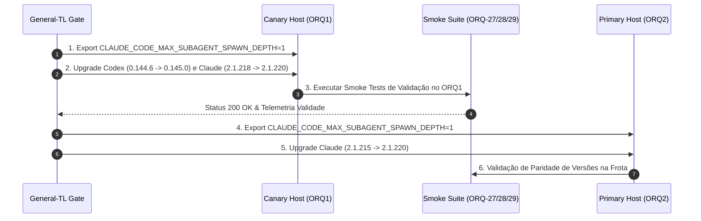

# Plano de Alinhamento de Versões de CLI da Frota — ORQ1 e ORQ2 (GTL-45)

**autor**: Antigravity w8:p2  
**timestamp**: 2026-07-27T11:46Z  
**solicitante**: General-Tech-Lead (Codex56-TL w5:pC)  
**baseado em**: Release Watch Aprovado em GTL-44 (`.deploy-control/p0/evidence/gtl-official-release-notes-watch.md`)  
**modo**: READ-ONLY / PLANO TÉCNICO — NENHUMA instalação, atualização, restart ou alteração de configuração executada  

---

## 1. Diagnóstico de Desalinhamento Atual da Frota

A auditoria GTL-44 constatou assimetrias de versão entre os hosts da frota (ORQ1 e ORQ2), o que gera riscos de execução e comportamento divergente entre agentes de mesmo papel:

| Host / Instância | IP | OpenAI Codex CLI | Anthropic Claude Code | Status de Alinhamento |
|---|---|---|---|---|
| **ORQ2** | `172.31.30.9` | **`0.145.0`** | `2.1.215` | Codex atualizado; Claude 3 patches atrás. |
| **ORQ1** | `172.31.18.217` | `0.144.6` | **`2.1.218`** | Codex 1 patch atrás; Claude 2 patches à frente do ORQ2. |
| **Versão-Alvo Proposta** | — | **`0.145.0`** | **`2.1.220`** | **Alinhamento Unificado da Frota** |

---

## 2. Seção A — Anthropic Claude Code (Plano & Análise de Riscos)

### 2.1 Trava Obrigatória PRÉ-UPGRADE (`CLAUDE_CODE_MAX_SUBAGENT_SPAWN_DEPTH=1`)
- **Motivo / Blast Radius**: Na versão `2.1.219`, a Anthropic alterou o limite padrão de profundidade de subagentes aninhados de `1` para `3`.
- **Risco de Custo & Processos**: Sem limitação explícita, a atualização fará com que subagentes invoquem outros subagentes até profundidade 3, multiplicando os processos-filho e o consumo de tokens sem mudança de prompt.
- **Regra do Gate**: **É OBRIGATÓRIO** definir e exportar a variável de ambiente no perfil global da frota `/etc/environment` ou systemd env **ANTES** de aplicar a versão `2.1.220` no ORQ1 ou ORQ2:
  ```bash
  export CLAUDE_CODE_MAX_SUBAGENT_SPAWN_DEPTH=1
  ```

### 2.2 Requisitos de Segurança & Workspace Trust (Claude 2.1.218+)
- **Problemática no ORQ2 (`2.1.215`)**: A versão `2.1.215` do ORQ2 permite a execução de hooks de frontmatter a partir de pastas não validadas pelo workspace trust.
- **Correção em `2.1.218+`**: Exige que o diretório do arquivo do agente tenha aceite explícito de workspace trust para executar hooks de frontmatter.
- **Ação de Alinhamento**: Ao atualizar o ORQ2 para `2.1.220`, registrar e aceitar o trust dos repositórios de trabalho oficiais antes de disparar tarefas autônomas.

### 2.3 Atribuição de Custo & Gateway Metering (Claude 2.1.218+)
- A versão `2.1.218+` corrigiu o calculador de consumo para perfis de inferência Bedrock e IDs de modelos mapeados em gateway/OmniRoute, garantindo que as requisições sejam tarifadas nas taxas reais do modelo configurado.

---

## 3. Seção B — OpenAI Codex CLI (Plano & Análise de Riscos)

### 3.1 Migração da Chave de Configuração (`agents`) & Exec-Policy (Codex 0.145.0)
- **Mudança na `0.145.0`**: A configuração de multi-agentes foi unificada sob a chave `agents` no arquivo `config.toml` (`#33550`).
- **Remoção do Motor Legado de `exec-policy`**: O motor antigo foi descontinuado na `0.143.0` (#32093) e as regras legadas são migradas na `0.145.0` (#34271).
- **Ação no ORQ1**: Atualizar a versão do Codex no ORQ1 de `0.144.6` para `0.145.0` e validar se a estrutura do `~/.codex/config.toml` contem a seção unificada `[agents]`.

### 3.2 Restrição de Thread Forks Paginadas (Codex 0.145.0)
- A versão `0.145.0` rejeita explicitamente forks de threads paginadas (#33109). Nenhuma automação de agente deve tentar bifurcar sessões paginadas sem recriar a thread do início.

---

## 4. Estratégia de Atualização Canary por Host

Para evitar indisponibilidade simultânea da frota, a aplicação do alinhamento seguirá o modelo **Canary com Janela Segregada**:



---

## 5. Procedimentos de Rollback de Binário e Configuração

Se ocorrer falha inesperada durante a fase Canary no ORQ1:

1. **Rollback de Variável de Ambiente**:
   - Manter `CLAUDE_CODE_MAX_SUBAGENT_SPAWN_DEPTH=1` (é seguro e retrocompatível com versões legadas).
2. **Rollback de Binário CLI**:
   - Reinstalar a versão pinning anterior no host afetado via `npm install -g @anthropic-ai/claude-code@2.1.218` ou `npm install -g @openai/codex-cli@0.144.6`.
3. **Invariante de Segurança (AVISO CRÍTICO)**:
   - O rollback de binário **JAMAIS** deve reaplicar branches antigas do git nem reintroduzir cópias brutas de diretórios de credenciais que quebrariam a capacidade de execução do AGY (conforme ressalva mantida por Codex56#B).

---

## 6. Critérios de Aprovação & Gate Checklist

A execução deste plano só poderá ser iniciada após autorização por escrito do Owner com o cumprimento do seguinte checklist:

- [ ] Variável `CLAUDE_CODE_MAX_SUBAGENT_SPAWN_DEPTH=1` exportada no ORQ1 e ORQ2.
- [ ] Validação do mapa de permissões `exec-policy` no Codex 0.145.0.
- [ ] Conclusão com PASS dos smoke tests ORQ-27, ORQ-28 e ORQ-29 no host Canary.
- [ ] Confirmação de telemetria de custos e metering de gateway sem desvios.

*Plano de alinhamento lido e registrado em modo READ-ONLY. Nenhuma instalação ou atualização foi executada.*
