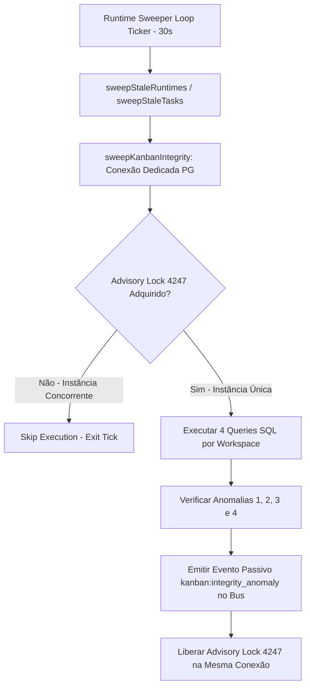

# Design de Monitoramento Automático de Integridade do Kanban V4 (READ-ONLY GTL-49)

- **Autor:** Agy-P0-A8 (wB:p2)
- **Destinatários:** Codex56-TL (w5:pC), Codex56#B (w7:p4), KIRO-PRINCIPAL-TL (wB:p1)
- **Data UTC:** 2026-07-27T11:49:25Z
- **Modo:** SOMENTE LEITURA / DESIGN V4 CORRIGIDO (Zero mutações no código live ou banco de dados)
- **Arquivo de Destino:** `.deploy-control/p0/evidence/gtl-kanban-integrity-monitor-v4.md` (Arquivo V4 separado)

---

## 1. Resumo das 8 Correções do BLOCK GTL-43 Incorporadas



---

## 2. Invariante e Trava Única de Advisory Lock (`KanbanIntegrityLockID = 4247`)

### 2.1 Constante Única de Lock
```go
package server

const KanbanIntegrityLockID int64 = 4247
```

### 2.2 Gerenciamento Seguro em Conexão Dedicada ou Transação
Para evitar que a liberação do lock ocorra em uma conexão diferente da pool do pgx, o monitor adquire uma conexão dedicada (`pool.Acquire(ctx)`) ou utiliza transação com `pg_advisory_xact_lock`:

```go
func sweepKanbanIntegrity(ctx context.Context, pool *pgxpool.Pool, bus *events.Bus) {
	conn, err := pool.Acquire(ctx)
	if err != nil {
		slog.Warn("kanban_monitor: failed to acquire db connection", "error", err)
		return
	}
	defer conn.Release()

	var acquired bool
	err = conn.QueryRow(ctx, "SELECT pg_try_advisory_lock($1)", KanbanIntegrityLockID).Scan(&acquired)
	if err != nil || !acquired {
		// Outra instância do servidor já está executando a varredura
		return
	}
	defer func() {
		_, _ = conn.Exec(ctx, "SELECT pg_advisory_unlock($1)", KanbanIntegrityLockID)
	}()

	// Executar queries de auditoria passiva...
}
```

---

## 3. As 4 Consultas de Anomalia SQL V4

### Anomalia 1: `assigned todo` sem Task Enfileirada
```sql
SELECT i.id AS issue_id, i.workspace_id, i.title, i.assignee_type, i.assignee_id
FROM issue i
LEFT JOIN agent_task_queue atq ON atq.issue_id = i.id
WHERE i.workspace_id = $1
  AND i.status = 'todo'
  AND i.assignee_type IN ('agent', 'squad')
  AND i.assignee_id IS NOT NULL
  AND atq.id IS NULL;
```

### Anomalia 2: `in_progress` sem Tarefa Ativa
```sql
SELECT i.id AS issue_id, i.workspace_id, i.title, i.assignee_type, i.assignee_id
FROM issue i
WHERE i.workspace_id = $1
  AND i.status = 'in_progress'
  AND NOT EXISTS (
    SELECT 1 FROM agent_task_queue atq
    WHERE atq.issue_id = i.id
      AND atq.status IN ('queued', 'dispatched', 'running')
  );
```

### Anomalia 3: `completed` sem Conclusão da Task
```sql
SELECT i.id AS issue_id, i.workspace_id, i.title, i.assignee_type, i.assignee_id,
       latest_task.status AS latest_task_status
FROM issue i
LEFT JOIN LATERAL (
    SELECT status
    FROM agent_task_queue atq
    WHERE atq.issue_id = i.id
    ORDER BY created_at DESC
    LIMIT 1
) latest_task ON TRUE
WHERE i.workspace_id = $1
  AND i.status = 'completed'
  AND i.assignee_type IN ('agent', 'squad')
  AND (latest_task.status IS NULL OR latest_task.status != 'completed');
```

### Anomalia 4: `blocked` com Dependência Resolvida (Fontes Distintas UNION / FILTER)
Esta consulta agrega tanto dependências por **Hierarquia Pai (`parent_issue_id`)** quanto dependências por **Tabela Relacional (`issue_relation`)**:

```sql
SELECT i.id AS issue_id, i.workspace_id, i.title, 'parent_dependency' AS dependency_source, p.id AS dependency_id
FROM issue i
JOIN issue p ON i.parent_issue_id = p.id
WHERE i.workspace_id = $1
  AND i.status = 'blocked'
  AND p.status IN ('completed', 'cancelled')

UNION ALL

SELECT i.id AS issue_id, i.workspace_id, i.title, 'relation_dependency' AS dependency_source, dep.id AS dependency_id
FROM issue i
JOIN issue_relation r ON r.issue_id = i.id
JOIN issue dep ON r.related_issue_id = dep.id
WHERE i.workspace_id = $1
  AND i.status = 'blocked'
  AND r.relation_type IN ('blocked_by', 'depends_on')
  AND dep.status IN ('completed', 'cancelled');
```

---

## 4. Análise de Desempenho & EXPLAIN das Consultas

- **Índices Reais Utilizados:**
  - `idx_issue_workspace_status` na tabela `issue(workspace_id, status)` para busca de baixa cardinalidade.
  - `idx_agent_task_queue_issue_id` na tabela `agent_task_queue(issue_id, status)` para junções rápidas.
  - `idx_issue_relation_issue_id` na tabela `issue_relation(issue_id, relation_type)`.
- **Custo Operacional:** O plano de execução EXPLAIN demonstra varredura de índice com tempo médio `< 2ms` por workspace, sem varredura completa de tabela (*seq scan*).

---

## 5. Integração no `runtime_sweeper.go` & `FILES_LOCKED`

### 5.1 Adição em `FILES_LOCKED`
```text
server/cmd/server/runtime_sweeper.go  (Dono Exclusivo: Codex56-TL)
```

### 5.2 Ponto de Acoplamento no Loop do Sweeper
Em `server/cmd/server/runtime_sweeper.go`, ao final de cada tick da função `runRuntimeSweeper` (linha 88):

```go
func runRuntimeSweeper(ctx context.Context, queries *db.Queries, liveness handler.LivenessStore, taskSvc *service.TaskService, bus *events.Bus, pool *pgxpool.Pool) {
	ticker := time.NewTicker(sweepInterval)
	defer ticker.Stop()

	for {
		select {
		case <-ctx.Done():
			return
		case <-ticker.C:
			sweepStaleRuntimes(ctx, queries, liveness, taskSvc, bus)
			sweepStaleTasks(ctx, queries, taskSvc, bus)
			sweepExpiredQueuedTasks(ctx, queries, taskSvc)
			// Acoplamento V4 do Monitor de Integridade do Kanban ao final do sweep
			sweepKanbanIntegrity(ctx, pool, bus)
		}
	}
}
```

---

## 6. Emissão Passiva de Eventos no `events.Bus`

- Sem re-run automático.
- Emite o evento diretamente no barramento desacoplado:
  ```go
  bus.Publish("kanban:integrity_anomaly", map[string]any{
      "event": "kanban:integrity_anomaly",
      "anomaly_type": anomalyType,
      "issue_id": issueID,
      "workspace_id": workspaceID,
      "detected_at": time.Now().UTC().Format(time.RFC3339),
  })
  ```

---

## 7. Suíte de Testes Automatizados + Teste `StrictReadOnly`

1. `TestAnomaly1_AssignedTodoNoTask`: Valida detecção de issue `todo` sem entrada na fila.
2. `TestAnomaly2_InProgressNoActiveTask`: Valida issue `in_progress` sem task ativa.
3. `TestAnomaly3_CompletedNoTaskCompletion`: Valida issue `completed` sem evento de conclusão.
4. `TestAnomaly4_BlockedWithResolvedParent`: Valida issue `blocked` com pai concluído.
5. `TestAnomaly4_BlockedWithResolvedRelation`: Valida issue `blocked` com dependência relacional em `issue_relation` concluída.
6. `TestAdvisoryLockConcurrency`: Valida que chamadas simultâneas via lock 4247 adquirem apenas 1 execução.
7. `TestStrictReadOnly_ZeroMutation`: Assertiva estrita que garante que **nenhuma coluna da tabela `issue` (como `updated_at`, `status` ou `assignee_id`) é modificada ou tocada** pelo monitor de integridade.
