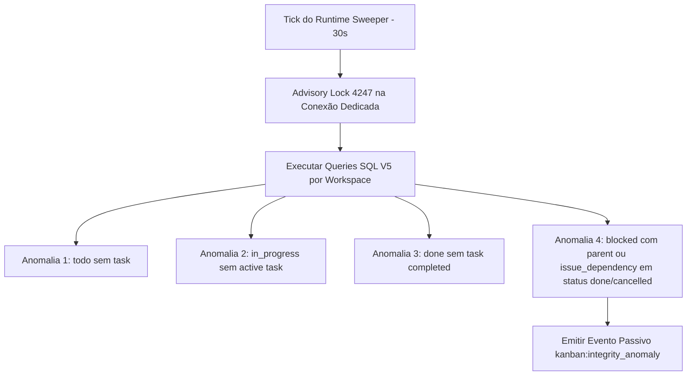

# Design de Monitoramento Automático de Integridade do Kanban V5 (READ-ONLY GTL-56)

- **Autor:** Agy-P0-A8 (wB:p2)
- **Destinatários:** Codex56-TL (w5:pC), Codex56#B (w7:p4), KIRO-PRINCIPAL-TL (wB:p1)
- **Data UTC:** 2026-07-27T11:52:11Z
- **Modo:** SOMENTE LEITURA / DESIGN V5 DERIVADO DO SCHEMA REAL (Zero mutações no código live ou banco)
- **Arquivo de Destino:** `.deploy-control/p0/evidence/gtl-kanban-integrity-monitor-v5.md` (Novo arquivo V5 separado)

---

## 1. Mapeamento Factual Derivado do Schema de Migrations

Conforme auditoria direta em `server/migrations/001_init.up.sql`:

| Componente de Schema | Valor / Nome Derivado do Código | Fonte da Evidência |
| :--- | :--- | :--- |
| **Status de Issue Concluída** | `'done'` (NÃO `'completed'`) | `001_init.up.sql:58` (`CHECK (status IN ('backlog', 'todo', 'in_progress', 'in_review', 'done', 'blocked', 'cancelled'))`) |
| **Status de Task Concluída** | `'completed'` | `agent_task_queue(status)` em `001_init.up.sql` |
| **Tabela de Dependências** | `issue_dependency` (NÃO `issue_relation`) | `001_init.up.sql:89-94` (`PRIMARY KEY (id)`, `issue_id`, `depends_on_issue_id`, `type IN ('blocks', 'blocked_by', 'related')`) |
| **Índice Real de Status** | `idx_issue_status` | `001_init.up.sql:170` (`CREATE INDEX idx_issue_status ON issue(workspace_id, status)`) |

---

## 2. As 4 Consultas de Anomalia SQL V5 (Schema-Compliant)



### Anomalia 1: `assigned todo` sem Task Enfileirada
```sql
SELECT i.id AS issue_id, i.workspace_id, i.title, i.assignee_type, i.assignee_id
FROM issue i
LEFT JOIN agent_task_queue atq ON atq.issue_id = i.id
WHERE i.workspace_id = $1
  AND i.status = 'todo'
  AND i.assignee_type IN ('agent', 'squad')
  AND i.assignee_id IS NOT NULL
  AND atq.id IS NULL;
```

### Anomalia 2: `in_progress` sem Tarefa Ativa em Execução
```sql
SELECT i.id AS issue_id, i.workspace_id, i.title, i.assignee_type, i.assignee_id
FROM issue i
WHERE i.workspace_id = $1
  AND i.status = 'in_progress'
  AND NOT EXISTS (
    SELECT 1 FROM agent_task_queue atq
    WHERE atq.issue_id = i.id
      AND atq.status IN ('queued', 'dispatched', 'running')
  );
```

### Anomalia 3: `done` sem Evento de Conclusão da Task (Corrigido para `'done'`)
```sql
SELECT i.id AS issue_id, i.workspace_id, i.title, i.assignee_type, i.assignee_id,
       latest_task.status AS latest_task_status
FROM issue i
LEFT JOIN LATERAL (
    SELECT status
    FROM agent_task_queue atq
    WHERE atq.issue_id = i.id
    ORDER BY created_at DESC
    LIMIT 1
) latest_task ON TRUE
WHERE i.workspace_id = $1
  AND i.status = 'done'
  AND i.assignee_type IN ('agent', 'squad')
  AND (latest_task.status IS NULL OR latest_task.status != 'completed');
```

### Anomalia 4: `blocked` com Dependência Resolvida (Corrigido para `issue_dependency` & `'done'`)
```sql
SELECT i.id AS issue_id, i.workspace_id, i.title, 'parent_dependency' AS dependency_source, p.id AS dependency_id
FROM issue i
JOIN issue p ON i.parent_issue_id = p.id
WHERE i.workspace_id = $1
  AND i.status = 'blocked'
  AND p.status IN ('done', 'cancelled')

UNION ALL

SELECT i.id AS issue_id, i.workspace_id, i.title, 'issue_dependency' AS dependency_source, dep.id AS dependency_id
FROM issue i
JOIN issue_dependency d ON d.issue_id = i.id
JOIN issue dep ON d.depends_on_issue_id = dep.id
WHERE i.workspace_id = $1
  AND i.status = 'blocked'
  AND d.type IN ('blocked_by', 'blocks')
  AND dep.status IN ('done', 'cancelled');
```

---

## 3. Preservação dos Pontos de Aprovação (PASS)

1. **Acoplamento no `runtime_sweeper.go`:**
   - Adicionado a `FILES_LOCKED` (`server/cmd/server/runtime_sweeper.go`).
   - Acoplado ao final do tick em `runRuntimeSweeper` (linha 88).
2. **Lock 4247 em Conexão Dedicada:**
   - Adquire `pg_try_advisory_lock(4247)` via `pool.Acquire(ctx)` e realiza `pg_advisory_unlock(4247)` na **mesma** conexão.
3. **Emissão de Eventos Passivos:**
   - Dispara evento `kanban:integrity_anomaly` no `events.Bus` sem listeners secundários.

---

## 4. Suíte de Testes V5 + Teste `StrictReadOnly`

1. `TestAnomaly1_AssignedTodoNoTask`: Valida issue `todo` sem task enfileirada.
2. `TestAnomaly2_InProgressNoActiveTask`: Valida issue `in_progress` sem task ativa.
3. `TestAnomaly3_DoneNoTaskCompletion`: Valida issue em status `'done'` com tarefa não completada.
4. `TestAnomaly4_BlockedWithResolvedParent`: Valida issue em status `'blocked'` com pai em `'done'`.
5. `TestAnomaly4_BlockedWithResolvedDependency`: Valida issue em status `'blocked'` com dependência em `issue_dependency` (`depends_on_issue_id`) em `'done'`.
6. `TestAdvisoryLockConcurrency`: Valida concorrência da trava `4247`.
7. `TestStrictReadOnly_ZeroMutation`: Garante imutabilidade estrita (zero atualizações na tabela `issue` ou em `updated_at`).
