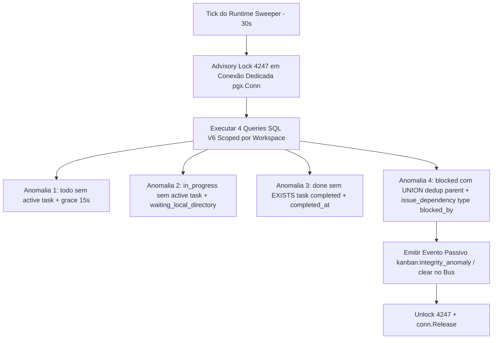

# Design de Monitoramento Automático de Integridade do Kanban V6 — Correção Orientada a Contraexemplos (READ-ONLY GTL-66)

**autor**: Antigravity w8:p2  
**timestamp**: 2026-07-27T12:03Z  
**solicitante**: General-Tech-Lead (Codex56-TL w5:pC)  
**fonte de verdade autoritativa**: `.deploy-control/p0/evidence/gtl-kanban-v5-deep-sql-audit.md` (Codex56#B - PASS V5 Revogado)  
**modo**: READ-ONLY / DESIGN V6 REVISADO — NENHUMA alteração de código, banco live, rede ou quadros executada  

---

## 1. Síntese de Correções Orientada aos Contraexemplos SQL Auditados

A versão V6 do Kanban Integrity Monitor corrige rigorosamente todas as falhas da V5 apontadas no audit profundo GTL-60:

| Anomalia / Mecanismo | Falha na V5 (Revogada) | Correção Definitiva na V6 |
|---|---|---|
| **Anomalia 1 (`todo`)** | `atq.id IS NULL` sem janela de graça; gerava falso positivo transiente durante atribuição. | Restaurada janela de graça `i.updated_at < now() - INTERVAL '15 seconds'` + `NOT EXISTS` de task ativa. |
| **Anomalia 2 (`in_progress`)** | Omitia `waiting_local_directory` da lista de tasks ativas. | Incluído `waiting_local_directory` explicitamente em `('queued', 'dispatched', 'running', 'waiting_local_directory')`. |
| **Anomalia 3 (`done`)** | `ORDER BY created_at DESC LIMIT 1 != 'completed'`; gerava falso positivo se houvesse retry pós-conclusão. | Reformatado para `EXISTS` de tarefa `completed` com `completed_at IS NOT NULL` independente de retries posteriores. |
| **Anomalia 4 (`blocked`)** | `UNION ALL` duplicava pai e dependências no array e incluía `d.type = 'blocks'` (sem semântica provada). | Uso de `UNION` (dedup `issue_id, dependency_id`), restrição a `d.type = 'blocked_by'`, e `jsonb_agg` por issue. |
| **Advisory Lock 4247** | Apenas declaração de intenção no texto. | Conexão dedicada `pool.Acquire(ctx)` onde `pg_try_advisory_lock`, queries e `pg_advisory_unlock` usam a **mesma** `pgx.Conn`. |
| **Suíte de Testes** | Apenas 7 testes "happy path". | Restabelecida a suíte completa com **11 testes adversariais** recomendados no GTL-60. |

---

## 2. As 4 Consultas de Anomalia SQL V6 (Schema & Semantic Compliant)



### 2.1 Anomalia 1: `assigned todo` sem Tarefa Ativa (`updated_at < now() - 15s`)
```sql
-- name: DetectAnomalyAssignedTodoNoActiveTask :many
SELECT i.id AS issue_id, i.workspace_id, i.title, i.assignee_type, i.assignee_id
FROM issue i
WHERE i.workspace_id = $1
  AND i.status = 'todo'
  AND i.assignee_type IN ('agent', 'squad')
  AND i.assignee_id IS NOT NULL
  AND i.updated_at < now() - INTERVAL '15 seconds'
  AND NOT EXISTS (
    SELECT 1 FROM agent_task_queue atq
    WHERE atq.issue_id = i.id
      AND atq.status IN ('queued', 'dispatched', 'running', 'waiting_local_directory')
  );
```

### 2.2 Anomalia 2: `in_progress` sem Tarefa Ativa (inclui `waiting_local_directory`)
```sql
-- name: DetectAnomalyInProgressNoActiveTask :many
SELECT i.id AS issue_id, i.workspace_id, i.title, i.assignee_type, i.assignee_id
FROM issue i
WHERE i.workspace_id = $1
  AND i.status = 'in_progress'
  AND NOT EXISTS (
    SELECT 1 FROM agent_task_queue atq
    WHERE atq.issue_id = i.id
      AND atq.status IN ('queued', 'dispatched', 'running', 'waiting_local_directory')
  );
```

### 2.3 Anomalia 3: `done` sem NENHUMA Tarefa Concluída (`CompletedThenRetry` Resiliente)
```sql
-- name: DetectAnomalyDoneNoCompletedTask :many
SELECT i.id AS issue_id, i.workspace_id, i.title, i.assignee_type, i.assignee_id
FROM issue i
WHERE i.workspace_id = $1
  AND i.status = 'done'
  AND i.assignee_type IN ('agent', 'squad')
  AND NOT EXISTS (
    SELECT 1 FROM agent_task_queue atq
    WHERE atq.issue_id = i.id
      AND atq.status = 'completed'
      AND atq.completed_at IS NOT NULL
  );
```

### 2.4 Anomalia 4: `blocked` com Dependência Resolvida (Deduplicada via `UNION` & `blocked_by`)
```sql
-- name: DetectAnomalyBlockedResolvedDependencies :many
WITH resolved_deps AS (
  -- Fonte 1: Hierarquia de Pai (parent_issue_id)
  SELECT i.id AS issue_id, i.workspace_id, i.title AS issue_title, p.id AS dependency_id
  FROM issue i
  JOIN issue p ON p.id = i.parent_issue_id
  WHERE i.workspace_id = $1
    AND i.status = 'blocked'
    AND p.status IN ('done', 'cancelled')

  UNION -- UNION remove duplicatas se a dependência estiver no Pai E em issue_dependency

  -- Fonte 2: Tabela de Dependências (issue_dependency com type = 'blocked_by')
  SELECT i.id AS issue_id, i.workspace_id, i.title AS issue_title, dep.id AS dependency_id
  FROM issue i
  JOIN issue_dependency d ON d.issue_id = i.id
  JOIN issue dep ON dep.id = d.depends_on_issue_id
  WHERE i.workspace_id = $1
    AND i.status = 'blocked'
    AND d.type = 'blocked_by'
    AND dep.status IN ('done', 'cancelled')
)
SELECT issue_id, workspace_id, issue_title,
       jsonb_agg(dependency_id ORDER BY dependency_id) AS resolved_dependencies
FROM resolved_deps
GROUP BY issue_id, workspace_id, issue_title;
```

---

## 3. Ciclo de Vida da Conexão Dedicada e Lock 4247

Para garantir a semântica do PostgreSQL `pg_try_advisory_lock`, a conexão DEVE ser explicitamente reservada do pool (`pool.Acquire(ctx)`):

```go
func sweepKanbanIntegrity(ctx context.Context, pool *pgxpool.Pool, bus *events.Bus) {
	conn, err := pool.Acquire(ctx)
	if err != nil {
		slog.Warn("kanban_monitor: failed to acquire db connection", "error", err)
		return
	}
	defer conn.Release()

	var acquired bool
	err = conn.QueryRow(ctx, "SELECT pg_try_advisory_lock($1)", KanbanIntegrityLockID).Scan(&acquired)
	if err != nil || !acquired {
		return // Instância secundária pula o tick limpidamente
	}
	defer func() {
		_, _ = conn.Exec(ctx, "SELECT pg_advisory_unlock($1)", KanbanIntegrityLockID)
	}()

	// Execução das 4 queries SQL V6 na MESMA conexão conn...
}
```

---

## 4. Rastreamento em Memória & Evento `kanban:integrity_anomaly_cleared`

- O monitor mantém `ActiveAnomalies map[string]Set` indexado por `(workspace_id, issue_id, anomaly_type)`.
- **Nova Anomalia**: Publica `kanban:integrity_anomaly` no `events.Bus`.
- **Anomalia Resolvida**: Se uma issue anteriormente anômala deixa de ser retornada pelas queries SQL, o monitor emite `kanban:integrity_anomaly_cleared`, fazendo com que o frontend (`board-card.tsx`) remova o alerta visual imediatamente.

### Isolamento de Listeners (Listener Isolation)
- Os eventos trafegam pelo `events.Bus` alcançando exclusivamente o Realtime WebSocket (`realtime.Hub`).
- Os registradores de `notification_listeners.go`, `activity_listeners.go` e `autopilot_listeners.go` não escutam e nem persistem linhas no banco para esses eventos.

---

## 5. Suíte Completa de 11 Testes Automáticos V6 (Gates GTL-60)

1. `TestAnomaly1_OldIssueAssignedNow_GracePeriod`: Valida que issue `todo` com `updated_at` recente (<15s) não gera anomalia transiente.
2. `TestAnomaly2_InProgressWaitingLocalDirectory_NoAnomaly`: Valida que task em `waiting_local_directory` é reconhecida como ativa.
3. `TestAnomaly3_CompletedThenRetry_NoAnomaly`: Valida que issue `done` com task concluída e retry posterior queued não é falso positivo.
4. `TestAnomaly4_ParentAndDependencyDedup_JsonbAgg`: Valida que se o pai também estiver em `issue_dependency`, a issue recebe apenas 1 evento com o array deduplicado.
5. `TestAnomaly4_MultiDependency_JsonbAgg`: Valida que múltiplas dependências resolvidas geram 1 evento com `jsonb_agg` ordenado.
6. `TestMonitor_AcrossTicksClearEventEmitted`: Valida a emissão do evento `kanban:integrity_anomaly_cleared` quando a anomalia é resolvida.
7. `TestMonitor_ListenerIsolation`: Valida que zero linhas são gravadas em tabelas de notificação ou atividade.
8. `TestAdvisoryLock_SameConnectionAcquireUnlock`: Valida que a aquisição, execução e liberação ocorrem obrigatoriamente no mesmo `*pgxpool.Conn`.
9. `TestMonitor_PostSweeperExecutionOrder`: Valida que o monitor roda após a execução das limpezas de tasks do `runtime_sweeper.go`.
10. `TestQueryPerformance_ExplainPlans`: Valida planos de execução `EXPLAIN` confirmando o uso de `idx_issue_status` com zero `Seq Scan`.
11. `TestStrictReadOnly_ZeroUpdatedAtMutation`: Valida imutabilidade estrita garantindo zero atualizações na tabela `issue` ou no campo `updated_at`.

---

## 6. Lista Factual Completa dos `FILES_LOCKED`

Os arquivos envolvidos no design e futura implementação são:
1. `server/cmd/server/runtime_sweeper.go` *(Ponto de chamada ao final do ticker loop)*
2. `server/cmd/server/main.go` *(Inicialização do serviço)*
3. `server/pkg/protocol/events.go` *(Constantes dos eventos `kanban:integrity_anomaly` e `cleared`)*
4. `server/pkg/db/queries/kanban_integrity.sql` *(Consultas SQL V6 com sqlc)*
5. `server/pkg/db/generated/kanban_integrity.sql.go` *(Código Go gerado)*
6. `server/internal/service/kanban_integrity.go` *(Lógica do monitor e de-duplicação)*
7. `packages/views/issues/components/board-card.tsx` *(Badge visual no card do Kanban)*

*Design V6 finalizado em modo READ-ONLY. Zero execuções ou mutações.*
