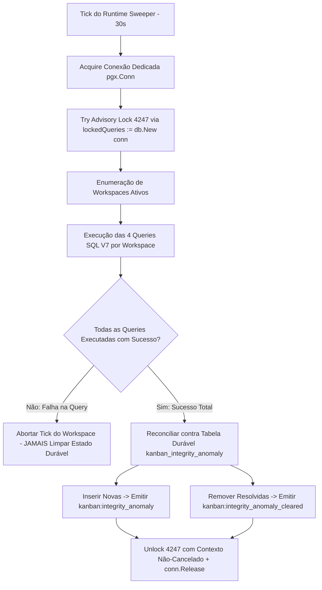

# Design de Monitoramento Automático de Integridade do Kanban V7 — Estado Durável e Hidratação (READ-ONLY GTL-75)

**autor**: Antigravity w8:p2  
**timestamp**: 2026-07-27T12:12Z  
**solicitante**: General-Tech-Lead (Codex56-TL w5:pC)  
**incorporando integralmente**: Auditoria GTL-67 (`.deploy-control/p0/evidence/gtl-kanban-v6-peer-review.md`)  
**modo**: READ-ONLY / DESIGN V7 ESTADO DURÁVEL — NENHUMA alteração de código, banco live, rede ou quadros executada  

---

## 1. Síntese de Arquitetura V7 — Estado Durável e Hidratação

O design V7 resolve a fragilidade fundamental da V6 (onde o estado em memória `ActiveAnomalies map` se perdia em restarts ou trocas de réplicas que adquiriam o advisory lock 4247). A V7 introduz um **armazenamento de estado durável** no PostgreSQL (`kanban_integrity_anomaly`), que preserva as anomalias ativas, garante deduplicação determinística em ambiente multi-instância e provê API de hidratação para o frontend (`board-card.tsx`).



### Invariantes Estritas Mantidas:
- **NENHUMA mutação na tabela `issue` ou `agent_task_queue`**: O monitor continua 100% estrito e passivo quanto às entidades principais.
- **Isolamento de Listeners**: Zero escritas em tabelas secundárias (`notification_listeners`, `activity_listeners`, `autopilot_listeners`).
- **Garantia Anti-Falso-Clear**: Falha em qualquer consulta SQL cancela a reconciliação do workspace. O evento `cleared` é emitido **estritamente após uma varredura completa e bem-sucedida**.

---

## 2. Placeholder de Migration Versionada (`NEXT_CANONICAL_MIGRATION.up.sql`)

> **Nota de Sequenciamento**: A migration não utiliza o prefixo 127 (reservado para ORQ-13) e aguarda o sequenciamento Z01 do repositório.

```sql
-- Migration Placeholder: NEXT_CANONICAL_MIGRATION_kanban_integrity_anomaly.up.sql

-- 1. Índice de Performance em issue_dependency para acelerar Anomalia 4
CREATE INDEX CONCURRENTLY IF NOT EXISTS idx_issue_dependency_issue_type_dep
  ON issue_dependency (issue_id, type, depends_on_issue_id);

-- 2. Tabela de Estado Durável do Monitor de Integridade do Kanban
CREATE TABLE IF NOT EXISTS kanban_integrity_anomaly (
    workspace_id UUID NOT NULL REFERENCES workspace(id) ON DELETE CASCADE,
    issue_id UUID NOT NULL REFERENCES issue(id) ON DELETE CASCADE,
    anomaly_type TEXT NOT NULL,
    details JSONB NOT NULL DEFAULT '{}'::jsonb,
    first_detected_at TIMESTAMPTZ NOT NULL DEFAULT now(),
    last_seen_at TIMESTAMPTZ NOT NULL DEFAULT now(),
    PRIMARY KEY (workspace_id, issue_id, anomaly_type)
);

CREATE INDEX IF NOT EXISTS idx_kanban_integrity_anomaly_ws
  ON kanban_integrity_anomaly(workspace_id);
```

---

## 3. As 4 Consultas de Anomalia SQL V7 com Guards Tenant

### 3.1 Anomalia 1: `assigned todo` sem Tarefa Ativa (`updated_at < now() - 15s`)
```sql
-- name: DetectAnomalyAssignedTodoNoActiveTask :many
SELECT i.id AS issue_id, i.workspace_id, i.title, i.assignee_type, i.assignee_id
FROM issue i
WHERE i.workspace_id = $1
  AND i.status = 'todo'
  AND i.assignee_type IN ('agent', 'squad')
  AND i.assignee_id IS NOT NULL
  AND i.updated_at < now() - INTERVAL '15 seconds'
  AND NOT EXISTS (
    SELECT 1 FROM agent_task_queue atq
    WHERE atq.issue_id = i.id
      AND atq.status IN ('queued', 'dispatched', 'running', 'waiting_local_directory')
  );
```

### 3.2 Anomalia 2: `in_progress` sem Tarefa Ativa
```sql
-- name: DetectAnomalyInProgressNoActiveTask :many
SELECT i.id AS issue_id, i.workspace_id, i.title, i.assignee_type, i.assignee_id
FROM issue i
WHERE i.workspace_id = $1
  AND i.status = 'in_progress'
  AND NOT EXISTS (
    SELECT 1 FROM agent_task_queue atq
    WHERE atq.issue_id = i.id
      AND atq.status IN ('queued', 'dispatched', 'running', 'waiting_local_directory')
  );
```

### 3.3 Anomalia 3: `done` sem NENHUMA Tarefa Concluída
```sql
-- name: DetectAnomalyDoneNoCompletedTask :many
SELECT i.id AS issue_id, i.workspace_id, i.title, i.assignee_type, i.assignee_id
FROM issue i
WHERE i.workspace_id = $1
  AND i.status = 'done'
  AND i.assignee_type IN ('agent', 'squad')
  AND NOT EXISTS (
    SELECT 1 FROM agent_task_queue atq
    WHERE atq.issue_id = i.id
      AND atq.status = 'completed'
      AND atq.completed_at IS NOT NULL
  );
```

### 3.4 Anomalia 4: `blocked` com Dependência Resolvida (Guards Tenant + `blocked_by` + `UNION` Dedup)
```sql
-- name: DetectAnomalyBlockedResolvedDependencies :many
WITH resolved_deps AS (
  -- Fonte 1: Hierarquia de Pai (parent_issue_id) com Guard de Mesmo Workspace
  SELECT i.id AS issue_id, i.workspace_id, i.title AS issue_title, p.id AS dependency_id
  FROM issue i
  JOIN issue p ON p.id = i.parent_issue_id AND p.workspace_id = i.workspace_id
  WHERE i.workspace_id = $1
    AND i.status = 'blocked'
    AND p.status IN ('done', 'cancelled')

  UNION -- UNION elimina duplicatas se a dependência estiver no pai E em issue_dependency

  -- Fonte 2: Tabela de Dependências (type = 'blocked_by') com Guard de Mesmo Workspace
  SELECT i.id AS issue_id, i.workspace_id, i.title AS issue_title, dep.id AS dependency_id
  FROM issue i
  JOIN issue_dependency d ON d.issue_id = i.id
  JOIN issue dep ON dep.id = d.depends_on_issue_id AND dep.workspace_id = i.workspace_id
  WHERE i.workspace_id = $1
    AND i.status = 'blocked'
    AND d.type = 'blocked_by'
    AND dep.status IN ('done', 'cancelled')
)
SELECT issue_id, workspace_id, issue_title,
       jsonb_agg(dependency_id ORDER BY dependency_id) AS resolved_dependencies
FROM resolved_deps
GROUP BY issue_id, workspace_id, issue_title;
```

---

## 4. Gestão de Conexão Dedicada, Advisory Lock e Contexto Não-Cancelado

Para garantir que a liberação do lock nunca falhe devido ao cancelamento do contexto do tick:

```go
func sweepKanbanIntegrity(ctx context.Context, pool *pgxpool.Pool, bus *events.Bus) {
	conn, err := pool.Acquire(ctx)
	if err != nil {
		slog.Warn("kanban_monitor: failed to acquire db connection", "error", err)
		return
	}
	defer conn.Release()

	// Utiliza db.New vinculando todas as queries à MESMA pgx.Conn
	lockedQueries := db.New(conn)

	var acquired bool
	err = conn.QueryRow(ctx, "SELECT pg_try_advisory_lock($1)", KanbanIntegrityLockID).Scan(&acquired)
	if err != nil || !acquired {
		return
	}

	// Lock cleanup utiliza contexto sem cancelamento para garantir o unlock
	defer func() {
		cleanupCtx, cancel := context.WithTimeout(context.WithoutCancel(ctx), 5*time.Second)
		defer cancel()
		_, _ = conn.Exec(cleanupCtx, "SELECT pg_advisory_unlock($1)", KanbanIntegrityLockID)
	}()

	// Enumeração global de workspaces
	workspaces, err := lockedQueries.ListAllWorkspaceIDs(ctx)
	if err != nil {
		return
	}

	for _, wsID := range workspaces {
		reconcileWorkspaceIntegrity(ctx, lockedQueries, bus, wsID)
	}
}
```

---

## 5. API de Hidratação do Frontend e Suporte a Reconnect

Para suportar reloads de página e reconexões WebSocket sem perder o estado dos badges visuais:

### 5.1 Endpoint Backend (`GET /api/workspaces/{id}/kanban-anomalies`)
- **Handler**: `server/internal/handler/kanban_integrity.go`
- **Retorno JSON**:
  ```json
  {
    "anomalies": [
      {
        "issue_id": "8a7c2e...",
        "anomaly_type": "assigned_todo_no_task",
        "details": {},
        "first_detected_at": "2026-07-27T12:00:00Z"
      }
    ]
  }
  ```

### 5.2 Hook Frontend & Realtime Hydration (`use-kanban-anomalies.ts`)
- O componente `board-view.tsx` executa `useKanbanAnomalies(workspaceId)` na montagem inicial e no evento de reconnect do WebSocket (`realtime/hooks.ts`), mantendo os cards em `board-card.tsx` perfeitamente sincronizados.

---

## 6. Lista Factual Completa dos `FILES_LOCKED`

1. `server/migrations/NEXT_CANONICAL_MIGRATION_kanban_integrity_anomaly.up.sql` *(Migration de tabela durável e índice)*
2. `server/pkg/db/queries/kanban_integrity.sql` *(Consultas SQL V7)*
3. `server/pkg/db/generated/kanban_integrity.sql.go` *(Código Go gerado pelo sqlc)*
4. `server/pkg/db/generated/models.go` *(Structs do banco geradas)*
5. `server/cmd/server/runtime_sweeper.go` *(Acoplamento ao final do ticker em runRuntimeSweeper)*
6. `server/cmd/server/main.go` *(Wiring do serviço no bootstrap)*
7. `server/pkg/protocol/events.go` *(Constantes dos eventos WS `kanban:integrity_anomaly` e `cleared`)*
8. `server/internal/service/kanban_integrity.go` *(Serviço de reconciliação durável)*
9. `server/internal/handler/kanban_integrity.go` *(Endpoint de hidratação HTTP GET)*
10. `server/internal/service/kanban_integrity_test.go` *(Suíte de testes Go de integração)*
11. `packages/core/types/events.ts` *(Tipos WSEventPayloadMap estendidos)*
12. `packages/core/types/kanban.ts` *(Tipos TypeScript do payload de anomalia)*
13. `packages/views/issues/hooks/use-kanban-anomalies.ts` *(Hook de hidratação e escuta WS)*
14. `packages/views/issues/components/board-card.tsx` *(Badge visual no card do Kanban)*

---

## 7. Suíte de Testes V7 (Gates GTL-67)

1. `TestAnomaly_SingleDetectionAndZeroRepeatsOnSubsequentTicks`: Valida que 10 ticks consecutivos emitem exatamente 1 evento inicial `kanban:integrity_anomaly`.
2. `TestAnomaly_ResolutionEmitsSingleClearEventAndDeletesDurableRow`: Valida que ao resolver a anomalia, 1 evento `cleared` é emitido e a linha é deletada da tabela durável.
3. `TestAnomaly_ServerRestartAndReplicaHandoverPreservesDurableStateNoDuplicateAlerts`: Valida que restarts do servidor lêem o estado durável e não disparam alertas duplicados.
4. `TestAnomaly_QueryFailureAbortsTickAndNeverClearsDurableState`: Valida que falhas temporárias em queries SQL abortam o tick sem emitir falsos clears.
5. `TestAnomaly_FrontendHydrationAndReconnectAPI`: Valida a resposta do endpoint HTTP GET de hidratação.
6. `TestAdvisoryLock_SameConnectionAcquireQueriesAndUnlockWithUncancelledContext`: Valida uso estrito da mesma `pgx.Conn` e unlock funcional mesmo sob cancelamento de contexto.
7. `TestMonitor_ListenerIsolationZeroNotificationOrActivityWrites`: Valida zero escritas secundárias nas tabelas de notificação/atividade.
8. `TestMonitor_PostSweeperExecutionOrder`: Valida ordem de execução após o sweeper de tasks.
9. `TestQueryPerformance_ExplainPlansWithTenantGuardAndIndex`: Valida planos de execução EXPLAIN usando `idx_issue_status` e `idx_issue_dependency_issue_type_dep`.
10. `TestStrictReadOnly_ZeroMutationOnIssueTableOrUpdatedAt`: Valida imutabilidade estrita na tabela `issue`.

*Desenho V7 finalizado em modo READ-ONLY. Zero execuções ou mutações.*
