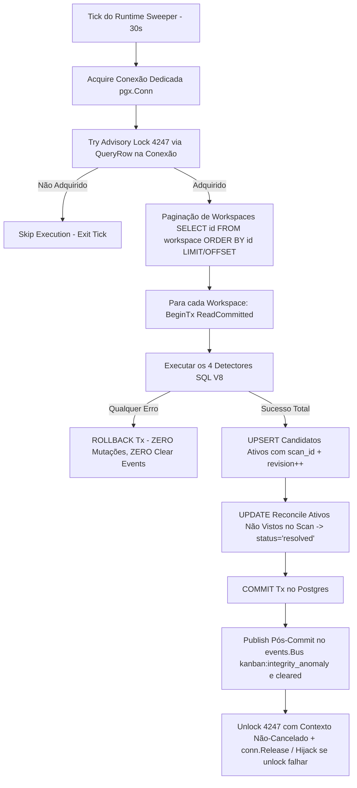
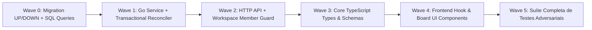

# Design de Monitoramento Automático de Integridade do Kanban V8 — Reconciliação Transacional Durável (READ-ONLY GTL-79)

**autor**: Antigravity w8:p2  
**timestamp**: 2026-07-27T12:18Z  
**solicitante**: General-Tech-Lead (Codex56-TL w5:pC)  
**incorporando integralmente**: Auditorias GTL-67 e GTL-77 (`.deploy-control/p0/evidence/gtl-kanban-v7-peer-review.md` - PASS V7 Revogado)  
**modo**: READ-ONLY / DESIGN V8 RECONCILIAÇÃO TRANSACIONAL — NENHUMA alteração de código, banco live, rede ou quadros executada  

---

## 1. Síntese do Protocolo Transacional e Garantias V8

A versão V8 resolve a falha fundamental da V7 (ausência de transações por workspace e de consultas SQL atômicas para upsert/reconcile/clear). A V8 formaliza uma **reconciliação set-based transacional por workspace**, onde detectores, upserts monotônicos, atualizações e deltas de anomalias ocorrem dentro de uma única transação PostgreSQL (`BEGIN ... COMMIT`), garantindo que **qualquer falha em query provoque ROLLBACK total** sem emissão de falsos clears ou eventos fantasma.



---

## 2. Migration Versionada UP e DOWN Placeholders

> **Nota de Sequenciamento**: A migration utiliza os placeholders `NEXT_CANONICAL_MIGRATION.up.sql` e `.down.sql` aguardando a lane de sequenciamento Z01.

### 2.1 `NEXT_CANONICAL_MIGRATION_kanban_integrity_anomaly.up.sql`
```sql
-- 1. Índice de Performance em issue_dependency para acelerar Anomalia 4
CREATE INDEX CONCURRENTLY IF NOT EXISTS idx_issue_dependency_issue_type_dep
  ON issue_dependency (issue_id, type, depends_on_issue_id);

-- 2. Tabela Durável do Monitor de Integridade do Kanban com Estados 'active' / 'resolved'
CREATE TABLE IF NOT EXISTS kanban_integrity_anomaly (
    workspace_id UUID NOT NULL REFERENCES workspace(id) ON DELETE CASCADE,
    issue_id UUID NOT NULL REFERENCES issue(id) ON DELETE CASCADE,
    anomaly_type TEXT NOT NULL CHECK (anomaly_type IN (
        'assigned_todo_no_active_task',
        'in_progress_no_active_task',
        'done_no_completed_task',
        'blocked_with_resolved_dependency'
    )),
    details JSONB NOT NULL DEFAULT '{}'::jsonb,
    status TEXT NOT NULL DEFAULT 'active' CHECK (status IN ('active', 'resolved')),
    scan_id UUID NOT NULL,
    revision BIGINT NOT NULL DEFAULT 1,
    first_detected_at TIMESTAMPTZ NOT NULL DEFAULT now(),
    last_seen_at TIMESTAMPTZ NOT NULL DEFAULT now(),
    resolved_at TIMESTAMPTZ,
    PRIMARY KEY (workspace_id, issue_id, anomaly_type),
    CHECK (last_seen_at >= first_detected_at)
);
```

### 2.2 `NEXT_CANONICAL_MIGRATION_kanban_integrity_anomaly.down.sql`
```sql
DROP TABLE IF EXISTS kanban_integrity_anomaly CASCADE;
DROP INDEX IF EXISTS idx_issue_dependency_issue_type_dep;
```

---

## 3. As 4 Consultas de Anomalia SQL V8 (Schema & Tenant Compliant)

Todas as 4 queries filtram `WHERE i.workspace_id = $1` e usam o índice `idx_issue_status`:

1. **Anomalia 1 (`todo`)**: `i.updated_at < now() - INTERVAL '15 seconds'` + `NOT EXISTS` task ativa.
2. **Anomalia 2 (`in_progress`)**: Active tasks em `('queued', 'dispatched', 'running', 'waiting_local_directory')`.
3. **Anomalia 3 (`done`)**: `NOT EXISTS (SELECT 1 FROM agent_task_queue atq WHERE atq.issue_id = i.id AND atq.status = 'completed' AND atq.completed_at IS NOT NULL)`.
4. **Anomalia 4 (`blocked`)**: `UNION` entre parent (`p.workspace_id = i.workspace_id`) e `issue_dependency` (`dep.workspace_id = i.workspace_id` AND `d.type = 'blocked_by'`), deduplicados por `dependency_id` em `jsonb_agg`.

---

## 4. Reconciliação Transacional Atômica (Queries de Upsert & Reconcile)

Dentro da transação por workspace `tx := conn.BeginTx(ctx, ...)`:

### 4.1 SQL de Upsert de Candidatos Ativos
```sql
-- name: UpsertKanbanAnomalyCandidates :many
INSERT INTO kanban_integrity_anomaly (
    workspace_id, issue_id, anomaly_type, details, status, scan_id, revision, first_detected_at, last_seen_at
)
SELECT unnest(@workspace_ids::uuid[]),
       unnest(@issue_ids::uuid[]),
       unnest(@anomaly_types::text[]),
       unnest(@details_list::jsonb[]),
       'active',
       @scan_id::uuid,
       1,
       now(),
       now()
ON CONFLICT (workspace_id, issue_id, anomaly_type) DO UPDATE
SET status = 'active',
    details = EXCLUDED.details,
    scan_id = EXCLUDED.scan_id,
    revision = kanban_integrity_anomaly.revision + 1,
    last_seen_at = GREATEST(kanban_integrity_anomaly.last_seen_at, EXCLUDED.last_seen_at),
    resolved_at = NULL
RETURNING workspace_id, issue_id, anomaly_type, revision, (xmax = 0) AS is_new_detection;
```

### 4.2 SQL de Reconciliação de Anomalias Resolvidas (Cleared)
```sql
-- name: ReconcileResolvedKanbanAnomalies :many
UPDATE kanban_integrity_anomaly
SET status = 'resolved',
    revision = revision + 1,
    resolved_at = now()
WHERE workspace_id = $1
  AND status = 'active'
  AND scan_id != $2
RETURNING workspace_id, issue_id, anomaly_type, revision;
```

### 4.3 Pruning Histórico de Retenção (7 dias)
```sql
-- name: PruneResolvedKanbanAnomalies :exec
DELETE FROM kanban_integrity_anomaly
WHERE status = 'resolved'
  AND resolved_at < now() - INTERVAL '7 days';
```

---

## 5. Gestão Segura de Conexão, Lock 4247 e Paginação

```go
func sweepKanbanIntegrity(ctx context.Context, pool *pgxpool.Pool, bus *events.Bus) {
	conn, err := pool.Acquire(ctx)
	if err != nil {
		slog.Warn("kanban_monitor: failed to acquire db connection", "error", err)
		return
	}

	var acquired bool
	err = conn.QueryRow(ctx, "SELECT pg_try_advisory_lock($1)", KanbanIntegrityLockID).Scan(&acquired)
	if err != nil || !acquired {
		conn.Release()
		return
	}

	// Defer de Unlock e Release com Verificação de Segurança
	defer func() {
		cleanupCtx, cancel := context.WithTimeout(context.WithoutCancel(ctx), 5*time.Second)
		defer cancel()

		var unlocked bool
		unlockErr := conn.QueryRow(cleanupCtx, "SELECT pg_advisory_unlock($1)", KanbanIntegrityLockID).Scan(&unlocked)
		if unlockErr != nil || !unlocked {
			slog.Error("kanban_monitor: failed to unlock advisory lock, destroying connection", "error", unlockErr)
			conn.Hijack() // Destrói a handle para não devolver uma sessão bloqueada ao pool
			return
		}
		conn.Release()
	}()

	// Paginação Keyset de Workspaces
	var lastID pgtype.UUID
	limit := int32(50)

	for {
		workspaces, err := db.New(conn).ListWorkspacesPaged(ctx, db.ListWorkspacesPagedParams{
			AfterID: lastID,
			LimitRows: limit,
		})
		if err != nil || len(workspaces) == 0 {
			break
		}

		for _, ws := range workspaces {
			reconcileWorkspaceTransaction(ctx, conn, bus, ws.ID)
			lastID = ws.ID
		}
	}
}
```

---

## 6. Fonte Autoritativa no Frontend: API Autenticada & Reconnect Safety

- **Endpoint HTTP Protegido**: `GET /api/workspaces/{id}/kanban-anomalies`
  - **Middleware Guard**: `RequireWorkspaceMemberFromURL(queries, "id")` em `server/cmd/server/router.go`.
  - **Cabeçalho**: `Cache-Control: private, no-store`.
  - **Retorno**: `{ "workspace_id": "...", "workspace_revision": 42, "anomalies": [...] }`.
- **Protocolo de Sincronização do Frontend (`use-kanban-anomalies.ts`)**:
  - O cliente aceita que a entrega WebSocket é *best-effort*.
  - Na montagem do componente (`board-view.tsx`) e em caso de reconexão do WebSocket:
    1. Registra os ouvintes no WebSocket.
    2. Executa a requisição `GET /api/workspaces/{id}/kanban-anomalies` obtendo o snapshot autoritativo com `workspace_revision`.
    3. Aplica eventos recebidos do WS **apenas** se `event.revision > snapshot.workspace_revision`.

---

## 7. Mapeamento dos Módulos das Waves 0 a 5



---

## 8. Lista Factual Completa dos `FILES_LOCKED` (20 Arquivos)

1. `server/migrations/NEXT_CANONICAL_MIGRATION_kanban_integrity_anomaly.up.sql`
2. `server/migrations/NEXT_CANONICAL_MIGRATION_kanban_integrity_anomaly.down.sql`
3. `server/pkg/db/queries/kanban_integrity.sql`
4. `server/pkg/db/generated/kanban_integrity.sql.go`
5. `server/pkg/db/generated/models.go`
6. `server/cmd/server/runtime_sweeper.go`
7. `server/cmd/server/main.go`
8. `server/cmd/server/router.go`
9. `server/pkg/protocol/events.go`
10. `server/internal/service/kanban_integrity.go`
11. `server/internal/service/kanban_integrity_test.go`
12. `server/internal/handler/kanban_integrity.go`
13. `server/internal/handler/kanban_integrity_test.go`
14. `packages/core/types/events.ts`
15. `packages/core/types/kanban.ts`
16. `packages/core/api/schema.ts`
17. `packages/views/issues/hooks/use-kanban-anomalies.ts`
18. `packages/views/issues/components/board-view.tsx`
19. `packages/views/issues/components/board-card.tsx`
20. `packages/views/issues/components/__tests__/board-view.test.tsx`

*Desenho V8 finalizado em modo READ-ONLY. Zero execuções ou mutações.*
