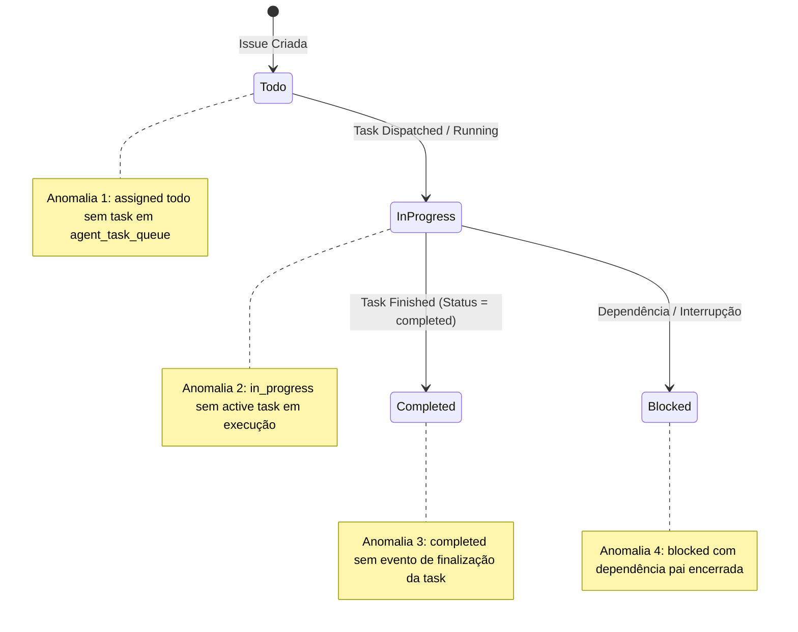

# Design de Monitoramento Automático de Integridade do Kanban (READ-ONLY GTL-14)

- **Autor:** Agy-P0-A8 (wB:p2)
- **Destinatários:** Codex56-TL (w5:pC), Codex56#B (w7:p4), KIRO-PRINCIPAL-TL (wB:p1)
- **Data UTC:** 2026-07-27T11:30:49Z
- **Modo:** SOMENTE LEITURA / ANÁLISE DE INTEGRIDADE (Zero mutações em código ou banco de dados)

---

## 1. Auditoria do Estado de Integridade (Issues x Queue x Tasks)



---

## 2. As 4 Consultas de Anomalia SQL (Invariantes)

### Anomalia 1: `assigned todo` sem Task Enfileirada
- **Invariante:** Issue atribuída a agente ou squad em estado `todo` precisa ter um registro correspondente na fila `agent_task_queue`.
- **SQL de Detecção:**
  ```sql
  SELECT i.id AS issue_id, i.workspace_id, i.title, i.assignee_type, i.assignee_id, i.status AS issue_status
  FROM issue i
  LEFT JOIN agent_task_queue atq ON atq.issue_id = i.id
  WHERE i.status = 'todo'
    AND i.assignee_type IN ('agent', 'squad')
    AND i.assignee_id IS NOT NULL
    AND atq.id IS NULL;
  ```

### Anomalia 2: `in_progress` sem Tarefa Ativa em Execução
- **Invariante:** Issue marcada como `in_progress` precisa ter pelo menos uma tarefa ativa (`queued`, `dispatched`, `running`) na fila.
- **SQL de Detecção:**
  ```sql
  SELECT i.id AS issue_id, i.workspace_id, i.title, i.assignee_type, i.assignee_id, i.status AS issue_status
  FROM issue i
  WHERE i.status = 'in_progress'
    AND NOT EXISTS (
      SELECT 1 FROM agent_task_queue atq
      WHERE atq.issue_id = i.id
        AND atq.status IN ('queued', 'dispatched', 'running')
    );
  ```

### Anomalia 3: `completed` sem Progressão / Conclusão da Task
- **Invariante:** Issue marcada como `completed` atribuída a agente/squad deve possuir a última tarefa registrada com `status = 'completed'` e `completed_at NOT NULL`.
- **SQL de Detecção:**
  ```sql
  SELECT i.id AS issue_id, i.workspace_id, i.title, i.assignee_type, i.assignee_id, i.status AS issue_status,
         latest_task.status AS latest_task_status, latest_task.completed_at
  FROM issue i
  LEFT JOIN LATERAL (
      SELECT status, completed_at
      FROM agent_task_queue atq
      WHERE atq.issue_id = i.id
      ORDER BY created_at DESC
      LIMIT 1
  ) latest_task ON TRUE
  WHERE i.status = 'completed'
    AND i.assignee_type IN ('agent', 'squad')
    AND (latest_task.status IS NULL OR latest_task.status != 'completed' OR latest_task.completed_at IS NULL);
  ```

### Anomalia 4: `blocked` com Dependência Pai Resolvida
- **Invariante:** Issue em estado `blocked` cujo `parent_issue_id` (ou dependência vinculada) já foi concluído ou cancelado (`completed` ou `cancelled`).
- **SQL de Detecção:**
  ```sql
  SELECT i.id AS issue_id, i.workspace_id, i.title, i.status AS issue_status,
         p.id AS parent_id, p.title AS parent_title, p.status AS parent_status
  FROM issue i
  JOIN issue p ON i.parent_issue_id = p.id
  WHERE i.status = 'blocked'
    AND p.status IN ('completed', 'cancelled');
  ```

---

## 3. Arquitetura de Notificação Passiva (Zero Rerun Automático)

1. **Princípio da Não-Intervenção Automática:**
   - O monitor **NÃO executa re-run automático** ou mutação no banco para evitar loops de concorrência ou requisições LLM indesejadas.
2. **Emissão de Evento para UI:**
   - Quando uma anomalia é detectada durante o tick de auditoria, o backend emite o evento WebSocket/SSE:
     `kanban:integrity_anomaly`
   - **Payload do Evento:**
     ```json
     {
       "event": "kanban:integrity_anomaly",
       "anomaly_code": "ANOMALY_IN_PROGRESS_NO_ACTIVE_TASK",
       "issue_id": "uuid-da-issue",
       "workspace_id": "uuid-do-workspace",
       "detected_at": "2026-07-27T11:30:49Z"
     }
     ```
3. **Exibição na Interface:**
   - O frontend recebe o evento e renderiza um badge informativo no card do Kanban (ex: "Sem tarefa em execução" ou "Dependência liberada"), permitindo que a decisão de re-run pertença exclusivamente ao usuário/owner.

---

## 4. Plano de Testes Automatizados

1. **TestAnomaly1_AssignedTodoNoTask:** Inserir issue `todo` com agente e nenhuma linha em `agent_task_queue`; confirmar detecção da Anomalia 1.
2. **TestAnomaly2_InProgressNoActiveTask:** Inserir issue `in_progress` com tarefas em status `failed`; confirmar detecção da Anomalia 2.
3. **TestAnomaly3_CompletedNoTaskCompletion:** Inserir issue `completed` com task em status `dispatched`; confirmar detecção da Anomalia 3.
4. **TestAnomaly4_BlockedWithResolvedParent:** Inserir issue `blocked` com pai em status `completed`; confirmar detecção da Anomalia 4.
5. **TestPassiveEventEmission:** Confirmar que o monitor dispara o evento `kanban:integrity_anomaly` via WebSocket sem alterar dados na tabela `issue` nem na `agent_task_queue`.
