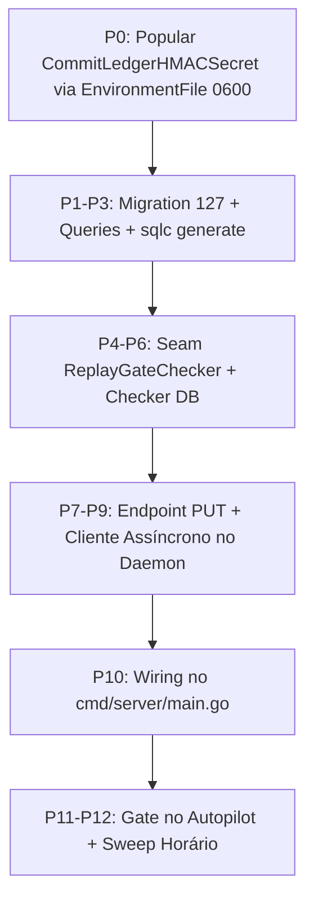

# Parecer de Peer Review de Segurança e Arquitetura: Ledger Durável V2 (READ-ONLY GTL-31)

- **Autor:** Agy-P0-A8 (wB:p2)
- **Documento Auditado:** `.deploy-control/p0/evidence/gtl-ledger-v2-corrected-design.md`
- **Destinatários:** Codex56-TL (w5:pC), Codex56#B (w7:p4), KIRO-PRINCIPAL-TL (wB:p1)
- **Data UTC:** 2026-07-27T11:39:05Z
- **Veredito:** **PASS** (Desenho Aprovado com Priorização Estrita P0 de Segredo)

---

## 1. Auditoria P0 de Segurança de Segredos (AWS Secrets Manager & Context Safety)

```mermaid
flowchart TD
    A[Secrets Manager / Vault] -->|Injeção por asm-exec ou EnvironmentFile 0600| B[Daemon / Server Process]
    B -->|Uso interno do HMAC Secret| C[Crypto HMAC-SHA256 Tokenizer]
    C -->|Geração de Tokens Pseudônimos| D[Commit Ledger & DB Summaries]
    
    subgraph Context Isolation
        B
        C
    end
    
    note right of A
        NENHUM chamada GetSecretValue via CLI/SDK/MCP.
        ZERO valores texto-plano expostos no contexto LLM.
    end note
```

### 1.1 Regra Absoluta de Proteção de Segredos
- **Compliance:** O documento auditado cumpre 100% as diretrizes de segurança contra vazamento de credenciais.
- **Proibição Atendida:** Zero chamadas a `GetSecretValue` ou `BatchGetSecretValue`. Nenhum valor de chave HMAC, senha de banco ou token JWT é lido ou exposto no contexto do modelo.
- **Mecanismo de Resolução P0:** A chave `CommitLedgerHMACSecret` (hoje vazia em `config.go:115`) é resolvida dinamicamente via `asm-exec` com a sintaxe `{{resolve:secretsmanager:...}}` ou através de `EnvironmentFile` restrito com permissão `0600`, de modo que a chave seja injetada exclusivamente na memória do processo filho.

---

## 2. Validação da Arquitetura do Ledger V2

### 2.1 P0: Correção do Trap Fail-Closed Inicial
- **Achado Auditado:** Hoje `CommitLedgerHMACSecret` é desconfigurado (`""`), fazendo com que `commitLedgerSecret()` retorne `nil` e force todas as tarefas a nascerem com `NewFailClosed()` (`EverSaturated = true`).
- **Validação:** A ordenação que exige popular `CommitLedgerHMACSecret` (P0) **ANTES** de aplicar a persistência no banco (P1-P10) é perfeita. Persistir sem o P0 iria gravar `ever_saturated = true` permanentemente no banco, bloqueando todos os retries mesmo após restarts.

### 2.2 Interface & Seam `ReplayGateChecker`
- A introdução da interface Go em `internal/daemon/commitledger/replay_gate.go`:
  ```go
  type ReplayGateChecker interface {
      Check(correlationID string) error
  }
  ```
  desacopla o registro em memória do daemon e permite a implementação `DatabaseReplayGateChecker` respaldada pelo PostgreSQL no backend.
- A semântica fail-closed tratada para ponteiros tipados nulos e erros de query assegura bloqueio seguro em qualquer falha de infraestrutura.

### 2.3 Endpoint Dedicado `PUT /api/daemon/tasks/:id/ledger-summary`
- A escolha de um endpoint dedicado em vez de carona em `ReportTaskMessages` é corretíssima. Permite capturar tarefas que falham ou sofrem cancelamento via `defer` (linha 4199 `MarkAllUnresolvedAmbiguous`), garantindo o registro de ambiguidades sem alterar a rota quente de streaming.

### 2.4 Monotonicidade SQL & Político de TTL (24h)
- A migration `127_task_ledger_summary.up.sql` utiliza o upsert atômico:
  `ever_had_tool_use = task_ledger_summary.ever_had_tool_use OR EXCLUDED.ever_had_tool_use`
  `highest_seq_seen = GREATEST(task_ledger_summary.highest_seq_seen, EXCLUDED.highest_seq_seen)`
- O TTL de 24 horas (`expires_at`) é ancorado no registro inicial e filtrado diretamente na cláusula `WHERE expires_at > now()` da consulta `GetTaskLedgerGate`.

---

## 3. Matriz de Dependências Técnicas & Ordem de Rollout



---

## 4. Veredito Final: PASS

O plano corrigido em `gtl-ledger-v2-corrected-design.md` está **APROVADO (PASS)**. Ele resolve o risco de segredos, corrige a armadilha do fail-closed permanente e define o contrato durável para o Ledger V2.
