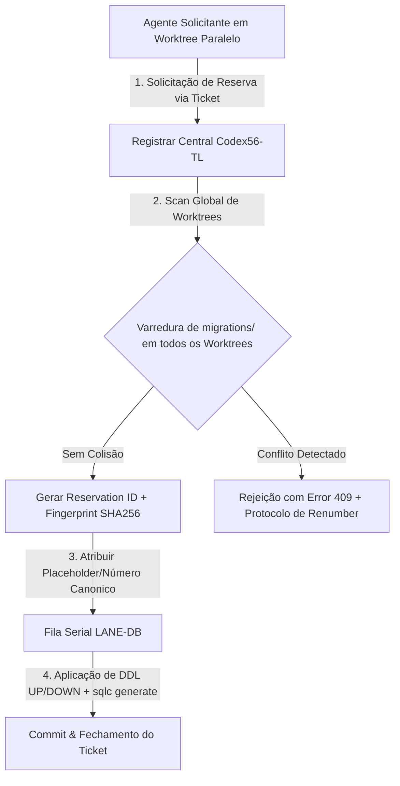

# Proposta Operacional: Governança do Registrar Central de Migrations (ORQ-41 / Z01) — CORRIGIDA

**autor**: Antigravity w8:p2  
**timestamp**: 2026-07-27T15:10Z  
**governança**: Kanban Issue `ORQ-41` ("Decouple Kanban metadata from paid task execution")  
**autoridade central de registro**: General-Tech-Lead (Codex56-TL `w5:pC`)  
**modo**: READ-ONLY / PROPOSTA DE GOVERNANÇA CORRIGIDA — NENHUMA atribuição de número realizada, zero arquivos de migration criados, zero edições em banco, código ou quadros.  

---

## 1. Contexto e Motivação do Protocolo

Em ambientes de desenvolvimento com múltiplos agentes autônomos trabalhando em paralelo em *worktrees* isolados, a atribuição descentralizada de números sequenciais de migration (ex: `127_...`, `128_...`) gera **colisões de números de schema**, quebras de compilação do `sqlc` e retrabalho de fusão no Git.

Para eliminar colisões e garantir a integridade do banco de dados PostgreSQL, esta proposta estabelece o **Registrar Central de Migrations sob a autoridade exclusiva do Codex56-TL (`w5:pC`)**, aplicando uma fila serial única (`LANE-DB`) e um protocolo rigoroso de reserva por ticket.

---

## 2. Protocolo de Funcionamento do Registrar Central

### 2.1 As 7 Etapas do Ciclo de Vida da Reserva de Migration

1. **Varredura Global de Worktrees (Global Worktree Scan)**:
   - Antes de emitir qualquer número canônico, o Registrar Central executa uma varredura em `server/migrations/` em **todos os worktrees ativos** do repositório para mapear o maior número existente e identificar reservations pendentes.

2. **Geração de Ticket de Reserva (Lock / Reservation ID)**:
   - Toda solicitação aprovada recebe um Ticket Único de Reserva no formato:
     `RES-<issue_id>-<sequencial_hex>` (Exemplo: `RES-ORQ41-001`).
   - O ticket registra o solicitante, a issue correspondente (`ORQ-N`), o propósito do DDL e o timestamp UTC de emissão.

3. **Assinatura Criptográfica de Conteúdo (Migration Fingerprint)**:
   - O DDL proposto deve ter seus hashes SHA256 gravados no ticket:
     - `sha256_up`: Hash do arquivo `.up.sql`
     - `sha256_down`: Hash do arquivo `.down.sql`
   - Se o conteúdo do DDL for alterado durante o desenvolvimento, o agente deve solicitar re-associação de fingerprint.

4. **Prazo de Validade e Expiração (TTL)**:
   - Toda reserva possui um **TTL máximo de 24 horas**.
   - Se o PR da migration não for aplicado na fila `LANE-DB` antes da expiração do TTL, o ticket expira automaticamente e o número reservado é liberado para reciclagem ou re-sequenciamento.

5. **Exigência Estrita de Pares Símétricos (UP / DOWN Pairing)**:
   - O Registrar **recusa** qualquer reserva que não apresente o par simétrico de arquivos:
     - `<numero>_<nome>.up.sql`
     - `<numero>_<nome>.down.sql`
   - O arquivo `.down.sql` deve conter a reversão limpa e segura (ex: remoção de colunas aditivas, restauração de índices anteriores) sem falhar se executado em bancos descartáveis.

6. **Protocolo de Liberação e Re-numeramento (Release & Renumber Protocol)**:
   - **Fase de Design**: Agentes em trabalho paralelo **devem utilizar obrigatoriamente placeholders** `NEXT_CANONICAL_a`, `NEXT_CANONICAL_b`, etc.
   - **Fase de Integração**: O re-numeramento dos placeholders para o número canônico final (ex: `127`, `128`, `129`) é executado **exclusivamente pelo Codex56-TL** no momento da entrada da migration na fila `LANE-DB`.

7. **Fila Serial de Execução DB (`LANE-DB Queue`)**:
   - As alterações nos diretórios `server/migrations/`, `server/pkg/db/queries/` e `server/pkg/db/generated/` formam a **LANE-DB**.
   - Apenas **um único agente** por vez detém o *lock* da `LANE-DB`.
   - O agente responsável pela `LANE-DB` executa a sequência:
     1. Aplicar DDL no PostgreSQL;
     2. Executar `sqlc generate`;
     3. Validar compilação limpa via `go build ./...`;
     4. Fechar o ticket de reserva e liberar a `LANE-DB` para o próximo item da fila.

---

## 3. Estado Factual Medido das Migrations no Repositório

### 3.1 Diagnóstico de Estado Factual (Fatos Medidos)
1. **Base Integrada Principal**: O maior número de migration fisicamente integrado na branch principal em `server/migrations/` é **`126`** (`126_runtime_profile_protocol_family_native_runtimes.up.sql`).
2. **Propostas e Materializações Paralelas**:
   - A ORQ-13 materializou a migration `127` em estado *untracked* em uma branch/worktree paralela.
   - A proposta Z01 sugeriu em documento a alocação de `127` (Ledger) e `128` (Approved Accounts).
3. **Ausência de Reservas Canônicas Válidas**:
   - **NENHUMA reserva de número canônico acima de 126 é válida ou vigente** até que o Registrar Central (`Codex56-TL`) execute o *scan global de worktrees* e expeça o *ruling* formal de alocação.

---

## 4. Check-out Citing ORQ-41

- **Governança**: `ORQ-41`
- **Artefato Gerado**: `.deploy-control/p0/evidence/gtl-migration-registrar-governance.md`
- **Veredito**: **PROPOSTA CORRIGIDA SUBMETIDA PARA APROVAÇÃO DO GTL** ⏳
- **Status de Mutação**: READ-ONLY. Nenhuma migration criada, zero números fixos atribuídos, zero edições em banco ou quadros.

---

## 5. Registro Canônico de Reservas

### RES-ORQ13-001 — ATIVA

| Campo | Valor |
|---|---|
| Issue | `ORQ-13` |
| Solicitante | `Opus48#B` (`w6:p2`) |
| Registrar | `Codex56-TL` (`w5:pC`) |
| Número canônico | `127` |
| Nome | `task_usage_thinking_level` |
| Arquivo UP | `127_task_usage_thinking_level.up.sql` |
| Arquivo DOWN | `127_task_usage_thinking_level.down.sql` |
| SHA-256 UP | `0ea3005da0ee257618062552cf8792f9c2e6ed478dce3ba174bf08692486cac1` |
| SHA-256 DOWN | `74354ae28dee526c7dbc6bc6733471a59c2f3dabfe5a7fe609fe20d747e61113` |
| Emitida em | `2026-07-27T15:37:12Z` |
| Expira em | `2026-07-28T15:37:12Z` |
| Estado | `ATIVA`, condicionada ao peer review do runbook V3 e à entrada serial na `LANE-DB` |

Ruling factual do Registrar:

- foram inspecionados os 23 worktrees retornados por `git worktree list --porcelain`;
- somente `gtl-i03-orq13-phase1` contém uma migration `127`, e ela corresponde ao par desta reserva;
- `git ls-remote --heads origin` e o fetch read-only da branch remota de integração foram verificados;
- a integração remota termina em `126_runtime_profile_protocol_family_native_runtimes`;
- nenhuma migration `127` ou superior foi encontrada nos worktrees ou na integração remota;
- esta reserva não autoriza execução de DDL, geração SQLC, stage, commit, push ou merge por si só.

---

## 6. Fila canônica LANE-DB — snapshot 2026-07-27T18:11:01Z

Varredura global atualizada, somente leitura:

- **28/28 worktrees** registrados inspecionados em `migrations/`, `pkg/db/queries/` e `pkg/db/generated/`;
- **28/28 refs locais** inspecionadas;
- **22/22 heads remotos live** consultados por `git ls-remote --heads origin`; são idênticos aos remote-tracking refs locais (zero head novo, removido ou SHA divergente);
- somente `agent/opus48-b/orq-13-thinking-level` contém migration `>=127`: o par `127_task_usage_thinking_level.{up,down}.sql` da `RES-ORQ13-001`;
- ORQ-21, ORQ-12 e ORQ-43A não materializam migration `>=127`;
- o root possui delta SQLC preexistente e sem migration em `queries/issue.sql` + `generated/issue.sql.go` (`ResetIssueToTodoIfNoActiveTask`); esse writer deve estabilizar/liberar os paths antes de qualquer lock LANE-DB, mas não recebe número por este registro.

Ordem serial vinculante, sem inferir ordem numérica ainda impossível:

| Posição | Item | Reserva | Número | Estado/gate |
|---:|---|---|---:|---|
| 1 | ORQ-21 — autoridade/registry de conta | nenhuma | não atribuído | predecessor não estabilizado; worktree sem migration |
| 2 | ORQ-12 — snapshot/account em usage | nenhuma | não atribuído | depende de ORQ-21; worktree sem migration |
| 3 | ORQ-13 — thinking level em usage | `RES-ORQ13-001` | `127` | par commitado e worktree limpo; reserva ativa; integração aguarda predecessores e gates próprios |
| 4 | ORQ-43A — `Idempotency-Key` durável de `daemon_token` | `RES-ORQ43A-001` | **não atribuído** | posição reservada; aguarda posições 1→2→3, delta SQLC root liberado e novo scan |

A combinação “ORQ-21 → ORQ-12 → ORQ-13” com `127` já fixado para ORQ-13 ainda não define um número legal para eventuais migrations dos dois predecessores. Portanto nenhum `128`, `129` ou outro número é atribuído a ORQ-43A neste snapshot.

### RES-ORQ43A-001 — FILA_RESERVADA_SEM_NÚMERO

| Campo | Valor |
|---|---|
| Escopo lógico | `ORQ-43A` (subfase do card ORQ-43; **não** cria nem numera novo card Kanban) |
| Destinatário informado | `Codex56-B` |
| Registrar | Kiro, por diretiva explícita do owner para LANE-DB |
| Posição canônica | `4`, depois de `ORQ-21 → ORQ-12 → ORQ-13/RES-ORQ13-001` |
| Número canônico | **NÃO ATRIBUÍDO** |
| Placeholder obrigatório | `NEXT_CANONICAL_daemon_token_idempotency` |
| Migration pretendida | coluna nullable `daemon_token.idempotency_key` + unique partial index `(workspace_id, daemon_id, idempotency_key)` quando não nula |
| SQLC | `pkg/db/queries/daemon_token.sql` + regeneração exclusiva de `pkg/db/generated/daemon_token.sql.go` pela LANE-DB |
| Emitida em | `2026-07-27T18:11:01Z` |
| TTL numérico | **NÃO INICIADO**; começa somente quando o Registrar vincular número após predecessores estáveis e scan renovado |
| Estado | `QUEUED_NO_NUMBER`, sem lock de arquivos e sem autorização de implementação/DDL |

Esta reserva de **posição**, não de número, proíbe materializar arquivo numerado, editar gerado manualmente ou executar DDL/SQLC/DB compartilhado. O número final só pode ser emitido após: (1) resolução explícita da ordem/números de ORQ-21 e ORQ-12; (2) estabilização/entrada serial da reserva 127 de ORQ-13; (3) liberação do delta SQLC preexistente no root; e (4) novo scan global de worktrees + refs remotas.

## 7. Renovação R1 e decisão explícita do Registrar — 2026-07-28T13:21:29Z

### Scan global imediatamente anterior à renovação

A renovação foi emitida somente após nova varredura read-only:

- **31/31 worktrees registrados** inspecionados; os quatro achados `>=127` são o mesmo par UP/DOWN em `gtl-i03-orq13-phase1` e no worktree combinado de cache `~/.cache/orq13-combined/wt`;
- **55/55 refs locais** inspecionadas; os dois únicos achados são o mesmo par em `refs/heads/agent/opus48-b/orq-13-thinking-level`;
- **23/23 heads remotos live** consultados; zero migration `>=127`, zero objeto ausente e todos os 23 SHAs iguais aos remote-tracking refs;
- todos os achados UP são `0ea3005da0ee257618062552cf8792f9c2e6ed478dce3ba174bf08692486cac1` e todos os DOWN são `74354ae28dee526c7dbc6bc6733471a59c2f3dabfe5a7fe609fe20d747e61113`;
- não há número, basename, conteúdo ou hash concorrente. **NO_COLLISION**.

### Estado factual dos predecessores vinculantes

| Predecessor | Board/task no corte | Git/worktree | Migration `>=127` | Decisão |
|---|---|---|---|---|
| ORQ-21 | `todo`, Codex-B, zero task ativa; último run `failed/runtime_offline` | branch em `0cb8aeb`; worktree **dirty** com `scripts/staging/seed_approved_assignment.sql` e `server/internal/credentialregistry/` untracked | nenhuma | **não estabilizado; não integrar agora** |
| ORQ-12 | `todo`, Opus48-A, zero task ativa; último run `failed/runtime_offline` | branch em `0cb8aeb`; worktree limpo, sem implementação própria | nenhuma | depende de ORQ-21 e não contém candidato; **não integrar agora** |

A ordem de governança **ORQ-21 → ORQ-12 → ORQ-13** continua vinculante para entrada na branch compartilhada, DDL compartilhado, promoção e produção. Este registro não declara nenhum predecessor merged, integrado, aprovado ou dispensado.

### Decisão do Registrar: `OVR-ORQ13-CANDIDATE-001`

Como ORQ-21 e ORQ-12 não estão estabilizados, a decisão formal é **não integrar os predecessores agora**. Em vez disso, fica emitido um override limitado para não perder a janela de validação do candidato ORQ-13:

**Permitido até o TTL abaixo:**

1. montar branch/worktree **local e descartável** de candidato, sem alterar refs canônicas/remotas;
2. aplicar exclusivamente os quatro commits já medidos, na ordem `11ef715 → 67e9a4c → b1f08e3 → c0e93a2`;
3. executar testes e aplicar migration somente em PostgreSQL **novo, efêmero e isolado**, sem dados compartilhados;
4. produzir evidência de teste/merge-tree e descartar o candidato.

**Expressamente proibido por este override:**

- merge/cherry-pick na `integration/dev-transition-candidate-20260719`, main ou qualquer branch compartilhada;
- push, PR, tag, deploy, promoção ou afirmação de integração concluída;
- DDL em DB compartilhado, execução de migration em ambiente persistente ou regeneração SQLC fora do candidato descartável;
- editar, rebasear, renumerar ou re-hashar os commits/migrations de ORQ-13;
- usar o override para pular ORQ-21/ORQ-12 na integração final ou liberar ORQ-43A.

O override autoriza **candidate testing/integration local descartável**, não integração canônica. A integração final de ORQ-13 permanece `BLOCKED_PREDECESSORS` até ORQ-21 e ORQ-12 estabilizarem e entrarem pela LANE-DB na ordem vinculante, seguida de novo scan do Registrar. Revisão independente e autorização de merge do owner continuam obrigatórias.

### RES-ORQ13-001 — RENOVADA R1, MESMO NÚMERO

| Campo | Valor renovado |
|---|---|
| Reserva | `RES-ORQ13-001` (mesma identidade; nenhuma nova reserva criada) |
| Número canônico | **`127`** (sem renumeração) |
| Nome | `task_usage_thinking_level` |
| SHA-256 UP | `0ea3005da0ee257618062552cf8792f9c2e6ed478dce3ba174bf08692486cac1` |
| SHA-256 DOWN | `74354ae28dee526c7dbc6bc6733471a59c2f3dabfe5a7fe609fe20d747e61113` |
| Renovada em | `2026-07-28T13:21:29Z` |
| Novo TTL | **24 horas** |
| Nova expiração | **`2026-07-29T13:21:29Z`** |
| Estado | **`ATIVA_RENOVADA_R1`**, sem lock/merge/DDL compartilhado autorizado |
| Override associado | `OVR-ORQ13-CANDIDATE-001`, limitado ao candidato local descartável descrito acima |

A expiração original `2026-07-28T15:37:12Z` foi supersedida antes de vencer. O mesmo número e os mesmos hashes permanecem vinculados; `RES-ORQ43A-001` continua `QUEUED_NO_NUMBER`, posição 4, sem TTL numérico iniciado.

## 8. Decisão executiva R2 do General Tech Manager — 2026-07-28

O owner determinou execução imediata e o General Tech Manager identificou uma contradição na ordem anterior: ORQ-12 exige migration, mas ORQ-13 já possui a migration 127 reservada, implementada e validada. Exigir ORQ-12 antes de ORQ-13 sem liberar um número tornava a fila inexequível por construção.

A ordem anterior `ORQ-21 → ORQ-12 → ORQ-13` fica **SUPERSEDED**. A nova ordem serial vinculante é:

1. **ORQ-21** — estabilizar autoridade, contas aprovadas e assignments; não requer migration nova porque as tabelas já existem;
2. **ORQ-13 / RES-ORQ13-001** — integrar a migration canônica 127 já validada;
3. **ORQ-12** — implementar `task_usage.account_id` sobre a árvore que já contém ORQ-13, usando `NEXT_CANONICAL_task_usage_account_id` durante desenvolvimento e vinculando o número **128** somente após novo scan imediatamente posterior à integração da 127;
4. **ORQ-43A** — permanece depois da ORQ-12, ainda `QUEUED_NO_NUMBER`.

### Autorizações desta decisão

- ORQ-21 e ORQ-12 podem iniciar implementação local imediatamente em worktrees exclusivos;
- ORQ-12 deve partir da árvore ORQ-13 validada para que SQLC/generated representem a sequência real;
- testes em PostgreSQL efêmero, `sqlc generate`, build, vet, race e lint diferencial estão autorizados;
- a execução não precisa aguardar novo aceite de Gate 0 quando todas as ferramentas/permissões já constarem do inventário aceito; qualquer falta real deve ser reportada como delta, sem paralisar trabalho que não dependa dela;
- valores de segredo continuam proibidos em contexto e nenhuma autorização de secret mutation é inferida.

### Gates que permanecem

- um writer por FILES_LOCKED e LANE-DB;
- revisão independente antes de integração compartilhada;
- scan global imediatamente antes de materializar 128;
- DB de produção não recebe DDL até gates locais/efêmeros verdes e autorização de deploy;
- nenhum status pode permanecer bloqueado sem causa, responsável, ação concreta e ETA/condição externa registrados.

Esta R2 substitui também o trecho de `OVR-ORQ13-CANDIDATE-001` que proibia ultrapassar ORQ-12 na sequência final. O restante do override, incluindo proibições de DDL compartilhado sem gates e de alegação prematura de produção, permanece válido.

## 8. GTM R2 — ordem vinculante supersessora e reserva ORQ-12/128

- **Ruling:** `GTM-R2-20260728T133551Z`
- **Emitido pelo owner/GTM:** `2026-07-28T13:35:51Z`
- **Registro do Registrar:** `2026-07-28T13:37:47Z`
- **Efeito:** supersede explicitamente a ordem anterior `ORQ-21 → ORQ-12 → ORQ-13` em qualquer seção histórica deste documento.

A ordem canônica vinculante passa a ser:

| Posição | Item | Reserva/número | Estado no corte R2 |
|---:|---|---|---|
| 1 | ORQ-21 — autoridade/registry de conta | sem número de migration | dois worktrees observados: histórico `agent/codex-b/orq-21` em `0cb8aeb` com dois escopos untracked; candidato R2 `agent/codex56-b/orq21-r2` limpo em `0cb8aeb`, ainda sem implementação |
| 2 | ORQ-13 — `thinking_level` em usage | `RES-ORQ13-001=127` | ativa/renovada R1; branch limpa em `c0e93a2`; hashes preservados; integração canônica aguarda ORQ-21 |
| 3 | ORQ-12 — `account_id` em usage | `RES-ORQ12-001=128` | número reservado agora; branch `agent/opus48-a/orq12-task-usage-account-id` limpa em `c0e93a2`, contendo apenas a base ORQ-13, zero delta ORQ-12 e nenhum arquivo `128_*` |
| 4 | ORQ-43A — idempotency key do daemon token | `RES-ORQ43A-001=QUEUED_NO_NUMBER` | permanece sem número e sem TTL numérico; aguarda 1→2→3 e novo scan |

### Supersessão sem ambiguidade

1. ORQ-13 **não** aguarda mais ORQ-12; aguarda somente ORQ-21 e seus gates próprios.
2. ORQ-12 deve ser construído sobre ORQ-13/127 e usar migration **128**.
3. Qualquer texto anterior que diga `ORQ-21 → ORQ-12 → ORQ-13`, que coloque ORQ-12 na posição 2, ou que condicione ORQ-13 à estabilização de ORQ-12 está **SUPERSEDED_BY_GTM_R2**.
4. `OVR-ORQ13-CANDIDATE-001` não vira autorização de integração canônica: suas restrições de segurança continuam válidas até ORQ-21 estabilizar, mas sua premissa de que ORQ-12 é predecessor de ORQ-13 foi revogada.
5. Nenhum merge, push, PR, DDL compartilhado ou integração de predecessor é afirmado por este ruling.

### Scan de colisão R2

Imediatamente antes da reserva 128 foram inspecionados **32/32 worktrees**, **57/57 refs locais** e **23/23 heads remotos live**. Todos os oito achados `>=127` são cópias/ref do par exato `127_task_usage_thinking_level.{up,down}.sql`; zero arquivo `128_*`; zero SHA remoto divergente. A duplicação do par 127 na branch/worktree ORQ-12 é ancestralidade esperada de ORQ-13, não segunda reivindicação do número.

### RES-ORQ12-001 — NÚMERO 128 RESERVADO, ARQUIVOS AINDA AUSENTES

| Campo | Valor |
|---|---|
| Issue | `ORQ-12` |
| Número canônico | **`128`** |
| Nome reservado | `task_usage_account_id` |
| Arquivo UP esperado | `128_task_usage_account_id.up.sql` |
| Arquivo DOWN esperado | `128_task_usage_account_id.down.sql` |
| SHA-256 UP/DOWN | **PENDENTE** — nenhum arquivo 128 materializado; hashes devem ser registrados antes de integração |
| Base obrigatória | ORQ-13 `c0e93a270c856b5d9c6da5e97b1f149c2cc9fe6e` com `RES-ORQ13-001=127` |
| Emitida em | `2026-07-28T13:37:47Z` |
| TTL | 24 horas |
| Expira em | **`2026-07-29T13:37:47Z`** |
| Estado | `RESERVED_NO_FILES`, sem autorização implícita de DDL/merge/push |

A reserva 128 autoriza apenas o número e basename para a lane ORQ-12. Antes de qualquer integração, o Registrar exige: par UP/DOWN materializado na branch proprietária, hashes completos, worktree limpo, teste em DB efêmero, revisão independente e novo scan de colisão. ORQ-21 continua sendo o primeiro predecessor; ORQ-43A continua posição 4 sem número.
