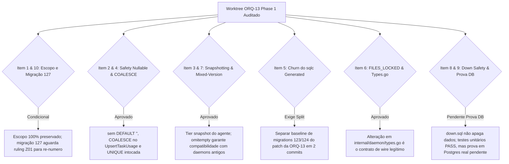

# Parecer de Peer Review Adversarial: ORQ-13 Fase 1 Implementation (READ-ONLY GTL-68 CORREÇÃO DE REGISTRO)

- **Autor:** Agy-P0-A8 (wB:p2)
- **Worktree Auditado:** `/home/ec2-user/workspace/worktrees/gtl-i03-orq13-phase1`
- **Documento Auditado:** `.deploy-control/p0/evidence/gtl-i03-orq13-phase1-implementation.md`
- **Destinatários:** Codex56-TL (w5:pC), Codex56#B (w7:p4), KIRO-PRINCIPAL-TL (wB:p1)
- **Data UTC:** 2026-07-27T12:05:37Z
- **Veredito:** **PASS DE CÓDIGO E TESTES UNITÁRIOS COM SPLIT PLAN, CONDICIONAL A 3 CRITÉRIOS DE INTEGRACAO**

---

## 1. Avaliação Adversarial dos 10 Itens de Auditoria

---

## 2. Detalhamento Factual dos Achados

### 2.1 Preservação de Histórico e Segurança de Dados (Itens 2, 4 e 8)
- **Nullable & COALESCE:** A coluna `thinking_level` foi adicionada sem `NOT NULL` e sem `DEFAULT ''`. O `COALESCE(EXCLUDED.thinking_level, task_usage.thinking_level)` no `UpsertTaskUsage` impede a sobre-escrita acidental do tier por atualizações parciais.
- **Unicidade de Tokens:** A trava `UNIQUE (task_id, provider, model)` da migration 032 não foi alterada, garantindo que não ocorra dupla contagem de tokens.
- **Migration Down Segura:** O arquivo `127_task_usage_thinking_level.down.sql` remove exclusivamente a coluna `thinking_level`, preservando a tabela `task_usage` e os registros históricos.

### 2.2 Origem do Tier e Compatibilidade Wire (Itens 3, 6 e 7)
- **Snapshot Fixo:** O valor do tier vem estritamente da configuração do agente (`task.Agent.ThinkingLevel`) no momento da invocação. O teste `TestUsageThinkingLevelIgnoresModelSuffix` comprova que nomes de modelo (ex: `gemini-3.6-flash-high`) **não** alteram o tier.
- **Contrato de Wire:** A adição de `ThinkingLevel string json:"thinking_level,omitempty"` em `internal/daemon/types.go` é o canal de transporte legítimo entre daemon e backend. Daemons legados omitirão a chave e o backend tratará como `NULL`.

### 2.3 Gestão de Churn no `sqlc` e Conflito de Migration (Itens 1 e 5)
- **Migration Sequence (Item 1):** O uso do número `127` para a migration deve aguardar a confirmação do ruling Z01 para evitar colisão com branches concorrentes (ex: ORQ12 / ledger V2).
- **Churn do `sqlc` (Item 5):** A regeneração do `sqlc` incluiu structs derivados das migrations 123 e 124 em `models.go`. Essa variação é um drift pré-existente no repositório base.

---

## 3. Plano de Split em 2 Commits para Integração

Para garantir um histórico git perfeitamente auditável e sem poluição de escopo:

1. **Commit 1 (`chore(sqlc): baseline sqlc regeneration`):**
   - Re-gerar o `sqlc` no commit base para commitar o alinhamento dos structs das migrations 123/124 em `models.go` e `task_message.sql.go`.
2. **Commit 2 (`feat(orq13): thinking_level phase 1 implementation`):**
   - Incluir exclusivamente as alterações direcionadas da ORQ-13:
     - `migrations/127_task_usage_thinking_level.up.sql` e `.down.sql`
     - `pkg/db/queries/task_usage.sql` e `pkg/db/generated/task_usage.sql.go`
     - `internal/daemon/daemon.go` e `internal/daemon/types.go`
     - `internal/handler/daemon.go`
     - Testes unitários em `internal/daemon/` e `internal/handler/`.

---

## 4. Veredito Final Corrigido (ORQ-13)

A implementação da Fase 1 da **ORQ-13** no worktree `/home/ec2-user/workspace/worktrees/gtl-i03-orq13-phase1` está **APROVADA QUANTO AO CÓDIGO E TESTES UNITÁRIOS COM PLANO DE SPLIT**, estando contudo **CONDICIONAL** aos 3 seguintes critérios antes do merge:

1. **Ruling Z01:** Definição e renumeração formal da migration (127 vs 128) pela liderança técnica.
2. **Commit de Baseline Separado:** Re-geração e separação limpa do churn pré-existente do `sqlc` no Commit 1.
3. **Prova em Banco PostgreSQL Real:** Execução e validação empírica do `COALESCE` e da migration em instância PostgreSQL de testes, pois os testes unitários atuais rodam sobre stubs de memória e não constituem prova de execução SQL real.
