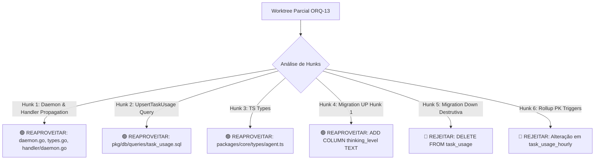

# Parecer de Peer Review de Salvamento de Código: ORQ-13 (READ-ONLY GTL-41)

- **Autor:** Agy-P0-A8 (wB:p2)
- **Documento Auditado:** `.deploy-control/p0/evidence/gtl-orq13-salvage-map.md`
- **Destinatários:** Codex56-TL (w5:pC), Codex56#B (w7:p4), KIRO-PRINCIPAL-TL (wB:p1)
- **Data UTC:** 2026-07-27T11:44:13Z
- **Veredito:** **PASS** (Mapeamento de Salvamento Validado com Sucesso)

---

## 1. Avaliação Crítica do Mapeamento de Salvamento

### 1.1 Confirmação de Hunks Seguros para Reaproveitamento (Salvamento)

| Arquivo / Hunk | Decisão de Review | Justificativa Técnica |
| :--- | :--- | :--- |
| `server/internal/daemon/daemon.go` & `types.go` | **APROVADO (REAPROVEITAR)** | Transmite `ThinkingLevel` limpo do daemon via `TaskMessageData`. |
| `server/internal/handler/daemon.go` | **APROVADO (REAPROVEITAR)** | Handler HTTP recebe `msg.ThinkingLevel` e encaminha ao DB. |
| `server/pkg/db/queries/task_usage.sql` & `.sql.go` | **APROVADO (REAPROVEITAR)** | `UpsertTaskUsage` estendido com parâmetro `@thinking_level::text`. |
| `packages/core/types/agent.ts` | **APROVADO (REAPROVEITAR)** | Interfaces TypeScript atualizadas com `thinking_level`. |
| `127_task_usage_reasoning_tier.up.sql` (Hunk 1) | **APROVADO (REAPROVEITAR)** | Estritamente `ALTER TABLE task_usage ADD COLUMN thinking_level TEXT NOT NULL DEFAULT ''`. |

---

## 2. Confirmação de Hunks Rejeitados / Bloqueados

### 2.1 Rejeição 1: Migration Down Destrutiva (`127_...down.sql`)
- **Achado Auditado:** O arquivo `.down.sql` do worktree original continha `DELETE FROM task_usage;` e `DELETE FROM task_usage_hourly;`.
- **Decisão:** **REJEITADO (BLOQUEADO)**. A decisão de descartar este arquivo e reescrevê-lo com `ALTER TABLE task_usage DROP COLUMN IF EXISTS thinking_level;` foi **100% confirmada**.

### 2.2 Rejeição 2: Alteração das Chaves Primárias nos Rollups (`task_usage_hourly`)
- **Achado Auditado:** O worktree tentava alterar a PK e os 4 triggers de `task_usage_hourly` / `task_usage_hourly_dirty`.
- **Decisão:** **REJEITADO (BLOQUEADO)**. Alinhado ao GTL-36, os rollups mantêm a agregação pura de tokens por `provider:model`. A cardinalidade do tier de raciocínio é mantida **exclusivamente na tabela bruta `task_usage`**.

### 2.3 Rejeição 3: Inferência de Tier por Sufixo de String (`-high`)
- **Achado Auditado:** Tentativa de parsear o tier buscando sufixos no nome do modelo.
- **Decisão:** **REJEITADO (BLOQUEADO)**. O tier deve ser repassado como parâmetro estrito de primeira classe na tupla `(provider, model, tier)`.

---

## 3. Compatibilidade com o Modelo de Precificação PASS (GTL-36)

- A suíte de precificação por tempo/versão (`internal/metrics/pricing.go`) com a struct `ModelPrice` (`EffectiveFrom`, `Version`, `PriceMissReason`) será integrada de forma limpa junto aos hunks Go aprovados.

---

## 4. Veredito Final: PASS

O parecer de peer review aprova o mapeamento fornecido em `gtl-orq13-salvage-map.md`. A lista de hunks seguros está delimitada e pronta para integração limpa pelo `GENERAL-TECH-LEAD`.
