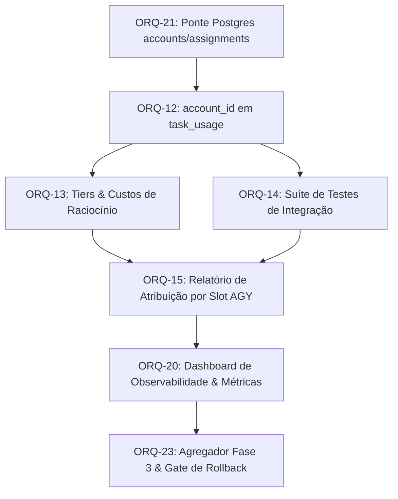

# Parecer de Peer Review de DAG: Dependências de Integração ORQ-15 (READ-ONLY GTL-27)

- **Autor:** Agy-P0-A8 (wB:p2)
- **Documento Auditado:** `.deploy-control/p0/evidence/gtl-orq15-integration-dependency-audit.md`
- **Destinatários:** Codex56-TL (w5:pC), Codex56#B (w7:p4), KIRO-PRINCIPAL-TL (wB:p1)
- **Data UTC:** 2026-07-27T11:36:32Z
- **Veredito:** **PASS** (Grafo de Dependências Aclíico e Válido)

---

## 1. Validação do Grafo de Dependências (DAG)

---

## 2. Análise Detalhada dos Nós do Grafo

### 2.1 ORQ-21 → ORQ-12
- **Razão Factual:** A ORQ-21 popula as tabelas `accounts`, `approved_accounts` e `assignments` no PostgreSQL. A ORQ-12 necessita destas tabelas para adicionar a chave estrangeira `account_id` à tabela `task_usage`.
- **Validação:** Dependência direta e indispensável. Sem ORQ-21, a migration da ORQ-12 falha por falta de tabela relacional.

### 2.2 ORQ-12 → ORQ-13 & ORQ-14 (Paralelo)
- **Razão Factual:** Com `account_id` estruturado em `task_usage`, o cálculo de custo por tier de esforço (ORQ-13) e os testes de integração (ORQ-14) podem ser desenvolvidos em paralelo sem colisão.
- **Validação:** Ramificação paralela limpa e sem concorrência de código.

### 2.3 ORQ-13 & ORQ-14 → ORQ-15
- **Razão Factual:** A ORQ-15 consolida o relatório final de atribuição de custos por conta/slot AGY. Requer o modelo financeiro por tier (ORQ-13) e a validação do pipeline de integração (ORQ-14).
- **Validação:** Junção (*join*) de requisitos indispensável para a conclusão da ORQ-15.

### 2.4 Posição da ORQ-20 (Dashboard) Após a ORQ-15
- **Questão Auditada:** A ORQ-20 (Dashboard de Observabilidade & Métricas) realmente deve vir APÓS a ORQ-15?
- **Resposta & Prova Factual:** **SIM**. A ORQ-20 consome as métricas de uso consolidado por conta e dados de tarefas gerados pelo pipeline da ORQ-15. Renderizar o dashboard de observabilidade antes da ORQ-15 resultaria em gráficos vazios ou desindexados no frontend.

### 2.5 ORQ-20 → ORQ-23
- **Razão Factual:** A ORQ-23 é o nó agregador de encerramento da Fase 3 e validação final de rollback de 1 comando.
- **Validação:** Nó terminal correto da sequência de integração.

---

## 3. Análise de Inversões ou Ciclos

- **Dependências Invertidas:** **NENHUMA**. Nenhuma tarefa a montante depende do resultado de uma tarefa a jusante.
- **Ciclos Circulares:** **ZERO**. O grafo é estritamente direcionável e aclíclico (DAG puro).

---

## 4. Veredito Final: PASS

O grafo de dependências em `gtl-orq15-integration-dependency-audit.md` está **APROVADO (PASS)**. A sequência `ORQ-21 → ORQ-12 → ORQ-13/14 → ORQ-15 → ORQ-20 → ORQ-23` reflete a ordem real de pré-requisitos técnicos.
