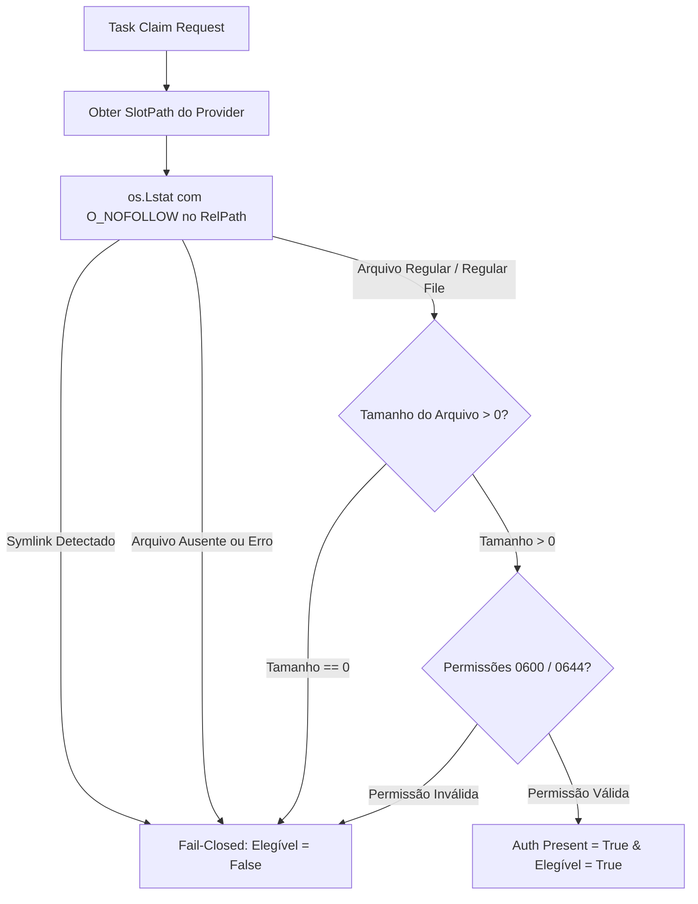

# CORREÇÃO GTL-16R: Design de Elegibilidade Dinâmica de Slots com Metadados Físicos (READ-ONLY)

- **Autor:** Agy-P0-A8 (wB:p2)
- **Destinatários:** Codex56-TL (w5:pC), Codex56#B (w7:p4), KIRO-PRINCIPAL-TL (wB:p1)
- **Data UTC:** 2026-07-27T11:33:31Z
- **Modo:** SOMENTE LEITURA / REVISÃO DE ARQUITETURA (Zero leitura de segredo em memória, zero mutação)

---

## 1. Seção de CORREÇÃO GTL-16R

### 1.1 Correções de Caminhos Reais Extraídos do Código

| Provider | Subdiretório do Slot | RelPath Real do Credencial | Arquivo de Validação no Código |
| :--- | :--- | :--- | :--- |
| **KIRO** | `<slot_path>/xdg-data` | `kiro-cli/data.sqlite3` | `kiro_home.go` (Linha 11: `kiroCredentialRelPath = "kiro-cli/data.sqlite3"`) |
| **AGY / Antigravity** | `<slot_path>/home` | `.gemini/antigravity-cli/antigravity-oauth-token` | `antigravity_home.go` (Linha 12: `antigravityCredentialRelPath`) |
| **CODEX** | `<slot_path>/codex` | `codex-home/...` | `codex_home.go` |
| **CLINE** | `<slot_path>/cline` | `cline-data-dir/...` | `cline_home.go` |

*Nota de Correção:* Kiro utiliza o banco SQLite `kiro-cli/data.sqlite3` no subdiretório `xdg-data` (confirmado em `kiro_home.go:11`), e NUNCA `tokens.json`.

### 1.2 Regra de Ouro: Proibição de Leitura de Segredos em Memória
Conforme diretiva do owner, o avaliador de saúde **NÃO lê nem faz parse de conteúdo de tokens em memória**. A elegibilidade é determinada **exclusivamente por metadados físicos do sistema de arquivos** e integridade da estrutura.

---

## 2. Algoritmo de Validação por Metadados Físicos (`O_NOFOLLOW` / `lstat`)



### 2.1 Passos da Inspeção de Metadados Físicos

1. **Inspeção Symlink (`O_NOFOLLOW` / `os.Lstat`):**
   ```go
   info, err := os.Lstat(srcPath)
   if err != nil || info.Mode()&os.ModeSymlink != 0 {
       return false // Symlink ou arquivo ausente
   }
   ```
2. **Validação de Arquivo Regular:**
   ```go
   if !info.Mode().IsRegular() {
       return false // Deve ser um arquivo físico regular (não socket/fifo/dir)
   }
   ```
3. **Validação de Tamanho Não-Nulo (`Size > 0`):**
   ```go
   if info.Size() <= 0 {
       return false // Arquivo de 0 bytes é um placeholder inválido
   }
   ```

---

## 3. Diferenciação: Auth Present vs Session Alive

- **Auth Present (Autenticação Física Presente):**
  - Condição: O arquivo físico de credencial (ex: `data.sqlite3` para Kiro, `antigravity-oauth-token` para AGY) passa com sucesso pela checagem de metadados (`lstat`, `IsRegular`, `Size > 0`).
  - Indica que a conta possui credencial válida estocada no slot.
- **Session Alive (Sessão de Processo Viva):**
  - Condição: O runtime do daemon no host ORQ2 reporta heartbeat ativo via WebSocket/HTTP (`GET /api/daemon/runtimes`).
  - Um slot pode ter **Auth Present = true** mesmo que o processo esteja ocioso e sem tarefas ativas em execução.

---

## 4. TTL Caching, Revogação & Concorrência

1. **Cache TTL (60 Segundos):**
   - Resultados de `AuthPresent` são armazenados em um cache `map[string]SlotHealthState` com TTL de 60 segundos no Daemon.
   - Evita I/O de disco desnecessário a cada tick de claim.
2. **Tratamento de Revogação:**
   - Se um token for apagado ou zerado (`size = 0`), a próxima verificação no vencimento do TTL marcará `AuthPresent = false`.
   - O claim path falhará em modo **Fail-Closed**, omitindo o slot revogado sem causar pânico no daemon.
3. **Segurança de Concorrência:**
   - Acesso ao cache de saúde protegido por `sync.RWMutex`.

---

## 5. Suíte de Testes Sem Leitura de Conteúdo de Token

1. **TestKiroDataSqlite3Presence:** Criar arquivo regular fictício `kiro-cli/data.sqlite3` com `size > 0`; confirmar `AuthPresent == true`.
2. **TestRejectSymlinks:** Criar symlink apontando para `data.sqlite3`; confirmar rejeição física (`AuthPresent == false`).
3. **TestRejectZeroBytePlaceholder:** Criar `data.sqlite3` de 0 bytes; confirmar `AuthPresent == false`.
4. **TestTTLCacheExpiration:** Confirmar renovação do cache após 60 segundos.
