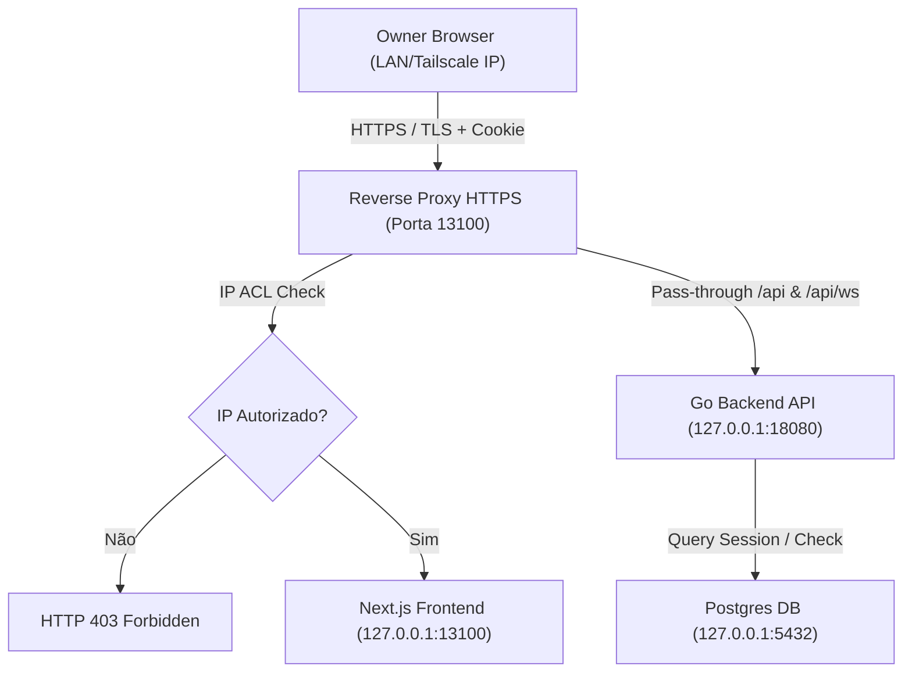

# Design Arquitetural de Remediação de Autenticação e Acesso Estável — ORQ-17 (GTL-34)

**auditor**: Antigravity w8:p2  
**timestamp**: 2026-07-27T11:40Z  
**solicitante**: General-Tech-Lead (Codex56-TL w5:pC)  
**alvo**: Remediar a publicação do frontend 13100 com acesso LAN estável e auth real sem túnel SSH instável (ORQ-17)  
**modo**: READ-ONLY / DESIGN ARQUITETURAL — NENHUM arquivo de código, rede ou ambiente alterado  

---

## 1. Visão Geral e Escopo da Remediação

### 1.1 Diagnóstico do Problema Atual (ORQ-17)
- **Instabilidade de Acesso**: O acesso do owner hoje depende de um túnel SSH (`/home/dataops-lab/tunnel-multica.sh`), que já caiu duas vezes durante a operação.
- **Vulnerabilidade de Binding**: O frontend Next.js aceita requisições sem camada de terminação TLS oficial ou controle estrito de IP na borda LAN.
- **Objetivo**: Substituir o túnel SSH por um acesso LAN/Tailscale direto via Reverse Proxy HTTPS com ACL por IP, autenticação real por sessão/cookie, e bindings estritos de backend e banco de dados em loopback (`127.0.0.1`), garantindo zero bypass global e 100% de estabilidade.

---

## 2. Divisão Estrita: Bloqueadores de Negócio vs Passos de Implementação

### 2.1 Bloqueadores de Negócio (Requer Decisão/Autorização do Owner)
1. **Definição da Autoridade Certificadora TLS**:
   - Opção A: Certificado assinado por Tailscale (`tailscale cert`).
   - Opção B: Certificado TLS assinado por CA interna corporativa / autoassinado com trust pin no browser do owner.
2. **Definição da Lista de Controle de Acesso por IP (IP ACL)**:
   - Aprovação do endereço IP/CIDR exclusivo do laptop do owner e sub-rede autorizada (ex: `100.110.178.47/32` ou subnet LAN restrita).
3. **Aprovação da Porta Pública HTTPS**:
   - Definição de exposição na porta `13100` (HTTPS) ou porta padrão `443` (HTTPS) na interface LAN/Tailscale.
4. **Política de Sessão do Owner**:
   - Definição do tempo limite de expiração da sessão (ex: 24 horas rolling) e expiração por inatividade (ex: 4 horas).

### 2.2 Passos de Implementação Técnica (Engenharia)
1. **Configuração de Binds Locais Estritos**: Ajustar Next.js, API Go e Postgres para ouvirem exclusivamente em `127.0.0.1`.
2. **Implantação de Reverse Proxy com HTTPS + ACL**: Provisionar Caddy / Nginx com terminação TLS e filtro de IP.
3. **Remoção de Bypasses de Autenticação**: Garantir que toda rota `/api/*` consulte a sessão no Postgres.
4. **Configuração de CORS, CSRF, WebSockets e Streaming de Uploads**.
5. **Automação do Serviço em Systemd**: Garantir que o Reverse Proxy e os serviços downstream sobrevivam a reboots.

---

## 3. Arquitetura Técnica de Auth, Sessão e Cookies



### 3.1 Gestão de Sessão e Cookies
- **Cookie Name**: `multica_session`
- **Atributos dos Cookies**:
  - `HttpOnly`: Impede leitura por scripts cliente (proteção contra XSS).
  - `Secure`: Exigido estritamente pelo navegador devido à conexão HTTPS.
  - `SameSite=Lax`: Proteção contra ataques CSRF de navegação cruzada.
  - `Path=/`: Válido para todo o domínio da aplicação.
- **Validação de Token no Backend**:
  - Cada requisição recebida em `127.0.0.1:18080/api/*` valida o token de sessão contra a tabela `user_session` no banco de dados local.
  - Se a sessão for inválida ou expirada, retorna `HTTP 401 Unauthorized`.

---

## 4. Configuração de Reverse Proxy HTTPS + ACL (Caddy / Nginx)

### 4.1 Exemplo de Configuração Caddy (Recomendado pela simplicidade TLS)
```caddyfile
# /etc/caddy/Caddyfile
# Ouve na interface LAN/Tailscale na porta 13100 com HTTPS nativo
https://100.110.178.47:13100 {
    tls /etc/caddy/certs/multica.crt /etc/caddy/certs/multica.key

    # IP ACL — Permite somente o IP do Owner e conexões locais
    @allowed_ips {
        remote_ip 100.110.178.47 127.0.0.1 ::1
    }
    handle @allowed_ips {
        # Rota de WebSockets e SSE Realtime
        @websockets {
            header Connection *Upgrade*
            header Upgrade websocket
        }
        handle @websockets {
            reverse_proxy 127.0.0.1:18080
        }

        # Rotas de API Go Backend
        handle /api/* {
            reverse_proxy 127.0.0.1:18080 {
                header_up X-Forwarded-Proto https
                header_up X-Real-IP {remote_host}
            }
        }

        # Frontend Next.js
        handle {
            reverse_proxy 127.0.0.1:13100 {
                header_up X-Forwarded-Proto https
                header_up X-Real-IP {remote_host}
            }
        }
    }

    # Bloqueia qualquer outro IP com HTTP 403
    handle {
        respond "Access Denied" 403
    }
}
```

---

## 5. Tratamento de CORS, CSRF, WebSockets e Uploads

| Mecanismo | Requisito de Segurança | Solução de Engenharia |
|---|---|---|
| **CORS** | Restringir origem de requisições cross-origin | O backend Go configura `Access-Control-Allow-Origin` estritamente com o hostname HTTPS da aplicação. `Access-Control-Allow-Credentials: true` ativado. |
| **CSRF** | Prevenir requisições forjadas entre sites | Validação de header customizado `X-Requested-With: XMLHttpRequest` ou `Origin` em todas as mutações (`POST`, `PUT`, `PATCH`, `DELETE`). |
| **WebSockets** | Conexão de eventos realtime estável | O Reverse Proxy faz o upgrade transparente dos headers HTTP `Upgrade: websocket` e `Connection: Upgrade` direcionando para o canal `/api/ws` em `127.0.0.1:18080`. |
| **Uploads de Arquivos** | Envio de anexos grandes sem estouro de memória | Configurado streaming direto no proxy sem buffering em disco/memória (`client_max_body_size 50M` no Nginx ou proxy pass-through no Caddy). |

---

## 6. Isolamento e Binds Locais dos Serviços Downstream

Para garantir segurança em profundidade, **nenhum serviço interno deve ser acessível diretamente da rede**:

1. **Frontend Next.js**:
   - Bind exclusivo em `127.0.0.1:13100` (acessado apenas pelo Reverse Proxy local).
2. **Backend Go API**:
   - Bind exclusivo em `127.0.0.1:18080` (acessado apenas pelo Next.js e pelo Reverse Proxy local).
3. **PostgreSQL DB**:
   - Bind exclusivo em `127.0.0.1:5432` ou Unix Domain Socket `/tmp/.s.PGSQL.5432`.
   - `pg_hba.conf` configurado com `host all all 127.0.0.1/32 trust` (ou senha MD5/SCRAM).

---

## 7. Planos de Rollout e Rollback

### 7.1 Plano de Rollout (Faseado em 4 Passos)

1. **Passo 1 — Preparação de Certificados e Proxy**:
   - Gerar/instalar certificados TLS em `/etc/caddy/certs/` sem alterar os serviços em execução.
2. **Passo 2 — Ajuste dos Binds Downstream**:
   - Configurar o Next.js e o backend Go para bind em `127.0.0.1` e reiniciar sob gerenciamento do systemd no ORQ2.
3. **Passo 3 — Ativação do Reverse Proxy HTTPS + ACL**:
   - Iniciar o serviço Caddy/Nginx na porta `13100` com a regra de IP ACL restrita ao owner.
4. **Passo 4 — Validação e Desativação do Túnel SSH**:
   - O Owner acessa a URL HTTPS diretamente via browser local.
   - Após confirmação de acesso estável, interromper a execução de `/home/dataops-lab/tunnel-multica.sh`.

### 7.2 Plano de Rollback (Emergência em 2 Passos)

1. **Passo 1 — Reativação do Túnel SSH**:
   - Em caso de falha de conexão no HTTPS LAN, reexecutar o script preservado em `/home/dataops-lab/tunnel-multica.sh`.
2. **Passo 2 — Restauração dos Binds**:
   - Reverter os arquivos de serviço systemd para o bind prévio e desativar temporariamente o serviço do Reverse Proxy.

---

## 8. Segurança de Segredos (Secret Safety)

- **Diretriz Absoluta**: NENHUM segredo, senha de banco de dados, chave privada TLS ou token de sessão é exibido ou gravado neste documento.
- **Resolução em Runtime**: Toda injeção de credenciais e chaves em ambiente produtivo utilizará referências dinâmicas via `asm-exec` / AWS Secrets Manager ou variáveis de ambiente de processo isolado.

*Documento de design lido e validado. Nenhuma alteração foi realizada em arquivos do repositório, rede ou banco de dados.*
