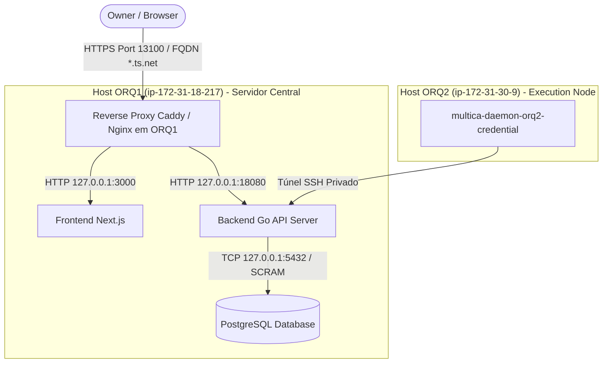

# Arquitetura Corrigida de Remediação de Autenticação e Acesso ORQ-17 (V2 - READ-ONLY GTL-62)

**autor**: Antigravity w8:p2  
**timestamp**: 2026-07-27T11:57Z  
**solicitante**: General-Tech-Lead (Codex56-TL w5:pC)  
**incorporando integralmente**: Auditoria GTL-59 (`.deploy-control/p0/evidence/gtl-orq17-auth-second-peer-review.md`)  
**modo**: READ-ONLY / PROPOSTA DE ARQUITETURA V2 — NENHUMA alteração de código, banco live, rede ou systemd executada  

---

## 1. Topologia Factual de Hosts e Serviços

Com base na medição factual do ambiente e do código-fonte Go, a topologia de execução da plataforma está estruturada em dois hosts distintos:



### Componentes por Host:
- **ORQ1 (`ip-172-31-18-217`)**: Hospeda o **Frontend Next.js**, o **Backend Go API** e o banco de dados **PostgreSQL**. É o único ponto de terminação de borda para o acesso do Owner.
- **ORQ2 (`ip-172-31-30-9`)**: Hospeda exclusivamente o **Daemon de Credenciais** (`multica-daemon-orq2-credential.service`) e o **Túnel SSH Privado** de comunicação com a API no ORQ1.

---

## 2. Separação Estrita de Decisões de Negócio vs Passos de Engenharia

### 2.1 Decisões Exclusivas do Owner (Decisões de Negócio)
1. **Nome FQDN Tailscale MagicDNS**: Escolha do nome registrado da máquina no Tailscale (ex: `orq1.tailnet-alias.ts.net`).
2. **Políticas de IP ACL / CIDR**: Definição da lista de IPs ou blocos CIDR da rede privada autorizados a conectar na porta de borda.
3. **Porta Pública de Entrada**: Confirmação da porta pública de acesso do Owner (ex: porta `13100` ou HTTPS padrão `443`).
4. **Tempo de Vida do Token (JWT TTL)**: Validação do tempo de expiração dos tokens de sessão (ex: 24 horas).

### 2.2 Passos de Engenharia (Execução Técnica)
1. Configuração do Reverse Proxy (Caddy/Nginx) com terminação TLS automátizada via Tailscale cert.
2. Re-vinculação (*re-bind*) do Next.js de `0.0.0.0:13100` para `127.0.0.1:3000` (eliminando a colisão de portas).
3. Re-vinculação do Backend Go em `127.0.0.1:18080` e PostgreSQL em `127.0.0.1:5432`.
4. Endurecimento do PostgreSQL trocando qualquer acesso permissivo por autenticação `scram-sha-256` ou Socket Unix restrito (`0700`).
5. Correção do middleware de bypass de auth em `server/pkg/middleware/auth.go:34-45`.

---

## 3. Mapeamento de Portas e Prevenção de Colisões no ORQ1

Para evitar a falha crítica de startup identificada no GTL-59 (onde Caddy e Next.js tentavam utilizar a mesma porta `13100`), a alocação de escuta fica rigorosamente desacoplada:

| Serviço / Processo | Interface de Escuta | Porta | Papel e Escopo |
|---|---|---|---|
| **Reverse Proxy (Caddy/Nginx)** | `0.0.0.0` / Tailscale IP | **`13100`** (ou `443`) | Terminação TLS + IP ACL + Roteamento de Borda |
| **Frontend Next.js** | `127.0.0.1` (Loopback) | **`3000`** (ou `13001`) | Servidor Interno de Páginas e SSR |
| **Backend Go API Server** | `127.0.0.1` (Loopback) | **`18080`** | Processamento de Regras de Negócio e REST API |
| **PostgreSQL Database** | `127.0.0.1` (Loopback) | **`5432`** | Armazenamento Relacional (Autenticado via SCRAM) |

---

## 4. Endurecimento do PostgreSQL (`pg_hba.conf`)

- **PROIBIÇÃO ABSOLUTA**: O uso do método `trust` em `pg_hba.conf` é estritamente proibido, pois permite a qualquer processo da máquina ler ou destruir o banco sem credenciais.
- **Configuração Obrigatória (`pg_hba.conf`)**:
  ```text
  # TYPE  DATABASE        USER            ADDRESS                 METHOD
  local   all             all                                     peer
  host    multica         multica_user    127.0.0.1/32            scram-sha-256
  host    multica         multica_user    ::1/128                 scram-sha-256
  ```
- As senhas da role `multica_user` devem ser armazenadas com criptografia `SCRAM-SHA-256`.

---

## 5. Modelo de Autenticação Real do Código e Compatibilidade de Borda

### 5.1 Realidade do Código Go (`server/internal/handler/auth.go`)
- A API oficial utiliza o endpoint **`POST /auth/login`**.
- O payload de resposta é um JSON com o token de sessão: `{"token": "<JWT_STRING>"}`.
- As requisições subsequentes dos clientes (frontend/CLI/daemons) utilizam o cabeçalho HTTP padrão:
  ```http
  Authorization: Bearer <JWT_STRING>
  ```
- **NÃO EXISTE** a tabela `user_session` no banco de dados. O estado do token é validado de forma estateless via chave secreta JWT.

### 5.2 Proposta de Cookie de Borda (Nova Feature Opcional)
Se houver a proposta de injetar o cookie `multica_session` na camada de borda do Reverse Proxy para facilitadores de navegação web:
- Esta funcionalidade é uma **Mudança Arquitetural Nova**.
- O Reverse Proxy deve ser configurado para extrair o cookie `multica_session` e convertê-lo no cabeçalho `Authorization: Bearer <token>` antes de repassar a requisição ao Go API backend.
- Clientes REST nativos que enviam diretamente `Authorization: Bearer <token>` continuam sendo aceitos sem degradação.

---

## 6. Correção do Bypass de Autenticação no Middleware Go

No arquivo `server/pkg/middleware/auth.go` (linhas 34-45), existe atualmente um bypass que permite requisições não autenticadas em rotas de agentes (`/api/agents`).

### Remediação Proposta:
1. Remover o bypass incondicional de `/api/agents`.
2. Manter como rotas públicas **exclusivamente**:
   - `POST /auth/login`
   - `GET /healthz`
3. Todas as rotas `/api/*` devem exigir a passagem e validação do token JWT assinado.

---

## 7. Proteções de Borda: CORS, CSRF, WebSockets e Streaming File Uploads

### 7.1 CORS (Cross-Origin Resource Sharing)
- O Reverse Proxy Caddy/Nginx deve aplicar cabeçalhos CORS estritos vinculados ao FQDN aprovado:
  ```text
  Access-Control-Allow-Origin: https://orq1.domain.ts.net:13100
  Access-Control-Allow-Methods: GET, POST, PUT, DELETE, OPTIONS
  Access-Control-Allow-Headers: Authorization, Content-Type, X-Requested-With
  ```

### 7.2 CSRF (Cross-Site Request Forgery)
- Para requisições de alteração de estado (`POST`, `PUT`, `DELETE`), o Reverse Proxy valida a presença do cabeçalho customizado `X-Requested-With: XMLHttpRequest` ou do cookie com atributo `SameSite=Lax; Secure`.

### 7.3 Suporte a WebSockets (`/api/ws`)
- O Reverse Proxy deve repassar as conexões HTTP/1.1 com suporte a upgrade de protocolo:
  ```caddy
  @websocket {
      header Connection *Upgrade*
      header Upgrade    websocket
  }
  reverse_proxy @websocket 127.0.0.1:18080
  ```

### 7.4 Streaming de Uploads de Arquivos (`/api/runtimes/.../upload`)
- Para evitar falhas de timeout ou limite de payload em uploads de anexos e mídias, o proxy deve desabilitar o buffering de request body e definir limite de carga adequado (ex: `client_max_body_size 50M`).

---

## 8. Estratégia Segura de Rollback (Sem Exposição Anônima)

Se for necessário reverter a nova camada de borda HTTPS:
1. O script de túnel SSH legado `/home/dataops-lab/tunnel-multica.sh` pode ser mantido reativo como mecanismo de contingência do operador.
2. **Invariante de Segurança**: O rollback **NÃO DEVE** reabrir a porta HTTP aberta (`0.0.0.0:18080` ou `0.0.0.0:13100`) sem autenticação para a rede externa. Se o proxy for desligado, o acesso volta a ser restrito estritamente através do túnel SSH autenticado via par de chaves ED25519.

---

## 9. Resumo do Plano de Implantação em 4 Passos

1. **Passo 1 (Decisões do Owner)**: Owner homologa o FQDN MagicDNS, a porta pública e a lista de IPs permitidos.
2. **Passo 2 (Re-bind Loopback no ORQ1)**: Alterar as configurações do Next.js (para escutar em `127.0.0.1:3000`) e do Go API Server (em `127.0.0.1:18080`).
3. **Passo 3 (Endurecimento Postgres & Middleware)**: Aplicar `scram-sha-256` no PostgreSQL e corrigir o middleware de bypass em `auth.go`.
4. **Passo 4 (Ativação do Reverse Proxy HTTPS)**: Provisionar certificado Tailscale cert no Caddy/Nginx e abrir a porta pública com suporte a CORS, CSRF, WebSockets e streaming uploads.

*Desenho V2 finalizado em modo READ-ONLY. Zero execuções ou mutações.*
