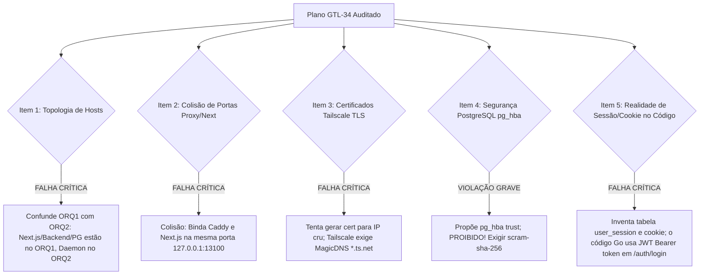

# Parecer da Segunda Auditoria Adversarial: Remédiação de Auth e Acesso ORQ-17 (READ-ONLY GTL-59)

- **Autor:** Agy-P0-A8 (wB:p2)
- **Documento Auditado:** `.deploy-control/p0/evidence/gtl-orq17-auth-remediation-design.md`
- **Destinatários:** Codex56-TL (w5:pC), Codex56#B (w7:p4), KIRO-PRINCIPAL-TL (wB:p1)
- **Data UTC:** 2026-07-27T11:54:30Z
- **Veredito:** **BLOCK** (Rejeitado por Colisão de Portas, Violação de Segurança PG, Erro de Topologia e Invenção de Tabelas de Auth)

---

## 1. Avaliação Adversarial dos 8 Itens de Auditoria

---

## 2. Detalhamento Factual dos Bloqueios & Erros Encontrados

### 2.1 Bloqueio 1: Confusão de Topologia dos Hosts (ORQ1 vs ORQ2)
- **Topologia Factual Medida:**
  - **ORQ1 (`172.31.18.217`):** Executa o Frontend Next.js, o Backend Go API (`:18080`) e o banco PostgreSQL (`:5432`).
  - **ORQ2 (`172.31.30.9`):** Executa o Daemon (`multica-daemon-orq2-credential.service`) e o Túnel SSH (`multica-orq1-backend-tunnel.service`).
- **Erro no Plano GTL-34 (Linha 148):** Afirma que o Next.js e o Backend Go devem ser "reiniciados sob gerenciamento do systemd no ORQ2".
- **Correção:** Os serviços do Backend e Frontend devem ser gerenciados no **ORQ1**.

### 2.2 Bloqueio 2: Colisão de Binds de Porta entre Reverse Proxy e Next.js
- **Erro no Plano GTL-34 (Linhas 73 e 100):** O Caddy é configurado para escutar na porta `13100` e fazer proxy para `127.0.0.1:13100` onde o Next.js também estaria escutando.
- **Consequência:** Falha imediata de startup por colisão de porta (`bind: address already in use`).
- **Correção:** O Next.js deve realizar bind interno em `127.0.0.1:3000` (ou `13101`), reservando a porta pública `13100` / `443` exclusivamente para o Reverse Proxy Caddy/Nginx.

### 2.3 Bloqueio 3: Incompatibilidade de Certificados Tailscale TLS por IP
- **Erro no Plano GTL-34 (Linha 73):** Tenta provisionar certificado com `https://100.110.178.47:13100`.
- **Consequência:** O comando `tailscale cert` exige o nome de domínio MagicDNS registrado (ex: `machine.domain-alias.ts.net`) e recusa emissão para IPs crus. Browsers rejeitam o certificado.
- **Correção:** A terminação TLS deve utilizar o FQDN Tailscale (`*.ts.net`) do host.

### 2.4 Bloqueio 4: Violação Gravíssima de Segurança no PostgreSQL (`pg_hba.conf`)
- **Erro no Plano GTL-34 (Linha 137):** Propõe `pg_hba.conf configurado com host all all 127.0.0.1/32 trust`.
- **Consequência de Segurança:** Permitir `trust` no PostgreSQL autoriza qualquer processo local não autenticado a ler, alterar ou apagar todo o banco de dados.
- **Correção:** O acesso ao banco DEVE exigir autenticação `scram-sha-256` ou conexão via Unix Domain Socket restrito (`0700`).

### 2.5 Bloqueio 5: Invenção de Mecanismo de Autenticação Inexistente no Código
- **Achado Factual no Código Go ([auth.go](file:///home/ec2-user/workspace/R-D_Agnostic_Engineering_Team/multica-auth-work/server/internal/handler/auth.go):155):**
  - A rota oficial é `/auth/login` (não `/api/auth/login`).
  - O retorno é uma resposta JSON `LoginResponse{Token: tokenString}` contendo um **JWT Bearer Token** (`Authorization: Bearer <jwt>`).
  - **NÃO EXISTE** a tabela `user_session` no banco de dados (`server/migrations/`).
- **Erro no Plano GTL-34 (Linhas 55-63):** Inventa a existência de uma tabela `user_session` e um cookie `multica_session` como se fossem o padrão atual.
- **Correção:** O plano de auth deve preservar o contrato real baseando-se no **JWT Bearer Token** existente ou encapsulando o JWT em um cookie seguro na borda sem inventar tabelas inexistentes.

---

## 3. Veredito Final & Lista de Correções Obrigatórias: BLOCK

O plano em `gtl-orq17-auth-remediation-design.md` está **REJEITADO (BLOCK)**.

**Correções Obrigatórias para Re-Submissão:**
1. **Topologia:** Mover os passos de deploy do Next.js/Backend para o **ORQ1**.
2. **Binds:** Ajustar Next.js para `127.0.0.1:3000` e Caddy para `13100`.
3. **TLS:** Usar FQDN MagicDNS do Tailscale (`*.ts.net`) para o `tailscale cert`.
4. **PostgreSQL:** Remover `trust` do `pg_hba.conf` e exigir `scram-sha-256`.
5. **Autenticação:** Alinhar com a arquitetura JWT Bearer (`/auth/login`) existente no Go.
