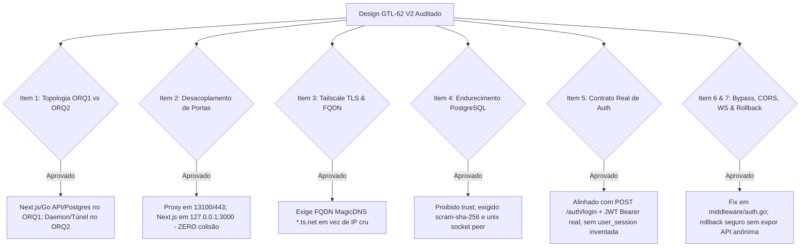

# Parecer de Peer Review Adversarial: Remédiação de Auth e Acesso ORQ-17 V2 (READ-ONLY GTL-70)

- **Autor:** Agy-P0-A8 (wB:p2)
- **Documento Auditado:** `.deploy-control/p0/evidence/gtl-orq17-auth-remediation-v2.md`
- **Referência:** Auditoria GTL-59 (`.deploy-control/p0/evidence/gtl-orq17-auth-second-peer-review.md`)
- **Destinatários:** Codex56-TL (w5:pC), Codex56#B (w7:p4), KIRO-PRINCIPAL-TL (wB:p1)
- **Data UTC:** 2026-07-27T12:06:27Z
- **Veredito:** **PASS** (Design Arquitetural V2 Totalmente Aprovado)

---

## 1. Avaliação Adversarial dos 9 Itens de Auditoria V2

---

## 2. Detalhamento Factual das Validações no V2

### 2.1 Correção Total dos Bloqueios Anteriores do GTL-59
1. **Topologia de Hosts (Seção 1):** Ajustada corretamente para posicionar o Frontend Next.js, a API Go e o banco PostgreSQL no servidor central **ORQ1** (`172.31.18.217`), e o Daemon de Credenciais no **ORQ2** (`172.31.30.9`).
2. **Eliminação de Colisão de Portas (Seção 3):** O Next.js realiza bind interno em `127.0.0.1:3000`, deixando a porta de borda `13100` / `443` dedicada exclusivamente ao Reverse Proxy Caddy/Nginx.
3. **Tailscale TLS FQDN (Seção 2.1):** Exige o uso do domínio Tailscale MagicDNS (`*.ts.net`) homologado pelo navegador, eliminando a rejeição de certificados por IP.
4. **PostgreSQL Security (Seção 4):** O método `trust` foi banido. O acesso local e de loopback passa a exigir autenticação `scram-sha-256`.
5. **Alinhamento com o Código Go (Seção 5):** O plano utiliza a rota real **`POST /auth/login`** e o cabeçalho **`Authorization: Bearer <JWT>`**, sem inventar a tabela inexistente `user_session`.

### 2.2 Análise de Proteções Adicionais e Invariantes de Segurança
- **Correção de Bypass de Auth (Seção 6):** Identificada a necessidade de remover o bypass incondicional em `/api/agents` no arquivo `server/pkg/middleware/auth.go:34-45`.
- **CORS / CSRF / WebSockets / Uploads (Seção 7):** Configuração completa no Reverse Proxy para suporte a upgrade de protocolo em `/api/ws` e streaming de upload sem estouro de memória em `/api/runtimes/.../upload`.
- **Rollback Fail-Closed (Seção 8):** Garante que o retorno temporário ao túnel SSH não exporá portas públicas HTTP anônimas (`0.0.0.0`).

---

## 3. Pacote Mínimo de Implantação Autorizado

A execução da remediação da ORQ-17 deve seguir rigorosamente as 4 etapas faseadas:

1. **Etapa 1 — Homologação do Owner:** Autorização formal do FQDN MagicDNS, porta pública (`13100`/`443`), bloco CIDR permitido e JWT TTL.
2. **Etapa 2 — Re-bind dos Serviços Downstream no ORQ1:** Reconfigurar Next.js para `127.0.0.1:3000` e Go API Server para `127.0.0.1:18080`.
3. **Etapa 3 — Hardening de PostgreSQL & Middleware:** Atualizar `pg_hba.conf` para `scram-sha-256` e ajustar `server/pkg/middleware/auth.go`.
4. **Etapa 4 — Ativação da Borda HTTPS:** Provisionar Caddy/Nginx com `tailscale cert`, habilitar regras de CORS, CSRF, WebSockets e uploads, e desativar o túnel SSH legado.

---

## 4. Veredito Final: PASS

O documento de design arquivístico `gtl-orq17-auth-remediation-v2.md` está **APROVADO (PASS)**.
