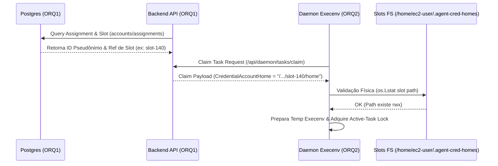

# Arquitetura & Patch Map Redesign ORQ-21 Bridge (READ-ONLY GTL-09)

- **Autor:** Agy-P0-A8 (wB:p2)
- **Destinatários:** Codex56-TL (w5:pC), Codex56#B (w7:p4), KIRO-PRINCIPAL-TL (wB:p1)
- **Data UTC:** 2026-07-27T11:28:04Z
- **Modo:** SOMENTE LEITURA / REDESIGN DE ARQUITETURA (Nenhum build ou edição executada)

---

## 1. Princípios de Arquitetura & Resolução de Bloqueios



### 1.1 Resolução Exclusiva no Claim Path (Backend ORQ1)
- **Fato:** O Daemon do ORQ2 **NÃO possui conexão direta ao PostgreSQL**.
- **Solução:** Toda a lógica de rotação de conta, filtro de assignments e seleção de slot ocorre no Backend (ORQ1) durante a requisição de reivindicação (`claim`).
- **Dado Transmitido:** O Backend injeta no payload da tarefa apenas o identificador pseudônimo e caminho relativo do slot (ex: `slot-140`), sem expor credenciais brutas no banco.

### 1.2 Validação Física no Daemon (ORQ2)
- Antes de spawnar o processo filho, o Daemon executa `os.Lstat(accountHome)`.
- Se o diretório do slot não existir fisicamente no ORQ2, o Daemon rejeita a execução graciosa com log auditável em vez de falhar em runtime.

### 1.3 Normalização de Aliases (`agy` / `antigravity`)
- Em `execenv.go:312`, estender a verificação de provider para aceitar ambos os aliases:
  ```go
  if (params.Provider == "antigravity" || params.Provider == "agy") && params.CredentialAccountHome != ""
  ```
- Garante roteamento unificado para `prepareAntigravityHome` apontando para `<slot_path>/home`.

### 1.4 Travas de Tarefas Ativas & Revogação
- **Active-Task Locks:** O Daemon utiliza semáforo por slot (`newTaskSlotSemaphore`) no `execenv` para impedir que duas tarefas no mesmo slot sobrescrevam o ambiente temporário simultaneamente.
- **Revogação:** Se uma conta for revogada no banco (ORQ1), a query do claim path ignora o slot desativado e o Backend não envia `CredentialAccountHome`, caindo no comportamento global ou marcando a task como `skipped`.

---

## 2. Mapa Mínimo de Patches (Patch Map para Codex56-TL)

| Arquivo Alvo | Componente | Descrição Mínima da Alteração |
| :--- | :--- | :--- |
| `server/internal/daemon/daemon.go` | **Backend Claim (ORQ1)** | Substituir `credentialAccountHome := ""` (Linha 3448) pela resolução dinâmica baseada no `CurrentAssignment` e tabela de slots do DB. |
| `server/internal/daemon/execenv/execenv.go` | **Daemon Execenv (ORQ2)** | Adicionar alias `params.Provider == "agy"` (Linha 312) e validação `os.Lstat` do subdiretório do provider (`/home` para agy, `/xdg-data` para kiro, `/codex` para codex). |
| `server/internal/daemon/execenv/kiro_home.go` | **Kiro Guard (ORQ2)** | Manter `if srcMissing return nil` (Linhas 73-75) combinado com a allowlist dos 4 slots válidos (`139`, `140`, `143`, `149`). |

---

## 3. Cobertura de Testes Recomendada
1. **Claim Path Slot Resolution Test (Backend):** Testar se a reivindicação de tarefa retorna o slot pseudônimo correto associado à conta do agente.
2. **Physical Slot Validation Test (Daemon):** Testar que o Daemon valida `os.Lstat` do slot no ORQ2 antes do spawn.
3. **Alias Normalization Test (`agy` vs `antigravity`):** Testar que requisições com `Provider = "agy"` ativam o isolamento de `AntigravityHome`.
4. **Revocation & Lock Test:** Testar que contas revogadas não recebem atribuição de slot e tarefas concorrentes respeitam a trava de execução.
