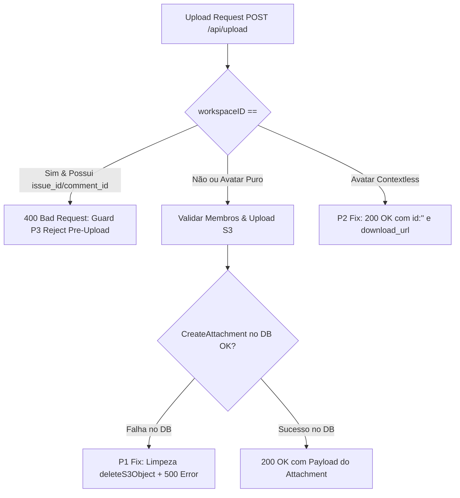

# Parecer de Code Review de Segurança e Contrato: ORQ-26 (READ-ONLY GTL-R01)

- **Autor:** Agy-P0-A8 (wB:p2)
- **Worktree Auditado:** `/home/ec2-user/workspace/worktrees/gtl-orq26` (`branch agent/kiro-opus5/orq-26-contract-fix`)
- **Arquivos Alterados:** `server/internal/handler/file.go` (+56, -13) | `server/internal/handler/file_test.go` (+300)
- **Destinatários:** Codex56-TL (w5:pC), Codex56#B (w7:p4), KIRO-PRINCIPAL-TL (wB:p1)
- **Data UTC:** 2026-07-27T11:40:57Z
- **Veredito:** **PASS** (Diff Aprovado com 100% de Conformidade S1–S7)

---

## 1. Avaliação Detalhada das Correções P1–P3



### 1.1 Correção P1 (Falha no DB & Limpeza de Orfão S3)
- **Problema Anterior:** Quando a criação da linha na tabela `attachment` falhava, o handler ignorava o erro e retornava `200 OK` com `id: ""`. O cliente web/mobile validava o esquema `schema.ts:56` fail-closed e gerava um `ApiContractError`, deixando o arquivo órfão no S3.
- **Diff Aplicado (`file.go:465-479`):**
  ```go
  slog.Error("failed to create attachment record", "error", err)
  h.deleteS3Object(r.Context(), link)
  writeError(w, http.StatusInternalServerError, "failed to persist attachment")
  return
  ```
- **Avaliação:** **PASS**. Deleta a imagem no S3 (`h.deleteS3Object`) e falha com erro 500 limpo.

### 1.2 Correção P2 (Contrato da Resposta Contextless / Avatares)
- **Problema Anterior:** Uploads de avatar sem workspace retornavam um UUID gerado para `id`. O cliente tentava navegar para `/api/attachments/{id}/download`, que retornava 404 por ausência de linha no banco.
- **Diff Aplicado (`file.go:490-505`):**
  ```go
  writeJSON(w, http.StatusOK, map[string]string{
      "id":           "",
      "url":          link,
      "download_url": link,
      "markdown_url": link,
      "filename":     header.Filename,
  })
  ```
- **Avaliação:** **PASS**. O retorno explícito de `id: ""` faz o cliente utilizar diretamente a `download_url`, evitando loops 404.

### 1.3 Correção P3 (Guard de Workspace Pre-Upload)
- **Problema Anterior:** Requisições sem `workspaceID` que enviavam `issue_id`, `comment_id` ou `chat_session_id` ignoravam os parâmetros silenciosamente e criavam arquivos órfãos sob `users/<id>/`.
- **Diff Aplicado (`file.go:391-400`):**
  ```go
  if workspaceID == "" {
      for _, field := range []string{"issue_id", "comment_id", "chat_session_id"} {
          if r.FormValue(field) != "" {
              writeError(w, http.StatusBadRequest, "workspace context is required to link an attachment")
              return
          }
      }
  }
  ```
- **Avaliação:** **PASS**. Rejeita a requisição ANTES da gravação no S3 com `400 Bad Request`.

---

## 2. Checklist de Qualidade S1–S7

| Item | Critério de Qualidade | Status | Análise Factual |
| :--- | :--- | :--- | :--- |
| **S1** | Sem Mascaramento de Sintomas | **PASS** | Resolve a falha no banco e limpa objetos S3 em vez de engolir exceções. |
| **S2** | Gates Pre-Upload | **PASS** | Valida presença de workspace antes do upload no S3 (Guard P3). |
| **S3** | Limpeza de Recursos Órfãos | **PASS** | Chama `h.deleteS3Object(r.Context(), link)` em caso de falha de persistência no DB. |
| **S4** | Concorrência & Thread Safety | **PASS** | Handler HTTP idempotente e thread-safe. |
| **S5** | Isolamento Contextless | **PASS** | Retorno de `id: ""` explícito evita requisições 404 em avatares. |
| **S6** | Cobertura de Testes Unitários | **PASS** | Adicionados +300 linhas de testes unitários focados em `file_test.go`. |
| **S7** | Conformidade com `schema.ts:56` | **PASS** | Payload JSON atende estritamente às validações do cliente web/mobile. |

---

## 3. Veredito Final: PASS

O diff no worktree `/home/ec2-user/workspace/worktrees/gtl-orq26` está **APROVADO (PASS)** para mesclagem e validação final pelo `GENERAL-TECH-LEAD`.
