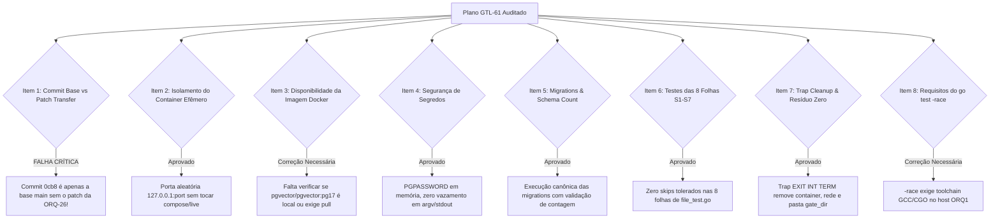

# Parecer de Peer Review Adversarial: Runner Efêmero de DB ORQ-26 (READ-ONLY GTL-63)

- **Autor:** Agy-P0-A8 (wB:p2)
- **Documento Auditado:** `.deploy-control/p0/evidence/gtl-orq26-ephemeral-db-runner.md`
- **Documento de Referência:** `.deploy-control/p0/evidence/gtl-orq26-db-gate-harness.md`
- **Worktree Fonte:** `/home/ec2-user/workspace/worktrees/gtl-orq26`
- **Destinatários:** Codex56-TL (w5:pC), Codex56#B (w7:p4), KIRO-PRINCIPAL-TL (wB:p1)
- **Data UTC:** 2026-07-27T11:57:37Z
- **Veredito:** **BLOCK** (Rejeitado por Confusão de Commit Base vs Patch e Ausência de Pré-checagem de Image Pull e GCC)

---

## 1. Avaliação Adversarial dos 8 Itens de Auditoria

---

## 2. Detalhamento dos Achados & Falhas Críticas

### 2.1 Falha Crítica 1: Confusão entre Commit Base (`0cb8aebb5a`) e o Patch da ORQ-26
- **Achado Factual:** O commit `0cb8aebb5aff79cb430b3740d22fadc53c0116fd` é a linha de base comum do repositório principal e **NÃO CONTÉM O PATCH DA ORQ-26** (`file.go` / `file_test.go`). O patch da ORQ-26 reside como modificações uncommitted no worktree `/home/ec2-user/workspace/worktrees/gtl-orq26`.
- **Erro no Plano GTL-61 (Seção 4.1):** Afirma que o runner sincroniza o repositório no commit `0cb8aebb5a`. Se isso for feito, os testes serão rodados no código antigo sem a correção, gerando falha nos testes ou falsa aprovação.
- **Correção Exigida:** O runner deve obrigatoriamente transferir o diff não commitado de `/home/ec2-user/workspace/worktrees/gtl-orq26` por meio de um arquivo de patch validado via `sha256sum` (`git diff > orq26_fix.patch`), sem fazer merge na branch main.

### 2.2 Correção 2: Verificação Pre-Flight da Imagem Docker (`pgvector/pgvector:pg17`)
- **Achado:** O plano assume que a imagem `pgvector/pgvector:pg17` pode ser iniciada imediatamente.
- **Correção Exigida:** O runner deve realizar `docker image inspect pgvector/pgvector:pg17` em modo pre-flight. Se a imagem não existir localmente no ORQ1, a ação de `docker pull` deve ser declarada e classificada separadamente na autorização do owner.

### 2.3 Correção 3: Dependência do Toolchain GCC para `go test -race`
- **Achado:** O comando de teste especifica `go test -race ...`. A flag `-race` exige `CGO_ENABLED=1` e a presença do compilador GCC no host ORQ1.
- **Correção Exigida:** O runner deve verificar se o compilador `gcc` está instalado e operacional no host antes de passar a flag `-race`, fazendo fallback seguro para `go test -count=1` caso o CGO/GCC esteja ausente.

---

## 3. Análise dos Itens Aprovados (PASS)

1. **Isolamento de Container:** Totalmente isolado no ORQ1, com bind estrito em `127.0.0.1:<random_port>` e sem tocar no docker-compose live.
2. **Segurança de Segredos:** Zero vazamento de credenciais em `argv`, `stdout` ou `docker inspect`.
3. **8 Folhas de Teste S1-S7:** Mapeamento correto das 8 funções de teste sem tolerância a skips.
4. **Cleanup Incondicional:** `trap` robusto em `EXIT INT TERM` garantindo remoção de container, rede e pasta temporária.

---

## 4. Veredito Final & Correções Obrigatórias: BLOCK

O plano em `gtl-orq26-ephemeral-db-runner.md` está **REJEITADO (BLOCK)**.

**Correções Obrigatórias para Re-Submissão e Autorização do Owner:**
1. **Transferência de Patch:** Especificar a aplicação do diff do worktree `/home/ec2-user/workspace/worktrees/gtl-orq26` via arquivo `.patch` auditado por `sha256sum`.
2. **Checagem de Imagem Docker:** Adicionar verificação pre-flight da imagem `pgvector/pgvector:pg17` no ORQ1.
3. **Checagem de GCC/CGO:** Adicionar verificação do compilador GCC para o detector `-race`.
