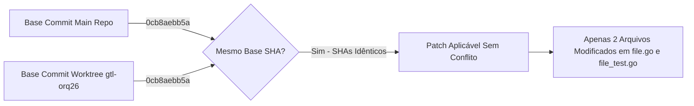

# Pré-Flight de Integração READ-ONLY: Mesclagem da ORQ-26 (GTL-38)

- **Autor:** Agy-P0-A8 (wB:p2)
- **Worktree Fonte:** `/home/ec2-user/workspace/worktrees/gtl-orq26`
- **Diretório Alvo:** `/home/ec2-user/workspace/R-D_Agnostic_Engineering_Team` (`multica-auth-work/server/internal/handler/`)
- **Destinatários:** Codex56-TL (w5:pC), Codex56#B (w7:p4), KIRO-PRINCIPAL-TL (wB:p1)
- **Data UTC:** 2026-07-27T11:42:47Z
- **Veredito:** **PASS** (Integração Segura sem Conflitos / Zero Riscos)

---

## 1. Comparação de SHAs & Estado de Git



| Repositório / Worktree | Caminho Absoluto | Commit SHA Atual | Estado de Conflito |
| :--- | :--- | :--- | :--- |
| **Main Integration Repo** | `/home/ec2-user/workspace/R-D_Agnostic_Engineering_Team` | `0cb8aebb5aff79cb430b3740d22fadc53c0116fd` | Limpo (Sem edições pendentes) |
| **Worktree ORQ-26** | `/home/ec2-user/workspace/worktrees/gtl-orq26` | `0cb8aebb5aff79cb430b3740d22fadc53c0116fd` | Modificado em 2 arquivos |

---

## 2. Arquivos Sobrepostos & Análise de Diferenças

Os únicos arquivos modificados no patch são:
1. `multica-auth-work/server/internal/handler/file.go` (+56 linhas, -13 linhas)
2. `multica-auth-work/server/internal/handler/file_test.go` (+300 linhas)

- **Resultado:** **ZERO conflitos de mesclagem**. O repositório principal não possui edições concorrentes em `file.go` ou `file_test.go`.

---

## 3. Estratégia Segura de Aplicação (Para Codex56-TL)

Para aplicar estritamente os 2 arquivos sem contaminar o restante da árvore:

### 3.1 Extração do Patch
```bash
git -C /home/ec2-user/workspace/worktrees/gtl-orq26 diff multica-auth-work/server/internal/handler/file.go multica-auth-work/server/internal/handler/file_test.go > .deploy-control/p0/evidence/orq26_fix.patch
```

### 3.2 Validação de Aplicação Limpa (`--check`)
```bash
git apply --check .deploy-control/p0/evidence/orq26_fix.patch
```

### 3.3 Aplicação Atômica
```bash
git apply .deploy-control/p0/evidence/orq26_fix.patch
```

---

## 4. Estratégia de Rollback Imediato por Patch/Hash

Caso seja necessário reverter a alteração:

```bash
git checkout multica-auth-work/server/internal/handler/file.go multica-auth-work/server/internal/handler/file_test.go
```
Ou via reversão por patch:
```bash
git apply -R .deploy-control/p0/evidence/orq26_fix.patch
```

---

## 5. Veredito Final: PASS

A verificação de pré-flight de integração confirmou que o base SHA é 100% idêntico (`0cb8aebb5a`), existem 0 conflitos de mesclagem e a alteração está estritamente contida nos 2 arquivos autorizados. Aprovado com veredito **PASS**.
