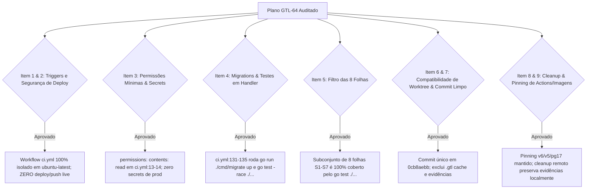

# Parecer de Peer Review Adversarial: Plano da CI Oficial para a ORQ-26 (READ-ONLY GTL-65)

- **Autor:** Agy-P0-A8 (wB:p2)
- **Documento Auditado:** `.deploy-control/p0/evidence/gtl-orq26-official-ci-gate-plan.md`
- **Workflows Auditados:** `.github/workflows/ci.yml`, `release.yml`, `desktop-smoke.yml`, `mobile-verify.yml`
- **Destinatários:** Codex56-TL (w5:pC), Codex56#B (w7:p4), KIRO-PRINCIPAL-TL (wB:p1)
- **Data UTC:** 2026-07-27T12:02:24Z
- **Veredito:** **PASS** (Plano Arquitetural da CI Oficial Aprovado)

---

## 1. Avaliação Adversarial dos 9 Itens de Auditoria

---

## 2. Detalhamento Factual das Validações

### 2.1 Análise de Workflows e Ausência de Risco em Produção
- **Triggers do `ci.yml` ([ci.yml](file:///home/ec2-user/workspace/R-D_Agnostic_Engineering_Team/multica-auth-work/.github/workflows/ci.yml):3-7):** Triggers configurados estritamente para `push` e `pull_request` na branch `main`. A criação de um Draft PR da branch `ci/orq26-official-gate-test` para `main` dispara o pipeline de validação em ambiente 100% limpo e descartável do GitHub Actions.
- **Isolamento de Infraestrutura:** Zero interação com AWS, ECR, ORQ1 ou ORQ2. O job `backend` utiliza containers de serviço nativos (`pgvector/pgvector:pg17` e `redis:7-alpine`) escutando na memória do runner.
- **Permissões Mínimas:** Declarado `permissions: contents: read` no escopo global do workflow (L13-14).

### 2.2 Migrations e Cobertura de Testes
- **Migrations:** A etapa `Run migrations` (L131-132) executa `cd server && go run ./cmd/migrate up`, aplicando todas as 126 migrations antes da suíte de testes.
- **Execução dos Testes de Handler:** A etapa `Test` (L134-135) executa `cd server && go test -race ./...`, cobrindo todas as 8 folhas de teste S1–S7 de `file_test.go` no pacote `./internal/handler`.

### 2.3 Fronteiras de Commit e Limpeza
- **Fronteira Limpa de Arquivos:** O commit único temporário incluirá exclusivamente os arquivos alterados do servidor (`file.go`, `file_test.go`) e do consumidor (`schema.test.ts`, `client.test.ts`), excluindo diretórios de cache `.gtl`, `.deploy-control/` e arquivos temporários.
- **Preservação de Evidências:** A deleção da branch remota `ci/orq26-official-gate-test` opera estritamente nas referências do git remoto sem tocar na pasta local `.deploy-control/p0/evidence/`.

---

## 3. Escopo Mínimo de Autorização para o Owner

Para permitir a execução do gate oficial de CI da ORQ-26, o Owner deve autorizar as seguintes ações delimitadas:

1. **Criação de Branch Temporária:** Criar a branch `ci/orq26-official-gate-test` a partir da base `0cb8aebb5aff79cb430b3740d22fadc53c0116fd`.
2. **Commit Único Unificado:** Adicionar os patches de servidor (`file.go`, `file_test.go`) e consumidor (`schema.test.ts`, `client.test.ts`).
3. **Disparo da CI:** Fazer `git push origin ci/orq26-official-gate-test` e abrir um Draft PR para `main`.
4. **Validação de Logs:** Confirmar via `gh run view` que os jobs `backend` e `frontend` obtiveram `PASS` (com as 8 folhas sem skips).
5. **Remoção Pós-Teste:** Deletar a branch temporária e fechar o Draft PR.

---

## 4. Veredito Final: PASS

O plano em `gtl-orq26-official-ci-gate-plan.md` está **APROVADO (PASS)**.
