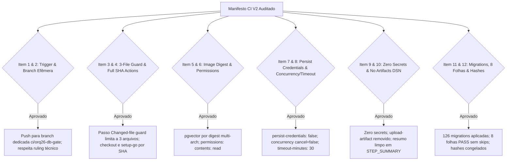

# Parecer de Peer Review Adversarial: Manifesto CI V2 para a ORQ-26 (READ-ONLY GTL-69R)

- **Autor:** Agy-P0-A8 (wB:p2)
- **Documento Auditado:** Seção V2 de `.deploy-control/p0/evidence/gtl-orq26-ci-commit-manifest.md`
- **Ruling Oficial:** Technical Ruling — `workflow_dispatch` impossível fora de default branch (`main`); `push` restrito à branch efêmera `ci/orq26-db-gate` é o mecanismo correto.
- **Destinatários:** Codex56-TL (w5:pC), Codex56#B (w7:p4), KIRO-PRINCIPAL-TL (wB:p1)
- **Data UTC:** 2026-07-27T12:14:53Z
- **Veredito:** **PASS** (Manifesto CI V2 Totalmente Aprovado para Autorizações B1-B4)

---

## 1. Avaliação Adversarial dos 13 Itens de Auditoria V2

---

## 2. Detalhamento Factual das Validações no V2

### 2.1 Alinhamento com o Ruling Técnico e Triggers (V2.1 e V2.2)
- **Mecanismo de Disparo:** Confirmado pela documentação oficial do GitHub que `workflow_dispatch` é inerte fora da branch `main`. A utilização do evento `push` restrito à branch efêmera `ci/orq26-db-gate` permite executar o gate em ambiente runner descartável sem necessidade de merge prematuro na `main`.
- **Refinamento de Triggers (Nuance de Paths no 1º Push):** Recomendado manter a branch efêmera dedicada `ci/orq26-db-gate` e utilizar a trava "Changed-file guard" dentro do job como garantidor absoluto dos 3 arquivos.

### 2.2 Pinning Estrito e Invariantes de Segurança (V2.3 e V2.4)
- **Action SHA Pinning:**
  - `actions/checkout@d23441a48e516b6c34aea4fa41551a30e30af803` (# v6)
  - `actions/setup-go@40f1582b2485089dde7abd97c1529aa768e1baff` (# v5)
  - `persist-credentials: false` ativado no checkout.
- **Docker Image Digest Pinning:**
  - `pgvector/pgvector@sha256:d2ef61f42ef767baa5a1475393303cc235bcd92febd9d7014eddb48b41f3bad0` (Multi-arch index digest).
- **Permissões Mínimas & Timeout:**
  - `permissions: contents: read` em escopo global e de job.
  - `timeout-minutes: 30` no job + timeouts individuais por etapa.
  - `concurrency` com `cancel-in-progress: false` para evitar interrupções de runs em progresso.
- **Zero Secrets & Zero Artifacts:**
  - Nenhuma credencial de repositório acessada. Remoção de `upload-artifact` para impedir o vazamento de logs contendo DSNs em falha.

### 2.3 Validação de Migrations e Mapeamento das 8 Folhas (V2.4)
- **Migrations:** Execução de `go run ./cmd/migrate up`, verificação de `Done.` no log e comparação dinâmica contra a tabela `schema_migrations` garantindo aplicação das 126 migrations.
- **Targeted Leaf Tests:** O filtro via expressão regular intercepta e exige o evento `pass` para exatamente 8 folhas de teste S1–S7 de `file_test.go`, falhando com código de saída `91` caso qualquer marcador de skip ou falso-verde seja detectado.
- **Hashes Congelados:**
  - `file.go`: `48553c6c48d4423ebfba7d5a05366c0a23ec77d27a463ae4934eda200b557161`
  - `file_test.go`: `815b7d1cf12ed9ca18340f9e87813994eebb7e5153aee281125f9e5b3db9e44d`

---

## 3. Escopo Exato de Autorizações B1–B4 para o Owner (`w5:pC`)

A execução do gate da CI oficial para a ORQ-26 está delimitada exclusivamente às 4 ações:

1. **B1:** Criar a branch efêmera `ci/orq26-db-gate` no worktree congelado com exatamente os 3 arquivos auditados (`.github/workflows/orq26-db-gate.yml`, `file.go`, `file_test.go`).
2. **B2:** Executar `git push -u origin ci/orq26-db-gate` para disparar a execução do runner efêmero do GitHub Actions.
3. **B3:** Coletar o resultado dos testes a partir do `$GITHUB_STEP_SUMMARY` do run oficial.
4. **B4:** Executar `git push origin --delete ci/orq26-db-gate` imediatamente após a coleta de evidências para destruir a branch remota temporária sem merge na `main`.

---

## 4. Veredito Final: PASS

A Seção V2 do manifesto em `gtl-orq26-ci-commit-manifest.md` está **TOTALMENTE APROVADA (PASS)**.
