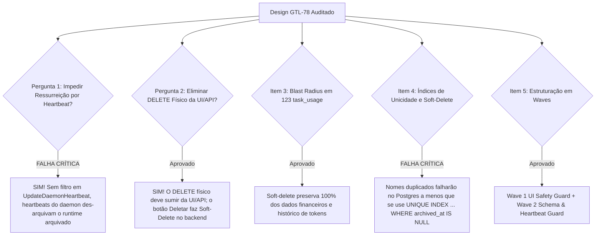

# Parecer de Peer Review Adversarial: Lifecycle Seguro de Runtimes (READ-ONLY GTL-81)

- **Autor:** Agy-P0-A8 (wB:p2)
- **Documento Auditado:** `.deploy-control/p0/evidence/gtl-runtime-retention-safe-lifecycle.md`
- **Contexto:** GTL-42 / ORQ-18 / ORQ-19 e Schema de Migrations do PostgreSQL
- **Destinatários:** Codex56-TL (w5:pC), Codex56#B (w7:p4), KIRO-PRINCIPAL-TL (wB:p1)
- **Data UTC:** 2026-07-27T12:19:21Z
- **Veredito:** **BLOCK** (Rejeitado por Ausência de Trava de Ressurreição por Heartbeat, Índices Únicos Não-Tratados e Omissoes de Filtro SQL)

---

## 1. Avaliação Adversarial dos Itens de Auditoria & Respostas Arquiteturais



---

## 2. Detalhamento Factual dos Achados & Deficiências

### 2.1 Falha Crítica 1: Vulnerabilidade de Ressurreição por Heartbeat de Daemon
- **Achado de Código:** Daemons ativos ou reiniciados enviam heartbeats periódicos que executam `UPDATE agent_runtime SET status = 'online', last_heartbeat_at = NOW()`.
- **Risco no Design GTL-78:** O documento não especifica a trava de heartbeat. Se um operador arquivar um runtime (`archived_at = NOW()`), o próximo heartbeat enviado pelo daemon limpará ou ignorará o arquivamento, **ressuscitando automaticamente o runtime arquivado**.
- **Correção Exigida:** Todas as queries de heartbeat e varredura (`UpdateDaemonHeartbeat`, `sweepStaleRuntimes`) DEVEM incluir a cláusula `WHERE archived_at IS NULL` e rejeitar conexões de runtimes arquivados com erro explícito (`runtime_archived`).

### 2.2 Falha Crítica 2: Conflito de Índices Únicos com Soft-Delete
- **Achado de Schema:** Se a tabela `agent_runtime` possuir restrição de unicidade em colunas como `(workspace_id, name)`, arquivar um runtime com `archived_at` manterá a linha no banco.
- **Risco:** Tentar criar um novo runtime com o mesmo nome no mesmo workspace resultará em `HTTP 409 Conflict` ou erro de banco.
- **Correção Exigida:** A migration deve recriar os índices únicos de `agent_runtime` como **Índices Únicos Parciais**:
  ```sql
  CREATE UNIQUE INDEX idx_agent_runtime_unique_name 
  ON agent_runtime(workspace_id, name) 
  WHERE archived_at IS NULL;
  ```

### 2.3 Resposta à Pergunta de Interface: Eliminação do DELETE Físico da UI/API
- **Decisão Arquitetural:** O comando `DELETE FROM agent_runtime` DEVE desparecer completamente do fluxo de trabalho padrão de UI e API. O contrato `DELETE /api/runtimes/{id}` deve ser um alias para aoperação de Soft-Delete (`UPDATE agent_runtime SET archived_at = NOW()`), garantindo retenção histórica perpétua para relatórios financeiros (`task_usage`).

---

## 3. Plano de Implantação Faseado (Waves Implementáveis)

### Wave 1 — Quick UI Safety Guard (Sem Alteração de Schema DB)
- **Escopo**: No componente frontend `delete-runtime-dialog.tsx`, interceptar tentativas de exclusão de runtimes com agentes associados e oferecer o fluxo guiado de **Reassignment de Agentes** via chamadas `PATCH /api/agents/{id}`.
- **Risco**: Zero risco de banco de dados.

### Wave 2 — Schema Lifecycle & Heartbeat Guard (Definitivo)
- **Escopo**:
  1. Aplicar a migration com `archived_at`, índices únicos parciais `WHERE archived_at IS NULL` e colunas de status.
  2. Atualizar todas as queries em `server/pkg/db/queries/runtime.sql` com `WHERE archived_at IS NULL`.
  3. Travar `UpdateDaemonHeartbeat` para rejeitar heartbeats em runtimes com `archived_at IS NOT NULL`.
  4. Implementar o endpoint atômico `POST /api/runtimes/{id}/reassign-and-archive`.

---

## 4. Veredito Final & Correções Obrigatórias: BLOCK

O documento em `gtl-runtime-retention-safe-lifecycle.md` está **REJEITADO (BLOCK)**.

**Correções Obrigatórias para Re-Submissão:**
1. Adicionar a trava explícita contra ressurreição por heartbeat em `UpdateDaemonHeartbeat`.
2. Especificar Índices Únicos Parciais (`WHERE archived_at IS NULL`) na migration.
3. Declarar a substituição total do DELETE físico por Soft-Delete na UI/API.
4. Listar o audit das queries SQL em `runtime.sql` contendo `WHERE archived_at IS NULL`.
