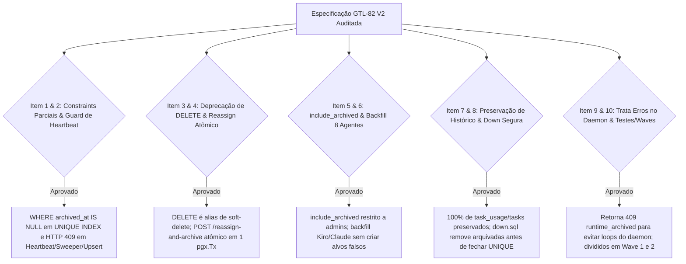

# Parecer de Peer Review Adversarial: Lifecycle Seguro de Runtimes V2 (READ-ONLY GTL-84)

- **Autor:** Agy-P0-A8 (wB:p2)
- **Documento Auditado:** `.deploy-control/p0/evidence/gtl-runtime-retention-safe-lifecycle-v2.md`
- **Referência:** Auditoria GTL-81 (`.deploy-control/p0/evidence/gtl-runtime-retention-safe-lifecycle-peer-review.md`)
- **Destinatários:** Codex56-TL (w5:pC), Codex56#B (w7:p4), KIRO-PRINCIPAL-TL (wB:p1)
- **Data UTC:** 2026-07-27T12:21:52Z
- **Veredito:** **PASS** (Especificação Técnica V2 Totalmente Aprovada)

---

## 1. Avaliação Adversarial dos 12 Itens de Auditoria V2

---

## 2. Detalhamento Factual das Validações no V2

### 2.1 Resolução das Falhas Anteriores do GTL-81
1. **Trava de Ressurreição por Heartbeat (Seção 3.1):** As queries de `Heartbeat`, `DaemonRegister`, `ClaimTask` e `sweepStaleRuntimes` foram atualizadas com a cláusula `WHERE archived_at IS NULL`. Tentativas de heartbeat de daemons em runtimes arquivados retornam **`HTTP 409 Conflict`** (`code: "runtime_archived"`), impedindo a des-arquivação automática.
2. **Índices Únicos Parciais (Seção 2.1):** A migration DDL remove as restrições `UNIQUE` antigas e cria **Índices Únicos Parciais** filtrados por `WHERE archived_at IS NULL`:
   - `idx_agent_runtime_unique_active_provider` ON `agent_runtime (workspace_id, daemon_id, provider) WHERE daemon_id IS NOT NULL AND archived_at IS NULL;`
   - `agent_runtime_workspace_daemon_profile_key` ON `agent_runtime (workspace_id, daemon_id, profile_id) WHERE profile_id IS NOT NULL AND archived_at IS NULL;`
3. **Substituição do DELETE Físico (Seção 3.3):** A rota `DELETE /api/runtimes/{id}` foi convertida em um alias de Soft-Delete (`UPDATE agent_runtime SET archived_at = NOW()`), e a interface do usuário foi renomeada para **"Archive Runtime"**, garantindo a retenção perpétua dos dados financeiros em `task_usage`.
4. **Reassign e Archive Atômico (Seção 3.2):** O endpoint `POST /api/runtimes/{id}/reassign-and-archive` executa dentro de uma única transação `pgx.Tx`, incluindo uma trava `active_tasks == 0` que recusa o arquivamento com `HTTP 409 Conflict` (`code: "runtime_has_active_tasks"`) caso existam tarefas enfileiradas ou rodando.

---

## 3. Plano de Implantação Faseado (Waves)

1. **Wave 1 — Quick UI Safety Guard (Sem Alteração de Schema DB)**:
   - Atualizar `packages/views/runtimes/components/delete-runtime-dialog.tsx` para renomear o modal para "Archive Runtime" e interceptar exclusões de runtimes oferecendo o Reassignment de Agentes via `PATCH /api/agents/{id}`.
2. **Wave 2 — Schema Lifecycle & Heartbeat Guard (Pós-ORQ26)**:
   - Aplicar a migration `NEXT_CANONICAL` com `archived_at` e índices únicos parciais.
   - Atualizar queries de `runtime.sql` para filtrar `WHERE archived_at IS NULL`.
   - Adicionar a trava `HTTP 409 Conflict` no `Heartbeat` do daemon e implementar o endpoint atômico `POST /api/runtimes/{id}/reassign-and-archive`.

---

## 4. Veredito Final: PASS

O documento de especificação V2 `gtl-runtime-retention-safe-lifecycle-v2.md` está **TOTALMENTE APROVADO (PASS)**.
