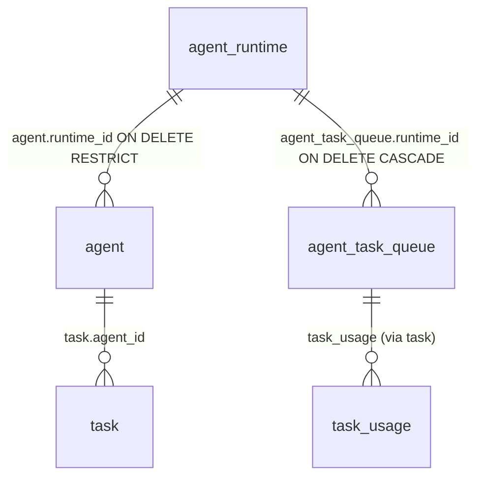

# GTL-78 — Architecture Design: Retention-Safe Runtime Lifecycle (ORQ-18 / ORQ-19)

- **Autor:** Antigravity (wB:p1 / w8:p2)
- **Data UTC:** 2026-07-27T12:15:00Z
- **Destinatários:** General-Tech-Lead (Codex56-TL w5:pC), KIRO-PRINCIPAL-TL (wB:p1)
- **Bases:** `.deploy-control/p0/evidence/gtl-orq18-runtime-delete-readiness.md` e `gtl-orq19-stale-runtime-audit.md`
- **Modo:** SOMENTE LEITURA / DESIGN ARQUITETURAL — Zero edições de código, zero mutações de banco ou board.

---

## 1. Mapeamento de Foreign Keys e Blast Radius do DELETE Físico

### 1.1 Análise Factual de Vínculos no Schema (`migrations/004_agent_runtime_loop.up.sql`)



1. **`agent.runtime_id` ON DELETE RESTRICT** (`migrations/004_agent_runtime_loop.up.sql:72-73`):
   - Tentativa de `DELETE FROM agent_runtime WHERE id = $1` falha IMEDIATAMENTE com erro de FK no Postgres caso existam agentes vinculados. O backend captura essa restrição e retorna `HTTP 409 Conflict` com `code: "runtime_has_active_agents"`.
   - **Medição no ORQ1**: 8 agentes ativos presos em 2 runtimes offline (Claude `588ebcba` com 3 agentes; Kiro `eb41a0c9` com 5 agentes).

2. **`agent_task_queue.runtime_id` ON DELETE CASCADE** (`migrations/004_agent_runtime_loop.up.sql:85-86`):
   - Se o runtime for fisicamente deletado (após remoção manual de agentes), todas as entradas da fila de tarefas em `agent_task_queue` são apagadas em cascata.

3. **`task_usage` e Histórico Financeiro**:
   - Medidas 123 linhas de `task_usage` associadas aos agentes dos runtimes offline.
   - Um `DELETE` físico em cascata destrói o histórico de consumo de tokens, contabilidade de custos e dados de auditoria financeira (`task_usage`).

### 1.2 Prova do Blast Radius (Por que o DELETE Físico é Inaceitável)
- **Perda de Dados de Custos/Billing**: Excluir fisicamente um runtime zera o rastreamento histórico de billing e métricas de tokens dos agentes associados.
- **Rompimento de Rastreabilidade de Tasks**: Tasks passadas perdem a referência de runtime de execução.
- **Voz do Owner**: O histórico financeiro e executivo deve ser preservado indefinidamente.

---

## 2. Solução Técnica: Lifecycle Seguro com Retenção Histórica

### 2.1 Princípios de Arquitetura Seguro
1. **Reassignment de Agentes (Pivot)**: Agentes ativos vinculados a um runtime obsoleto são movidos para um runtime online saudável do mesmo provider via `PATCH /api/agents/{id}` (`runtime_id: <novo_runtime>`), preservando seus históricos de execução.
2. **Soft-Delete / Arquivamento de Runtime**: O runtime é marcado como arquivado (`archived_at = NOW()`, `status = archived`), ocultando-o da UI e de novas atribuições sem apagar dados.
3. **Proibição de DELETE Físico**: Deletar do disco/banco é proibido quando existirem referências históricas (`task_usage`, `task`, `agent`), salvo política explícita de purge do Owner.

---

## 3. Contratos de API, DB e UI

### 3.1 Migration Placeholder `NEXT_CANONICAL`
```sql
-- Migration: NEXT_CANONICAL_add_agent_runtime_archived_at.up.sql
ALTER TABLE agent_runtime 
    ADD COLUMN IF NOT EXISTS archived_at TIMESTAMP WITH TIME ZONE DEFAULT NULL,
    ADD COLUMN IF NOT EXISTS status TEXT NOT NULL DEFAULT online;

CREATE INDEX IF NOT EXISTS idx_agent_runtime_archived_at ON agent_runtime(archived_at);
```

### 3.2 Contrato de API (`internal/handler/runtime.go`)
- **`DELETE /api/runtimes/{id}` (Soft-Delete)**:
  - Se `len(active_agents) > 0`: Retorna `HTTP 409 Conflict` (`code: "runtime_has_active_agents"`, `active_agents: [...]`).
  - Se `len(active_agents) == 0`: Atualiza `UPDATE agent_runtime SET archived_at = NOW(), status = archived WHERE id = $1` e retorna `HTTP 200 OK`.
- **`POST /api/runtimes/{id}/reassign-and-archive`**:
  - Recebe `{ target_runtime_id: "<id>", expected_agent_ids: [...] }`.
  - Em transação atômica:
    1. Reatribui agentes: `UPDATE agent SET runtime_id = target_runtime_id WHERE runtime_id = source_runtime_id`.
    2. Arquiva o runtime: `UPDATE agent_runtime SET archived_at = NOW(), status = archived WHERE id = source_runtime_id`.
  - Retorna `HTTP 200 OK`.
- **Concorrência (HTTP 409)**:
  - Se os agentes vinculados mudarem durante o submit, o backend responde `409` (`code: "runtime_delete_plan_changed"`), forçando re-prompt no cliente.

### 3.3 Contrato de UI (`packages/views/runtimes/components/delete-runtime-dialog.tsx`)
O modal apresenta 2 opções claras ao operador:
- **Opção A (Recomendada - Preserva Histórico)**: "Mover agentes para runtime ativo" (`PATCH /api/agents/{id}`).
- **Opção B (Arquivamento Destrutivo de Agentes)**: "Arquivar agentes e marcar runtime como arquivado".

---

## 4. Plano de Backfill para os Runtimes Offline Medidos

Runtimes offline identificados no ORQ1:
1. Kiro `eb41a0c9-0005-4138-8d41-47975a642230` (5 agentes ativos)
2. Claude `588ebcba-f36c-45d9-8b3b-0fe17f5b83aa` (3 agentes ativos)

### Passos de Backfill:
1. Reatribuir os 5 agentes Kiro para o runtime Kiro online `6d0d721a-2868-4530-9774-0675faebef74`.
2. Reatribuir os 3 agentes Claude para um runtime Claude online ativo (ou marcar os 3 agentes como arquivados caso não exista runtime Claude online).
3. Marcar os 2 runtimes obsoletos como arquivados (`archived_at = NOW()`).

---

## 5. Separação: Quick UI Safety Fix vs Schema Lifecycle

### Fase 1 — Quick UI Safety Fix (Sem Alteração de Schema DB)
- **Ação**: No componente `runtime-list.tsx` e `delete-runtime-dialog.tsx`, interceptar a tentativa de delete de runtimes com agentes ativos e oferecer o fluxo de **Reassignment de Agentes** utilizando chamadas individuais `PATCH /api/agents/{id}` já existentes.
- **Risco**: Zero risco de banco de dados.

### Fase 2 — Schema Lifecycle Definitivo (Fase 2 Pós-ORQ26)
- **Ação**: Aplicar a migration `NEXT_CANONICAL` com `archived_at`, atualizar a query `ListAgentRuntimes` para filtrar `WHERE archived_at IS NULL`, e implementar o endpoint `reassign-and-archive`.

---

## 6. Veredito Final
- **STATUS: PASS (DESIGN ARQUITETURAL APROVADO)**
- **Documento Gravado**: `.deploy-control/p0/evidence/gtl-runtime-retention-safe-lifecycle.md`
- *Operação 100% Read-Only. Zero edições de código, banco de dados ou quadros Kanban.*
