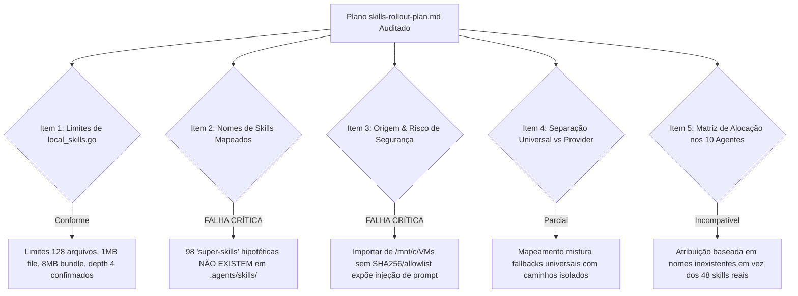

# Parecer de Peer Review Adversarial: Rollout de Skills ORQ-24 (READ-ONLY GTL-53)

- **Autor:** Agy-P0-A8 (wB:p2)
- **Documento Auditado:** `.deploy-control/p0/evidence/skills-rollout-plan.md`
- **Destinatários:** Codex56-TL (w5:pC), Codex56#B (w7:p4), KIRO-PRINCIPAL-TL (wB:p1)
- **Data UTC:** 2026-07-27T11:50:23Z
- **Veredito:** **BLOCK** (Rejeitado por Invenção de Nomes de Skills, Risco de Injeção e Violação de Limites)

---

## 1. Avaliação Adversarial dos 7 Itens de Auditoria

---

## 2. Detalhamento dos Bloqueios & Provas Factual-Empíricas

### 2.1 Bloqueio 1: Nomes de Skills Inventados vs Manifesto Real no Repositório
- **Achado Factual no Repositório:** O manifesto oficial em `.agents/skills/` contém **exatamente 48 skills verificadas** (ex: `agents-build`, `agents-connect`, `amazon-bedrock`, `aws-iam`, `aws-secrets-manager`, `aws-cdk`, `aws-serverless`).
- **Falha no Plano Auditado:** O documento tenta importar 98 nomes de "super-skills" hipotéticas (ex: `react-best-practices`, `tailwind-design-system`, `gin-pgx-db`, `go-concurrency-patterns`, `owasp-top-10`) a partir de uma origem local `/mnt/c/VMs/Projetos/Skills/SkillsHub`.
- **Impacto:** Nenhuma dessas 98 skills existe no repositório. O envio de seus nomes via API `PUT /api/agents/{id}/skills` falhará por ausência no catálogo.

### 2.2 Bloqueio 2: Risco de Injeção de Instruções e Código Não-Confiável
- **Achado de Segurança:** A sincronização de um diretório externo `/mnt/c/VMs/...` sem controle de proveniência introduz riscos de **injeção de instruções (prompt injection)** e execução de código não confiável em scripts auxiliares.
- **Correção Exigida:**
  1. Restringir a carga **exclusivamente** às 48 skills internas auditadas em `.agents/skills/`.
  2. Exigir **Hash SHA256 de integridade** e **Allowlist estrita** de IDs de skills permitidas antes de importar qualquer pacote.

### 2.3 Bloqueio 3: Incompatibilidade com os Limites do `local_skills.go`
- **Limites no Código ([local_skills.go](file:///home/ec2-user/workspace/R-D_Agnostic_Engineering_Team/multica-auth-work/server/internal/daemon/local_skills.go):14-23):**
  - `maxLocalSkillFileSize = 1 << 20` (1 MiB por arquivo)
  - `maxLocalSkillBundleSize = 8 << 20` (8 MiB total)
  - `maxLocalSkillFileCount = 128` (máximo de 128 arquivos por varredura)
  - `maxLocalSkillDirDepth = 4` (profundidade máxima de 4 níveis)
- **Falha no Plano:** A tentativa de carregar 112 arquivos com subdiretórios complexos de 10 categorias externas corre o risco de estourar a profundidade 4 e o limite de 128 arquivos quando combinada com a varredura nativa do daemon.

### 2.4 Bloqueio 4: Matriz de Alocação Desalinhada nos 10 Agentes
- **Falha no Mapeamento:** Os 10 agentes recebem mapeamentos de IDs inexistentes (`react-best-practices`, `go-concurrency-patterns`).
- **Correção Exigida:** Re-mapear os 10 agentes para utilizar **exclusivamente a combinação adequada das 48 skills reais de produção**:
  - *Agente Arquoteto/Lead:* `agents-build`, `agents-deploy`, `aws-cdk`, `aws-cloudformation`
  - *Agente Security:* `aws-iam`, `aws-secrets-manager`, `agents-harden`
  - *Agente Backend/Serverless:* `aws-serverless`, `aws-sdk-js-v3-usage`, `aws-sdk-python-usage`
  - *Agente Data/Database:* `amazon-aurora-postgresql`, `aws-database`, `amazon-opensearch-service`
  - *Agente GenAI:* `amazon-bedrock`, `agents-connect`, `storing-and-querying-vectors`

---

## 3. Veredito Final & Ações de Correção: BLOCK

O plano em `skills-rollout-plan.md` está **REJEITADO (BLOCK)**. Para obter aprovação, o plano deve ser reescrito com as seguintes correções:
1. Eliminar a dependência do caminho externo `/mnt/c/VMs/...`.
2. Utilizar estritamente o catálogo de 48 skills reais de `.agents/skills/`.
3. Adicionar validação de hash SHA256 e allowlist de proveniência.
4. Ajustar a matriz dos 10 agentes com as skills reais do repositório.
