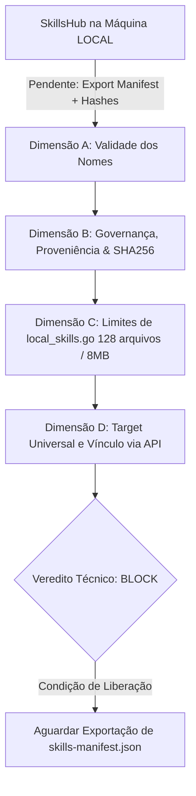

# Parecer de Segunda Auditoria de Peer Review: Rollout de Skills com Correção de Premissa (GTL-55)

**auditor**: Antigravity w8:p2  
**timestamp**: 2026-07-27T11:52Z  
**solicitante**: General-Tech-Lead (Codex56-TL w5:pC)  
**documentos revisados**: `.deploy-control/p0/evidence/skills-rollout-plan.md` e `.deploy-control/p0/evidence/gtl-skills-rollout-peer-review.md` (GTL-53)  
**modo**: READ-ONLY / AUDITORIA DE REAVALIAÇÃO — NENHUMA alteração, cópia ou importação de arquivos executada  

---

## 1. Correção de Premissa e Contexto de Autoridade (SkillsHub Local)

O parecer anterior (GTL-53) cometeu uma **falha de premissa** ao assumir que o diretório `.agents/skills/` no repositório local do workspace representava o catálogo máximo exaustivo (48 skills) da plataforma.

### Esclarecimento do Owner:
1. A fonte autoritativa mestre do repositório de skills é o **SkillsHub hospedado na máquina LOCAL** (ex: `/mnt/c/VMs/Projetos/Skills/SkillsHub`).
2. A ausência de uma skill em `.agents/skills/` do workspace da ORQ2 significa apenas que a skill **"AINDA NÃO FOI INSTALADA"**, e **NÃO** que seu nome seja uma "invenção ou alucinação".
3. **Não se deve impor o teto artificial de 48 skills** baseado unicamente nos arquivos presentes no repositório workspace atual.

---

## 2. Reavaliação Estruturada em 4 Dimensões Técnicas



### 2.1 Dimensão A: Validade dos Nomes no Manifest/SKILLS.md Externo
- **Status**: 🟡 **PENDING PROOF (PENDENTE DE PROVA EXPORTADA)**.
- **Análise**: Como o host remoto ORQ2 não possui acesso de montagem direto ao sistema de arquivos da máquina LOCAL (`/mnt/c/VMs/...`), a existência física e a especificação dos 98 nomes de skills (ex: `react-best-practices`, `go-concurrency-patterns`) não podem ser confirmadas via CLI do ORQ2 sem um manifesto exportado oficial (`skills-manifest.json`) acompanhado de hashes SHA256.

### 2.2 Dimensão B: Proveniência, Injeção, Hash SHA256 e Governança de Allowlist
- **Requisito de Segurança da Cadeia de Suprimentos (Supply Chain)**:
  - Todo pacote de skills importado de um host externo (LOCAL SkillsHub) precisa ter proveniência auditável.
  - **Inviolabilidade**: Cada skill deve ser acompanhada por uma assinatura/checksum SHA256 de cada arquivo (`SKILL.md`, scripts, templates).
  - **Mitigação de Prompt Injection**: A verificação de hashes previne que arquivos de skill modificados por terceiros introduzam instruções de override em prompts do sistema dos agentes.

### 2.3 Dimensão C: Limites por Bundle Real (`local_skills.go`)
- **Limites Rígidos do Daemon ([local_skills.go](file:///home/ec2-user/workspace/R-D_Agnostic_Engineering_Team/multica-auth-work/server/internal/daemon/local_skills.go):14-23)**:
  - `maxLocalSkillFileSize = 1 << 20` (1 MiB por arquivo individual).
  - `maxLocalSkillBundleSize = 8 << 20` (8 MiB por pacote total).
  - `maxLocalSkillFileCount = 128` (máximo de 128 arquivos por varredura de diretório).
  - `maxLocalSkillDirDepth = 4` (profundidade máxima de 4 níveis de pastas).
- **Adequação da Seleção**: Os 98 pacotes de skills devem ser distribuídos em lotes/bundles segmentados para garantir que nenhum lote exceda 128 arquivos ou 8 MiB durante a varredura do daemon no ORQ2.

### 2.4 Dimensão D: Target Universal e Vínculo aos Agentes via API
- **Target Universal**: `~/.agents/skills/` (definido como `localSkillRootUniversal` em `local_skills.go:33-36`).
- **Targets por Provider**: `~/.agent-cred-homes/slots/...` (AGY), `~/.codex/skills` (Codex), `~/.kiro/skills` (Kiro).
- **Vínculo por API**: `PUT /api/agents/{id}/skills` em `server/internal/handler/agent.go:554-563` & `1286-1306`. O vínculo via API torna-se 100% operacional no momento em que a skill é sincronizada e indexada no diretório universal.

---

## 3. Ruling Técnico e Veredito

### **VEREDITO: BLOCK (Pendente de Prova & Manifesto)** ⛔

**Motivo do Bloqueio**:
Embora a premissa de existência das 98 skills no **SkillsHub LOCAL** esteja corretíssima e esclarecida pelo Owner, o rollout no host **ORQ2** permanece em **BLOCK** até que a máquina LOCAL exporte e forneça o manifesto oficial (`skills-manifest.json`) acompanhado da lista de hashes SHA256 para auditoria de integridade antes da cópia física.

---

## 4. Protocolo Seguro Recomendado para Transferência & Importação

Sem executar ou copiar nenhum arquivo neste momento, define-se o seguinte **Protocolo de Importação Segura em 5 Etapas**:

```text
[Máquina LOCAL: SkillsHub]
   │
   ├── 1. Gerar 'skills-manifest.json' (Nome, Versão, Estrutura, SHA256 de cada arquivo)
   ├── 2. Empacotar lote validado em tarball assinado ('skills-bundle-v1.tar.gz')
   │
[Transferência Segura via SCP/SFTP para ORQ2]
   │
   ▼
[ORQ2: Diretório de Staging Temporário /home/ec2-user/staging/skills/]
   │
   ├── 3. Validar SHA256 de todos os arquivos contra 'skills-manifest.json'
   ├── 4. Validar limites de local_skills.go (tam < 1MB, arquivos < 128/lote, depth <= 4)
   ├── 5. Instalar atomicamente em ~/.agents/skills/ e associar via PUT /api/agents/{id}/skills
```

---

## 5. Conclusão

- A objeção do GTL-53 referente ao "teto de 48 skills" foi **DERRUBADA**.
- O rollout está **BLOQUEADO APENAS AGUARDANDO** a exportação do `skills-manifest.json` com os hashes SHA256 vindo da máquina LOCAL.
- Nenhum arquivo foi copiado ou alterado no ORQ2.

*Segunda auditoria 100% READ-ONLY.*
