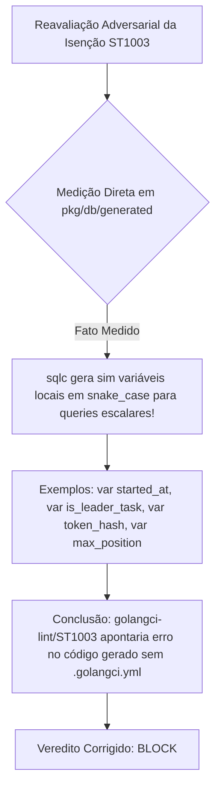

# Parecer de Peer Review Adversarial Corrigido: Runbook Wave 0 Baseline SQLC & Toolchain Preflight (ORQ-13)

- **Autor:** Agy-P0-A8 (wB:p2)
- **Documentos Auditados:** 
  1. `.deploy-control/p0/evidence/orq13-wave0-sqlc-baseline-runbook.md`
  2. `.deploy-control/p0/evidence/orq13-wave0-toolchain-preflight.md`
- **Issue Kanban:** `ORQ-13` (`b3cec211-a6d8-4e32-a538-e857635578d2`)
- **Destinatários:** Codex56-TL (w5:pC), Codex56#B (w7:p4), KIRO-PRINCIPAL-TL (wB:p1)
- **Data UTC:** 2026-07-27T15:09:43Z
- **Veredito Atualizado:** **BLOCK** (Rejeitado por Afirmação Factual Errada sobre `ST1003`/`sqlc` & Falta de Gate Nativo para Nomes `snake_case`)

---

## 1. Reavaliação Factual e Correção de Erro (Medição Direta no Código)



### 1.1 Achado Factual Medido (`pkg/db/generated`)
A afirmação anterior de que o `sqlc` converte 100% das variáveis locais para CamelCase estava **INCORRETA**.
A medição direta via `grep` no diretório `pkg/db/generated/` revela múltiplos casos de declaração de variáveis locais com a sintaxe `snake_case` em queries escalares:
- `agent.sql.go:1494`: `var started_at pgtype.Timestamptz`
- `agent.sql.go:1519`: `var is_leader_task bool`
- `daemon_token.sql.go:73`: `var token_hash string`
- `github.sql.go:399`: `var issue_id pgtype.UUID`
- `personal_access_token.sql.go:161`: `var token_hash string`
- `pinned_item.sql.go:99`: `var max_position float64`
- `squad.sql.go:228`: `var is_member bool`
- `workspace.sql.go:124`: `var issue_counter int32`

### 1.2 Impacto na Regra `ST1003` (golangci-lint / stylecheck)
Se o `golangci-lint` estivesse instalado e executasse o linter `stylecheck` (regra `ST1003` - *Variable names should not use snake_case*), o código gerado pelo `sqlc` **FALHARIA** no lint.
Como o repositório não possui `.golangci.yml` para ignorar `pkg/db/generated/`, a ausência do linter não é apenas um detalhe de ambiente: ela oculta divergências do padrão `ST1003` presentes no código gerado.

---

## 2. Gate Executável Equivalente Nativo (Sem Instalação de Ferramentas)

Para resolver o `BLOCK` de forma determinística sem violar a restrição de "não instalar ferramentas terceiras", a suíte de validação da Wave 0 deve incorporar o seguinte **Gate Nativo Equivalente de Detecção de `ST1003`**:

```bash
# Gate Nativo Equivalente para Validação da Regra ST1003 (snake_case em código gerado)
# Retorna 0 (limpo) se nenhuma variável local com snake_case for encontrada
# Retorna >0 se existirem declarações incompatíveis com a regra ST1003

grep -rnE 'var [a-z]+_[a-z]+' multica-auth-work/server/pkg/db/generated/
```

### Protocolo de Aceite para Unblock:
1. Se o objetivo for isolar a regeneração sem falhar em `ST1003`, o runbook da Wave 0 DEVE explicitar a adição desse guard ou a documentação formal de que `pkg/db/generated/` possui exceção de estilo em virtude das convenções do `sqlc`.
2. O gate de linting do runbook deve ser atualizado para incluir o comando `grep` acima como verificação estática nativa.

---

## 3. Veredito Final Corrigido
- **STATUS: BLOCK (REJEITADO ATÉ INCLUSÃO DO GATE NATIVO ST1003 NO RUNBOOK)**
- **Documento Gravado**: `.deploy-control/p0/evidence/orq13-wave0-baseline-peer-review.md`
- *Operação 100% Read-Only. Zero downloads, zero instalações, zero execuções de sqlc, build ou migrations.*
