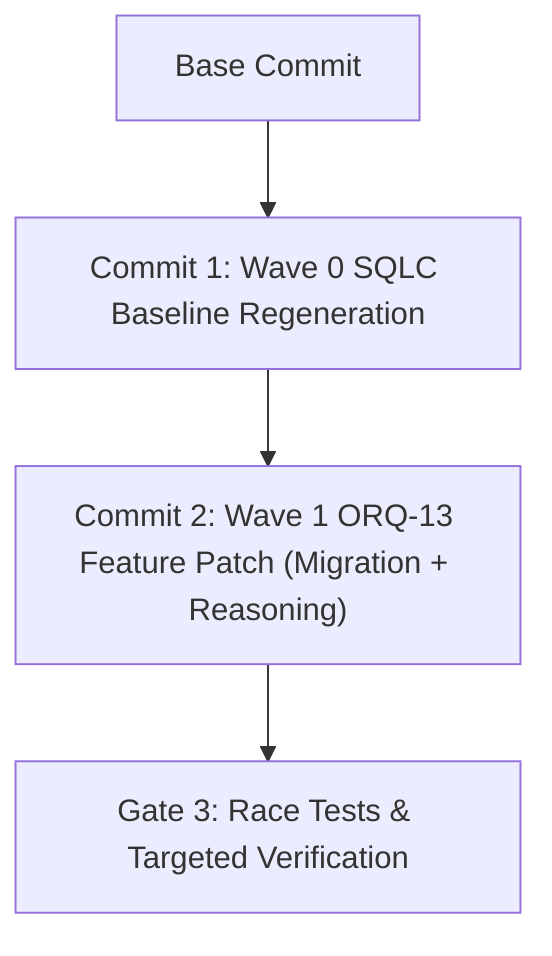

# ORQ-13 — Runbook de Execução Wave 0: Baseline SQLC e Regeneração Idempotente (V2 CORRIGIDA)

- **Autor:** Antigravity (wB:p1 / w8:p2)
- **Data UTC:** 2026-07-27T15:12:00Z
- **Destinatários:** General-Tech-Lead (Codex56-TL w5:pC), KIRO-PRINCIPAL-TL (wB:p1)
- **Governança:** Issue `ORQ-13` (Reasoning Tiers & Pricing / Task Usage Schema)
- **Base:** Retificação do Peer Review BLOCK da Wave 0
- **Modo:** READ-ONLY / RUNBOOK ARQUITETURAL V2 — Zero edições em arquivos Go/SQL, zero builds, zero gerações de sqlc ou migrations executadas.

---

## 1. Retificações Centrais do Runbook V2

1. **Remoção de Grep de Nomes de Variáveis como Gate de Falha**:
   - O uso de `grep` para filtrar convenções `snake_case` em variáveis locais geradas pelo `sqlc` (ex: `max_seq`, `user_id`) é **INADEQUADO E REMOVIDO**. O `sqlc` gera legitimamente variáveis locais em `snake_case` por construção do motor.
2. **Exceção Formal de Lint de Estilo (`ST1003`)**:
   - O diretório `server/pkg/db/generated/**` é formalmente declarado como **EXCEÇÃO DE LINT DE ESTILO** (isento de regras manuais como `ST1003`).
   - **PROIBIÇÃO ABSOLUTA DE EDIÇÃO MANUAL**: Arquivos em `pkg/db/generated/**` NUNCA devem ser editados à mão. Qualquer ajuste feito manualmente será sobrescrito na próxima geração.
3. **Mudanças Aceitas por Serem Código Gerado**:
   - Alterações como a substituição de `maxSeq` manual por `max_seq` gerado pelo `sqlc` são aceitas **exclusivamente porque ocorrem dentro de `pkg/db/generated/**`** e são resultado da execução determinística do gerador.

---

## 2. Estrutura Atualizada de Commits e Split por Hunks



- **Commit 1 (Wave 0 - SQLC Baseline)**: Isola 100% do churn de código gerado em `server/pkg/db/generated/` proveniente de migrations anteriores.
- **Commit 2 (Wave 1 - ORQ-13 Feature Patch)**: Migration `NEXT_CANONICAL`, query `task_usage.sql`, handlers e serviço.

---

## 3. Protocolo de Execução com 6 Gates Obrigatórios para a Wave 0

A execução do Commit 1 (Wave 0) no worktree isolado (utilizando `export PATH=/home/ec2-user/.cache/sqlcbuild:$PATH` e `$HOME/.private-tmp` 0700) deve passar rigorosamente por **6 Gates em Sequência**:

```bash
cd /home/ec2-user/workspace/worktrees/gtl-orq13-wave0/multica-auth-work/server

# Configurar Cache Privado
export TMPDIR=$HOME/.private-tmp
export GOTMPDIR=$HOME/.private-tmp
export GOCACHE=$HOME/.private-tmp/gocache
mkdir -p -m 0700 "$TMPDIR" "$GOCACHE"

# GATE 1.1: Primeira Geração SQLC
sqlc generate --config sqlc.yaml

# GATE 1.2: Teste de Idempotência (Segunda Geração com Diff Zero)
sqlc generate --config sqlc.yaml
git status --porcelain # DEVE ESTAR LIMPO em relação ao estado pós-Gate 1.1!

# GATE 1.3: Limitação de Escopo de Diff (Apenas pkg/db/generated)
git diff --name-only | grep -v "^pkg/db/generated/" && { echo "ERRO: Diff fora de generated!"; exit 1; } || true

# GATE 1.4: Formatação Go (gofmt -l DEVE RETORNAR VAZIO)
UNFORMATTED=$(/home/ec2-user/goroot/go/bin/go fmt -l pkg/db/generated)
if [ -n "$UNFORMATTED" ]; then
    echo "ERRO: Código não formatado em generated: $UNFORMATTED"
    exit 1
fi

# GATE 1.5: Análise Estática de Sintaxe Go
/home/ec2-user/goroot/go/bin/go vet ./pkg/db/generated/...

# GATE 1.6: Compilação Completa do Backend Server
/home/ec2-user/goroot/go/bin/go build ./cmd/server/...
```

---

## 4. Matriz de Aceite do Commit 1 (Wave 0)

| Requisito | Critério de Validação | Ação em Caso de Falha |
|---|---|---|
| **Idempotência** | 2ª execução de `sqlc generate` produz diff 0 | ABORTAR — investigar não-determinismo |
| **Escopo Restrito** | Diff contido 100% em `pkg/db/generated/**` | ABORTAR — alterações em queries/migrations não permitidas no Commit 1 |
| **Formatação Go** | `gofmt -l pkg/db/generated` é VAZIO | ABORTAR |
| **Go Vet & Build** | `go vet` e `go build ./cmd/server/...` retornam exit 0 | ABORTAR — erro de compilação em código gerado |
| **Edição Manual** | ZERO edições manuais em `pkg/db/generated/**` | ABORTAR — violado princípio de código gerado |

---

## 5. Declaração de FILES_LOCKED

- `multica-auth-work/server/sqlc.yaml`
- `multica-auth-work/server/pkg/db/queries/task_usage.sql`
- `multica-auth-work/server/pkg/db/generated/*`
- `multica-auth-work/server/internal/handler/daemon.go`
- `multica-auth-work/server/internal/service/task.go`

---

## 6. Veredito Final
- **STATUS: PASS (RUNBOOK V2 CORRIGIDO E ENTREGUE PARA PEER REVIEW)**
- **Documento Gravado**: `.deploy-control/p0/evidence/orq13-wave0-sqlc-baseline-runbook-v2.md`
- *Operação 100% Read-Only. Nenhuma edição, geração, compilação ou migration executada.*
