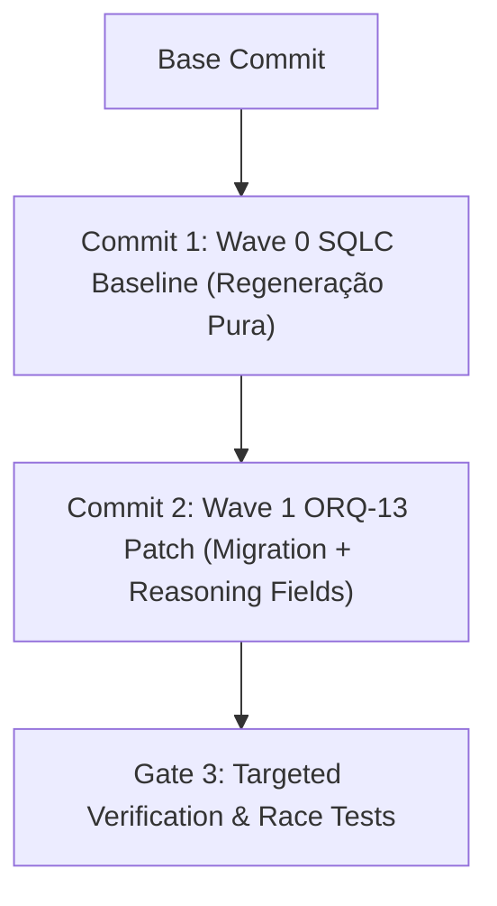

# ORQ-13 — Runbook de Execução Wave 0: Baseline SQLC e Regeneração Idempotente

- **Autor:** Antigravity (wB:p1 / w8:p2)
- **Data UTC:** 2026-07-27T15:06:00Z
- **Destinatários:** General-Tech-Lead (Codex56-TL w5:pC), KIRO-PRINCIPAL-TL (wB:p1)
- **Governança:** Issue `ORQ-13` (Reasoning Tiers & Pricing / Task Usage Schema)
- **Modo:** READ-ONLY / RUNBOOK ARQUITETURAL — Zero edições em arquivos Go/SQL, zero builds, zero gerações de sqlc ou migrations executadas.

---

## 1. Objetivo e Estratégia de Split por Commits/Hunks

Para evitar ruidos e conflitos entre a regeneração automatizada de queries do `sqlc` (churn de migrations anteriores como 123/124) e as alterações de regras de negócio da **ORQ-13** (`thinking_level`, `reasoning_effort`, `reasoning_budget`), a execução é obrigatoriamente dividida em 2 commits isolados:



### Commit 1 — Wave 0: SQLC Baseline Regeneration (Idempotente)
- **Conteúdo**: Apenas a execução do `sqlc generate` sobre o estado atual de `server/migrations/` e `server/pkg/db/queries/`.
- **Propósito**: Isolar qualquer churn de código gerado em `server/pkg/db/generated/` em um commit limpo antes de introduzir novas colunas ou queries.

### Commit 2 — Wave 1: ORQ-13 Targeted Feature Patch
- **Conteúdo**: 
  1. Migration `NEXT_CANONICAL_add_task_usage_reasoning.up.sql` (colunas `thinking_level`, `reasoning_effort`, `reasoning_budget`).
  2. Atualização de query em `server/pkg/db/queries/task_usage.sql`.
  3. Atualização dos handlers em `server/internal/handler/daemon.go` e serviço em `server/internal/service/task.go`.

---

## 2. Princípios de Governança: Owner Único e Isolamento de Cache

1. **Disciplina de Escritor Único (Single Owner)**:
   - Um único agente (Single Writer) opera no worktree isolado (ex: `/home/ec2-user/workspace/worktrees/gtl-orq13-wave0`).
   - Bloqueada qualquer edição simultânea nos arquivos gerados pelo `sqlc`.
2. **Ambiente Privado de Cache (`0700`)**:
   - É obrigatório configurar diretórios temporários privados antes de qualquer comando Go/sqlc:
     ```bash
     export TMPDIR=$HOME/.private-tmp
     export GOTMPDIR=$HOME/.private-tmp
     export GOCACHE=$HOME/.private-tmp/gocache
     mkdir -p -m 0700 "$TMPDIR" "$GOCACHE"
     ```

---

## 3. Comandos Idempotentes do SQLC e Validação de Formatação

Os comandos são executados a partir de `multica-auth-work/server`:

```bash
cd /home/ec2-user/workspace/worktrees/gtl-orq13-wave0/multica-auth-work/server

# 1. Execução Idempotente da Geração de Código
sqlc generate --config sqlc.yaml

# 2. Linting e Validação de Formatação do Código Gerado
gofmt -l pkg/db/generated
git diff --check pkg/db/generated

# 3. Análise Estática Go
/home/ec2-user/goroot/go/bin/go vet ./pkg/db/generated/...
```

---

## 4. Estrutura de Gates Separados

```
┌────────────────────────────────────────────────────────────────────────┐
│ GATE 1: Wave 0 Baseline SQLC (Commit 1)                                │
│   - Rodar sqlc generate                                                │
│   - Validar gofmt -l e git diff --check em pkg/db/generated           │
│   - Isolar diff em Commit 1 ("chore(db): sqlc baseline generation")    │
└────────────────────────────────────────────────────────────────────────┘
                                   │
                                   ▼
┌────────────────────────────────────────────────────────────────────────┐
│ GATE 2: Wave 1 ORQ-13 Feature Patch (Commit 2)                          │
│   - Adicionar migration NEXT_CANONICAL e query task_usage.sql          │
│   - Rodar sqlc generate                                                │
│   - Atualizar handlers de daemon (thinking_level)                      │
│   - Isolar diff em Commit 2 ("feat(usage): add reasoning tracking")    │
└────────────────────────────────────────────────────────────────────────┘
                                   │
                                   ▼
┌────────────────────────────────────────────────────────────────────────┐
│ GATE 3: Targeted Verification & Testing                                │
│   - Executar tests targeted: go test -race -count=1 ./internal/handler  │
│   - Validar zero regressões em task_usage e billing                    │
└────────────────────────────────────────────────────────────────────────┘
```

---

## 5. Declaração de FILES_LOCKED

- `multica-auth-work/server/sqlc.yaml`
- `multica-auth-work/server/pkg/db/queries/task_usage.sql`
- `multica-auth-work/server/pkg/db/generated/*`
- `multica-auth-work/server/internal/handler/daemon.go` (ReportTaskUsage)
- `multica-auth-work/server/internal/service/task.go`

---

## 6. Veredito Final
- **STATUS: PASS (RUNBOOK WAVE 0 SQLC BASELINE APROVADO PARA REVIEW)**
- **Documento Gravado**: `.deploy-control/p0/evidence/orq13-wave0-sqlc-baseline-runbook.md`
- *Operação 100% Read-Only. Nenhuma edição, geração, compilação ou migration executada.*
