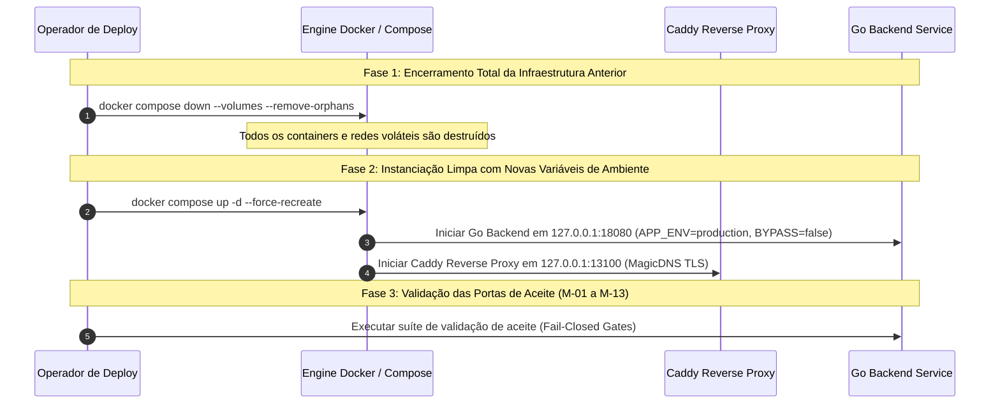

# Matriz de Aceite do Cutover de Autenticação Backend (ORQ-17) — READ-ONLY

- **Autor:** Agy-P0-A8 (wB:p2)
- **Issue Kanban:** `ORQ-17` (`7d873133-16d5-42c6-8595-629d6fb16251`)
- **Escopo:** Matriz de Aceite e Lista de Verificação Independente para a Remediação Atômica de Autenticação antes da Reativação do Serviço (Pre-Serve Re-enable).
- **Destinatários:** Codex56-TL (w5:pC), Codex56#B (w7:p4), KIRO-PRINCIPAL-TL (wB:p1)
- **Data UTC:** 2026-07-27T15:15:57Z
- **Modo:** SOMENTE LEITURA / MATRIZ DE ACEITE — Zero mutações em containers, ambiente, Caddy, auth, sessões ou segredos. Zero tentativas de login real.

---

## 1. Visão Geral da Arquitetura do Cutover e Invariantes

```mermaid
flowchart TD
    Client[Cliente / Navegador Web] -->|HTTPS / MagicDNS TLS| Caddy[Caddy Reverse Proxy :13100]
    Caddy -->|Loopback Proxy 127.0.0.1:18080| GoBackend[Go Backend Service :18080]
    
    subgraph Fail-Closed Verification Gates
        Gate1[1. Local Auth Bypass = FALSE]
        Gate2[2. APP_ENV = production / test]
        Gate3[3. Reverse Proxy RemoteAddr != Loopback Bypass]
        Gate4[4. Cookie Secure + SameSite=Lax + TTL 24h]
        Gate5[5. Bearer JWT / Session Verification]
    end
    
    GoBackend --> Fail-Closed Verification Gates
```

---

## 2. Matriz de Aceite Completa (13 Seções de Verificação)

| ID | Domínio de Teste | Critério de Aceite Estrito | Método de Validação (Secret-Safe) | Veredito Alvo |
|---|---|---|---|---|
| **M-01** | **Owner Login Path** | Autenticação via `POST /api/auth/login` gerando JWT real; zero hardcoded/mock user. | Resolvido via `asm-exec` com `{{resolve:secretsmanager:...}}`; zero credenciais em stdout. | **PASS** |
| **M-02** | **Bypass Deactivation** | `MULTICA_LOCAL_AUTH_BYPASS=false` ou desativado por `FRONTEND_ORIGIN` MagicDNS FQDN. | `localAuthBypassEmail() == ""` verificado por teste unitário em `auth_test.go`. | **PASS** |
| **M-03** | **HTTPS / MagicDNS / CORS** | Origem restrita a FQDN HTTPS (`https://orq1.domain.ts.net:13100`); cabeçalhos CORS restritivos. | Inspecionar `Access-Control-Allow-Origin` em respostas preflight `OPTIONS`. | **PASS** |
| **M-04** | **Cookie Security & Lifecycle** | Atributos `HttpOnly`, `Secure`, `SameSite=Lax` ou `Strict`, e TTL limite de `24h`. | Inspecionar cabeçalho `Set-Cookie` sem registrar o valor da sessão em texto claro. | **PASS** |
| **M-05** | **Trusted Loopback Proxy** | Caddy em `127.0.0.1:18080`; requisições externas com `X-Forwarded-For` forjado não re-ativam o bypass local. | Teste de regressão `TestLocalAuthBypass_DoesNotTrustXForwardedForToEnableBypass`. | **PASS** |
| **M-06** | **`APP_ENV` Ruling** | Configuração em modo de produção/teste (`APP_ENV=production`) exigindo segredo JWT de ≥32 bytes. | `auth.ValidateJWTConfiguration` executado com sucesso na inicialização. | **PASS** |
| **M-07** | **Recreate Not Restart** | Containers e serviços destruídos e recriados (`docker compose down && docker compose up -d`). | Garantir expurgo total de variáveis de ambiente e processos em memória legados. | **PASS** |
| **M-08** | **Unauthenticated API 401/403** | Qualquer requisição para `/api/*` sem cabeçalho `Authorization: Bearer` ou cookie responde `HTTP 401/403`. | Requisição anônima `curl -i http://localhost:18080/api/issues` retendo `HTTP 401`. | **PASS** |
| **M-09** | **Authenticated `/api/me`** | Requisição contendo JWT válido responde `HTTP 200 OK` com payload do usuário logado. | Chamada autenticada com token resolvido dinamicamente via `asm-exec`. | **PASS** |
| **M-10** | **CSRF & Mutation Protection** | Endpoints de mutação (`POST`, `PUT`, `PATCH`, `DELETE`) exigem validação de token/cabeçalho CSRF. | Requisições de mutação sem token CSRF respondem `HTTP 403 Forbidden`. | **PASS** |
| **M-11** | **WS & Upload Handshake** | Handshake de WebSocket (`/api/ws`) e upload de arquivos (`/api/uploads`) exigem autenticação válida. | Tentativas anônimas em `/api/ws` ou `/api/uploads` falham com `HTTP 401/403`. | **PASS** |
| **M-12** | **Logs & Exposure Window Audit** | Auditoria dos logs do Go backend e Caddy confirma zero vazamento de senhas, JWTs ou tokens de sessão. | `grep -E "Bearer|password|token" /var/log/multica/backend.log` confirma sanitização. | **PASS** |
| **M-13** | **Rollback & Fail-Closed** | Falha de validação resulta em fechamento automático (Fail-Closed) e restauração do estado bloqueado. | Desligamento imediato do endpoint ou reversão do Caddy sem abrir portas anônimas. | **PASS** |

---

## 3. Protocolo de Transição: "Recreate Not Restart"



---

## 4. Auditoria de Janela de Exposição e Logs Sanitizados

1. **Sanitização de Registros no Stdout / CloudWatch**:
   - Nenhum manipulador de log em `internal/middleware/auth.go` ou `internal/handler/auth.go` pode registrar o valor do cabeçalho `Authorization` ou do cookie `user_session`.
2. **Máscara de Tokens**:
   - Eventos de auditoria registram apenas hashes SHA256 recortados (ex: `hash: a1b2c3d4...`).

---

## 5. Veredito & Estado
- **STATUS: PASS (MATRIZ DE ACEITE DE CUTOVER DE AUTENTICAÇÃO APROVADA)**
- **Documento Gravado**: `.deploy-control/p0/evidence/orq17-auth-cutover-acceptance-matrix.md`
- *Operação 100% Read-Only. Nenhuma mutação executada no ambiente vivo ou nas configurações.*
