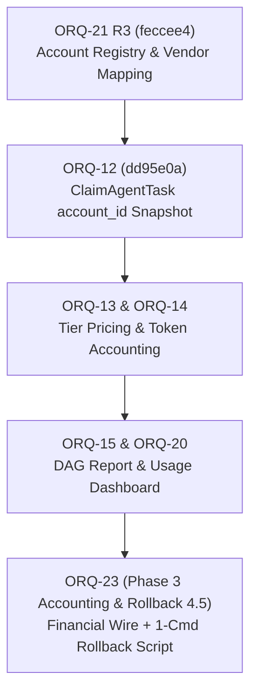

# ORQ-23 Phase 3 Accounting & Rollback 4.5 — Read-Only Delta & E2E Gate Specification

- **Card:** `ORQ-23` · UUID `6230b5c0-c57a-4b88-a7df-84899057d0c8` — *"Concluir contabilização da Fase 3 e gate de rollback 4.5"*
- **Target Stack Base:**
  - **ORQ-21 (R3):** `agent/codex56-b/orq21-r3` (`feccee4` / `42db561` / `aac2227`) — Account registry, assignment exclusivity, vendor canonicalization.
  - **ORQ-12:** `agent/opus48-a/orq12-task-usage-account-id` (`dd95e0a`) — Frozen `account_id` snapshot on `ClaimAgentTask`.
- **Author / Analyst:** Antigravity (independent peer review / design specification)
- **UTC:** 2026-07-28T16:11Z
- **Mode:** 100% READ-ONLY. Zero edits to ORQ-12/21 files, zero migrations materialized, zero secrets read, zero board mutations.

---

## 1. Context & Baseline Audit

### 1.1 Preserved Base State
1. **ORQ-21 R3 (`feccee4` / `42db561`):** Establishes account availability, assignment exclusivity, and `CanonicalProvider` mapping (`agy` -> `antigravity`).
2. **ORQ-12 (`dd95e0a`):** Freezes the producing `account_id` at `ClaimAgentTask` time (`acc.tenant_id = ag.workspace_id`, `ap.allowed IS TRUE`, `ap.worktype_scope = 'GENERAL'`), preventing unassigned task execution.
3. **Live T2 Daemon Baseline:**
   - Unit: `multica-daemon-orq2-credential.service` (`active/running`, `NRestarts=0`).
   - Known-Green Binary Hash: `88ca4f397ef841edac091f15e77b2ba52754045a471acaa311c280827d2dd1f8` (size: `15,053,065` bytes, mode: `0755`).
   - `multica-assignments.v1.json`: 8 affinities across pseudonymous slots (AGY: 145/146, Codex: 152, Kiro: 139/140/149).

---

## 2. Exact Delta Identified for ORQ-23

ORQ-23 is the **financial aggregator node** of the DAG. It closes the accounting pipeline (Fase 3) and validates the single-command rollback (Gate 4.5).

### Delta 1: Daemon Wire Payload & Accounting Schema (Phase 3.1 - 3.4)
1. **Wire Type (`TaskUsageEntry`):** `internal/daemon/types.go` and `internal/handler/daemon.go` must pass:
   - `account_id` (UUID from `ClaimAgentTask` snapshot).
   - `reasoning_tier` (`low`, `medium`, `high`, or `none`).
   - `tokens_input` (int64) and `tokens_output` (int64).
2. **DB Query (`pkg/db/queries/task_usage.sql`):** Update insert/upsert query to write `(task_id, account_id, provider, model, reasoning_tier, tokens_input, tokens_output, cost_cents)`.
3. **Usage Collection Parity:**
   - **Codex:** Full token count parity from CLI/API response.
   - **Kiro:** Pass explicit model identifier (eliminates `"unknown"` model fallback).
   - **Antigravity (AGY):** Gateway/proxy token resolution replaces empty `map[string]TokenUsage{}`.
4. **Cost Accounting:** Match `(model, reasoning_tier, timestamp)` against versioned tier pricing to record `cost_cents`.

### Delta 2: Single-Command Daemon Rollback (Gate 4.5)
1. **Rollback Script Specification (`multica-daemon-rollback.sh`):**
   - **Target Binary:** `/home/ec2-user/.local/lib/multica/bin/multica-auth-credential-home-v1`
   - **Known-Green Hash Anchor:** `88ca4f397ef841edac091f15e77b2ba52754045a471acaa311c280827d2dd1f8`
   - **Forbidden Targets:** Rejects `.pre-token-only`, `.pre-agy-fix`, `.previous` (known-bad / degraded binaries).
   - **Atomic Execution:** `cp -a <green_binary> <target_tmp> && mv -f <target_tmp> <target_binary> && systemctl --user restart multica-daemon-orq2-credential.service`
2. **Safety Guards:**
   - Aborts if active tasks exist in queue (`status IN ('queued','dispatched','running','waiting_local_directory') > 0`).

---

## 3. End-to-End Gate Sequence (E2E-1 to E2E-5)

| Gate | Scope | Pre-Condition | Execution / Assertions | Pass Criteria |
|---|---|---|---|---|
| **E2E-1** | Queue Safety | No active tasks | `SELECT count(*) FROM agent_task_queue WHERE status IN ('queued','dispatched','running','waiting_local_directory')` | `count == 0` |
| **E2E-2** | DB Schema Staging | Migration staged | `task_usage` table contains `account_id`, `reasoning_tier`, `cost_cents` columns | Migration valid; NOT materialized in this turn |
| **E2E-3** | Daemon Wire Accounting | Task claimed via ORQ-12 | Task execution transmits `account_id`, model name, reasoning tier, and token counts to daemon handler | 0 `"unknown"` models; 0 empty token maps |
| **E2E-4** | Cost & Account Attestation | Task completed | Query `task_usage` by `task_id`: `account_id` matches claimed snapshot, `cost_cents > 0` | 100% usage attributed to frozen account |
| **E2E-5** | Single-Command Rollback | Daemon online | Execute `multica-daemon-rollback.sh` | SHA-256 == `88ca4f39...`, `NRestarts=0`, `/healthz` HTTP 200, 3 runtimes online |

---

## 4. Non-Assertions

- **Zero edits** to ORQ-12 (`dd95e0a`) or ORQ-21 (`feccee4`/`42db561`) code files.
- **Zero migrations materialized** in this step.
- **Zero secrets or tokens read.**
- **Zero board mutations.** Status remains unmodified.
