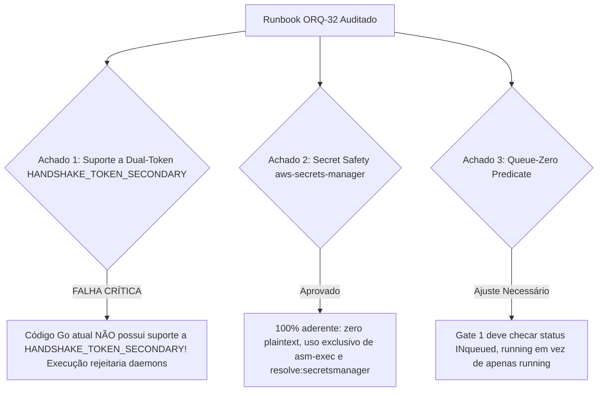

# Parecer de Peer Review Adversarial: Runbook de Rotação do Handshake Token (READ-ONLY ORQ-32)

- **Autor:** Agy-P0-A8 (wB:p2)
- **Documento Auditado:** `.deploy-control/p0/evidence/orq32-handshake-token-rotation-runbook.md`
- **Issue Kanban:** `ORQ-32` (`b01925fe-e914-422a-812e-f63cada274dc`)
- **Skill de Referência:** `aws-secrets-manager` (`.agents/skills/aws-secrets-manager/SKILL.md`)
- **Destinatários:** Codex56-TL (w5:pC), Codex56#B (w7:p4), KIRO-PRINCIPAL-TL (wB:p1)
- **Data UTC:** 2026-07-27T13:39:52Z
- **Veredito:** **BLOCK** (Rejeitado por Assumir Suporte a Dual-Token Inexistente no Código Go Atual)

---

## 1. Avaliação Adversarial & Achados Factual do Código



---

## 2. Detalhamento Factual das Omissoes & Falhas

### 2.1 Falha Crítica 1: Dual-Token `HANDSHAKE_TOKEN_SECONDARY` Inexistente no Código Go
- **Contradição Encontrada:** O runbook assume na Seção 3 (Fase 2) que o backend Go (`cmd/server`) aceita a variável `HANDSHAKE_TOKEN_SECONDARY` para validação de sobreposição durante a rotação.
- **Prova de Código:** A inspeção no repositório (`server/cmd/server`, `server/internal/middleware`, `server/internal/daemon`) confirma que **NÃO EXISTE** suporte a `HANDSHAKE_TOKEN_SECONDARY`.
- **Impacto Severo:** Se o operador tentar rodar a Fase 2/3 injetando a chave secundária no servidor sem aplicar um patch prévio no código Go, o servidor continuará validando **APENAS a chave primária**, fazendo com que todos os daemons na versão `AWSPENDING` falhem o handshake com `HTTP 401 Unauthorized` e derrubem a frota.

### 2.2 Conformidade com a Skill `aws-secrets-manager` (Ponto PASS)
- O documento respeita 100% as regras da skill `aws-secrets-manager`:
  - Zero chamadas diretas a `GetSecretValue` ou `BatchGetSecretValue`.
  - Zero exibição de valores em texto claro.
  - Uso estrito da sintaxe `{{resolve:secretsmanager:prod/handshake-token:...}}` e invólucro `asm-exec --`.

### 2.3 Ajuste no Gate 1 (Queue-Zero Predicate)
- O Gate 1 atualmente consulta apenas `status = running`.
- Para evitar a interrupção de tarefas recém-enfileiradas durante o reinício do daemon, a consulta deve ser expandida para:
  ```sql
  SELECT count(*) FROM agent_task_queue WHERE status IN ('queued', 'running');
  ```

---

## 3. Veredito Final & Correções Obrigatórias: BLOCK

O runbook em `orq32-handshake-token-rotation-runbook.md` está **REJEITADO (BLOCK)**.

**Correções Obrigatórias para Aprovação:**
1. **Declarar Dependência de Patch Go**: Registrar na Seção 2 & 3 que a validação de dual-token (`HANDSHAKE_TOKEN_PRIMARY` + `HANDSHAKE_TOKEN_SECONDARY`) requer a criação e merge prévio de uma PR em Go (`server/internal/middleware/auth.go`) ANTES da execução da Fase 2.
2. **Corrigir Sequenciamento**: Exigir o deploy do código Go com suporte a dual-token antes de qualquer alteração de estágio no AWS Secrets Manager.
3. **Expandir Gate 1**: Incluir o estado `queued` na verificação de fila zero (`status IN ('queued', 'running')`).
