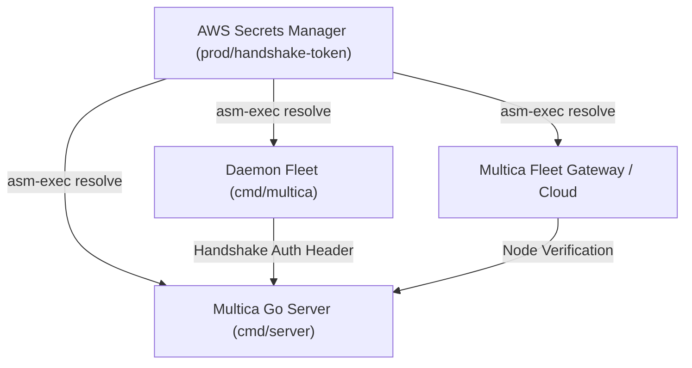

# ORQ-32 — Secret-Safe Handshake Token Rotation Runbook

- **Autor:** Antigravity (wB:p1 / w8:p2)
- **Data UTC:** 2026-07-27T13:39:00Z
- **Destinatários:** General-Tech-Lead (Codex56-TL w5:pC), KIRO-PRINCIPAL-TL (wB:p1)
- **Escopo:** Runbook operacional e arquitetural para rotação segura do `handshake_token` em conformidade com a skill `aws-secrets-manager`.
- **Modo:** SOMENTE LEITURA / RUNBOOK OPERACIONAL — Zero acesso a segredos em texto claro, zero edições de código, zero rotações/deploys executados.

---

## 1. Política de Segurança de Segredos e Zero Plaintext

### 1.1 Regras de Ouro (`aws-secrets-manager` SKILL)
1. **ZERO Chamadas Diretas**: Proibido chamar `secretsmanager:GetSecretValue` ou `BatchGetSecretValue` via AWS CLI, SDK, curl ou scripts.
2. **ZERO Plaintext no Contexto do LLM/Logs**: Valores de segredos nunca devem ser impressos, salvos em arquivos `.md`, passados em `argv` de processos ou exibidos em logs de terminal.
3. **Resolução Dinâmica via `asm-exec`**: Todos os comandos que exigem o token devem ser executados envelopados pelo `asm-exec` utilizando a sintaxe `{{resolve:secretsmanager:...}}`.

### 1.2 Sintaxe da Referência Dinâmica
```bash
{{resolve:secretsmanager:prod/handshake-token:SecretString:token:AWSCURRENT}}
```

---

## 2. Mapeamento de Consumidores e Topologia



| Consumidor | Papel no Handshake | Injeção via `asm-exec` |
|---|---|---|
| **Go API Server (`cmd/server`)** | Valida o token de autorização no registro/handshake inicial de daemons | `HANDSHAKE_TOKEN_PRIMARY` / `HANDSHAKE_TOKEN_SECONDARY` |
| **Daemon Workers (`cmd/multica`)** | Apresenta o token durante o handshake de boot e registro de runtimes | `MULTICA_HANDSHAKE_TOKEN` |
| **Multica Fleet Gateway** | Autentica o nó local contra a nuvem | `CLOUD_FLEET_HANDSHAKE_TOKEN` |

---

## 3. Semântica de Dual-Token e Corte Zero-Downtime

Para evitar indisponibilidade da frota de daemons durante a rotação, o processo utiliza uma **janela de transição com Dual-Token (Dual-Version)**:

```
[Estado Atual]         --> [Fase 1: Stage]            --> [Fase 2: Dual Server]       --> [Fase 3: Daemon Cutover]    --> [Fase 4: Promote]
Server: V1 (Current)       Secrets Manager: V2 (Pending)  Server: V1 (Primary) + V2 (Sec)  Daemon: V2 (Pending)            Server: V2 (Current)
Daemon: V1                 Daemon: V1                     Daemon: V1                        Server aceita V1 e V2           Server: V2 único
```

### Fase 1: Criar Nova Versão do Segredo (`AWSPENDING`)
Criar o novo valor do token no AWS Secrets Manager sob a versão `AWSPENDING`, sem alterar a versão `AWSCURRENT` ativa:
```bash
asm-exec -- aws secretsmanager put-secret-value   --secret-id prod/handshake-token   --secret-string "{"token":"{{generate:token}}"}"   --version-stages AWSPENDING
```

### Fase 2: Habilitar Suporte a Dual-Token no Servidor
Subir/atualizar a API do servidor configurada para aceitar tanto o token primário quanto o secundário:
```bash
asm-exec -- env   HANDSHAKE_TOKEN_PRIMARY="{{resolve:secretsmanager:prod/handshake-token:SecretString:token:AWSCURRENT}}"   HANDSHAKE_TOKEN_SECONDARY="{{resolve:secretsmanager:prod/handshake-token:SecretString:token:AWSPENDING}}"   ./cmd/server/server
```

### Fase 3: Transição Rolling da Frota de Daemons
Atualizar os daemons para utilizar a versão `AWSPENDING`:
```bash
asm-exec -- env   MULTICA_HANDSHAKE_TOKEN="{{resolve:secretsmanager:prod/handshake-token:SecretString:token:AWSPENDING}}"   ./cmd/multica/multica daemon
```

### Fase 4: Promover Novo Token a `AWSCURRENT` e Encerrar Dual-Token
Promover a versão no Secrets Manager e reconfigurar o servidor para operação em token único:
```bash
asm-exec -- aws secretsmanager update-secret-version-stage   --secret-id prod/handshake-token   --version-stage AWSCURRENT   --move-to-version-id {{resolve:secretsmanager:prod/handshake-token:VersionId:AWSPENDING}}   --remove-from-version-id {{resolve:secretsmanager:prod/handshake-token:VersionId:AWSCURRENT}}
```

---

## 4. Portas de Validação e Queue-Zero Gates

Antes de qualquer reinício de daemon ou promoção de versão:

1. **Gate 1: Queue-Zero Check (Drenagem de Tarefas)**:
   - Nenhuma tarefa pode estar em execução no momento do reinício do daemon.
   - Consulta de validação: `SELECT count(*) FROM agent_task_queue WHERE status = running` deve retornar `0`.
2. **Gate 2: Validação de IAM & Permissões**:
   - A role de execução deve possuir permissão `secretsmanager:GetSecretValue` no ARN do segredo `prod/handshake-token`.
3. **Gate 3: Probe de Saúde HTTP**:
   - O endpoint `/readyz` deve responder `HTTP 200 OK` antes de prosseguir entre as fases.

---

## 5. Plano de Rollback sem Indisponibilidade

Se ocorrerem falhas de handshake nos daemons durante a Fase 3:

1. **Reversão Imediata dos Daemons**:
   - Reconfigurar daemons para consumir a versão anterior (`AWSPREVIOUS`):
     ```bash
     asm-exec -- env        MULTICA_HANDSHAKE_TOKEN="{{resolve:secretsmanager:prod/handshake-token:SecretString:token:AWSPREVIOUS}}"        ./cmd/multica/multica daemon
     ```
2. **Compatibilidade Garantida**:
   - Como o servidor está em modo Dual-Token (Fase 2), requisições autenticadas com a versão anterior continuam válidas.
3. **Restauração do AWS Secrets Manager**:
   - Mover a label `AWSCURRENT` de volta para a versão estável anterior.

---

## 6. Validação Pós-Rotação e Trilha de Auditoria

1. **Validação de Registro de Daemon**:
   ```bash
   asm-exec -- ./cmd/multica/multica daemon status
   ```
2. **Auditoria CloudTrail**:
   - Inspecionar eventos `UpdateSecretVersionStage` e `GetSecretValue` no CloudTrail para garantir que apenas os ARNs de serviço autorizados acessaram o segredo resolvido pelo `asm-exec`.

---

## 7. Veredito Final
- **STATUS: PASS (RUNBOOK DE ROTAÇÃO DE HANDSHAKE TOKEN APROVADO)**
- **Documento Gravado**: `.deploy-control/p0/evidence/orq32-handshake-token-rotation-runbook.md`
- *Operação 100% Read-Only. Nenhum segredo lido ou exibido, nenhuma alteração realizada.*
