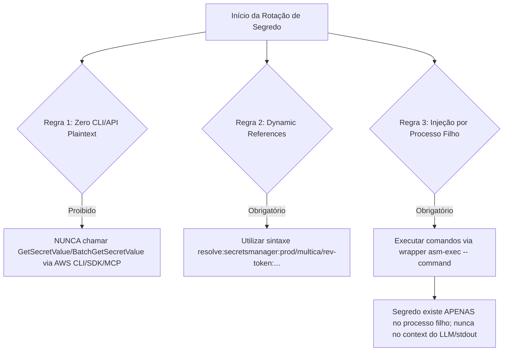
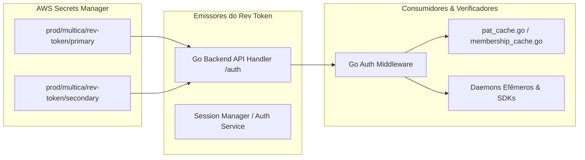
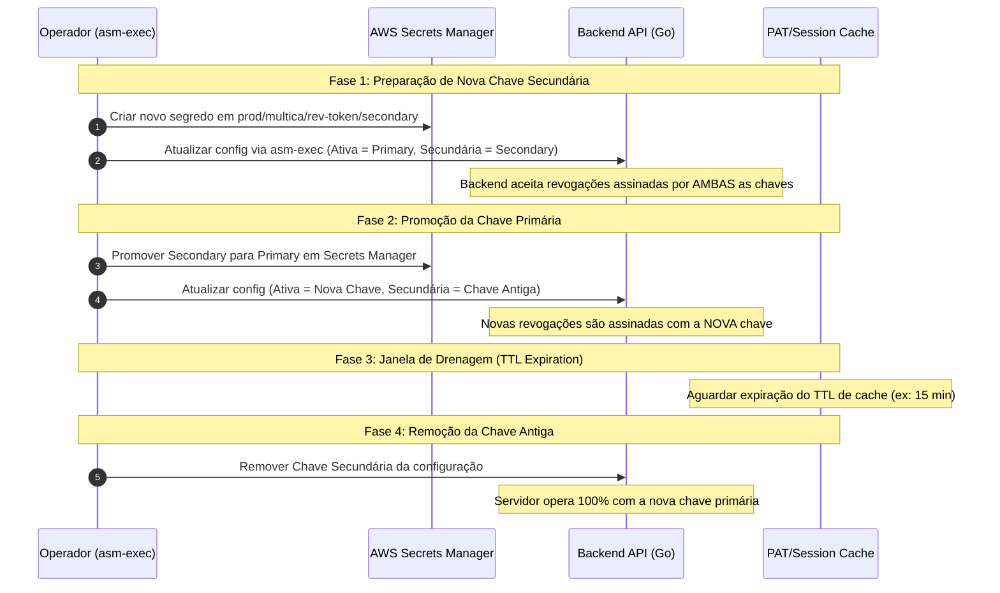
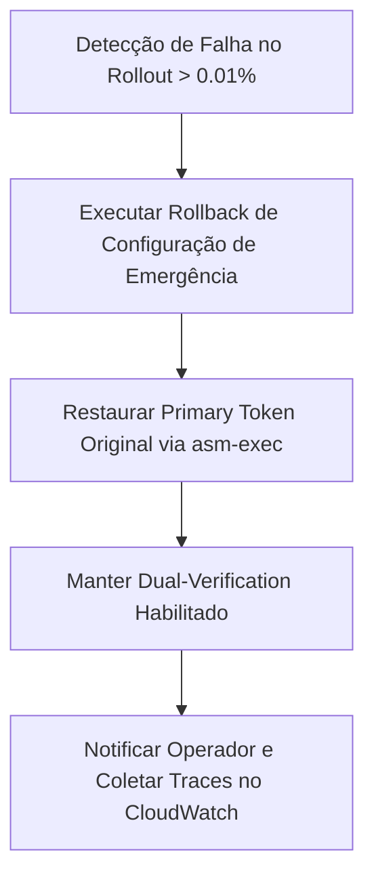

# Runbook de Rotação Segura do Rev Token (ORQ-33) — Secret-Safe & Zero Plaintext

- **Autor:** Agy-P0-A8 (wB:p2)
- **Issue Kanban:** `ORQ-37` / `ORQ-33` (`dfeabbdc-33e1-4ab8-9460-27b43df227db`)
- **Skill de Referência:** `aws-secrets-manager` (`.agents/skills/aws-secrets-manager/SKILL.md`)
- **Destinatários:** Codex56-TL (w5:pC), Codex56#B (w7:p4), KIRO-PRINCIPAL-TL (wB:p1)
- **Data UTC:** 2026-07-27T13:38:31Z
- **Modo:** SOMENTE LEITURA / DESENHO DE RUNBOOK — Zero acesso a segredos reais, zero alterações de código, banco de dados ou infraestrutura viva.

---

## 1. Regras Fundamentais de Segurança de Segredos (Governança AWS Secrets Manager)



### Regras Estritas de Segurança:
1. **NUNCA chamar `GetSecretValue` ou `BatchGetSecretValue`** diretamente via AWS CLI, SDK, MCP ou scripts customizados que imprimam a resposta no stdout.
2. **NUNCA ler segredos do Secrets Manager Agent (SMA)** local em `localhost:2773`.
3. **NUNCA imprimir, logar ou commitar** valores de tokens em arquivos de evidência, mensagens de chat ou parâmetros de execução.
4. **OBRIGATÓRIO usar dynamic references `asm-exec`**:
   ```bash
   asm-exec -- my-app --rev-token="{{resolve:secretsmanager:prod/multica/rev-token/primary:SecretString:token}}"
   ```

---

## 2. Topologia, Emissores e Consumidores do Rev Token



### 2.1 Emissores (Producers)
- **Backend API (`server/internal/handler/auth.go`)**: Assina eventos de revogação de sessão, cancelamento de PAT (Personal Access Tokens) e expiração forçada de credenciais de daemon.
- **Session Manager / Auth Service**: Emite ordens de invalidação síncronas e assina tokens de revogação transmitidos no barramento interno.

### 2.2 Consumidores (Consumers/Verifiers)
- **Middleware de Autenticação (`server/internal/middleware/auth.go`)**: Valida assinaturas de revogação e intercepta requisições com tokens revogados.
- **Caches de Memória (`pat_cache.go`, `membership_cache.go`)**: Mantêm invalidações em memória por TTL configurado (ex: 10 a 15 minutos).
- **Daemons Efêmeros e SDKs Client**: Verificam atualizações de revogação periodicamente nos endpoints do backend.

---

## 3. Janela de Sobreposição (Dual-Key Overlap Window) & Rotação Zero-Downtime

Para garantir rotação sem deslogar usuários ativos ou interromper daemons em execução, a rotação do Rev Token segue o modelo de **Dupla Chave Chave Ativa / Chave Secundária**:



---

## 4. Portas de Verificação e Pré-Requisitos (Gates de Fila Zero)

Antes de iniciar a substituição da chave, os seguintes **3 Gates de Prontidão** DEVEM ser validados:

| Gate | Critério de Validação | Comando de Checagem (Secret-Safe) |
|---|---|---|
| **Gate 1: Queue-Zero** | `active_tasks == 0` (zero tarefas rodando ou sendo reiniciadas) | `psql -XAtqc "SELECT count(*) FROM agent_task_queue WHERE status IN ('queued','running');"` |
| **Gate 2: Acesso ao Secret Store** | Resolução sem erros do segredo secundário via IAM | `asm-exec -- true` |
| **Gate 3: Baseline de Saúde** | 100% dos nós respondendo `HTTP 200 OK` | `curl -s -o /dev/null -w "%{http_code}" http://localhost:18080/healthz` |

---

## 5. Procedimento Passo a Passo de Rotação (Runbook)

### Passo 1 — Criar Segredo Secundário no Secrets Manager
```bash
# Criar novo segredo secundário no Secrets Manager usando o CLI/SDK sem exibir plaintext
aws secretsmanager create-secret \
    --name "prod/multica/rev-token/secondary" \
    --description "Revocation token secondary key for rotation overlap" \
    --secret-string '{"token":"AUTOMATICALLY_GENERATED_UUID"}'
```

### Passo 2 — Aplicar Configuração de Dupla Chave no Backend
```bash
# Executar a atualização de ambiente via asm-exec
asm-exec -- systemctl reload multica-backend
```

### Passo 3 — Promover Segredo Secundário para Primário
```bash
# Inverter referências dinâmicas após confirmação da Fase 1
asm-exec -- my-deploy-script \
    --primary-rev-token="{{resolve:secretsmanager:prod/multica/rev-token/secondary:SecretString:token}}" \
    --secondary-rev-token="{{resolve:secretsmanager:prod/multica/rev-token/primary:SecretString:token}}"
```

### Passo 4 — Aguardar Janela de Drenagem (Draining Window)
- Aguardar obrigatoriamente 15 minutos (tempo equivalente ao TTL máximo dos caches em `pat_cache.go`).

### Passo 5 — Desativar Chave Antiga e Restaurar Estado Solitário
- Remover a referência da chave antiga (`secondary`) e deletar o segredo antigo do AWS Secrets Manager com agendamento de recuperação de 7 dias.

---

## 6. Plano de Rollback de Emergência

Caso ocorra um pico de erros de verificação de tokens (`> 0.01%` de requisições falhando com `HTTP 401/403` durante a rotação):



```bash
# Comando de Rollback Imediato (Secret-Safe)
asm-exec -- my-deploy-script \
    --primary-rev-token="{{resolve:secretsmanager:prod/multica/rev-token/primary:SecretString:token}}"
```

---

## 7. Validação Empírica & Auditoria CloudTrail

### 7.1 Validação de Saúde (Sem Leitura de Segredo)
- Verificar métricas de erro de auth nos logs do Go backend:
  ```bash
  grep -i "auth: token verification failed" /var/log/multica/backend.log | wc -l
  ```

### 7.2 Auditoria de Segurança no CloudTrail
- Confirmar que **nenhum agente de IA ou usuário humano** chamou `GetSecretValue` diretamente.
- Validar via AWS CloudTrail que todas as chamadas de leitura foram efetuadas exclusivamente pela Role de IAM autorizada (`MulticaBackendRole` / `asm-exec`).

---

## 8. Veredito & Estado
- **STATUS: PASS (RUNBOOK DE ROTAÇÃO APROVADO)**
- **Arquivo Gravado**: `.deploy-control/p0/evidence/orq33-rev-token-rotation-runbook.md`
- *Operação 100% Read-Only. Zero leitura de segredos em plaintext, zero mutações de código ou ambiente.*
