# ORQ-36 Security Wave B: `MULTICA_TOKEN` Governance Preflight Evidence (READ-ONLY)

- **Author / Owner:** Antigravity (Opus-46-B)
- **Cutoff / Timestamp:** 2026-07-28T16:12:00Z
- **Target:** `MULTICA_TOKEN` Governance, Token Class Matrix, Secret-Safe Lifecycle, AWS Secrets Manager Integration
- **Execution Mode:** READ-ONLY (Zero secret fetching, zero `GetSecretValue`, zero AWS/runtime/board mutation)

---

## Executive Summary

This evidence document details the governance, classification, lifecycle, blast radius, and rotation architecture for **`MULTICA_TOKEN`** under **Security Wave B**. 

All investigation has been conducted strictly in **read-only mode** in compliance with the [`aws-secrets-manager`](file:///home/ec2-user/workspace/R-D_Agnostic_Engineering_Team/.agents/skills/aws-secrets-manager/SKILL.md) skill rules:
1. No `get-secret-value` or `batch-get-secret-value` commands executed.
2. Plaintext secrets are never fetched or stored in conversation history.
3. Runtime dynamic resolution via `asm-exec` (`{{resolve:secretsmanager:...}}`) is mandated for production secret resolution.

---

## 1. Token Class Matrix & Architecture Mapping

Multica enforces strict token prefix segregation across its authentication architecture:

| Token Class | Prefix Format | Scope / Lifecycle | Issuer Source | Primary Consumers | Storage & Lookup |
|---|---|---|---|---|---|
| **Task-Scoped Agent Token** (`MULTICA_TOKEN`) | `mat_` | Ephemeral (task duration only). Least privilege. | `daemon.go` (`taskScopedAuthToken`) when launching agent process | Agent subcommands (`cmd_agent.go`, `cmd_issue.go`, `cmd_autopilot.go`) | Injected as environment variable `MULTICA_TOKEN` into child process. Validated by `cmd_agent.go:253` (`mat_` required). |
| **Daemon Auth Token** | `mdt_` | Single workspace / single daemon. Longer lived. | `jwt.go:70` (`GenerateDaemonToken`: `"mdt_" + 40 hex chars`) | Daemon-to-server endpoints (`/api/daemon/register`, `/api/daemon/heartbeat`) | Hashed (SHA-256) and stored in `daemon_token` table; cached in Redis (`DaemonTokenCache`). `middleware/daemon_auth.go`. |
| **Personal Access Token (PAT)** | `mul_` | User scope across workspaces. User managed. | `personal_access_token.go` (`CreatePersonalAccessToken`) | User CLI, API integrations | Hashed (SHA-256) before DB storage. `cloud_pat.go`. Show-once plaintext on mint. |
| **Cloud PAT Path Token** | `mcn_` | Cloud daemon PAT fallback. | Cloud Auth Service | Daemon fallback auth path | Hashed before DB/Redis lookup. |

---

## 2. Deep Dive: `MULTICA_TOKEN` (`mat_`) vs Daemon Token (`mdt_`)

### 2a. Issuer & Generation Flow
- **`MULTICA_TOKEN` (`mat_`)**:
  - Minted at task dispatch by `daemon.go` via `taskScopedAuthToken(task)`.
  - Injected directly into the child agent execution environment as `MULTICA_TOKEN=mat_...`.
  - Enforces strict isolation: the agent **never sees or inherits the daemon's own credential** (`mdt_` or `mul_`).
  - `cmd_agent.go:253` validates that any agent execution context receives a `mat_` prefixed token, failing closed if missing or invalid.
- **Daemon Token (`mdt_`)**:
  - Minted via `GenerateDaemonToken` (`internal/auth/jwt.go:70`) as `"mdt_" + hex.EncodeToString(b)`.
  - Identifies the daemon instance to the server (`/api/daemon/register` and `/api/daemon/heartbeat`).
  - Evaluated in `middleware/daemon_auth.go` via `DaemonTokenCache` (Redis short-circuit) and `GetDaemonTokenByHash` (PostgreSQL).
  - Explicitly stripped of user actor claims (`X-Actor-Source` cleared; `OwnerID == 0`).

### 2b. Consumers & Environment Variable Filtering
- **Consumers**:
  - `cmd_agent.go`: Agent execution context.
  - `cmd_auth.go`: `os.Getenv("MULTICA_TOKEN")` resolution.
  - `cmd_issue.go`, `cmd_issue_metadata.go`, `cmd_autopilot.go`: Read `MULTICA_TOKEN` for issue/metadata reporting.
- **Filtering Policy**:
  - Environment variable filtering (`docs/product-overview.md:336`) prevents child agent processes from overwriting or reading daemon host credentials (`mdt_` tokens or host env vars).

---

## 3. Secret-Safe Lifecycle & AWS Secrets Manager Integration

### 3a. AWS Secrets Manager Structure
For production secret storage (e.g. JWT signing keys, root daemon tokens, database credentials):
- Secret Name: `prod/multica/jwt-signing-key` or `prod/multica/daemon-token`
- Dynamic Reference Syntax:
  ```bash
  asm-exec -- multica-server --jwt-key="{{resolve:secretsmanager:prod/multica/jwt-signing-key:SecretString:key}}"
  ```

### 3b. Blast Radius Analysis

| Compromise Scenario | Scope of Impact | Containment / Mitigation |
|---|---|---|
| **`mat_` (`MULTICA_TOKEN`) Leaked** | Low / Single Task. Attacker can read/update issues accessible to that specific task run. | Token automatically expires when task finishes. Cannot access daemon admin routes or other workspaces. |
| **`mdt_` (Daemon Token) Leaked** | Medium / Workspace Daemon. Attacker can register/heartbeat as daemon for that workspace. | Scope restricted to single workspace (`OwnerID == 0`). Immediate revocation via `workspace_revoke.go` / clearing `daemon_token` table & Redis cache. |
| **`mul_` (User PAT) Leaked** | High / User Scope. Attacker gains full user privileges across all workspaces. | Revoke immediately via `POST /api/tokens/revoke`. |

### 3c. Zero-Downtime Rollback & Revocation Plan
1. **Revocation Mechanism**:
   - `mdt_` tokens: Delete row in `daemon_token` table + invalidate Redis `DaemonTokenCache` key (`daemon_token:<hash>`).
   - `mat_` tokens: Invalidate task session in DB or terminate active task runner.
2. **Rollback Safety**:
   - Backward-compatible middleware (`daemon_auth.go`) handles both `mdt_` daemon tokens and `mul_` PATs with hash-before-lookup validation.
   - If token governance fails closed, daemons fall back to re-registering with fresh `mdt_` credentials.

---

## 4. Permissions, Gate 0 & Security Controls

- **IAM Policy Least Privilege**:
  ```json
  {
    "Version": "2012-10-17",
    "Statement": [
      {
        "Effect": "Allow",
        "Action": [
          "secretsmanager:GetSecretValue"
        ],
        "Resource": "arn:aws:secretsmanager:*:*:secret:prod/multica/*"
      }
    ]
  }
  ```
- **Structural Enforcement**:
  - AWS Core plugin `PreToolUse` hook blocks direct `get-secret-value` calls.
  - `asm-exec` wrapper handles SigV4-signed resolution without exposing plaintext values to LLM context.

---

## 5. Kanban Execution Plan & Roadmap (ETA: 45-75m)

```mermaid
gantt
    title ORQ-36 MULTICA_TOKEN Governance Execution Roadmap
    dateFormat  HH:mm
    axisFormat %H:%M

    section Phase 1: Preflight Audit
    Read-only Token Audit & Skill Alignment :active, p1, 00:00, 15m

    section Phase 2: Specification & Rules
    Token Matrix & mat_ vs mdt_ Contract :p2, 00:15, 20m
    Secrets Manager & asm-exec Integration :p3, 00:35, 15m

    section Phase 3: Evidence & Gate 0
    Rollback Plan & Exclusive Evidence Report :p4, 00:50, 15m
```



| Milestone | Task Description | Estimated Duration | Status |
|---|---|---|---|
| **Phase 1** | Read-only Token & Consumer Audit | 15 min | ✅ COMPLETED |
| **Phase 2** | `mat_` vs `mdt_` Governance Specification | 20 min | READY |
| **Phase 3** | AWS Secrets Manager & `asm-exec` Rollout Spec | 15 min | READY |
| **Phase 4** | Exclusive Evidence & Gate 0 Verification | 15 min | READY |
| **Total ETA** | | **45 - 75 min** | |
