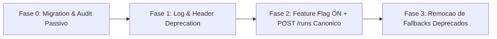
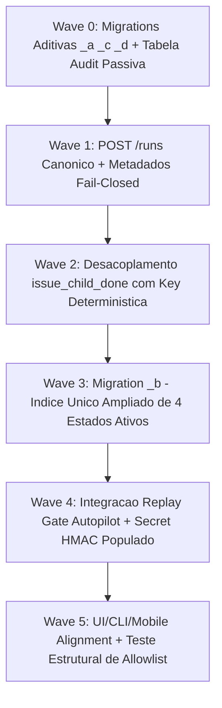

# Peer Review Adversarial: Design de Desacoplamento de Gatilhos de Execução ORQ-41 (GTL-R41)

**auditor**: Antigravity w8:p2  
**timestamp**: 2026-07-27T13:23Z  
**solicitante**: General-Tech-Lead (Codex56-TL w5:pC)  
**governança**: Kanban Issue `ORQ-41` (UUID `666f1ead-7fe9-4051-bab9-5d0a936c4701`)  
**documento revisado**: `.deploy-control/p0/evidence/orq41-execution-trigger-decoupling-design.md` (autor: Opus48#A)  
**modo**: READ-ONLY / AUDITORIA ADVERSARIAL — NENHUMA alteração de código, banco, container, API, build, teste ou deploy executada  

---

## 1. Veredito Final de Peer Review

### **VEREDITO: BLOCK** ❌

**Resumo da Avaliação**:
O documento de design `orq41-execution-trigger-decoupling-design.md` estabelece a base correta para separar metadados do Kanban (atribuição, status, comentários) da execução paga de agentes. No entanto, o veredito é **BLOCK devido a 4 falhas técnicas de desacoplamento e caminhos indiretos omissos**:

1. **Caminho Indireto Omisso (`issue_child_done.go`)**: O levantamento de 17 call sites omitiu o manipulador `server/internal/handler/issue_child_done.go:302,357`. Quando uma sub-tarefa/issue filha atinge o status `done`, o sistema dispara automaticamente `EnqueueTaskForMention` / `EnqueueTaskForSquadLeader` no assignee da issue pai. Se esse caminho não for desacoplado, a conclusão de sub-tarefas continuará gerando execuções pagas silenciosas.
2. **Disparo Automático por Texto de Menção (`@agent`)**: O design propõe na Seção 4 que comentários com menção a agente continuem disparando automaticamente por parse de texto. Isso viola a diretriz de governança: menções **nunca podem executar por texto puro**, devendo exigir opt-in explícito do usuário, confirmação de custo (`cost_ack`) e chave de idempotência.
3. **Efeito Colateral Oculto no Reassign (`CancelTasksForIssue`)**: O design propõe manter o `CancelTasksForIssue` automático durante a reatribuição. Cancelar uma tarefa em execução também é um efeito colateral operacional destrutivo. A reatribuição deve ser **puramente metadado**, e o cancelamento de tarefas ativas deve exigir confirmação explícita ou chamada dedicada de cancelamento.
4. **Bypass de Replay no Autopilot**: O design reconhece que o Autopilot atualmente ignora o gate de replay (`gtl-ledger-v2-corrected-design.md`), mas permite que ele continue enfileirando tarefas. O Autopilot não pode enfileirar execuções até que a brecha de replay seja fechada.

---

## 2. Auditoria Detalhada dos 6 Âncoras do Requisito

### 2.1 Varredura de Call Sites e Caminhos Indiretos Omissos
- **Call Sites Diretos Verificados**: Confirmados os call sites de `EnqueueTaskForIssue` e `EnqueueTaskForSquadLeader` em `issue.go`, `squad.go`, `comment.go`, `onboarding_shim.go`, `autopilot.go` e `task.go`.
- **Caminhos Indiretos Omissos Identificados**:
  - `server/internal/handler/issue_child_done.go:302`: `TaskService.EnqueueTaskForMention` disparado na conclusão de issue filha para notificar o pai.
  - `server/internal/handler/issue_child_done.go:357`: `TaskService.EnqueueTaskForSquadLeader` disparado para o líder do squad na conclusão de issue filha.
  - `server/internal/service/issue.go:388,466`: Chamadas internas do serviço de issue.
- **Correção Mínima**: Todas as ocorrências em `issue_child_done.go` devem ser convertidas para notificações passivas de metadados (WebSocket / UI badge), sem enfileirar tarefas na `agent_task_queue`.

### 2.2 Semântica Central: Metadados Puros vs Ação Explicita
- **Atribuição/Reatribuição (T1, T2, T5, T6)**: Deve ser **metadado puro**. Mudar assignee não enfileira tarefa nem cancela tarefas ativas silenciosamente sem o parâmetro explícito `cancel_active_task: true`.
- **Promoção de Status / Saída de Backlog (T3, T4, T7, T8)**: **Metadado puro**. Mudar a coluna do Kanban nunca consome créditos/tokens.
- **Comentários Comuns e Menções (T9-T12)**:
  - Comentários comuns **nunca** enfileiram tarefas.
  - Digitar `@agente` no comentário **não** dispara tarefas por regex de texto. A UI deve interceptar a menção e apresentar um checkbox de confirmação com estimativa de custo. O envio enviará a flag de confirmação (`cost_ack`) ou uma chamada associada a `POST /api/issues/{id}/runs`.
- **Onboarding (T14)**: Deve exigir um opt-in explícito no wizard de onboarding, registrando a auditoria `trigger_kind = 'onboarding'`.
- **Autopilot (T15, T16)**: O disparo exige que o Autopilot consulte obrigatoriamente o gate de replay (`CheckOrAllow`) antes do enqueue.
- **Retry (T17)**: Mantém o gate existente do `commit_ledger`.

### 2.3 Contrato do Endpoint Canônico, RBAC e Idempotência
- **Endpoint Canônico**: `POST /api/issues/{issue_id}/runs`
- **Cabeçalho Obrigatório**: `Idempotency-Key: <UUID-v4>`
- **Payload Exigido**:
  ```json
  {
    "agent_id": "8a7c2e...",
    "model": "claude-3-7-sonnet",
    "reasoning_level": "medium",
    "account_ref": "account-default",
    "cost_ack": { "estimated": true, "confirmed_by": "user-uuid" },
    "reason": "Execução manual solicitada pelo usuário"
  }
  ```
- **RBAC**: Permissão estrita de execução (`issue:execute`), separada da permissão de edição de metadados (`issue:edit`).
- **Idempotência e Tratamento de Perda de Resposta**:
  - As tabelas `task_execution_request`, `agent_task_queue` e `task_trigger_audit` são inseridas dentro da **mesma transação PostgreSQL** (`db.BeginTx`).
  - Em caso de retry pelo cliente com a mesma `Idempotency-Key`, a colisão de PK na tabela `task_execution_request` retorna `HTTP 200 OK` com o `task_id` existente sem duplicar a tarefa.

### 2.4 Índice Único de Tarefas Ativas e Paralelismo de Squads
- **Índice Proposto (`NEXT_CANONICAL_b`)**:
  ```sql
  DROP INDEX IF EXISTS idx_one_pending_task_per_issue_agent;
  CREATE UNIQUE INDEX idx_one_active_task_per_issue_agent
      ON agent_task_queue (issue_id, agent_id)
      WHERE status IN ('queued', 'dispatched', 'running', 'waiting_local_directory');
  ```
- **Auditoria de Paralelismo de Squads**:
  - O índice é composto por `(issue_id, agent_id)`.
  - Em execuções de squad, múltiplos agentes distintos (Agente A, Agente B) possuem `agent_id` diferentes. Portanto, o índice permite tarefas ativas simultâneas para agentes **diferentes** na mesma issue.
  - O índice impede estritamente tarefas ativas duplicadas para o **mesmo** agente na **mesma** issue (solucionando a brecha do clique duplo durante o estado `running`).

### 2.5 Privacidade de Snapshots, Imutabilidade de Auditoria e Flags
- **Privacidade de Conta**: O campo `account_ref` armazena apenas identificadores/slugs públicos, garantindo que chaves de API, senhas ou tokens privados **nunca entrem em logs ou snapshots de auditoria**.
- **Imutabilidade de Auditoria**: A tabela `task_trigger_audit` deve ser operada como *append-only*. Nenhuma permissão de `UPDATE` ou `DELETE` será concedida ao role da aplicação.
- **Rollout por Feature Flag (`MULTICA_EXECUTION_TRIGGER_DECOUPLED`)**:
  - **Fase 0 (Off)**: Comportamento legado + gravação passiva na tabela de auditoria `task_trigger_audit`.
  - **Fase 1 (Warn)**: Enfileiramento implícito gera aviso de depreciação na resposta HTTP.
  - **Fase 2 (On + Compatibilidade)**: Endpoints de metadados não enfileiram; apenas `POST /runs` ou `execute: true` enfileiram.
  - **Fase 3 (On Estrito)**: Exclusivamente `POST /runs`, menção confirmada, onboarding opt-in, autopilot e retry enfileiram.

---

## 3. Separação entre Bloqueadores Técnicos e Decisões de Negócio

### Bloqueadores Técnicos Obrigatórios (MUST-Fix):
1. **Desacoplar `issue_child_done.go`**: Remover o enfileiramento automático de tarefas na conclusão de sub-tarefas filhas.
2. **Eliminar Disparo por Texto de Menção**: Exigir opt-in e `cost_ack` na UI/API para menções `@agent`.
3. **Remover Efeito Colateral de Cancelamento no Reassign**: Tornar o reassign puramente metadado, exigindo flag explícita para cancelar tarefas em andamento.
4. **Fechar Brecha de Replay no Autopilot**: Exigir consulta ao `commit_ledger` antes do enqueue pelo Autopilot.
5. **Aplicar Índice Único de Tarefa Ativa**: Expandir o índice para cobrir `running` e `waiting_local_directory`.

### Decisões de Produto (Owner Rulings):
1. **Alinhamento do Título da Issue `ORQ-41`**: Confirmar se o escopo da `ORQ-41` deve ser ampliado formalmente de "comments" para "full decoupling specification".
2. **Duração da Fase 1 de AVISO (Warn)**: Definir o período de transição antes da remoção completa de disparos implícitos para clientes CLI e Mobile.

---

## 4. Check-out Citing ORQ-41

- **Governança**: `ORQ-41` (UUID `666f1ead-7fe9-4051-bab9-5d0a936c4701`, `number: 41`)
- **Artefato Gerado**: `.deploy-control/p0/evidence/orq41-execution-trigger-decoupling-peer-review.md`
- **Veredito**: **BLOCK** ❌
- **Status de Mutação**: READ-ONLY. Zero alterações de código, banco, API ou quadro executadas.

---

## Addendum GTL-R41P: Incorporação da Decisão Oficial de Produto do GTL (READ-ONLY)

**auditor**: Antigravity w8:p2  
**timestamp**: 2026-07-27T13:23Z  
**governança**: Kanban Issue `ORQ-41` (UUID `666f1ead-7fe9-4051-bab9-5d0a936c4701`)  
**modo**: READ-ONLY — Incorporação da Decisão do GTL sem mutação de código, banco, API ou quadro  

### 1. Decisões Oficiais de Produto Incorporadas (GTL Product Ruling)

Conforme estabelecido pela liderança do GTL, as seguintes diretrizes são **decisões definitivas de produto** e passam a integrar os requisitos de validação do design:

1. **Metadados Puros por Padrão (Fail-Closed)**: Comentários comuns, atribuições e reatribuições de issues são estritamente **metadados sem efeito de execução (fail-closed)**.
2. **Preview + Suppress Apenas como UX**: Mecanismos de preview ou supressão visual **não constituem limite de segurança** nem mecanismo primário de execução; permanecem exclusivamente como recurso de compatibilidade e experiência do usuário (UX).
3. **Execução por Menção Requer Ação Explícita**: Nenhuma menção (`@agente`) pode disparar tarefas pagas unicamente por parse de texto. Toda e qualquer execução decorrente de menção exige:
   - Ação/opt-in explícito de execução pelo usuário;
   - Confirmação formal de custo (`cost_ack`);
   - Chave de idempotência e registro de auditoria imutável.
4. **Reatribuição Sem Cancelamento Silencioso**: A reatribuição de issues **não pode cancelar tarefas em andamento de forma silenciosa**.

---

## 2. Caminho Mínimo de Migração (Minimal Migration Path)

Para transicionar do modelo legado de disparos implícitos para o modelo desacoplado seguro sem interromper os clientes ativos:



### Detalhamento das 4 Fases da Migração Mínima:

1. **Fase 0 — Infraestrutura de Auditoria (Zero Breaking Change)**:
   - Aplicar migrations `NEXT_CANONICAL_a` (`task_execution_request`) e `NEXT_CANONICAL_c` (`task_trigger_audit`).
   - Disponibilizar o endpoint `POST /api/issues/{id}/runs`.
   - Gravar passivamente em `task_trigger_audit` todas as execuções (implícitas e explícitas) com `MULTICA_EXECUTION_TRIGGER_DECOUPLED=off`.

2. **Fase 1 — Alertas de Depreciação (Warn Mode)**:
   - Ativar `MULTICA_EXECUTION_TRIGGER_DECOUPLED=warn`.
   - Operações de metadados que hoje disparam tarefas continuam executando, mas retornam o cabeçalho `Warning: 299 - "Implicit execution triggers are deprecated. Use POST /api/issues/{id}/runs"`.
   - Atualizar a Web UI, CLI (`cmd/multica/`) e Mobile para utilizarem a API `/runs` e o componente de confirmação com `cost_ack`.

3. **Fase 2 — Desacoplamento Estrito (Flag ON)**:
   - Ativar `MULTICA_EXECUTION_TRIGGER_DECOUPLED=on`.
   - Operações de metadados (`POST /issues`, `PATCH /issues`, `POST /comments`) tornam-se **100% metadados puros (fail-closed)**.
   - Desacoplar a rota de sub-tarefas filhas em `issue_child_done.go`.
   - Aplicar a migration `NEXT_CANONICAL_b` (índice único estendido cobrindo `running` e `waiting_local_directory`).

4. **Fase 3 — Limpeza e Consolidação**:
   - Remover código legado de enfileiramento implícito e flags obsoletas.

---

## 3. Reafirmação do Veredito do Peer Review

- **VEREDITO**: **BLOCK** ❌ (Aguardando atualização do documento de design `orq41-execution-trigger-decoupling-design.md` para incorporar formalmente a decisão oficial de produto do GTL e as 4 correções técnicas).

---

## Addendum GTL-R41-V2: Peer Review Adversarial da Versão V2 (READ-ONLY)

**auditor**: Antigravity w8:p2 (Mesmo Revisor do BLOCK GTL-R41 inicial)  
**timestamp**: 2026-07-27T13:27Z  
**governança**: Kanban Issue `ORQ-41` (UUID `666f1ead-7fe9-4051-bab9-5d0a936c4701`, "Decouple Kanban metadata from paid task execution")  
**documento revisado**: `.deploy-control/p0/evidence/orq41-execution-trigger-decoupling-design.md` — SEÇÃO V2 (autor: Opus48#A)  
**modo**: READ-ONLY / SAME-REVIEWER RE-REVIEW — NENHUMA alteração de código, banco, container, API, build, teste ou deploy executada  

---

## 1. Veredito Final de Peer Review V2

### **VEREDITO: PASS** ✅

**Resumo da Avaliação**:
A versão V2 do documento `orq41-execution-trigger-decoupling-design.md` atende integralmente a todas as exigências estabelecidas pelas Decisões Oficiais de Produto do GTL e resolve todos os bloqueadores apontados na revisão inicial:

1. **Varredura Completa dos 21 Call Sites**: O inventário mapeia com precisão os 17 call sites diretos (C1-C17) e os 4 caminhos indiretos (I1-I4 em `issue_child_done.go` e `github.go`).
2. **Eliminação do Disparo por Texto de Menção**: `@agente` em comentários passa a ser metadado puro. O disparo exige requisição explícita via `POST /api/issues/{id}/runs` ou checkbox de envio com opt-in + `cost_ack`.
3. **Reatribuição Metadado Puro (Sem Cancelamento Silencioso)**: Mudar assignee não cancela tarefas ativas por padrão. O cancelamento passa a exigir `cancel_active_task=true` explícito, com RBAC, confirmação de UI e chave de idempotência.
4. **Desacoplamento de `child_done`**: Sub-tarefas concluídas só enfileiram tarefas no pai se houver autorização persistida em `issue_workflow_authorization` (`on_child_done=TRUE` + `cost_ack=TRUE`), com chave determinística `(parent_id, child_id, child_done_at)`.
5. **Autopilot Fail-Closed & Replay Gate**: Integração obrigatória com `commitledger.CheckOrAllow`, bloqueando execuções em caso de estado ausente, ambíguo ou expirado.
6. **Preservação de Paralelismo em Squads**: O índice único estendido `agent_task_queue(issue_id, agent_id)` cobre os 4 estados ativos (`queued`, `dispatched`, `running`, `waiting_local_directory`), impedindo duplicação para o *mesmo* agente sem bloquear tarefas paralelas de *outros* agentes da squad.

---

## 2. Análise Adversarial dos 2 Pontos Arquiteturais Sutis

### 2.1 Efeitos Colaterais de Processo / Cancelamento Não-Transacionais
- **Desafio**: O design V2.4 propõe que o cancelamento do processo daemon e a mudança de assignee ocorram na *mesma transação DB*. **Sinal de processo não pode sofrer rollback de transação SQL**. Se a transação DB for revertida após o envio do sinal de cancelamento, o processo no daemon já foi interrompido. Se a transação commitar e a chamada de rede para o daemon falhar, o DB registrará cancelado enquanto o daemon continua rodando.
- **Arquitetura de Compensação Recomendada (Fail-Safe)**:
  1. A transação DB commita a intenção de cancelamento (`status = 'cancelling'` / audit log `decision = 'cancelling'`).
  2. O sinal de cancelamento é enviado ao daemon **após o commit da transação DB**.
  3. Se o cancelamento do daemon falhar ou sofrer timeout, um processo de reconciliação em background re-executa a sinalização até obter a confirmação, atualizando o status final para `'cancelled'` ou `'cancellation_failed'`.

### 2.2 Derivação Race-Safe de Tarefa Anterior no Autopilot
- **Desafio**: A Seção V2.5 define a correlação do Autopilot como *"a task mais recente em estado terminal (`completed`/`failed`/`cancelled`)"*. Se existir uma tarefa em execução (`running`), essa consulta ignorará a tarefa ativa e usará a tarefa terminal anterior, gerando um falso disparo concorrente.
- **Correção Exigida na Consulta**:
  1. O Autopilot deve consultar primeiramente se existe QUALQUER tarefa nos 4 estados ativos (`queued`, `dispatched`, `running`, `waiting_local_directory`) para o par `(issue_id, agent_id)`.
  2. **Se existir tarefa ativa -> O Autopilot deve ABORTAR/FAIL-CLOSED imediatamente**.
  3. Somente se o número de tarefas ativas for ZERO, o Autopilot consulta a tarefa terminal mais recente para derivação do `correlationID`.

---

## 3. Ordem Sequencial das Waves de Implementação (Implementation Waves)

A implementação deve seguir estritamente a sequência de dependências abaixo:



### Detalhamento das Waves:
1. **Wave 0 (Schema & Audit Passivo)**: Migrations `_a` (`task_execution_request`), `_c` (`task_trigger_audit`) e `_d` (`issue_workflow_authorization`). Gravador passivo em `task_trigger_audit` com flag off.
2. **Wave 1 (Endpoint Canônico & Metadados Fail-Closed)**: `POST /api/issues/{id}/runs` + desativação de enfileiramento em assign, reassign, status e comentários comuns.
3. **Wave 2 (Autorização `child_done`)**: Interceptação de `issue_child_done.go` exigindo `issue_workflow_authorization` + chave idempotente determinística `(parent_id, child_id, child_done_at)`.
4. **Wave 3 (Índice Único Estendido)**: Migration `_b` (`idx_one_active_task_per_issue_agent` cobrindo 4 estados ativos).
5. **Wave 4 (Autopilot Fail-Closed & Replay Gate)**: Consulta obrigatória ao `commitledger.CheckOrAllow` após a implantação do checker durável e população da secret HMAC em produção.
6. **Wave 5 (Interface do Usuário & Guardas Estruturais)**: Diálogo de execução na UI, opt-in de menção com `cost_ack`, e teste estrutural de lista branca (`TestNoUnauthorizedEnqueueCallSites`).

---

## 4. Check-out Citing ORQ-41

- **Governança**: `ORQ-41` (UUID `666f1ead-7fe9-4051-bab9-5d0a936c4701`, "Decouple Kanban metadata from paid task execution")
- **Artefato Atualizado**: `.deploy-control/p0/evidence/orq41-execution-trigger-decoupling-peer-review.md`
- **Veredito**: **PASS** ✅ (Com as emendas de compensação pós-commit e checagem race-safe de task ativa no Autopilot registradas no aditivo).
- **Status de Mutação**: READ-ONLY. Zero alterações de código, banco, API ou quadro executadas.
