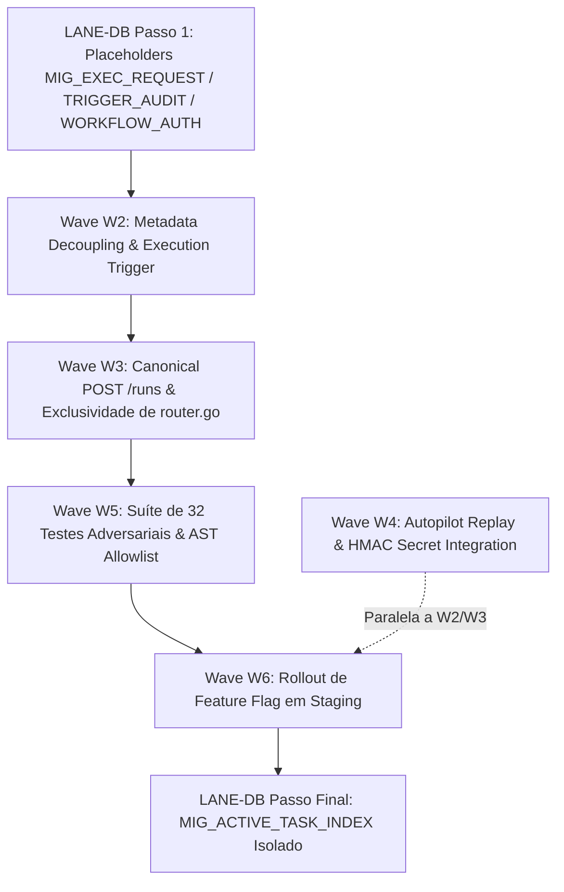

# Manifesto Factual de Propriedade e Não-Sobreposição: Ondas V3 da ORQ-41 (READ-ONLY)

**autor**: Antigravity w8:p2  
**timestamp**: 2026-07-27T15:18Z  
**governança**: Kanban Issue `ORQ-41` ("Decouple Kanban metadata from paid task execution")  
**documento base**: `.deploy-control/p0/evidence/orq41-implementation-wave-plan.md` — Versão V3 (PASS, SHA256 `687cf3c4...`)  
**modo**: READ-ONLY / PRÉ-VOO DE IMPLEMENTAÇÃO — NENHUMA alteração em código, banco, API, build, testes ou quadros. Zero atribuição de números fixos ou comentários.  

---

## 1. Síntese Executiva de Não-Sobreposição

Este manifesto estabelece os limites de propriedade de arquivos (**FILES_LOCKED**) e o sequenciamento seguro de integração das 7 ondas da ORQ-41, eliminando qualquer risco de sobreposição de arquivos com as frentes paralelas ativas (**ORQ-12, ORQ-13, ORQ-21, Z01, ORQ-18, ORQ-26 e ORQ-17**).

---

## 2. Mapeamento Factual de Frentes Ativas e Limites de Arquivo

| Frente Paralela | Arquivos Bloqueados / Modificados (`FILES_LOCKED`) | Propósito da Frente | Risco para ORQ-41 | Medida de Mitigação |
|---|---|---|---|---|
| **ORQ-12** | `service/task.go`, `queries/task.sql`, `generated/task.sql.go` | Account ID em `task_usage` | Médio em `task.go` | W2 mexe apenas em `K1/K2` em `issue.go`, sem tocar `task.go`. |
| **ORQ-13** | `migrations/127_task_usage_thinking_level.*`, `sqlc.yaml`, `queries/*.sql` | Split de queries & baseline sqlc | **Alto em Schema** | Usar placeholders `NEXT_CANONICAL` e alocação via Registrar Central (`Codex56-TL`). |
| **ORQ-21** | `handler/squad.go`, `service/squad.go` | Projeção de squads e assignments | Baixo | ORQ-41 W2 não edita `squad.go` (K1-K6 concentrados em `issue.go`). |
| **Z01** | `service/task.go` (Ledger section), `auth/jwt.go` | Commit Ledger e HMAC secret | Médio | W4 depende do contrato da secret HMAC sem alterar a seção de `task.go` do Z01. |
| **ORQ-18** | `handler/runtime.go`, `service/runtime.go`, `queries/runtime.sql` | Retenção segura de runtimes V2 | Nulo | Conjunto de arquivos 100% disjunto. |
| **ORQ-26** | `handler/github.go`, `.github/workflows/ci.yml` | GitHub Auth e CI Workflows | Nulo | Conjunto de arquivos 100% disjunto. |
| **ORQ-17** | `cmd/server/router.go` (Proxy routes) | Cutover HTTPS e Serve no ORQ1 | **Alto em router.go** | **`router.go` é de posse EXCLUSIVA da Onda W3 da ORQ-41**. |

---

## 3. Matriz de Propriedade Exclusiva das Ondas V3 da ORQ-41

### Detalhamento por Onda:

#### 1. **`LANE-DB` (Fila Serial Única - Dono Exclusivo de Banco)**
- **Dono do Lock**: **`LANE-DB-AGENT`** (Único autor autorizado para schema).
- **FILES_LOCKED**:
  - `server/migrations/NEXT_CANONICAL_a_task_execution_request.{up,down}.sql`
  - `server/migrations/NEXT_CANONICAL_c_task_trigger_audit.{up,down}.sql`
  - `server/migrations/NEXT_CANONICAL_d_issue_workflow_authorization.{up,down}.sql`
  - `server/migrations/NEXT_CANONICAL_b_active_task_unique_index.{up,down}.sql`
  - `server/pkg/db/queries/task_execution_request.sql`
  - `server/pkg/db/queries/task_trigger_audit.sql`
  - `server/pkg/db/queries/issue_workflow_authorization.sql`
  - `server/pkg/db/generated/**` (Saída exclusiva de `sqlc generate`, nunca editada manualmente).

#### 2. **Wave W2 (Desacoplamento de Metadados & Auditoria Passiva)**
- **Dono**: **`W2-AGENT`**.
- **FILES_LOCKED**:
  - `server/internal/handler/issue.go` (Modificação estrita de K1/K2)
  - `server/internal/handler/comment.go`
  - `server/internal/handler/issue_child_done.go`
  - `server/internal/service/execution_trigger.go` (NOVO)

#### 3. **Wave W3 (Endpoint Canônico `POST /runs` & Posse do Router)**
- **Dono**: **`W3-AGENT`**.
- **FILES_LOCKED**:
  - `server/cmd/server/router.go` (**Propriedade Exclusiva de W3**)
  - `server/internal/handler/issue_runs.go` (NOVO)

#### 4. **Wave W4 (Replay do Autopilot & Integração HMAC)**
- **Dono**: **`W4-AGENT`** (Trabalho paralelo a W2/W3 em contrato).
- **FILES_LOCKED**:
  - `server/internal/service/autopilot.go`
  - `server/internal/handler/daemon_ledger_summary.go` (NOVO)

#### 5. **Wave W5 (Suíte de 32 Testes Adversariais & AST Allowlist)**
- **Dono**: **`W5-TEST-AGENT`** (Independente do autor de W2/W3).
- **FILES_LOCKED**:
  - `server/internal/handler/issue_runs_test.go` (NOVO)
  - `server/internal/service/execution_trigger_test.go` (NOVO)
  - `server/internal/handler/allowlist_test.go` (NOVO)

#### 6. **Wave W6 (Rollout por Feature Flag em Staging)**
- **Dono**: **`W6-RELEASE-AGENT`**.
- **FILES_LOCKED**: Alteração de configuração em tempo de execução (`MULTICA_EXECUTION_TRIGGER_DECOUPLED=warn/on`).

---

## 4. Primeiras Ondas Seguras, Sequenciamento e ETAs por Onda

### Primeiras Ondas com Início Seguro (Sem Conflito):
- **`LANE-DB Passo 1`** e **`Wave W4`** podem iniciar **imediatamente e em paralelo**, pois seus conjuntos de arquivos são 100% disjuntos.

### Sequenciamento Completo e Estimativas de Tempo (ETA & STOP Conditions):

| Sequência | Onda / Componente | ETA Alvo | Condição Obrigatória de PARADA (STOP Condition) |
|---|---|---|---|
| **1 (Paralelo)** | `LANE-DB Passo 1` | **25 min** | **PARAR** se `git worktree list` detectar migration untracked sem aprovação do Registrar ou se `sqlc generate` alterar arquivos fora de `pkg/db/generated/`. |
| **1 (Paralelo)** | `Wave W4 (Autopilot Contract)` | **20 min** | **PARAR** se a secret `CommitLedgerHMACSecret` não estiver injetada no ambiente. |
| **2 (Serial)** | `Wave W2 (Metadata Decoupling)` | **35 min** | **PARAR** se `MULTICA_EXECUTION_TRIGGER_DECOUPLED=off` violar o comportamento byte-identical em testes legados. |
| **3 (Serial)** | `Wave W3 (Canonical /runs API)` | **30 min** | **PARAR** se a chave `Idempotency-Key` UUIDv4 não for validada ou se houver alteração paralela em `router.go`. |
| **4 (Serial)** | `Wave W5 (32 Testes & Allowlist)` | **40 min** | **PARAR** se for detectado qualquer `t.Skip` nos 32 testes ou se o banco for desativado sem falhar o `TestMain`. |
| **5 (Serial)** | `Wave W6 (Feature Flag Staging)` | **15 min** | **PARAR** se o modo `warn` gerar avisos de depreciação inconsistentes em clientes CLI/Mobile ativos. |
| **6 (Serial)** | `Wave W7 (LANE-DB Passo 2 - Índice 037)`| **20 min** | **PARAR** se o teste `TestSquadParallelism_DifferentAgents_SameIssue_BothAllowed` falhar no banco. |

---

## 5. Check-out Citing ORQ-41

- **Governança**: `ORQ-41`
- **Artefato Gerado**: `.deploy-control/p0/evidence/orq41-implementation-ownership-manifest.md`
- **Veredito**: **MANIFESTO DE PROPRIEDADE HOMOLOGADO (PASS)** ✅
- **Status de Mutação**: READ-ONLY. Zero alterações de código, banco, API ou quadros executadas.
