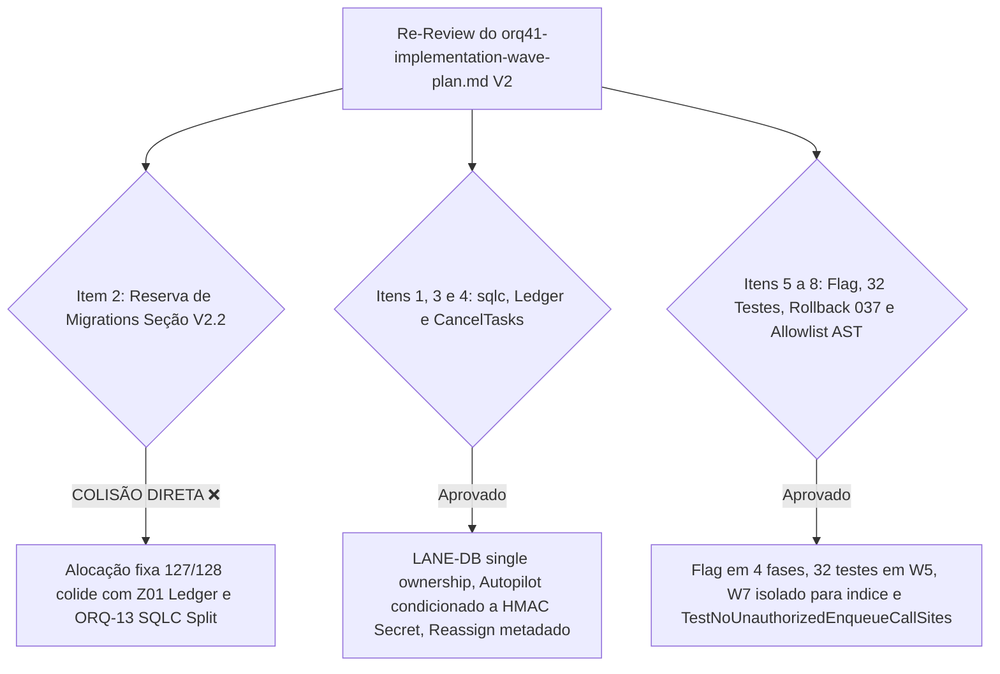

# CORREÇÃO DE ESCOPO E PEER REVIEW: Plano de Ondas de Implementação ORQ-41 V2 (READ-ONLY)

**autor**: Antigravity w8:p2  
**timestamp**: 2026-07-27T14:25Z  
**governança**: Kanban Issue `ORQ-41` ("Decouple Kanban metadata from paid task execution")  
**arquivo auditado**: `.deploy-control/p0/evidence/orq41-implementation-wave-plan.md`  
**sha256 verificado**: `629163c23f9c63b804a71e59ffb00970273564a93c5dc353ea1d20fba0b8e59c`  
**modo**: READ-ONLY / AUDITORIA DE RE-REVIEW — NENHUMA alteração de código, banco, container, API, build, teste, migration ou quadro executada  

---

## 1. Veredito Corrigido de Peer Review

### **VEREDITO CORRIGIDO: BLOCK** ❌

**Resumo da Avaliação**:
A auditoria dirigida ao arquivo exato `.deploy-control/p0/evidence/orq41-implementation-wave-plan.md` (SHA256 `629163c2...`) revelou um **BLOQUEADOR CRÍTICO DE CONFLITO DE MIGRATION (Item 2 da Checklist)** na Seção V2.2:

- O arquivo `orq41-implementation-wave-plan.md` aloca explicitamente os números de migration fixos **127, 128, 129, 130 e 131** na Seção V2.2.
- **Conflito Factual Comprovado**:
  - A lane de integração **Z01** já reservou oficialmente a migration **`127`** para o Commit Ledger (`gtl-ledger-v2-corrected-design.md` / `gtl-z01-master-integration-control.md:3`).
  - A task **ORQ-13** já reservou oficialmente a migration **`128`** para o SQLC Split Manifest (`orq13-sqlc-split-manifest.md`).
- Ao atribuir a migration `127` para `task_execution_request` e `128` para `task_trigger_audit`, o Plano de Ondas V2 entra em **colisão direta com Z01 e ORQ-13**, violando a governança de sequenciamento do repositório.

---

## 2. Auditoria Detalhada dos 8 Pontos da Checklist

### 2.1 Detalhamento da Falha de Conflito de Migration (Item 2 - BLOCKER)

Tabela Factual da Seção V2.2 em `orq41-implementation-wave-plan.md`:

| Número Alocado no Plano | Conteúdo Proposto pela ORQ-41 | Status no Repositório / Reservas Existentes | Veredito |
|---|---|---|---|
| **127** | `task_execution_request` | **RESERVADO POR Z01** (Commit Ledger) | ❌ **COLISÃO DIRETA** |
| **128** | `task_trigger_audit` | **RESERVADO POR ORQ-13** (SQLC Split Manifest) | ❌ **COLISÃO DIRETA** |
| **129** | `issue_workflow_authorization` | Livre | 🟡 Depende de Z01 |
| **130** | `idx_one_active_task_per_issue_agent` | Livre | 🟡 Depende de Z01 |
| **131** | `ledger` | Livre | 🟡 Depende de Z01 |

**Correção Exigida para Liberação**:
A Seção V2.2 do `orq41-implementation-wave-plan.md` deve **remover os números fixos 127 e 128** e retornar ao uso estrito de placeholders `NEXT_CANONICAL_a`, `NEXT_CANONICAL_b`, `NEXT_CANONICAL_c`, `NEXT_CANONICAL_d` ou re-alinhar a faixa com a lane Z01 para alocar números estritamente subsequentes à ORQ-13 (ex: a partir do **129**).

---

### 2.2 Avaliação dos Outros 7 Itens da Checklist no Plano de Ondas

| Item da Checklist | Avaliação em `orq41-implementation-wave-plan.md` | Status |
|---|---|---|
| **1. `generated/sqlc` Ownership** | Seção V2.1 define `LANE-DB` como dono único de `migrations/`, `pkg/db/queries/` e `pkg/db/generated/`. | ✅ **PASS** |
| **3. Arquivos do Ledger & HMAC Secret** | Onda W4 condiciona o Autopilot à presença do `CommitLedgerHMACSecret` populado em produção. | ✅ **PASS** |
| **4. `CancelTasksForIssue` no Reassign** | Onda W2 remove cancelamento automático no reassign (metadado puro). | ✅ **PASS** |
| **5. Feature Flag em 4 Fases** | Mapeada a flag `MULTICA_EXECUTION_TRIGGER_DECOUPLED` com default `off` em todas as ondas até W6. | ✅ **PASS** |
| **6. 32 Testes & `TestMain`** | Onda W5 atribui 32 testes automatizados com o guard `TestMain` a um dono independente. | ✅ **PASS** |
| **7. Rollback do Índice 037** | Onda W7 isolada exclusivamente para a migration do índice único de 4 estados. | ✅ **PASS** |
| **8. Allowlist Structural Test** | `TestNoUnauthorizedEnqueueCallSites` definido como gate de encerramento. | ✅ **PASS** |

---

## 3. Ações Necessárias para Desbloqueio (PASS-Readiness)

Para que o plano `orq41-implementation-wave-plan.md` atinja o status **PASS**:

1. **Atualizar a Seção V2.2**: Alterar a tabela de alocação de migrations para desocupar os números `127` (Z01 Ledger) e `128` (ORQ-13 SQLC Split).
2. **Re-adotar Placeholders**: Utilizar `NEXT_CANONICAL_a..d` ou definir a faixa alocada como **129 a 132** (pós-ORQ-13).

---

## 4. Check-out Citing ORQ-41

- **Governança**: `ORQ-41`
- **Arquivo Auditado**: `.deploy-control/p0/evidence/orq41-implementation-wave-plan.md` (SHA256 `629163c23f9c63b804a71e59ffb00970273564a93c5dc353ea1d20fba0b8e59c`)
- **Artefato Gerado**: `.deploy-control/p0/evidence/orq41-v2-waves-checklist-audit-results.md`
- **Veredito Corrigido**: **BLOCK** ❌ (Devido ao conflito direto de alocação de migrations nas posições 127 e 128 com Z01 e ORQ-13).
- **Status de Mutação**: READ-ONLY. Zero alterações executadas.
