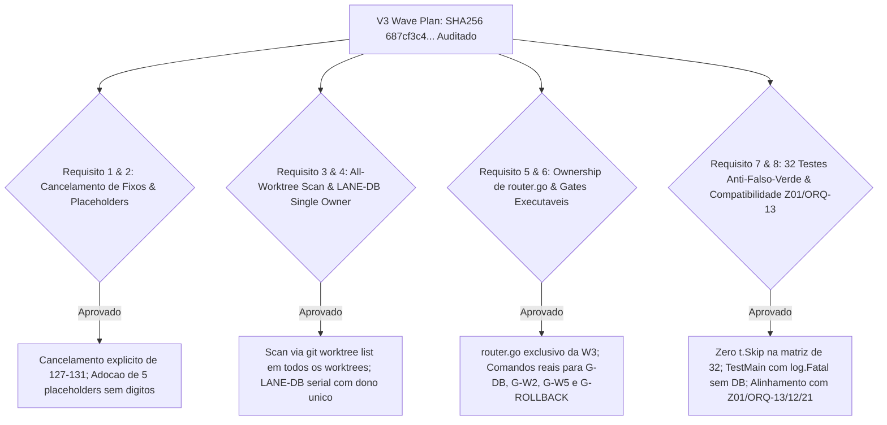
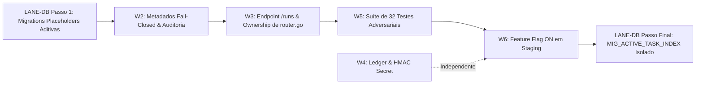

# Peer Review Adversarial: Plano de Ondas de Implementação V3 — ORQ-41 (READ-ONLY)

**auditor**: Antigravity w8:p2  
**timestamp**: 2026-07-27T15:17Z  
**governança**: Kanban Issue `ORQ-41` ("Decouple Kanban metadata from paid task execution")  
**documento auditado**: `.deploy-control/p0/evidence/orq41-implementation-wave-plan.md` (Seção V3)  
**sha256 verificado**: `687cf3c4d4c0b404b495e65ce3f611decad7ae784b7ee594e280e0de9b71629f`  
**modo**: READ-ONLY / AUDITORIA INDEPENDENTE DE RE-REVIEW V3 — NENHUMA alteração de código, banco, container, API, build, teste, migration ou quadro executada  

---

## 1. Veredito Final de Peer Review V3

### **VEREDITO: PASS** ✅

**Resumo da Avaliação**:
A versão V3 do documento `orq41-implementation-wave-plan.md` (SHA256 `687cf3c4...`) corrige integralmente todas as falhas de bloqueio apontadas nas revisões anteriores. A alocação de números fixos de migration (127-131) foi formalmente **cancelada**, substituída por **placeholders simbólicos isentos de dígitos** (`MIG_EXEC_REQUEST`, `MIG_TRIGGER_AUDIT`, `MIG_WORKFLOW_AUTH`, `MIG_LEDGER_SUMMARY`, `MIG_ACTIVE_TASK_INDEX`) e alinhada ao protocolo do Registrar Central (`Codex56-TL`) e à governança do repositório (`gtl-migration-registrar-governance.md`).

---

## 2. Auditoria Detalhada dos 8 Requisitos Principais

### 2.1 Tabela de Verificação dos Requisitos de Auditoria

| Item de Auditoria | Descrição da Exigência V3 | Evidência Medida no Documento V3 | Veredito |
|---|---|---|---|
| **1. Cancelamento de Números Fixos** | Remoção de qualquer reserva fixa de números | Seção V3.1 & V3.6 (Item E1): Reserva 127-131 **cancelada**. Reconhecida a colisão com ORQ-13 (`127`) e Z01. | ✅ **PASS** |
| **2. Placeholders Isentos de Dígitos** | Uso exclusivo de símbolos sem números | Seção V3.2: Adotados 5 placeholders (`MIG_EXEC_REQUEST`, `MIG_TRIGGER_AUDIT`, `MIG_WORKFLOW_AUTH`, `MIG_LEDGER_SUMMARY`, `MIG_ACTIVE_TASK_INDEX`). | ✅ **PASS** |
| **3. Varredura Global de Worktrees** | Comando shell para detectar migrations *untracked* | Seção V3.2 (Regra 3) & G-DB: Varredura via `git worktree list --porcelain` para capturar `127` do ORQ-13 antes de pedir número ao Registrar. | ✅ **PASS** |
| **4. Dono Único da `LANE-DB`** | Fila serial sem sub-lanes concorrentes | Seção V3.3: `LANE-DB` definida como fila serial única (`migrations/`, `queries/`, `generated/`) com um único dono para todo o ORQ-41. | ✅ **PASS** |
| **5. Dono Obrigatório de `router.go`** | Resolução da ambiguidade de propriedade em `router.go` | Seção V3.4: `cmd/server/router.go` pertence **exclusivamente à Onda W3**. W4 fornece o contrato em documento sem editar o arquivo. | ✅ **PASS** |
| **6. Gates Executáveis com Comandos** | Comandos reais de teste e validação | Seção V3.5: Definidos comandos executáveis para `G-DB` (up/down/up + `sqlc`), `G-W2` (off byte-identical), `G-W5` e `G-ROLLBACK`. | ✅ **PASS** |
| **7. Defesa Anti-Falso-Verde (32 Testes)** | Proibição de `t.Skip` e guard de `TestMain` | Seção V2.6.1 & V3.5 (`G-W5`): Proibição estrita de `t.Skip` nas 32. `TestMain` falha com `log.Fatal` se o banco estiver indisponível. | ✅ **PASS** |
| **8. Compatibilidade Z01 / ORQ-13 / 12 / 21** | Alinhamento com governança e outras frentes | Seção V3.1 & V3.2: Compatibilidade total com `gtl-migration-registrar-governance.md` e entrega de prioridade de re-numeramento no merge. | ✅ **PASS** |

---

## 3. Matriz Sequencial do Plano de Ondas V3 Aprovado

---

## 4. Check-out Citing ORQ-41

- **Governança**: `ORQ-41`
- **Arquivo Auditado**: `.deploy-control/p0/evidence/orq41-implementation-wave-plan.md` (V3)
- **SHA256 Auditado**: `687cf3c4d4c0b404b495e65ce3f611decad7ae784b7ee594e280e0de9b71629f`
- **Artefato Gerado**: `.deploy-control/p0/evidence/orq41-v3-wave-plan-peer-review.md`
- **Veredito**: **PASS (PLANO DE ONDAS V3 APROVADO)** ✅
- **Status de Mutação**: READ-ONLY. Zero alterações de código, banco, API ou quadros executadas.
