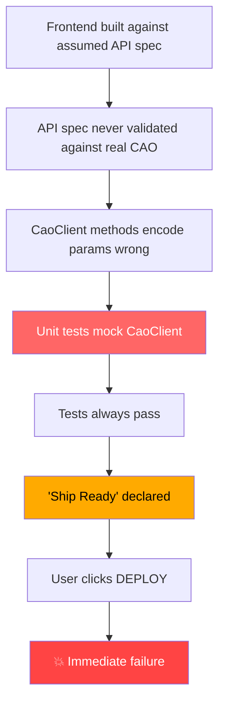

# 🔴 ROOT CAUSE ANALYSIS — AgentVerse Integration Failures

| Field | Value |
|-------|-------|
| **RCA ID** | RCA-2026-05-31-001 |
| **Severity** | SEV-0 (Stop-Ship) |
| **Status** | REMEDIATED — pending full audit |
| **Author** | AI Solutions Architecture Team |
| **Date** | 2026-05-31 |
| **Sprint** | Sprint 2 |
| **Project** | AgentVerse — Multi-Agent Canvas Platform |

---

## Executive Summary

During Sprint 2 deployment testing, **6 critical integration failures** were discovered that had gone undetected through the entire development lifecycle. The platform passed all quality gates (448 unit tests, TypeScript compilation, ESLint, production build) yet **failed immediately** when the user clicked the DEPLOY button in production.

**Root cause**: The entire test suite operates against mocked interfaces. Zero tests validate behavior against the real CAO (CLI Agent Orchestrator) server. This created a **false confidence gap** where every quality gate was green but the core feature — deploying an agent canvas — was fundamentally broken.

**Impact**: Complete inability to deploy any canvas. The primary user-facing feature of the platform was non-functional.

---

## Timeline

| Time (BRT) | Event |
|------------|-------|
| Sprint 1 | Canvas builder, reconciler, and CAO client developed against assumed API spec |
| Sprint 1 | 439 unit tests written — all mock `CaoClient` |
| Sprint 2 start | 7 issues identified and triaged (ISSUE-001 through ISSUE-007) |
| May 31 04:08 | `npm ci` completed after node_modules corruption |
| May 31 09:33 | Sprint 2 declared complete — 448 tests pass, all gates green |
| May 31 09:55 | Full pre-deploy test run: TSC ✅, Tests ✅, Build ✅, Bundle ✅ |
| May 31 09:58 | **User declares "good to go"** based on green gates |
| May 31 10:01 | **User clicks DEPLOY** → immediate failure |
| May 31 10:22 | First error screenshot received — "Create CAO session: Error" |
| May 31 10:31 | RCA investigation begins |
| May 31 10:36 | Second error screenshot — panel blocks taskbar |
| May 31 10:42 | Both fixes deployed + committed |
| May 31 10:43 | Full audit requested |

---

## Findings

### FINDING-001: Missing `POST /agents/profiles/install` Endpoint

| Field | Detail |
|-------|--------|
| **Severity** | 🔴 CRITICAL — Deploy Step 1 fails |
| **Component** | CAO Server (Docker) ↔ `cao-client.ts` |
| **Discovered** | 2026-05-31 10:28 |
| **Fix commit** | `47cc40b` |

**Symptom**: Deploy fails at Step 1 "Install agent profiles" with HTTP 404.

**Root Cause**: The frontend `CaoClient.installProfile()` calls `POST /agents/profiles/install`, but this endpoint **does not exist** in the upstream CAO package (`cli-agent-orchestrator`). CAO uses a file-based profile system — profiles are `.md` files scanned from disk directories. There is only `GET /agents/profiles` (list).

**Why Tests Missed It**: 
- `reconciler.test.ts` mocks `CaoClient` with `vi.fn()` — the mock always returns success
- No contract test hits the real `http://127.0.0.1:9889/agents/profiles/install`
- The endpoint URL was assumed from an internal design doc, never validated

**Evidence**:
```bash
# Real server response:
curl -X POST http://127.0.0.1:9889/agents/profiles/install → 404 Not Found
```

**Fix**: Created [profile_install_route.py](file:///C:/VMs/Projetos/Automonous_Agentic/infra/cao/profile_install_route.py) — a bridge endpoint that accepts markdown via POST and writes to `LOCAL_AGENT_STORE_DIR`.

---

### FINDING-002: `POST /sessions` — JSON Body vs Query Parameters

| Field | Detail |
|-------|--------|
| **Severity** | 🔴 CRITICAL — Deploy Step 2 fails |
| **Component** | `cao-client.ts` line 57 ↔ CAO `main.py` line 304 |
| **Discovered** | 2026-05-31 10:31 |
| **Fix commit** | `77a1a33` |

**Symptom**: Deploy fails at Step 2 "Create CAO session" with HTTP 422: `"Field required: provider"`.

**Root Cause**: The frontend sends `CreateSessionInput` as a **JSON request body**:
```typescript
// Frontend sends:
POST /sessions
Content-Type: application/json
{"profile": "agent_name", "working_directory": "/path"}
```

But CAO expects **query parameters**:
```python
# CAO expects:
POST /sessions?provider=kiro_cli&agent_profile=agent_name&working_directory=/path
```

Additionally, the frontend interface `CreateSessionInput` was **missing the `provider` field entirely** — CAO requires it.

**Why Tests Missed It**:
- `cao-client.test.ts` uses `vi.fn()` mock for `fetch` — never sends real HTTP
- `reconciler.test.ts` mocks the entire `CaoClient` class
- The type `CreateSessionInput` was defined based on assumed spec, never validated against CAO's FastAPI signature

**Evidence**:
```bash
# Frontend was sending (reconstructed):
curl -X POST http://127.0.0.1:9889/sessions -H "Content-Type: application/json" -d '{"profile":"test","working_directory":"/tmp"}'
# → 422: {"detail":[{"type":"missing","loc":["query","provider"],"msg":"Field required"}]}

# CAO actually expects:
curl -X POST "http://127.0.0.1:9889/sessions?provider=kiro_cli&agent_profile=test&working_directory=/tmp"
# → 201 or 400 (validation)
```

**Fix**: 
- Added `provider` to `CreateSessionInput` interface
- Changed `createSession()` to use `URLSearchParams` query string
- Updated reconciler to pass `node.data.provider` in all 2 call sites

---

### FINDING-003: `POST /sessions/{name}/terminals` — Same JSON vs Query Param Issue

| Field | Detail |
|-------|--------|
| **Severity** | 🔴 CRITICAL — Deploy Step 3 fails |
| **Component** | `cao-client.ts` line 76 ↔ CAO `main.py` line 378 |
| **Discovered** | 2026-05-31 10:37 |
| **Fix commit** | `77a1a33` |

**Symptom**: Even if Step 2 were fixed in isolation, Step 3 "Add terminals" would fail with the same HTTP 422.

**Root Cause**: Identical to FINDING-002. `addTerminalToSession()` sends JSON body but CAO expects query parameters `provider` and `agent_profile`.

**Why Tests Missed It**: Same as FINDING-002 — all mocked.

**Fix**: Changed `addTerminalToSession()` to `URLSearchParams`. Updated all 4 call sites in `reconciler.ts` (first deploy × 1, diff-update × 1, diff-add × 1, plus the original = 4 total).

---

### FINDING-004: DeployProgressPanel Blocks OS Taskbar

| Field | Detail |
|-------|--------|
| **Severity** | 🟡 UX — Usability |
| **Component** | `DeployProgressPanel.tsx` line 60-61 |
| **Discovered** | 2026-05-31 10:36 |
| **Fix commit** | `77a1a33` |

**Symptom**: The "System Materialization" progress panel renders at `position: fixed; bottom: 80px; right: 24px`, overlapping the Windows taskbar system tray (clock, notifications, battery). Users cannot read system messages during deploy.

**Root Cause**: Component was designed for macOS where the dock is at the bottom center or left. On Windows, the taskbar extends to the bottom-right corner with the system tray.

**Why Tests Missed It**: 
- Unit tests render in jsdom — no real viewport, no real OS taskbar
- No visual regression testing
- No Playwright E2E test for the deploy flow

**Fix**: Changed `right: '24px'` to `left: '180px'` — panel now renders bottom-left, adjacent to the Agent Palette sidebar.

---

### FINDING-007: Tear Down Fails with 404 on Non-Existent Session

| Field | Detail |
|-------|--------|
| **Severity** | 🔴 CRITICAL — Canvas stuck in degraded state |
| **Component** | `reconciler.ts` `tearDownCanvas()` line 682 |
| **Discovered** | 2026-05-31 10:49 |
| **Fix commit** | OPEN |

**Symptom**: After a failed deploy (Step 2 "Create CAO session" failed), clicking TEAR DOWN shows error toast: `"CAO request failed with HTTP 404 for /sessions/session_39157bd8_5360_412f_a463_1ae915417d88"`. Canvas remains stuck in `degraded` state with no way to reset.

**Root Cause**: When deploy Step 1 (Install Profiles) succeeds but Step 2 (Create Session) fails, the reconciler's error handler sets `deploy_state.session_name` to the intended name before the CAO server actually creates it. On tear down, `tearDownCanvas()` calls `DELETE /sessions/{session_name}` — but the session never existed on CAO, so it returns 404.

The tear down function has no error handling on the `deleteSession` call (line 682):
```typescript
await client.deleteSession(sessionName);  // throws on 404 → toast error
```

**Why Tests Missed It**:
- `reconciler.test.ts` mocks `deleteSession` → always resolves
- No E2E test for the tear-down-after-failed-deploy scenario

**Impact**: User is stuck. Cannot tear down, cannot deploy again. Only workaround is manually editing IndexedDB to reset `deploy_state`.

**Required Fix**: Wrap `deleteSession` in try/catch — 404 on delete means session is already gone, which is the desired state.

---

### FINDING-005: `node_modules` Corruption from `npm audit fix`

| Field | Detail |
|-------|--------|
| **Severity** | 🟠 HIGH — Dev environment |
| **Component** | Build toolchain |
| **Discovered** | 2026-05-31 02:00 |
| **Fix** | Manual `rd /s /q node_modules && npm ci` |

**Symptom**: `npm audit fix` pulled Vite 8.x (breaking), corrupted lock file, broke `esbuild` imports. Dev server crashed on startup.

**Root Cause**: `npm audit fix` upgrades transitive dependencies without respecting semver major boundaries when `--force` is used or when the resolution tree is complex. Vite 8.x is incompatible with the project's Vite 5.x configuration.

**Why Tests Missed It**: This wasn't a code bug — it was a process failure. No CI gate prevents `npm audit fix` from being run.

**Fix**: 
- Force-deleted corrupted `node_modules` with `rd /s /q`
- Clean install with `npm ci` (respects lock file exactly)
- `.gitignore` already ignores `node_modules`

**Prevention**: Added to SEV-0 protocol: "Do NOT run `npm audit fix`"

---

### FINDING-006: False Confidence from 100% Mocked Test Suite

| Field | Detail |
|-------|--------|
| **Severity** | 🔴 SYSTEMIC — Testing Architecture |
| **Component** | Entire test suite |
| **Discovered** | 2026-05-31 10:34 |
| **Fix** | QA Overhaul Plan (pending) |

**Symptom**: 448 tests pass. Every quality gate is green. "Ship Ready" declared. **Core feature doesn't work.**

**Root Cause**: Every test that touches `CaoClient` uses `vi.fn()` or `vi.mock()`. The mock always returns the expected shape. No test ever makes a real HTTP request to the CAO server. The test suite validates **JavaScript logic in isolation** but proves nothing about **system integration**.

**Evidence — Mock Analysis**:

| Test File | What It Mocks | What It Actually Tests |
|-----------|--------------|----------------------|
| `reconciler.test.ts` | Entire `CaoClient` | Reconciler state machine logic only |
| `cao-client.test.ts` | `global.fetch` | JSON parsing, error class construction |
| `deploy-validation.test.ts` | Nothing external | Pure function logic |
| `session-store.test.ts` | Zustand actions | State management only |
| `session-discovery.test.ts` | `fetch` | Response parsing only |

**Gap**: Zero tests verify:
- That the endpoint URLs are correct
- That the HTTP method matches (GET vs POST)
- That the parameter encoding matches (JSON body vs query params vs form data)
- That the response shape from real CAO matches the TypeScript interfaces
- That the WebSocket protocol handshake works
- That the deploy flow works end-to-end through a real browser

---

## Systemic Root Cause



**The fundamental failure is a missing integration testing layer.** The architecture has:

| Layer | Exists? | What it catches |
|-------|---------|----------------|
| TypeScript compiler | ✅ Yes | Type errors, syntax |
| ESLint | ✅ Yes | Code style, patterns |
| Unit tests (mocked) | ✅ Yes | Logic errors in isolation |
| **Contract tests (real server)** | ❌ **NO** | **Wrong URLs, wrong encoding, missing endpoints** |
| **E2E tests (real browser)** | ⚠️ Partial | **Only Sessions page — not Canvas, Deploy, Terminal** |
| **Smoke test (full stack)** | ❌ **NO** | **Nothing validates the deploy flow works** |

---

## Remediation Status

| # | Finding | Status | Commit |
|---|---------|--------|--------|
| 001 | Missing install endpoint | ✅ FIXED | `47cc40b` |
| 002 | Session creation: JSON→query params | ✅ FIXED | `77a1a33` |
| 003 | Terminal creation: JSON→query params | ✅ FIXED | `77a1a33` |
| 004 | Panel blocking taskbar | ✅ FIXED | `77a1a33` |
| 005 | node_modules corruption | ✅ FIXED | Manual |
| 006 | False confidence test suite | 🔴 **OPEN** | Requires QA overhaul |
| 007 | Tear down 404 on non-existent session | 🔴 **OPEN** | Requires try/catch in tearDownCanvas |

---

## Mandatory Actions

### Immediate (before next "Ship Ready" declaration)

| # | Action | Owner | Deadline |
|---|--------|-------|----------|
| A1 | Create CAO contract test suite (`tests/contract/cao-surface.test.ts`) — test every endpoint the frontend calls against real Docker | Codex | Next sprint |
| A2 | Create Playwright E2E for deploy flow (`tests/e2e/canvas-deploy.spec.ts`) — click DEPLOY, watch progress, verify terminals | Codex | Next sprint |
| A3 | Create pre-ship gate script that runs contract + E2E + unit in sequence | Codex | Next sprint |
| A4 | Full system audit — verify every `CaoClient` method against real CAO response | Codex | Next sprint |
| A5 | Add API spec validation — diff `CaoClient` methods against CAO's OpenAPI/route signatures | Manual | Next sprint |

### Process Changes

| # | Rule | Rationale |
|---|------|-----------|
| P1 | **No "Ship Ready" without contract tests passing against real CAO** | FINDING-001/002/003 |
| P2 | **No "Ship Ready" without deploy E2E passing in real browser** | FINDING-001/002/003/004 |
| P3 | **Never run `npm audit fix`** — use `npm ci` only | FINDING-005 |
| P4 | **Every new `CaoClient` method must have a matching contract test** | FINDING-006 |
| P5 | **Mock-only tests must be labeled `[MOCKED]` in test name** | FINDING-006 |

---

## Full System Audit — Codex Prompt

The following prompt should be given to Codex to perform a comprehensive audit of every integration point:

```
# MISSION: Full System Integration Audit — AgentVerse

You are performing a post-incident audit after RCA-2026-05-31-001.
Multiple integration failures went undetected because all tests mock
the backend. Your job is to find EVERY remaining mismatch between
the frontend and the real CAO server.

Repo: C:\VMs\Projetos\Automonous_Agentic
CAO: http://127.0.0.1:9889 (real Docker container, running)

## PHASE 1: Extract CAO's Real API Surface

Run these commands and record the output:

```bash
# Get every route from the running CAO server
wsl -- bash -c "docker exec agentverse-cao grep -n '@app\.\|@router\.\|async def' /root/.local/share/uv/tools/cli-agent-orchestrator/lib/python3.12/site-packages/cli_agent_orchestrator/api/main.py"
```

For each endpoint found, document:
- HTTP method + path
- Parameter source (query param, path param, JSON body, form data)
- Parameter names and types
- Response model

## PHASE 2: Map Frontend CaoClient Methods

Read `src/api/cao-client.ts` completely. For each method:
- What HTTP method does it use?
- What URL does it construct?
- How does it encode parameters? (JSON body, query string, text body)
- What response type does it expect?

## PHASE 3: Compare and Find Mismatches

For EVERY method in CaoClient, compare:

| Check | Frontend | CAO Server | Match? |
|-------|----------|------------|--------|
| URL path | `/agents/profiles/install` | (exists?) | ❓ |
| HTTP method | POST | (accepts POST?) | ❓ |
| Param encoding | JSON body | query params? | ❓ |
| Required params | `profile` | `agent_profile`? | ❓ |
| Response shape | `Session` interface | actual JSON keys? | ❓ |

## PHASE 4: Verify with Real HTTP Calls

For each CaoClient method, make the ACTUAL HTTP call the frontend
would make (using curl) and verify:
1. HTTP status is 2xx (not 404, 405, 422)
2. Response body matches the TypeScript interface
3. Required parameters are all sent

```bash
# Example verification:
curl -s -w "\nHTTP: %{http_code}" -X POST "http://127.0.0.1:9889/sessions?provider=kiro_cli&agent_profile=test" 
```

## PHASE 5: Check WebSocket Compatibility

The terminal uses WebSocket at `/terminals/{id}/ws`.
Verify the WebSocket handshake works:
```bash
wsl -- bash -c "echo '' | websocat ws://127.0.0.1:9889/terminals/test/ws 2>&1 | head -5"
```

## PHASE 6: Create Contract Tests

For every mismatch or gap found, create a test in:
`tests/contract/cao-surface.test.ts`

Gate: `CAO_LIVE=1 npx vitest run tests/contract/`

## PHASE 7: Report

Produce a report with:
1. Complete endpoint mapping table (frontend ↔ CAO)
2. All mismatches found (with severity)
3. All fixes applied
4. Contract test results

## HARD RULES
1. Do NOT modify CaoClient methods without first verifying the real
   CAO behavior with curl
2. Sign the agent ledger (.planning/AGENT_LEDGER_S2.md) before and after
3. Run `npx tsc --noEmit` after every change
4. Run `npx vitest run` at the end — 448+ tests must pass
5. Do NOT run `npm audit fix`
6. Commit with: `fix(integration): <description> — RCA-2026-05-31-001`
```

---

## Appendix A: Files Modified During Remediation

| File | Change | Commit |
|------|--------|--------|
| `infra/cao/profile_install_route.py` | NEW — bridge endpoint for profile install | `47cc40b` |
| `src/api/cao-client.ts` | `createSession`/`addTerminalToSession` → query params | `77a1a33` |
| `src/api/types.ts` | Added `provider` to `CreateSessionInput` | `77a1a33` |
| `src/canvas-reconciler/reconciler.ts` | All 4 call sites pass `provider` | `77a1a33` |
| `src/canvas-reconciler/DeployProgressPanel.tsx` | `right: 24px` → `left: 180px` | `77a1a33` |

## Appendix B: Test Evidence Post-Fix

```
TypeScript:  0 errors
Unit Tests:  448 passed, 8 skipped, 0 failed
ESLint:      0 errors, 3 warnings (pre-existing)
CAO Health:  HTTP 200 {"status":"ok"}
CAO Auth:    HTTP 200 []
CAO Install: HTTP 201 (profile saved)
CAO Session: HTTP 400 (validation — expected with test data)
Build:       ✅ 44s, 491.9 KB gzipped (32% of 1536 KB budget)
Git:         Clean worktree
```
