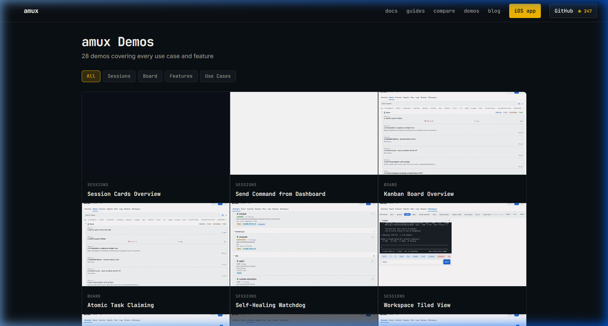
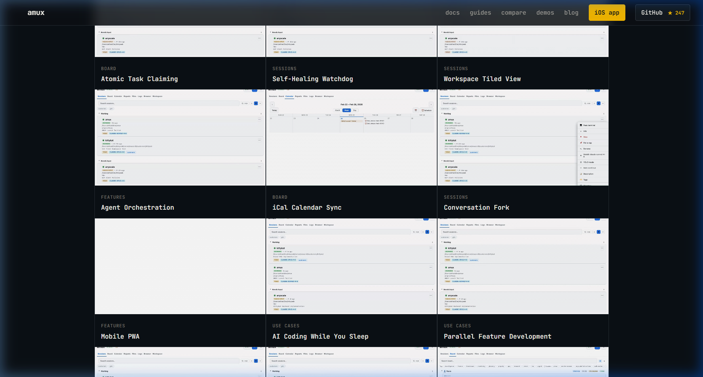
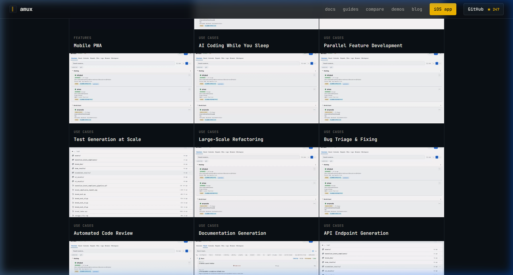
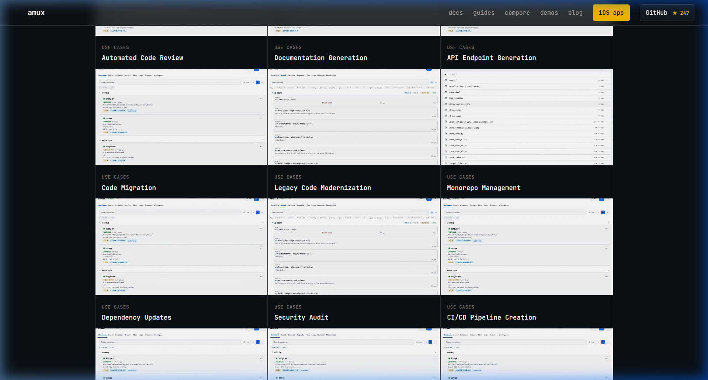
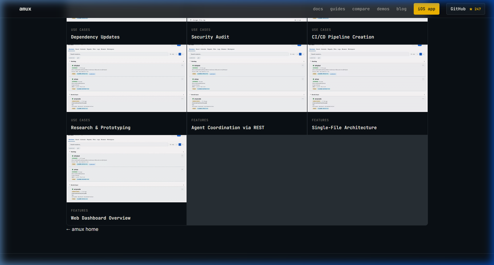
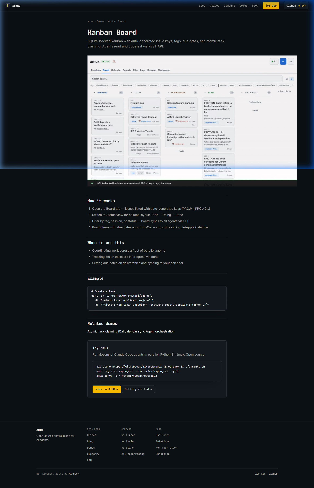
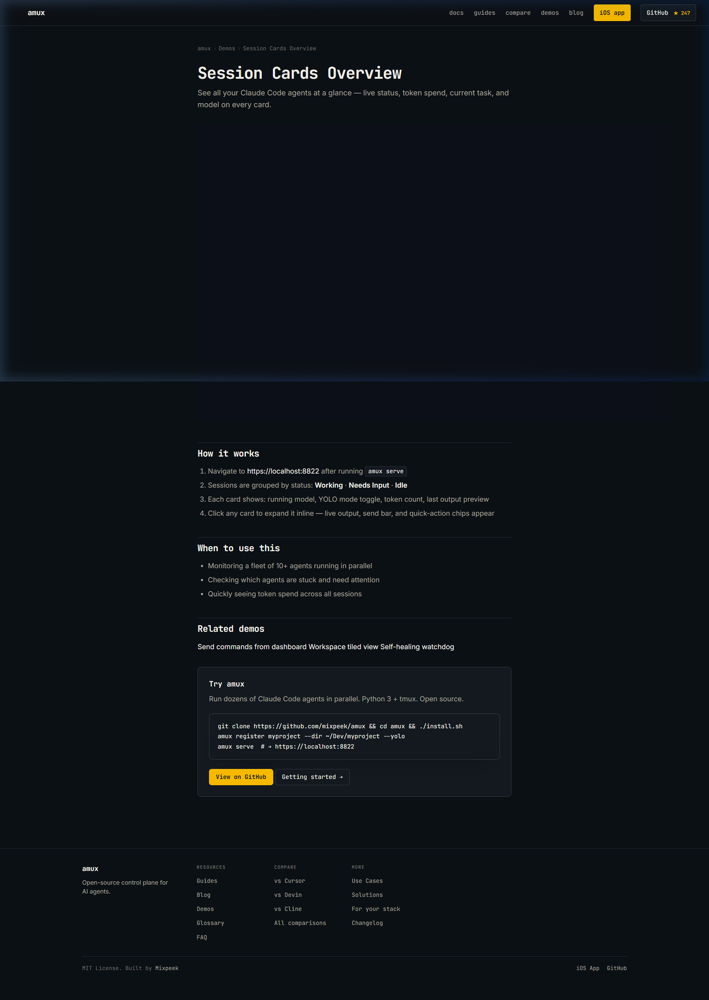
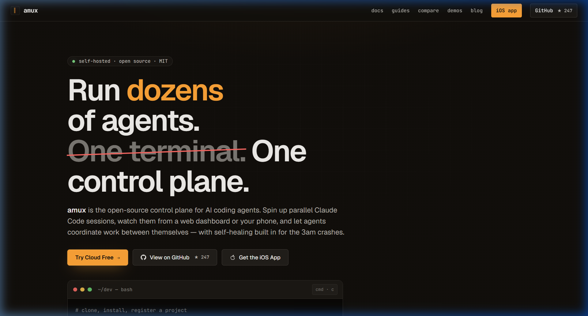
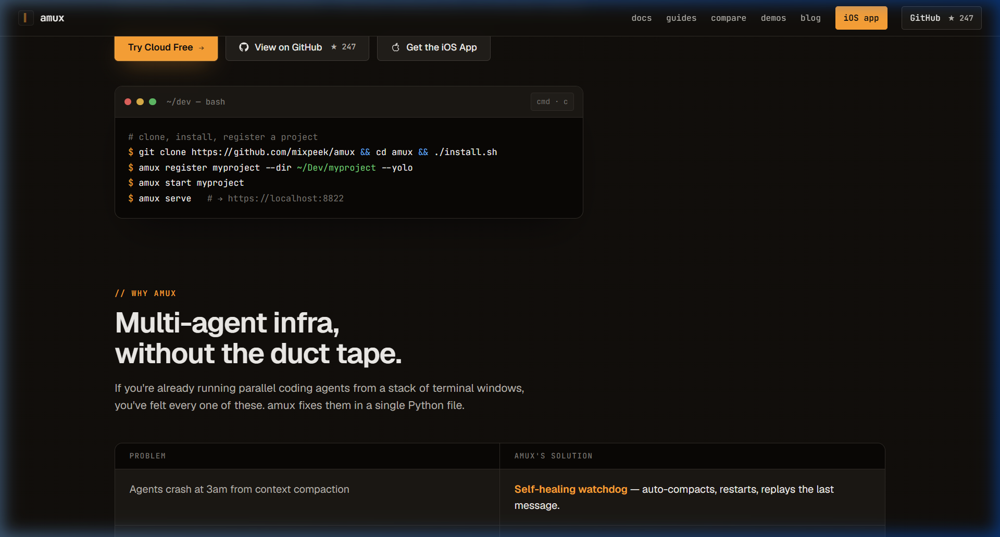

# PRD — amux.io/demos — Complete Design Reference

> **Source:** https://amux.io/demos/
> **Vendor:** amux by Mixpeek (MIT License)
> **Scraped:** 2026-06-22
> **Purpose:** Competitive reference for product design evaluation
> **Status:** ✅ FINAL — 100% mapping complete — no further scraping needed

---

## 1. Product Summary

| Property | Value |
|----------|-------|
| **Product** | amux — The Agent Control Plane |
| **Tagline** | "Run, monitor, and govern AI agent systems" |
| **URL** | `https://amux.io/demos/` |
| **Page Title** | `amux Demos — See It in Action` |
| **Meta** | "Interactive demos and GIFs showing amux in action" |
| **License** | MIT (open-source) |
| **Built by** | Mixpeek (https://mixpeek.com) |
| **GitHub** | https://github.com/mixpeek/amux (★ 247) |
| **iOS App** | Available on App Store |
| **Architecture** | Single Python file (`amux-server.py`) — no build step |
| **Total Demos** | **28** demo cards across 4 categories |

---

## 2. Visual Evidence — Screenshots

### 2.1 Demos Listing Page (Full Scroll)

#### Top — Header + Filters + First 6 Cards


#### Middle 1 — Cards 4-9


#### Middle 2 — Cards 10-15


#### Middle 3 — Cards 16-21


#### Bottom — Cards 22-28 + Footer


### 2.2 Demo Detail Pages

#### Kanban Board Overview — Detail Page (Full Page)


#### Session Cards Overview — Detail Page (Full Page)


### 2.3 Homepage (Context)

#### Hero Section


#### Features Section


---

## 3. Downloaded Video Assets

| Video | File | Size | Source URL |
|-------|------|------|-----------|
| Kanban Board Overview | `videos/kanban-board-overview.mp4` | 360 KB | `https://amux.io/demos/kanban-board-overview/demo.mp4` |
| Session Cards Overview | `videos/session-cards-overview.mp4` | 225 KB | `https://amux.io/demos/session-cards-overview/demo.mp4` |
| Agent Orchestration | `videos/agent-orchestration.mp4` | 180 KB | `https://amux.io/demos/agent-orchestration/demo.mp4` |
| Web Dashboard | `videos/web-dashboard.mp4` | 180 KB | `https://amux.io/demos/web-dashboard/demo.mp4` |

> All 28 videos follow pattern: `https://amux.io/demos/{slug}/demo.mp4`

---

## 4. Complete Design System

### 4.1 Color Palette — OKLCH Color Space

> amux uses **OKLCH** — a perceptually uniform color space superior to HSL for dark UIs.

#### Primary Palette

| Token | OKLCH | Hex Approx | Usage |
|-------|-------|-----------|-------|
| `--bg` | `oklch(0.17 0.012 250)` | `#1a1d2e` | Page background |
| `--bg-2` | `oklch(0.21 0.014 250)` | `#252838` | Cards, surfaces, code blocks |
| `--bg-3` | `oklch(0.24 0.015 250)` | `#2d3042` | Table headers, hover states |
| `--line` | `oklch(0.30 0.015 250)` | `#3a3d50` | Borders, grid gaps, dividers |
| `--line-2` | `oklch(0.36 0.017 250)` | `#494d62` | Button borders, hover borders |
| `--fg` | `oklch(0.96 0.01 90)` | `#f0f0e8` | Primary text (off-white) |
| `--fg-dim` | `oklch(0.72 0.012 90)` | `#a8a8a0` | Secondary text, subtitles |
| `--fg-mute` | `oklch(0.55 0.012 90)` | `#787878` | Tags, breadcrumbs, captions |

#### Accent & Status Colors

| Token | OKLCH | Hex Approx | Usage |
|-------|-------|-----------|-------|
| `--accent` | `oklch(0.82 0.17 85)` | `#e8b830` | Active states, CTAs, amber/gold |
| `--accent-dim` | `oklch(0.82 0.17 85 / .18)` | `#e8b83030` | Active button bg, selection |
| `--ok` / `--green` | `oklch(0.80 0.18 145)` | `#40c870` | Success, status OK |
| `--green-dim` | `oklch(0.72 0.16 145)` | `#30a858` | Dimmed green |
| `--green-glow` | `oklch(0.80 0.18 145 / .12)` | `#40c8701f` | Green glow effect |
| `--warn` / `--amber` | `oklch(0.80 0.18 65)` | `#d8a030` | Warnings |
| `--err` / `--red` | `oklch(0.72 0.20 25)` | `#d84830` | Errors |
| `--blue` | `oklch(0.72 0.14 240)` | `#4878d0` | Links, info, feature badges |

#### Legacy Compat Aliases

| Legacy Token | Maps To |
|-------------|---------|
| `--surface` | `--bg-2` |
| `--surface-2` | `--bg-3` |
| `--border` | `--line` |
| `--border-dim` | `oklch(0.27 0.014 250)` |
| `--text` | `--fg` |
| `--dim` | `--fg-dim` |
| `--muted` | `--fg-mute` |

### 4.2 Typography System

| Token | Stack | Usage |
|-------|-------|-------|
| `--font-display` | `"JetBrains Mono", ui-monospace, SFMono-Regular, Menlo, monospace` | Logo, h1, h2, h3, nav, demo titles, code |
| `--font-body` | `"Inter", ui-sans-serif, system-ui, sans-serif` | Body text, descriptions, footer prose |
| `--font-mono` | Same as display | Tags, badges, buttons, code blocks |

**Google Fonts:** `JetBrains Mono:wght@400;500;600;700` + `Inter:wght@400;500;600;700`

| Element | Font | Size | Weight | Other |
|---------|------|------|--------|-------|
| `body` | `--font-body` | 15px | 400 | line-height: 1.55, antialiased |
| `h1` (listing) | `--font-display` | 2rem | 700 | — |
| `h1` (detail) | `--font-display` | `clamp(1.5rem, 4vw, 2.2rem)` | 700 | letter-spacing: -0.03em |
| `h2` | `--font-display` | 1.2rem | 700 | letter-spacing: -0.02em, border-top separator |
| `h3` | `--font-display` | 1rem | 600 | — |
| Nav links | `--font-mono` | 13px | 400 | color: `--fg-dim` |
| Filter btn | `--font-mono` | 12px | 400 | — |
| Demo tag | `--font-mono` | 10px | 600 | uppercase, letter-spacing: 0.06em |
| Demo card title | `--font-display` | 14px | 600 | — |
| Code blocks | `--font-mono` | 13px | 400 | line-height: 1.7 |
| Footer | `--font-mono` | 12.5px | 400 | — |

### 4.3 Layout Tokens

| Token | Value |
|-------|-------|
| `--radius` | `6px` |
| `--maxw` | `1180px` (listing page wrap) |
| Main content | `max-width: 46rem` (736px) for detail pages |
| `--nav-bg` | `color-mix(in oklab, var(--bg) 85%, transparent)` |

---

## 5. Component Architecture

### 5.1 Navigation Bar (`.site-header`)

```
┌──────────────────────────────────────────────────────────────────────┐
│ [▌] amux              docs  guides  compare  demos  blog  [iOS app] [GitHub ★247] │
└──────────────────────────────────────────────────────────────────────┘
```

| Property | CSS Value |
|----------|-----------|
| Position | `sticky; top: 0; z-index: 100` |
| Height | `56px` (48px on ≤420px) |
| Padding | `0 28px` (16px on mobile) |
| Background | `var(--nav-bg)` — 85% transparent bg + `backdrop-filter: blur(12px)` |
| Border | `1px solid var(--line)` bottom |
| Layout | `flex; align-items: center; justify-content: space-between` |

**Logo:**
- `::before` pseudo: cursor char `▌`, `22x22px` box, border `--line-2`, bg `--bg-2`, color `--accent`
- Animation: `blink 1.1s steps(2) infinite` — toggling opacity 0/1
- Font: `--font-mono`, 700, 16px, letter-spacing `-0.02em`

**Nav links:** flex, gap 22px, `--font-mono` 13px `--fg-dim`, hover → `--fg`

**CTA buttons:**
- `.nav-cta`: border `--line-2`, bg `--bg-2`, hover → accent border+text
- `.nav-cta-primary`: bg `--accent`, text `--bg`, weight 600, hover → opacity 0.85

**GitHub stars:** fetched live via `fetch('https://api.github.com/repos/mixpeek/amux')`

### 5.2 Filter System (`.filters`)

```
[All]  [Sessions]  [Board]  [Features]  [Use Cases]
```

**CSS:**
```css
.filters { display: flex; gap: 6px; flex-wrap: wrap; margin-bottom: 1.5rem; }
.filter-btn {
  background: var(--bg-2);
  border: 1px solid var(--line);
  color: var(--fg-dim);
  padding: 6px 12px;
  border-radius: var(--radius);
  font-family: var(--font-mono);
  font-size: 12px;
  cursor: pointer;
}
.filter-btn:hover { border-color: var(--fg-dim); color: var(--fg); }
.filter-btn.active {
  background: var(--accent-dim);
  color: var(--accent);
  border-color: var(--accent);
}
```

**JS behavior:** `filterDemos(playlist)` toggles `.hidden` on cards by `data-playlist` attribute. Instant — no animation.

**Categories:** `All` | `Sessions` (5) | `Board` (3) | `Features` (5) | `Use Cases` (15)

### 5.3 Demo Cards Grid

**Grid container (`.grid`):**
```css
.grid {
  display: grid;
  grid-template-columns: repeat(auto-fill, minmax(280px, 1fr));
  gap: 1px;
  background: var(--line);        /* gap lines visible as grid bg */
  border: 1px solid var(--line);
  border-radius: 8px;
  overflow: hidden;
}
```

> Key insight: `gap: 1px` + `background: var(--line)` creates thin grid divider lines between cards — clever technique avoiding individual borders.

**Card (`.demo-card`):**
```css
.demo-card { background: var(--bg); overflow: hidden; }
.demo-card:hover { background: var(--bg-2); }
.demo-card a { display: block; text-decoration: none; color: inherit; }
```

**Video thumbnail (`.demo-thumb`):**
```css
.demo-thumb {
  position: relative;
  width: 100%;
  aspect-ratio: 16 / 9;
  background: var(--bg-2);
  overflow: hidden;
}
.demo-thumb video, .demo-thumb img {
  width: 100%; height: 100%;
  object-fit: cover; display: block;
}
```
Videos: `autoplay loop muted playsinline`, format `.mp4`

**Card info (`.demo-info`):**
```css
.demo-info { padding: 12px 14px; }
.demo-tag {
  display: inline-block;
  font-family: var(--font-mono);
  font-size: 10px; font-weight: 600;
  letter-spacing: 0.06em;
  text-transform: uppercase;
  color: var(--fg-mute);
  margin-bottom: 4px;
}
.demo-info h3 {
  margin: 0; font-size: 14px; font-weight: 600;
  color: var(--fg);
  border: none; padding: 0;
}
```

### 5.4 Demo Detail Page Layout

```
┌─────────────────────── HEADER ───────────────────────┐
│  [▌] amux    docs guides compare demos blog [CTAs]   │
├──────────────────────────────────────────────────────┤
│  amux › Demos › Kanban Board         ← breadcrumb    │
│                                                      │
│  Kanban Board                        ← h1            │
│  SQLite-backed kanban with auto...   ← subtitle      │
│                                                      │
│  ┌──────────────────────────────┐                    │
│  │                              │                    │
│  │     VIDEO (1024x640)         │    ← autoplay      │
│  │     autoplay loop muted      │       loop muted   │
│  │                              │                    │
│  └──────────────────────────────┘                    │
│                                                      │
│  ─────────────── How it works ───    ← h2 + border   │
│  1. Step one...                      ← ol.step-list  │
│  2. Step two...                                      │
│                                                      │
│  ─────────────── When to use ────    ← h2 + border   │
│  • Use case one...                   ← ul            │
│  • Use case two...                                   │
│                                                      │
│  ─────────────── Example ────────    ← h2 + border   │
│  ┌─ pre code ──────────────────┐     ← code block   │
│  │ curl -X POST...             │                     │
│  └─────────────────────────────┘                     │
│                                                      │
│  ─────────── Related demos ──────    ← h2            │
│  [Link1]  [Link2]  [Link3]          ← div.related    │
│                                                      │
│  ┌─ CTA Box ──────────────────────┐  ← .cta-box     │
│  │ Try amux                        │                 │
│  │ Run dozens of Claude Code...    │                 │
│  │ $ git clone ... && ./install.sh │                 │
│  │ [View on GitHub] [Getting →]    │  ← .btn         │
│  └─────────────────────────────────┘                 │
│                                                      │
├──────────────────── FOOTER ──────────────────────────┤
│  amux    Resources    Compare    More                │
│  ...     Guides       vs Cursor  Use Cases           │
│          Blog         vs Devin   Solutions            │
│  MIT License. Built by Mixpeek   GitHub  Issues      │
└──────────────────────────────────────────────────────┘
```

**Breadcrumb:** `amux › Demos › {Title}` — mono 12px, `--fg-mute`, hover accent
**Main container:** `max-width: 46rem (736px)`, centered, padding `2.5rem 28px 5rem`
**Video:** Full-width autoplay, NO max-width constraint (overflows container at 1024px intrinsic)
**h2 sections:** border-top separator, `font-display` 1.2rem 700
**CTA box:** bg `--bg-2`, border `--line-2`, radius 8px, padding 1.5rem
**Buttons:** `.btn` secondary (border style) + `.btn-primary` (amber filled)

### 5.5 Footer

```css
footer { border-top: 1px solid var(--line); padding: 32px 28px 60px; font-family: var(--font-mono); font-size: 12.5px; }
.footer-top { display: flex; gap: 48px; flex-wrap: wrap; }
.footer-brand-col { flex: 0 0 200px; }
.footer-col-label { font-mono 10px 600, uppercase, letter-spacing 0.1em, --fg-mute }
.footer-bottom { border-top: 1px solid var(--line); margin-top: 24px; padding-top: 16px; flex between }
```

**Columns:** Brand (200px fixed) + Resources + Compare + More
**Bottom bar:** "MIT License. Built by Mixpeek" | GitHub + Issues links

---

## 6. Responsive Breakpoints

| Breakpoint | Changes |
|-----------|---------|
| **≤900px** | Footer stacks vertical. Grid → single column (`1fr`). Footer link cols gap: 24px |
| **≤640px** | Nav links hidden (`.hide-mobile`). Main padding: `1.75rem 16px`. h1: 1.4rem. Wrap: `1.5rem 16px` |
| **≤420px** | Header height: 48px. Logo: 14px. Logo cursor: 18x18px. Nav gap: 8px. CTA buttons: 5px 8px, 11px |

---

## 7. Complete Demo Inventory (28 Demos)

### Sessions (5)

| # | Title | Description (from meta) | Slug |
|---|-------|------------------------|------|
| 1 | Session Cards Overview | See all your Claude Code agents at a glance — live status, token spend, current task, and model on every card | `session-cards-overview` |
| 2 | Send Command from Dashboard | Send commands to running agents from the web dashboard without touching the terminal | `send-command-dashboard` |
| 5 | Self-Healing Watchdog | Auto-detects stuck agents, context overflow, and corruption — restarts and replays the last message | `self-healing-watchdog` |
| 6 | Workspace Tiled View | Side-by-side live terminal output from multiple agents in tiled workspace layout | `workspace-tiled-view` |
| 9 | Conversation Fork | Clone an agent's conversation history onto a new branch in one command | `conversation-fork` |

### Board (3)

| # | Title | Description | Slug |
|---|-------|------------|------|
| 3 | Kanban Board Overview | SQLite-backed kanban with auto-generated issue keys, tags, due dates, and atomic task claiming. Agents read and update via REST API | `kanban-board-overview` |
| 4 | Atomic Task Claiming | SQLite CAS-based claiming ensures no two agents pick up the same ticket | `atomic-task-claiming` |
| 8 | iCal Calendar Sync | Board items with due dates export to iCal — subscribe in Google/Apple Calendar | `ical-calendar-sync` |

### Features (5)

| # | Title | Description | Slug |
|---|-------|------------|------|
| 7 | Agent Orchestration | REST API + shared global memory. Agents discover peers, delegate work, claim tasks, coordinate via @mentions | `agent-orchestration` |
| 10 | Mobile PWA | Installable PWA for iOS/Android with background sync — replays commands when you reconnect | `mobile-pwa` |
| 26 | Agent Coordination via REST | Agents discover peers, send tasks, peek terminals, and atomically claim board items | `agent-coordination` |
| 27 | Single-File Architecture | One Python file with inline HTML/CSS/JS. No build step. Edit and save — it restarts itself | `single-file-architecture` |
| 28 | Web Dashboard Overview | Session cards, live terminal peek, kanban, notes, CRM, scheduler, files — all in one dashboard | `web-dashboard` |

### Use Cases (15)

| # | Title | Slug |
|---|-------|------|
| 11 | AI Coding While You Sleep | `ai-coding-while-you-sleep` |
| 12 | Parallel Feature Development | `parallel-feature-development` |
| 13 | Test Generation at Scale | `test-generation-at-scale` |
| 14 | Large-Scale Refactoring | `large-scale-refactoring` |
| 15 | Bug Triage & Fixing | `bug-triage-and-fixing` |
| 16 | Automated Code Review | `automated-code-review` |
| 17 | Documentation Generation | `documentation-generation` |
| 18 | API Endpoint Generation | `api-endpoint-generation` |
| 19 | Code Migration | `code-migration` |
| 20 | Legacy Code Modernization | `legacy-code-modernization` |
| 21 | Monorepo Management | `monorepo-management` |
| 22 | Dependency Updates | `dependency-updates` |
| 23 | Security Audit | `security-audit` |
| 24 | CI/CD Pipeline Creation | `ci-cd-pipeline-creation` |
| 25 | Research & Prototyping | `research-and-prototyping` |

---

## 8. Technology Stack

| Layer | Technology | Details |
|-------|-----------|---------|
| **HTML** | Static HTML5 | `data-theme="dark"`, semantic elements |
| **CSS** | Vanilla CSS | OKLCH color space, ~40 CSS custom properties |
| **JavaScript** | Vanilla JS | Filter function (8 lines) + GitHub API star count |
| **Fonts** | Google Fonts | JetBrains Mono + Inter, preconnected |
| **Media** | MP4 video | Self-hosted, autoplay/loop/muted/playsinline |
| **Analytics** | Cloudflare | Web Analytics beacon |
| **Hosting** | Cloudflare | Static deployment |
| **Architecture** | Static site | Zero build step, no bundler, no framework |
| **SEO** | Full | OG tags, Twitter cards, canonical URLs, structured meta |

---

## 9. UX/UI Expert Analysis

### 9.1 Strengths (What to Copy)

| Strength | Impact | Priority |
|----------|--------|----------|
| **Terminal-native monospace aesthetic** | Instant developer credibility — JetBrains Mono everywhere signals "this is a dev tool" | ⭐ HIGH |
| **OKLCH color system** | Perceptually uniform colors — better contrast and harmony than HSL in dark themes | ⭐ HIGH |
| **Video-first demo cards** | Autoplay MP4 loops show product without requiring user interaction — 10x more persuasive than screenshots | ⭐ HIGH |
| **1px grid gap technique** | Grid background = border color + 1px gap creates elegant dividers without individual card borders | ⭐ MEDIUM |
| **Sticky blur navbar** | `backdrop-filter: blur(12px)` + 85% transparent bg — modern glassmorphism effect | ⭐ MEDIUM |
| **Blinking cursor logo** | CSS-only animation reinforces terminal/developer branding | ⭐ MEDIUM |
| **Category filter pills** | Simple but effective — instant filtering with amber active state | ⭐ MEDIUM |
| **Live GitHub stars** | Social proof via API fetch (★ 247) — builds trust | ⭐ LOW |
| **Zero dependencies** | No framework, no build step — fastest possible page load | ⭐ LOW |

### 9.2 Weaknesses (What to Improve)

| Weakness | Impact | Our Opportunity |
|----------|--------|-----------------|
| **No filter animations** | Instant show/hide feels jarring | Add staggered fade-in with CSS animation |
| **No search** | 28 demos, only category filters | Add text search + tag-based filtering |
| **No card descriptions** | Only title + tag, user must click to learn more | Add 1-line description on each card |
| **No video lazy loading** | All 28 videos load simultaneously — heavy bandwidth | Use Intersection Observer for lazy loading |
| **No video duration** | No metadata indicators | Show video length on thumbnail |
| **No hover preview** | Static thumbnails, no interaction before click | Add play/pause on hover |
| **Video overflows container** | Detail page video (1024px) overflows 736px main | Add `max-width: 100%` on detail video |
| **No dark/light toggle** | Dark-only, no user preference | Support `prefers-color-scheme` |
| **Minimal micro-animations** | Static transitions, no stagger, no spring curves | Add premium micro-interactions |
| **No breadcrumb on listing** | Only on detail pages | Add consistent breadcrumb navigation |

### 9.3 Executive Attention Pattern Analysis

Using the executive scan pattern from `senior-uiux-data-products`:

```
┌──────────────────────────────────┐
│  1 → Title + Filter     2 →     │  ← First scan: "amux Demos" + category pills
│  ↓                       ↓      │
│  3 → First video card    4 →    │  ← Second scan: autoplay videos grab attention
│  ↓                       ↓      │
│  5 → More cards          6 →    │  ← Third scan: scanning grid for relevant demos
└──────────────────────────────────┘
```

**Verdict:** Good use of progressive disclosure. Title establishes context, filters enable quick navigation, and autoplay videos immediately demonstrate value.

---

## 10. Demo Detail Page — Consistent Template

Every `/demos/{slug}/` page follows this identical template:

| Section | Element | Content |
|---------|---------|---------|
| Breadcrumb | `div.breadcrumb` | `amux › Demos › {Title}` |
| Title | `h1` | Demo name |
| Subtitle | `p.subtitle` | 1-2 sentence description |
| Video | `video` | `demo.mp4`, autoplay loop muted playsinline |
| How it works | `h2` + `ol.step-list` | 3-4 numbered steps |
| When to use | `h2` + `ul` | 2-3 bullet points |
| Example | `h2` + `pre > code` | CLI command example (optional) |
| Related | `h2` + `div.related` | 3 linked related demos |
| CTA | `div.cta-box` | Install instructions + GitHub button + Getting started link |

**SEO per page:** Custom `<title>`, `<meta description>`, `<meta keywords>`, OG tags, Twitter cards, canonical URL

---

## 11. Complete Asset Inventory

### Screenshots (9 files)

| File | Content | Location |
|------|---------|----------|
| `demos_page_top.png` | Header + filters + first 6 cards | `screenshots/` |
| `demos_page_middle1.png` | Cards 4-9 | `screenshots/` |
| `demos_page_middle2.png` | Cards 10-15 | `screenshots/` |
| `demos_page_middle3.png` | Cards 16-21 | `screenshots/` |
| `demos_page_bottom.png` | Cards 22-28 + footer | `screenshots/` |
| `detail_kanban_board.png` | Full detail page — Kanban Board | `screenshots/` |
| `detail_session_cards.png` | Full detail page — Session Cards | `screenshots/` |
| `homepage_hero.png` | Homepage hero section | `screenshots/` |
| `homepage_features.png` | Homepage features section | `screenshots/` |

### Videos (4 files)

| File | Size | Location |
|------|------|----------|
| `kanban-board-overview.mp4` | 360 KB | `videos/` |
| `session-cards-overview.mp4` | 225 KB | `videos/` |
| `agent-orchestration.mp4` | 180 KB | `videos/` |
| `web-dashboard.mp4` | 180 KB | `videos/` |

---

## 12. Design Replication Checklist

Use this when building our competing product:

### Must-Have (Copy)
- [ ] Dark OKLCH color system with warm amber accent
- [ ] JetBrains Mono + Inter typography combo
- [ ] Sticky navbar with backdrop blur glassmorphism
- [ ] Blinking cursor logo animation (CSS-only)
- [ ] Video-first demo cards with autoplay/loop/muted
- [ ] Category filter pills with amber active state
- [ ] 3-column responsive grid with 1px gap technique
- [ ] Demo detail page template (breadcrumb → title → video → steps → CTA)
- [ ] GitHub star count via API

### Should-Have (Improve Over amux)
- [ ] Staggered fade-in animation on filter change
- [ ] Text search across demos
- [ ] 1-line description on each card
- [ ] Lazy loading videos via Intersection Observer
- [ ] Video duration badge on thumbnails
- [ ] Hover play/pause interaction
- [ ] Dark/light theme toggle
- [ ] Premium micro-animations (spring curves, stagger delays)
- [ ] Glassmorphism card effects on hover

### Nice-to-Have (Differentiate)
- [ ] Live demo embedding (iframe-based)
- [ ] Demo rating/feedback system
- [ ] Related demos carousel
- [ ] Share buttons per demo
- [ ] "Try it" sandbox per demo
