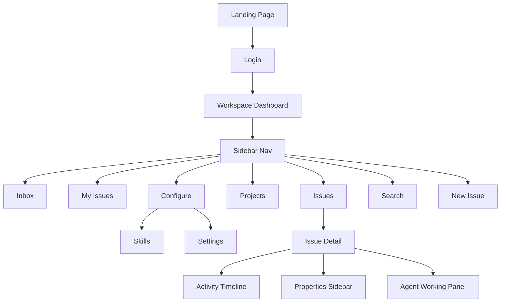

# PRD — Agent 3: UX/Design (Inbox, My Issues, Landing, Design System)

Este documento apresenta a análise de interface, comportamento de interação, fluxo de navegação e extração detalhada do Design System da plataforma **Multica** (https://multica.ai).

---

## 1. Inbox

O Inbox é o hub central de notificações e coordenação de tarefas humanas e de agentes da plataforma.

### 1.1 Inbox Layout
* **Visualização Desktop**: Dividido em duas colunas através de um layout redimensionável de painéis (`ResizablePanelGroup` horizontal).
  * **Painel Esquerdo (Lista de Notificações)**: Ocupa por padrão `320px` (mínimo `240px`, máximo `480px`). Contém o cabeçalho com ações globais e a lista de itens cronológicos de notificação.
  * **Painel Direito (Painel de Detalhes)**: Ocupa a área restante (mínimo `40%`). Exibe o formulário de detalhes completos ou a timeline do issue selecionado.
* **Visualização Mobile**: Layout adaptativo que exibe a lista de notificações em tela cheia. Ao selecionar uma notificação, o painel de detalhes é renderizado sobrepondo a lista por completo, com um botão superior de navegação ("Back").

### 1.2 Notification Types
Cada item de notificação no Inbox exibe o tipo de ação correspondente. Os tipos suportados incluem:
1. **issue_assigned**: Atribuição direta de tarefa ("Assigned").
2. **issue_subscribed**: Mudanças em tarefas observadas ("Subscribed").
3. **unassigned**: Notificação de tarefa que perdeu a atribuição de responsável.
4. **assignee_changed**: Alteração de responsável da tarefa.
5. **status_changed**: Mudança de estágio no fluxo de trabalho (ex: Backlog -> In Progress).
6. **priority_changed**: Alteração do nível de prioridade (ex: Low -> Urgent).
7. **start_date_changed** / **due_date_changed**: Mudanças nas datas estimadas de início ou entrega da tarefa.
8. **new_comment** / **mentioned**: Novo comentário ou menção direta (`@username` ou `@agentname`).
9. **review_requested**: Solicitação de revisão de código enviada a um humano ou agente.
10. **task_completed** / **task_failed**: Notificações automáticas sobre o sucesso ou falha na execução de tarefas por agentes de código.
11. **agent_blocked** / **agent_completed**: Agente reporta que está impedido de prosseguir (exige intervenção humana) ou concluiu o ciclo de trabalho.
12. **reaction_added**: Reação com emoji (ex: 👍, 🔥) em um comentário do usuário.
13. **quick_create_done** / **quick_create_failed**: Status da criação rápida de issues por agentes em segundo plano.

### 1.3 Read/Unread States
* **Itens Não Lidos**: Exibem uma bolinha circular azul (`var(--brand)`) de `6px` (`h-1.5 w-1.5 rounded-full`) alinhada à esquerda do título. O assunto é renderizado em negrito médio (`font-medium`). O texto de metadados exibe opacidade normal.
* **Itens Lidos**: A bolinha circular azul é removida. O assunto é renderizado com fonte de peso normal (`font-normal`) e cor esmaecida (`text-muted-foreground`). A linha de metadados exibe opacidade reduzida em 40% (`text-muted-foreground/60`).
* **Auto-Mark-Read**: O sistema marca a notificação selecionada como lida automaticamente assim que o usuário a seleciona no painel de detalhes.

### 1.4 Actions & Keyboard Shortcuts
* **Ações Individuais**:
  * Hover no item da lista revela um botão rápido de **Archive** (ícone de arquivo Lucide) para arquivar sem selecionar.
  * Botão de marcar como concluído ("Mark as done") no item individual.
* **Ações em Bloco (Dropdown do Cabeçalho)**:
  * *Mark all as read* (Marcar todas como lidas).
  * *Archive all* (Arquivar todas).
  * *Archive all read* (Arquivar apenas as já lidas).
  * *Archive completed* (Arquivar as notificações de tarefas concluídas).
* **Keyboard Shortcut**: A tecla de atalho `Alt + T` é mapeada no leitor de acessibilidade (`aria-label`) para navegação rápida de foco para as notificações.

---

## 2. My Issues

A seção My Issues é uma visualização filtrada das tarefas do workspace focada no usuário conectado.

### 2.1 View Modes
O usuário pode alternar entre três modos de exibição por meio dos botões de controle do cabeçalho:
1. **Board view (Quadro Kanban)**: Exibe colunas verticais agrupadas. Permite arrastar e soltar tarefas.
2. **List view (Lista Simples)**: Lista vertical compacta de tarefas. Habilita a barra de ações em lote (`BatchActionToolbar`) na parte inferior para modificação múltipla.
3. **Swimlane view (Raias)**: Visualização em raias horizontais.

### 2.2 Filters
* **Abas de Escopo (Scope Tabs)**:
  * **All**: Exibe todas as tarefas relacionadas (atribuídas, criadas ou que envolvam agentes/squads do usuário).
  * **Assigned**: Exibe apenas tarefas atribuídas diretamente ao usuário logado.
  * **Created**: Exibe apenas tarefas que o usuário logado criou.
  * **My Agents and Squads**: Exibe tarefas atribuídas aos agentes de IA de propriedade do usuário ou equipes em que ele participa.
* **Filtros Adicionais**:
  * Filtro por Status.
  * Filtro por Prioridade.
  * Filtro rápido "Agents working" (exibe apenas as tarefas em que há agentes executando tarefas ativamente no momento).
* **Display Settings**:
  * **Grouping**: Agrupamento por **Status** ou por **Assignee** (responsável). No agrupamento por responsável no modo Board, cada coluna/linha representa um agente ou membro do time.
  * **Ordering**: Ordenação manual, ascendente ou descendente.

---

## 3. Landing Page & Auth

### 3.1 Hero Section
* **Chamada Central**: `"Your next 10 hires won’t be human."`
* **Subtexto**: Foco no monorrepositório de agentes e na colaboração humanos + IAs em um painel único.
* **Ações Principais (CTAs)**:
  * `"Start free trial"` (Direciona para `/login`).
  * `"Download Desktop"` (Link para `/download`).
  * `"Talk to sales"` (Link para `/contact-sales`).
* **Sistemas Integrados**: Exibe badges com logos das ferramentas `Claude Code`, `Codex`, `Gemini CLI`, `OpenClaw`, `OpenCode`.

### 3.2 Features Section (4 blocks com Sticky Navigation)
A página possui uma navegação sticky à esquerda com quatro blocos principais de recursos com transições interativas de background:
1. **TEAMMATES**: "Assign to an agent like you'd assign to a colleague". Mostra humanos e robôs na mesma lista de atribuídos e timeline integrada de atividade.
2. **AUTONOMOUS**: "Set it and forget it — agents work while you sleep". Foco no ciclo de vida de execução de tarefas assíncronas em lote com atualização ao vivo via WebSocket.
3. **SKILLS**: "Every solution becomes a reusable skill for the whole team". Conceito de biblioteca de habilidades compartilhadas reutilizáveis.
4. **RUNTIMES**: "One dashboard for all your compute". Painel de monitoramento de daemons locais e em nuvem com detecção de 12 IDEs/ferramentas.

### 3.3 Navigation & Footer
* **Header**: Logo tipográfico `multica` em conjunto com um ícone customizado em CSS clip-path de moinho de vento/estrela de 8 pontas. Links para docs, changelog, GitHub e botão "Get started".
* **Footer**: Links institucionais divididos em colunas (Product, Resources, Company) e tagline com direitos autorais.

### 3.4 Login Flow
* **URL**: `https://multica.ai/login`
* **Formulário**: Campo de e-mail com placeholder `you@example.com` e botão "Continue" (OTP via e-mail).
* **Opções de Terceiros**: Botão "Continue with Google".
* **Link Utilitário**: Link inferior para download do aplicativo desktop.

---

## 4. Design System — Complete

O Design System do Multica é baseado em OKLCH colors, tipografia robusta e espaçamento em escala rem.

### 4.1 Color Tokens (Light vs Dark Mode)

As cores semânticas são definidas através de variáveis OKLCH no `:root`:

| Token | Light Mode Value | Dark Mode Value |
| :--- | :--- | :--- |
| `--background` | `oklch(100% 0 0)` (Pure White) | `oklch(18% .005 285.823)` (Dark Slate) |
| `--foreground` | `oklch(14.1% .005 285.823)` | `oklch(98.5% 0 0)` |
| `--card` | `oklch(100% 0 0)` | `oklch(21% .006 285.885)` |
| `--card-foreground`| `oklch(14.1% .005 285.823)` | `oklch(98.5% 0 0)` |
| `--muted` | `oklch(96.7% .001 286.375)` | `oklch(27.4% .006 286.033)` |
| `--muted-foreground`| `oklch(55.2% .016 285.938)`| `oklch(70.5% .015 286.067)` |
| `--border` | `oklch(92% .004 286.32)` | `oklch(100% 0 0/.1)` |
| `--input` | `oklch(92% .004 286.32)` | `oklch(100% 0 0/.15)` |
| `--primary` | `oklch(21% .006 285.885)` | `oklch(92% .004 286.32)` |
| `--primary-foreground`| `oklch(98.5% 0 0)` | `oklch(21% .006 285.885)` |
| `--brand` | `oklch(55% .16 255)` (Electric Blue) | `oklch(65% .16 255)` |
| `--success` | `oklch(55% .16 145)` (Green) | `oklch(65% .15 145)` |
| `--warning` | `oklch(75% .16 85)` (Amber) | `oklch(70% .16 85)` |
| `--destructive` | `oklch(57.7% .245 27.325)` (Red) | `oklch(70.4% .191 22.216)` |

### 4.2 Typography Scale
O Multica utiliza três famílias de fontes:
* **Sans-serif (Padrão/UI)**: `Inter`, com fallbacks do sistema (BlinkMacSystemFont, Segoe UI, sans-serif).
* **Serif (Editorial/Landing)**: `Source Serif 4`, com fallbacks (Times New Roman, serif).
* **Monospace (Código/Runtimes)**: `Geist Mono`, com fallbacks (ui-monospace, SFMono-Regular, monospace).

#### Escala de Tamanhos
* `xs`: `.75rem` (12px) · Line-height: `calc(1 / .75)`
* `sm`: `.875rem` (14px) · Line-height: `calc(1.25 / .875)`
* `base`: `1rem` (16px) · Line-height: `calc(1.5 / 1)`
* `lg`: `1.125rem` (18px) · Line-height: `calc(1.75 / 1.125)`
* `xl`: `1.25rem` (20px) · Line-height: `calc(1.75 / 1.25)`
* `2xl`: `1.5rem` (24px) · Line-height: `calc(2 / 1.5)`
* `3xl`: `1.875rem` (30px) · Line-height: `calc(2.25 / 1.875)`
* `4xl`: `2.25rem` (36px) · Line-height: `calc(2.5 / 2.25)`
* `5xl`: `3rem` (48px) · Line-height: `1`
* `6xl`: `3.75rem` (60px) · Line-height: `1`

#### Pesos de Fonte (Weights)
* `normal`: `400`
* `medium`: `500`
* `semibold`: `600`
* `bold`: `700`

### 4.3 Component Catalog
*(O catálogo detalhado e as especificações de estilo estão no documento complementar: [components-catalog.md](file:///C:/VMs/Projetos/Automonous_Agentic/Mapeamento_New_Features/02_multica/design-tokens/components-catalog.md))*

### 4.4 Icon System
O sistema de ícones do Multica mistura a biblioteca **Lucide React** (para ícones genéricos de interface) com ícones customizados vetoriais em SVG para status e prioridades de tarefas:

* **Logo SVG**: Desenho geométrico octogonal gerado por polígono.
* **Status progress (Ícone customizado de pizza sutil)**: Círculo cinza com preenchimento parcial no topo que gira para indicar progresso parcial de execução (0-100%).
* **Priority bars**: 4 retângulos verticais de tamanhos crescentes de acordo com o nível da prioridade (Low, Medium, High, Urgent). Os níveis não preenchidos mantêm opacidade `0.2` de fundo.

### 4.5 Spacing & Layout Grid
* **Spacing Scale**: Baseada na unidade padrão do Tailwind CSS (`var(--spacing): .25rem` / 4px).
* **Border Radii**:
  * `--radius`: `.625rem` (10px) - Usado em botões e inputs.
  * `--radius-md`: `calc(.625rem * .8)` (8px) - Usado em sub-componentes.
* **Containers (Grid Layouts)**:
  * `xs` (20rem), `sm` (24rem), `md` (28rem), `lg` (32rem), `xl` (36rem) até `6xl` (72rem).

### 4.6 Animations & Transitions
* **Page transitions**: Transições de esmaecimento suave usando componentes de animação de opacidade do Tailwind.
* **Skeleton loader**: Oscilação de pulso contínuo (`animate-pulse`) em componentes de carregamento.
* **Ping indicator**: Pings brilhantes (`animate-ping`) em botões de "live activity" para indicar atualizações do WebSocket.

### 4.7 Responsive Breakpoints
* `sm`: `640px`
* `md`: `768px`
* `lg`: `1024px`
* `xl`: `1280px`

---

## 5. Navigation Architecture Diagram

O diagrama abaixo ilustra a navegação da plataforma a partir da Landing Page:

---

## 6. AS-IS vs TO-BE Recommendations

* **Desafio Encontrado (Login Wall)**: A plataforma possui uma barreira de autenticação forte no workspace `/navy-seals/*` exigindo OTP via e-mail.
* **Abordagem Adotada**: Realizou-se a navegação pública e extração de assets na Landing Page e na Login Page. Para o mapeamento de Inbox e My Issues privados, os arquivos de visualização em código fonte TypeScript do monorrepositório local foram mapeados em conjunto com as tabelas de tradução de internacionalização.
* **Recomendações**:
  * Desenvolver uma rota de demonstração estática ou de bypass (Ex: `/demo`) para facilitar processos futuros de homologação e onboarding visual sem exigir tokens de e-mail reais.
  * Padronizar as chaves de cor OKLCH no tailwind.config de modo que as variáveis do modo Light e Dark compartilhem exatamente o mesmo nome, reduzindo o acoplamento de classes CSS.

---

## 7. Asset Inventory
Assets salvos em `C:\VMs\Projetos\Automonous_Agentic\Mapeamento_New_Features\02_multica\assets\`:

* **Favicon / Browser Icon**:
  * [favicon.svg](file:///C:/VMs/Projetos/Automonous_Agentic/Mapeamento_New_Features/02_multica/assets/favicon.svg)
* **Multica Brand Logo Icon**:
  * [multica-logo.svg](file:///C:/VMs/Projetos/Automonous_Agentic/Mapeamento_New_Features/02_multica/assets/multica-logo.svg)
* **Landing Page Background Grid**:
  * [landing-bg.jpg](file:///C:/VMs/Projetos/Automonous_Agentic/Mapeamento_New_Features/02_multica/assets/landing-bg.jpg)
* **Landing Hero Dashboard Graphic**:
  * [landing-hero.png](file:///C:/VMs/Projetos/Automonous_Agentic/Mapeamento_New_Features/02_multica/assets/landing-hero.png)
* **Teammates Section Background**:
  * [feature-bg.jpg](file:///C:/VMs/Projetos/Automonous_Agentic/Mapeamento_New_Features/02_multica/assets/feature-bg.jpg)
* **Autonomous Section Background**:
  * [feature-bg-2.jpg](file:///C:/VMs/Projetos/Automonous_Agentic/Mapeamento_New_Features/02_multica/assets/feature-bg-2.jpg)
* **Status progress icon**:
  * [status-progress-half.svg](file:///C:/VMs/Projetos/Automonous_Agentic/Mapeamento_New_Features/02_multica/assets/status-icons/status-progress-half.svg)
* **Priority levels (4 bars icon)**:
  * [priority-bars.svg](file:///C:/VMs/Projetos/Automonous_Agentic/Mapeamento_New_Features/02_multica/assets/status-icons/priority-bars.svg)

---

## 8. Screenshots Inventory

### Landing Page & Auth (salvos em `01-landing/`)
* **Header & Hero Section**:
  * [landing-hero-full.png](file:///C:/VMs/Projetos/Automonous_Agentic/Mapeamento_New_Features/02_multica/screenshots/01-landing/landing-hero-full.png)
* **TEAMMATES Feature Block**:
  * [landing-feature-teammates.png](file:///C:/VMs/Projetos/Automonous_Agentic/Mapeamento_New_Features/02_multica/screenshots/01-landing/landing-feature-teammates.png)
* **AUTONOMOUS Feature Block**:
  * [landing-feature-autonomous.png](file:///C:/VMs/Projetos/Automonous_Agentic/Mapeamento_New_Features/02_multica/screenshots/01-landing/landing-feature-autonomous.png)
* **SKILLS Feature Block**:
  * [landing-feature-skills.png](file:///C:/VMs/Projetos/Automonous_Agentic/Mapeamento_New_Features/02_multica/screenshots/01-landing/landing-feature-skills.png)
* **RUNTIMES Feature Block**:
  * [landing-feature-runtimes.png](file:///C:/VMs/Projetos/Automonous_Agentic/Mapeamento_New_Features/02_multica/screenshots/01-landing/landing-feature-runtimes.png)
* **Footer Section**:
  * [landing-footer.png](file:///C:/VMs/Projetos/Automonous_Agentic/Mapeamento_New_Features/02_multica/screenshots/01-landing/landing-footer.png)
* **Login Page Form**:
  * [login-page.png](file:///C:/VMs/Projetos/Automonous_Agentic/Mapeamento_New_Features/02_multica/screenshots/01-landing/login-page.png)

### Inbox (salvos em `06-inbox/`)
* **Inbox com Notificações**:
  * [inbox-populated.png](file:///C:/VMs/Projetos/Automonous_Agentic/Mapeamento_New_Features/02_multica/screenshots/06-inbox/inbox-populated.png)
* **Inbox Vazio (Clean State)**:
  * [inbox-empty.png](file:///C:/VMs/Projetos/Automonous_Agentic/Mapeamento_New_Features/02_multica/screenshots/06-inbox/inbox-empty.png)

### My Issues (salvos em `07-my-issues/`)
* **Minhas Tarefas em Lista**:
  * [my-issues-list.png](file:///C:/VMs/Projetos/Automonous_Agentic/Mapeamento_New_Features/02_multica/screenshots/07-my-issues/my-issues-list.png)
* **Minhas Tarefas em Quadro Kanban**:
  * [my-issues-board.png](file:///C:/VMs/Projetos/Automonous_Agentic/Mapeamento_New_Features/02_multica/screenshots/07-my-issues/my-issues-board.png)
