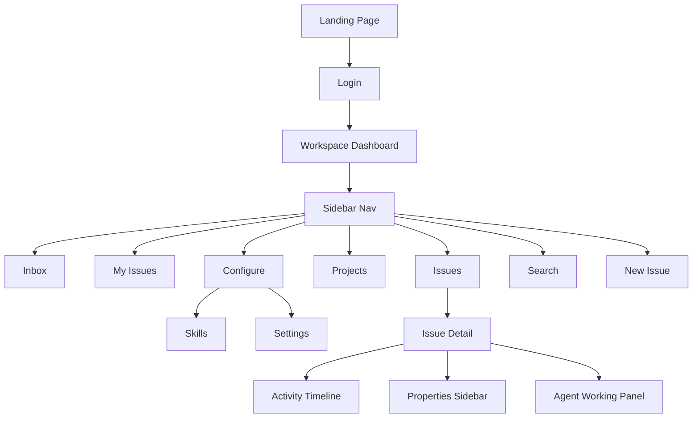

# 🎯 AGENT 3 — UX/Design: Inbox + My Issues + Landing + Design System

> **Role:** Senior UX/UI Design Mapper + Design System Extractor
> **Scope:** PHASE 5 (Inbox), PHASE 6 (My Issues), PHASE 9 (Landing Page), + FULL Design System Extraction
> **Coordination:** You are Agent 3 of 3. Agent 1 handles Issues/Projects/New Issue. Agent 2 handles Settings/Skills/Search.
> **Output Path:** `C:\VMs\Projetos\Automonous_Agentic\Mapeamento_New_Features\02_multica\`

---

## CONTEXT — What is Multica?

**Multica** (https://multica.ai) is an open-source project management platform for Human + Agent teams. It turns coding agents (Claude Code, Codex, Gemini CLI) into real teammates — assign issues, track progress, compound skills.

**Tech Stack:** Next.js App Router, Vercel, Tailwind CSS, shadcn/ui (Radix-based), Lucide React icons, i18next (en/zh/ko/ja), WebSocket, next-themes (light/dark/system), 3 custom font families (sans, serif, mono)

**Demo Workspace URL Base:** `https://multica.ai/navy-seals/`

If login wall appears: screenshot the login flow (Email OTP + Google OAuth), then try "Get started" or demo access from the landing page.

---

## 🛠️ RECOMMENDED SKILLS & TOOLS

Use these skills/tools for maximum efficiency and quality:

### Browser & DevTools
- **Chrome DevTools MCP** — Use `take_screenshot`, `navigate_page`, `click`, `evaluate_script`, `take_snapshot` for precise element capture
- **Browser Subagent** — Use for multi-step interaction flows (click sequences, scroll + capture, hover state capture)
- Use `evaluate_script` to extract computed CSS values:
  ```javascript
  // Extract all CSS custom properties
  (() => {
    const styles = getComputedStyle(document.documentElement);
    const props = {};
    for (const prop of document.styleSheets) {
      try { for (const rule of prop.cssRules) {
        if (rule.selectorText === ':root') {
          for (const p of rule.style) props[p] = rule.style.getPropertyValue(p);
        }
      }} catch(e) {}
    }
    return props;
  })()
  ```

### Design System Skills
- **StitchMCP** — Use `create_design_system_from_design_md` to formalize the extracted design tokens into a reusable design system
- **gsd-ui-review** — Use for 6-pillar visual audit (spacing, color, typography, hierarchy, contrast, consistency) on each captured screen
- **gsd-sketch** — Use if you need to create reference mockups of components for documentation
- **gsd-ui-phase** — Use to generate a UI-SPEC.md design contract from extracted patterns

### Documentation
- **gsd-map-codebase** — If you gain access to Multica's GitHub repo, use this to analyze their component structure
- Use Mermaid diagrams in the PRD for visual architecture documentation

---

## YOUR PHASES

### PHASE 5: Inbox
**URL:** `https://multica.ai/navy-seals/inbox`

- [ ] Screenshot the Inbox page — empty state
- [ ] Screenshot the Inbox with notifications (if pre-populated in demo)
- [ ] Map the notification list structure:
  - What information per notification? (icon, title, description, timestamp, read/unread indicator)
  - How are read vs unread visually distinguished? (bold text? dot indicator? background color?)
- [ ] Map notification types — screenshot one of each type if possible:
  - **Assignment** — "You were assigned to MUL-123"
  - **Status change** — "MUL-123 moved to In Progress"
  - **Comment/Mention** — "Alex commented on MUL-123" / "@you mentioned in MUL-123"
  - **Agent activity** — "Agent task completed on MUL-123" / "Agent task failed"
  - **Priority/Due date change**
- [ ] Map notification actions:
  - Click notification → navigates to issue?
  - Mark as read / mark all as read
  - Archive / dismiss
  - Any bulk actions?
- [ ] Map inbox header/toolbar:
  - Filter tabs? (All / Unread / Archived?)
  - Settings link?
  - Mark all as read button?
- [ ] Map the notification badge count (in sidebar — how does it show unread count?)
- [ ] Document the "Notifications alt+T" aria-label (keyboard shortcut?)

---

### PHASE 6: My Issues
**URL:** `https://multica.ai/navy-seals/my-issues`

- [ ] Screenshot the "My Issues" page
- [ ] Map the view tabs/filters:
  - Assigned to me
  - Created by me
  - Subscribed / Watching
- [ ] Map how this differs from the main Issues view (filtered? different layout?)
- [ ] Document column headers and available actions
- [ ] Map any status grouping (group by status? flat list?)
- [ ] Screenshot empty state (if possible — "No issues assigned to you")
- [ ] Map sort/filter options available
- [ ] Check for "Active" vs "Backlog" separation

---

### PHASE 9: Landing Page & Auth
**URL:** `https://multica.ai`

#### 9.1 Landing Page
- [ ] Screenshot the FULL landing page at 1920px width (multiple scrolls to capture everything)
- [ ] Map the hero section:
  - Headline: "Your next 10 hires won't be human."
  - Subtext
  - CTA buttons: "Start free trial", "Download Desktop", "Talk to sales"
  - "Works with" badges: Claude Code, Codex, Gemini CLI, OpenClaw, OpenCode
  - Hero image (the board view screenshot)
- [ ] Map the features section — there are 4 feature blocks with sticky navigation:
  - **TEAMMATES** — "Assign to an agent like you'd assign to a colleague"
  - **AUTONOMOUS** — "Set it and forget it — agents work while you sleep"
  - **SKILLS** — (discover the headline + description)
  - **RUNTIMES** — (discover the headline + description)
- [ ] For each feature block:
  - Screenshot the full block including the demo/animation
  - Document the 3 bullet points beneath each demo
  - Download the background images
- [ ] Map the navigation header: logo, nav links, GitHub button, "Get started" CTA
- [ ] Map the footer (if any)
- [ ] **Download ALL images:**
  - Hero image: `/_next/image?url=%2Fimages%2Flanding-hero.png`
  - Background: `/_next/image?url=%2Fimages%2Flanding-bg.jpg`
  - Feature bg 1: `/_next/image?url=%2Fimages%2Ffeature-bg.jpg`
  - Feature bg 2: `/_next/image?url=%2Fimages%2Ffeature-bg-2.jpg`
  - Any other images discovered

#### 9.2 Login Flow
**URL:** `https://multica.ai/login`

- [ ] Screenshot the login page
- [ ] Document the sign-in form:
  - Email input (placeholder: "you@example.com")
  - "Continue" button
  - "or" divider
  - "Continue with Google" button
  - "Prefer desktop app? Download" link
- [ ] If possible, trigger the verification code screen — screenshot it:
  - "Check your email" title
  - Code input
  - "Resend code" / cooldown timer

---

## PHASE 10: FULL DESIGN SYSTEM EXTRACTION ⭐⭐⭐

This is YOUR unique responsibility. Extract and document the COMPLETE design system.

### 10.1 Colors — Extract from both Light AND Dark mode

Navigate to any workspace page, use DevTools to extract:

```javascript
// Run this in browser console to get all tailwind-style CSS variables
(() => {
  const cs = getComputedStyle(document.documentElement);
  const tokens = [
    'background', 'foreground', 'card', 'card-foreground',
    'popover', 'popover-foreground', 'primary', 'primary-foreground',
    'secondary', 'secondary-foreground', 'muted', 'muted-foreground',
    'accent', 'accent-foreground', 'destructive', 'destructive-foreground',
    'border', 'input', 'ring', 'info', 'warning', 'success'
  ];
  return tokens.reduce((acc, t) => {
    acc[t] = cs.getPropertyValue(`--${t}`).trim();
    return acc;
  }, {});
})()
```

- [ ] Extract ALL color tokens in LIGHT mode — document as HSL + hex
- [ ] Switch to DARK mode, extract ALL color tokens — document as HSL + hex
- [ ] Document semantic usage for each color (what component uses what color)
- [ ] Map status-specific colors: info (blue), warning (amber), success (green), error/destructive (red)
- [ ] Map agent-specific colors (bot icon badge = `bg-info/10 text-info`)

### 10.2 Typography

```javascript
// Extract font families
(() => {
  const cs = getComputedStyle(document.documentElement);
  return {
    sans: cs.getPropertyValue('--font-sans') || cs.fontFamily,
    serif: cs.getPropertyValue('--font-serif'),
    mono: cs.getPropertyValue('--font-mono')
  };
})()
```

- [ ] Identify all 3 font families (sans, serif, mono — the 3 `__variable_` classes)
- [ ] Document the font scale: every distinct font-size used (text-xs through text-6xl)
- [ ] Document font weights used: 400, 500, 600, 700
- [ ] Map letter-spacing values used (tracking-tight, tracking-wide, etc.)
- [ ] Map line-height values

### 10.3 Component Library (shadcn/ui based)

Screenshot and document each unique component variant:

- [ ] **Buttons:** primary (white bg), secondary (outline), ghost, destructive — all sizes
- [ ] **Inputs:** text input, textarea, search input — focus states, placeholder styles
- [ ] **Select/Dropdown:** command palette style selectors
- [ ] **Dialog/Modal:** overlay, header, body, footer patterns
- [ ] **Toast/Notification:** position, animation, variants (success, error, info)
- [ ] **Avatar:** human (initials bg), agent (bot icon), with size variants (16px, 18px, 22px)
- [ ] **Badge/Tag:** label badges, status badges, role badges
- [ ] **Skeleton loaders:** the loading pattern (`animate-pulse bg-muted rounded-md`)
- [ ] **Breadcrumb:** separator style (`›`), link styling
- [ ] **Sidebar:** width, collapse behavior, section separators, icon sizing
- [ ] **Tables/Lists:** row height, hover state, selected state, striping
- [ ] **Tooltips:** position, delay, style
- [ ] **Toggle/Switch:** on/off states, size
- [ ] **Status Icons:** the custom SVG pie-chart circles (each status level)
- [ ] **Priority Icons:** the bar-chart SVG icons (each priority level)

### 10.4 Spacing & Layout

- [ ] Document the main layout structure: sidebar width, header height, main content padding
- [ ] Map border-radius values: `rounded-[9px]`, `rounded-[11px]`, `rounded-[12px]`, `rounded-lg`, etc.
- [ ] Map consistent spacing values (gap-1, gap-2, gap-3, p-4, px-4, py-2.5, etc.)
- [ ] Map responsive breakpoints (sm, md, lg, xl)

### 10.5 Animations & Transitions

- [ ] Document CSS transitions used: `transition-colors`, `transition-transform`
- [ ] Map animations: `animate-pulse` (skeletons), `animate-spin` (loader), `animate-ping`
- [ ] Document any page transition effects
- [ ] Note hover effects: `hover:bg-accent/30`, `hover:translate-x-0.5`

---

## OUTPUT REQUIREMENTS

### Screenshots — save to:
```
C:\VMs\Projetos\Automonous_Agentic\Mapeamento_New_Features\02_multica\screenshots\
├── 01-landing/
│   ├── landing-hero-full.png
│   ├── landing-feature-teammates.png
│   ├── landing-feature-autonomous.png
│   ├── landing-feature-skills.png
│   ├── landing-feature-runtimes.png
│   ├── landing-footer.png
│   └── login-page.png
├── 06-inbox/
│   ├── inbox-empty.png
│   ├── inbox-notifications.png
│   ├── inbox-notification-types.png
│   └── inbox-filters.png
├── 07-my-issues/
│   ├── my-issues-assigned.png
│   ├── my-issues-created.png
│   └── my-issues-empty.png
└── 10-misc/
    ├── sidebar-navigation.png
    ├── theme-light-mode.png
    ├── theme-dark-mode.png
    └── mobile-responsive-375px.png
```

### Design Tokens — save to:
```
C:\VMs\Projetos\Automonous_Agentic\Mapeamento_New_Features\02_multica\design-tokens\
├── colors-light.json          ← All CSS vars in light mode
├── colors-dark.json           ← All CSS vars in dark mode
├── typography.json            ← Font families, sizes, weights
├── spacing.json               ← Consistent spacing values
└── components-catalog.md      ← Visual catalog of all components
```

### Assets — save to:
```
C:\VMs\Projetos\Automonous_Agentic\Mapeamento_New_Features\02_multica\assets\
├── landing-hero.png
├── landing-bg.jpg
├── feature-bg.jpg
├── feature-bg-2.jpg
├── favicon.svg
├── multica-logo.svg (extract from page)
└── status-icons/ (extract SVGs)
```

### Deliverable — PRD Section
Write your findings into:
`C:\VMs\Projetos\Automonous_Agentic\Mapeamento_New_Features\02_multica\PRD_AGENT3_DESIGN_UX.md`

Structure:
```markdown
# PRD — Agent 3: UX/Design (Inbox, My Issues, Landing, Design System)

## 1. Inbox
### 1.1 Inbox Layout
### 1.2 Notification Types
### 1.3 Read/Unread States
### 1.4 Actions & Keyboard Shortcuts

## 2. My Issues
### 2.1 View Modes
### 2.2 Filters

## 3. Landing Page
### 3.1 Hero Section
### 3.2 Features Section (4 blocks)
### 3.3 Navigation & Footer
### 3.4 Login Flow

## 4. Design System — Complete
### 4.1 Color Tokens (Light + Dark)
### 4.2 Typography Scale
### 4.3 Component Catalog (with screenshots)
### 4.4 Icon System (Status + Priority + Lucide)
### 4.5 Spacing & Layout Grid
### 4.6 Animations & Transitions
### 4.7 Responsive Breakpoints

## 5. Architecture Diagram (Mermaid)


## 6. AS-IS vs TO-BE Recommendations

## 7. Asset Inventory

## 8. Screenshots Inventory
```

### Quality Rules
- Screenshot at MAXIMUM resolution (1920x1080+)
- Capture BOTH light and dark mode for key screens
- Use DevTools console to extract precise CSS values — don't estimate colors
- Download actual image files, don't just screenshot them
- Extract SVG source code for custom icons
- Document every micro-animation and transition
- Use `gsd-ui-review` 6-pillar audit on at least 3 key screens

---

**END — Execute PHASE 9 first (Landing Page — download assets), then PHASE 5 (Inbox), then PHASE 6 (My Issues), then PHASE 10 (Design System Extraction)**
