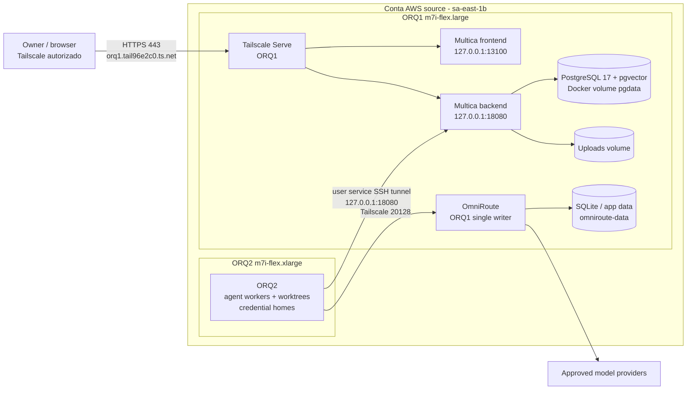
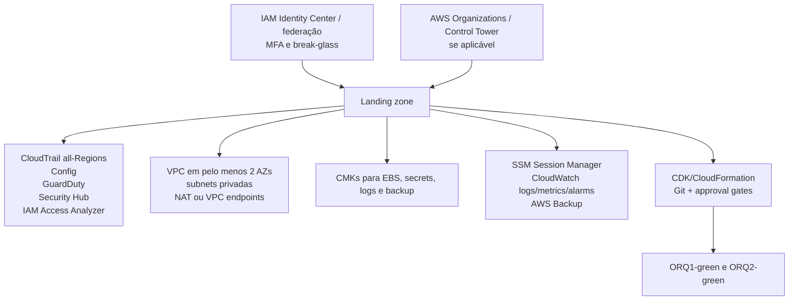
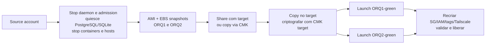
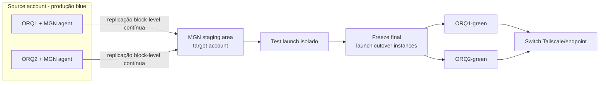
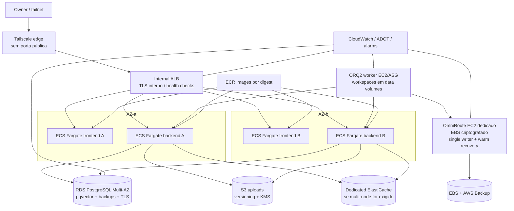
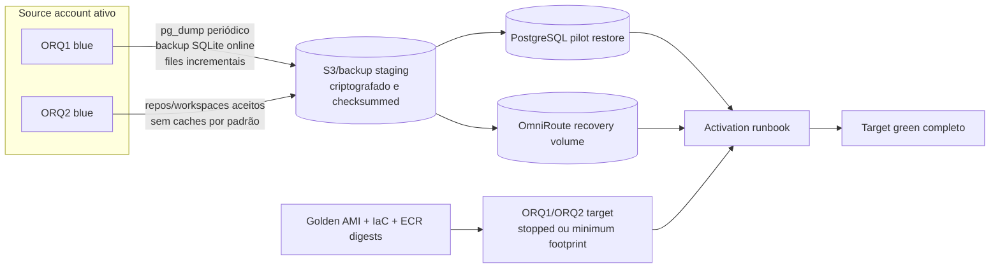

# ORQ1/ORQ2 - Opções e plano de migração para nova conta AWS

**Data de evidência:** 2026-07-31  
**Região do workload:** `sa-east-1`  
**Status:** proposta arquitetural para aprovação; nenhuma mutação AWS autorizada ou executada  
**Papel:** avaliação de arquitetura AWS, continuidade, segurança e migração cross-account

## 1. Decisão executiva proposta

Recomenda-se selecionar o **Cenário 3, blue/green app-aware em EC2**, para detalhamento e rehearsals. A execução ainda não pode ser aprovada: primeiro deve ser reconciliado o conflito entre a unit efetiva do ORQ2 e o contrato vigente do repositório, que exige OmniRoute como único router. Na ausência de uma mudança de contrato explicitamente aprovada pelo owner, o target deve cumprir o contrato OmniRoute-only.

A razão principal é objetiva: os estados autoritativos ativos no ORQ1 são pequenos (`pgdata` ~84 MB e `omniroute-data` ~72 MB), mas sensíveis e com requisitos de consistência diferentes. Copiar 104 GiB de discos root ou modernizar aplicação, banco e workers durante o mesmo cutover adicionaria risco sem benefício proporcional. A migração app-aware permite ensaiar o ambiente novo, validar restore, manter rollback rápido e aplicar um fence global antes do ponto de consistência.

**Alvo condicional recomendado:**

- RPO objetivo: **0**, ainda **não medido**, somente promovido a compromisso depois de dois ensaios provarem fence global, dump/sync final e marcadores de consistência por store.
- RTO objetivo da janela final: **20-45 minutos**; não é SLA até dois ensaios cronometrados passarem.
- Coexistência blue/green: **7-14 dias**, sem dois escritores para PostgreSQL ou SQLite.
- Rollback rápido: permitido somente antes de aceitar escrita no green; depois da primeira escrita no green não há rollback automático, somente forward-fix ou reverse migration app-aware.
- Modernização para ECS/RDS: somente depois da aceitação da migração de conta, em change separado.
- Execução bloqueada até: runtime autorizado, discovery das duas contas, classificação dos dados, backup fresco e rehearsals aprovados.

## 2. Escopo e limitações da evidência

### 2.1 Contas

A conta source observada é `809809509961`, por meio da role de instância `cw-agent-orquestradores`. A conta target foi descrita como nova/vazia, mas não foi inspecionada porque nenhum profile/role target foi fornecido.

Em AWS, o equivalente de “subscription” é uma **AWS account**. Esta proposta assume contas distintas na mesma Região, `sa-east-1`. A associação ou não das contas à mesma AWS Organization deve ser confirmada; isso altera a viabilidade de AWS Backup cross-account.

### 2.2 Limitação IAM da inspeção source

Foram negadas as ações `ec2:DescribeInstances`, `ec2:DescribeAddresses`, `ssm:DescribeInstanceInformation` e `cloudwatch:DescribeAlarms`. `ec2:DescribeVolumes` foi permitido. Portanto:

- os IDs, tipos e topologia dos hosts foram cruzados com IMDS/evidência operacional do repositório;
- os volumes EBS foram confirmados diretamente pela API AWS;
- Elastic IPs, Security Groups, NACLs, route tables, instance profiles completos e alarmes não foram re-inventariados via API;
- os IPs públicos atuais não devem ser considerados portáveis ou permanentes;
- antes de aprovação de execução, é obrigatório um discovery read-only com permissões mínimas nas duas contas.

### 2.3 Linhagem de capacidade observada

| Data/evidência | ORQ1 root | ORQ2 root | Interpretação |
|---|---:|---:|---|
| Handover 2026-07-24 | 24 GiB | 48 GiB | snapshot histórico |
| Capacity snapshot 2026-07-28 | filesystem 24 GiB | filesystem 60 GiB | ORQ2 estava 90.18% usado |
| API/host 2026-07-31 | EBS/filesystem 34 GiB | EBS/block device 70 GiB | baseline atual desta proposta |

Tempos e custos de cópia devem usar novo snapshot assinado no dia do rehearsal, com `DescribeVolumes`, `lsblk`, filesystem size/used e timestamp UTC.

### 2.4 Topologia condicional de contas

**Se source e target estiverem na mesma AWS Organization:** Control Tower/Organizations, SCPs, log archive/audit/backup accounts e AWS Backup cross-account podem ser usados; ainda são obrigatórios CMKs, vault policies e restore tests.

**Se forem Organizations independentes:** AWS Backup cross-account não é o mecanismo; usar AMI/snapshot sharing com CMK, MGN ou transferência app-aware. Criar trust temporário mínimo entre principals nominados, revogar shares/grants após aceitação e manter logging em cada Organization.

Em ambos os casos, a VPC target deve usar CIDRs sem overlap com source, com IPAM/CIDR aprovado, DNS e fluxos source-target documentados. A conectividade temporária deve ser Tailscale, peering/TGW ou VPN explicitamente aprovada; banco não será exposto à internet.

## 3. Arquitetura atual verificada



### 3.1 Inventário atual que entra no manifesto de migração

| Domínio | Estado verificado | Tratamento |
|---|---|---|
| ORQ1 EC2 | `i-0d9d441dd364039f9`, `m7i-flex.large`, `sa-east-1b` | Recriar por IaC ou rehost; não existe transferência direta de instância |
| ORQ1 root | `vol-024324f534a37e072`, gp3, 34 GiB, **não criptografado**, ~26 GiB usados | Não copiar cegamente no cenário recomendado; se AMI, copiar e criptografar com CMK target |
| Multica frontend | container ativo, loopback `13100` | Rebuild/pull por digest e recriar |
| Multica backend | container ativo, loopback `18080` | Rebuild/pull por digest e recriar |
| PostgreSQL | `pgvector/pgvector:pg17`, loopback `15433`, `pgdata` ~84.29 MB | `pg_dump -Fc` + restore verificado; DMS somente após laboratório de UDT/pgvector e conectividade privada |
| Uploads | volume ativo, atualmente 0 B | Sync app-aware e checksum; migrar mesmo vazio para manter contrato |
| OmniRoute | container saudável em Tailscale `100.118.244.61:20128` | Recriar de digest aprovado; exatamente um writer |
| OmniRoute state | `omniroute-data` ~72.23 MB | Backup online SQLite/full volume; `quick_check`; transporte criptografado |
| Artefatos OmniRoute | 4 containers parados; `omniroute-canary-data` ~2.08 MB | Não promover como rollback sem revalidação; owner decide retenção |
| Docker volumes órfãos | 22 volumes anônimos desvinculados, 0-135 MB cada | Classificar owner/proveniência; não migrar nem apagar por padrão |
| Multica legado histórico | em 2026-07-19 havia stack/banco gravável distinto; em 2026-07-31 os containers não existem e `multica_pgdata`/`multica_backend_uploads` aparecem com 0 B | Registrar último writer, aceite do owner e decisão archive/discard; não tratá-lo como estado atual sem prova |
| Tailscale edge | Serve 443, MagicDNS e certificado do tailnet, confirmados diretamente em 2026-07-31; listener 443 observado | Registrar green como novo node; automatizar ACL/tag, Serve/cert, SSH alias e host-key pinning |
| ORQ2 EC2 | `i-0af937456e125143d`, `m7i-flex.xlarge`, `sa-east-1b` | Recriar inicialmente com mesmo shape; right-size depois de histórico |
| ORQ2 root | `vol-04089fc818225fbcc`, gp3, 70 GiB, **não criptografado** | Recriar criptografado; separar OS e dados quando possível |
| ORQ2 daemon | `multica-daemon-orq2-credential.service` | Reinstalar unit versionada e validar runtime paths |
| ORQ2 tunnel | `multica-orq1-backend-tunnel.service` | Apontar primeiro ao blue, depois ao green; dependência hard do daemon |
| ORQ2 workspaces | repositórios, worktrees, `.deploy-control`, local gates | Commit/push ou backup checksummed; restaurar somente conjuntos aceitos |
| ORQ2 credential homes | grande e sensível | Preferir reemissão/reautenticação; cópia somente com autorização, criptografia e rotação |
| Host agents | CloudWatch agent, SSM agent e tailscaled ativos; EFS watchdog ativo sem mount EFS comprovado | Reinstalar por IaC somente agentes necessários; confirmar/remover EFS watchdog; não herdar identidade source |

### 3.2 Fora do escopo automático

Inventários de 2026-07-19 listavam AOP, HerdMaster, Chatwoot, P12, Grafana/Prometheus e Docuseal. Eles não aparecem entre os containers atuais de ORQ1. Logo:

- não são incluídos como workloads ativos desta migração;
- backups históricos continuam classificados como sensíveis;
- um owner deve confirmar por escrito qualquer inclusão;
- volumes anônimos não serão tratados como evidência de ownership.

### 3.3 Gate bloqueante de runtime

O contrato vigente do repositório declara OmniRoute como único router e exige falha fechada quando o gateway não está pronto. A unit efetiva observada do daemon ORQ2 remove variáveis `AGENT_BRAIN_GATEWAY_*`, usa credential homes e, portanto, não prova conformidade com esse contrato.

A migração **não está aprovada** enquanto esse conflito permanecer. Antes de construir qualquer workload target, o owner deve corrigir, testar e aceitar em change própria o runtime OmniRoute-only; somente o runtime aceito, com OmniRoute como único router e fail-closed, pode ser migrado.

Não é permitido preservar silenciosamente a unit atual, aprovar exceção temporária, alterar esse contrato dentro da migração ou usar o move para ativar arquitetura de routing diferente. Os diagramas de target, units e manifesto de secrets devem refletir a conformidade comprovada.

## 4. Fundação obrigatória na conta target

Nenhum cenário deve lançar produção em uma conta “blank” antes deste baseline.



### 4.1 Controles mínimos

1. Root user com MFA, sem access keys, contatos e alternate contacts corretos.
2. IAM Identity Center ou federação; roles separadas de admin, deploy, security audit e read-only.
3. CloudTrail multi-Region, log validation, S3 central/imutável e alarmes de atividade sensível.
4. AWS Config, GuardDuty, Security Hub CSPM e IAM Access Analyzer.
5. Budgets, Cost Anomaly Detection e tags obrigatórias: `Application`, `Environment`, `Owner`, `CostCenter`, `DataClassification`, `ManagedBy`.
6. EBS encryption by default em `sa-east-1` com CMK target; o setting só afeta recursos novos.
7. VPC em pelo menos duas AZs, sem banco público, SGs por referência, egress controlado.
8. SSM Session Manager preferido; porta 22 sem exposição pública permanente.
9. VPC endpoints para SSM, `ssmmessages`, ECR API/DKR, CloudWatch Logs, Secrets Manager e S3 quando o desenho não usar NAT.
10. Backup vault com CMK, retenção, proteção contra exclusão e restore test.
11. ECR com scanning e lifecycle; imagens por digest, nunca apenas `latest`.
12. IaC com change set, revisão e rollback; proibir configuração manual não registrada.
13. Build provenance: commit/tag, Dockerfiles, build args, base-image digests, SBOM e assinatura; publicar frontend/backend/OmniRoute aceitos no ECR target por digest antes do rehearsal.

### 4.2 Matriz mínima de IAM e KMS

Os ARNs exatos dependem do account ID target e devem ser gerados por IaC. Não usar users ou access keys de longa duração.

| Role/fase | Trust | Ações mínimas e condições |
|---|---|---|
| `MigrationDiscoveryReadOnly` | Identity Center/auditor nomeado | `Describe/List/Get` de EC2, IAM metadata, VPC, SSM inventory, CloudWatch, Backup, MGN/DMS; sem secrets plaintext |
| `MigrationIaCDeploy` | pipeline/deployer target | CloudFormation/CDK e `iam:PassRole` somente em path de roles do workload, com `iam:PassedToService` |
| `AmiShareCopyRole` | principal target temporário | launch permission e snapshot copy; KMS `DescribeKey/Decrypt/ReEncrypt*/CreateGrant/GenerateDataKey*` somente na CMK de migração |
| `MgnServiceRoles` | service principals MGN | service-linked roles e resources MGN target; staging SG/subnet escopados |
| `DmsMigrationRole` | service principal DMS | endpoints/task, logs e secret ARN específico; conectividade privada; sem wildcard de secrets |
| `BackupCopyRole` | AWS Backup, somente mesma Organization | vault policy, CMK e destination vault específicos |
| `ORQ1Role` / `ORQ2Role` | EC2 | SSM, logs/metrics, ECR pull e secret ARNs específicos por host |
| `BreakGlass` | grupo de emergência com MFA | sessão curta, CloudTrail/alerta, sem uso rotineiro |

Antes da execução: validar trust e policies com IAM Access Analyzer/Policy Simulator, registrar duração STS e permissions boundary/SCP; após hypercare, revogar AMI/snapshot shares, KMS grants e roles temporárias.

### 4.3 Matriz mínima de conectividade

| Origem -> destino | Porta | Finalidade |
|---|---:|---|
| ORQ1/ORQ2 -> Tailscale control/DERP e internet aprovada | TCP/UDP conforme Tailscale | registro, coordenação e fallback; exige NAT/egress se subnet privada |
| ORQ2 -> ORQ1 backend | TCP 22 para túnel; destino local 18080 | unit `multica-orq1-backend-tunnel` |
| ORQ2 -> OmniRoute | TCP 20128 pela tailnet | gateway privado |
| Browsers tailnet -> Tailscale Serve | TCP 443 | UI/API privada |
| MGN agent -> AWS APIs/S3 | TCP 443 | control e artifacts |
| MGN agent -> replication servers | TCP 1500 | block replication; SG/NACL/route obrigatórios |
| DMS -> source/target PostgreSQL | TCP 5432/15433 conforme endpoint | somente private path; source loopback precisa endpoint dedicado temporário, não internet |
| EC2/ECS -> SSM/ECR/Logs/Secrets/S3 | TCP 443 | NAT ou VPC endpoints listados |

Test launches AMI/MGN devem iniciar em **quarentena**, sem egress para tailnet, backend ou providers, com Docker, tailscaled e user lingering units desabilitados. Machine ID, SSH host keys e identidade Tailscale devem ser regenerados antes da liberação de rede.

### 4.4 Sizing inicial e gate de capacidade

- ORQ1-green: manter `m7i-flex.large` no primeiro cutover; usar root criptografado com headroom e, idealmente, volume separado para Docker/dados.
- ORQ2 apresentou no snapshot de 2026-07-28: CPU busy 69.77%, iowait 16.22%, swap 61.85%, load1/vCPU 1.75 e IO full PSI 14.24%. Portanto, `m7i-flex.xlarge` não pode ser promovido sem benchmark.
- Rehearsal obrigatório: comparar `m7i-flex.xlarge` (4 vCPU/16 GiB) com um target temporário 8 vCPU/32 GiB, usando concorrência representativa, p50/p95 de CPU, memória, swap, PSI, latência de disco, queue depth e duração dos gates.
- Se 4/16 não passar com margem, usar 8/32 no cutover e right-size depois; se o owner mantiver 4/16, impor budget de concorrência e stop condition.
- ORQ2-green deve usar root de sistema + volume de dados criptografado de pelo menos 120 GiB se credential homes e caches permanecerem locais.
- Não reduzir memória do ORQ1 nem mudar arquitetura/ISA durante a migração.

## 5. Cenário 1 - Cold move totalmente offline por AMI/snapshot

**Requisito coberto:** todos os serviços offline.



### Método

1. Construir landing zone, rede, IAM e KMS target.
2. Produzir backups preliminares online para ensaio e testar restore/checksums; esses artefatos não são os backups finais de cutover.
3. Iniciar o fence global: congelar admission e mutações backend/UI, parar daemon ORQ2, schedulers, webhooks, integrations e todos os clients de PostgreSQL/OmniRoute; provar e registrar zero writers.
4. Somente após o fence, gerar `pg_dump -Fc`, sync de uploads/workspaces, backup final OmniRoute com `quick_check`/checksum e marcadores de consistência.
5. Parar os containers e hosts; criar AMIs consistentes sem `--no-reboot`.
6. Como os roots atuais são não criptografados, compartilhar AMI/snapshots apenas com o account ID target, copiar no target e criptografar a cópia com CMK target. Para qualquer snapshot já criptografado, usar CMK customer-managed compartilhável, key policy/grant e permissões temporárias; `aws/ebs` não é compartilhável cross-account.
7. Aguardar AMI/snapshots target em `available/completed`; lançar primeiro em subnet/SG de quarentena sem acesso a tailnet, backend ou providers.
8. Antes de liberar egress: desabilitar Docker/tailscaled/user units herdados, regenerar machine ID, SSH host keys e Tailscale identity, recriar SGs, roles, profiles, tags e units.
9. Restaurar/validar os backups app-aware finais; ligar ORQ1, depois ORQ2; validar um único writer e admission fechada; só então liberar tráfego.
10. Após hypercare, revogar launch permissions, snapshot shares e KMS grants temporários.

### RTO/RPO de planejamento

- **RTO:** 4-8 horas.
- **RPO atual:** não medido; **objetivo 0** somente se rehearsals comprovarem fence global, backups finais e snapshots consistentes.
- **Duração de preparação:** 3-7 dias.

### Prós

- Menor mudança de aplicação e sistema operacional.
- Caminho simples de entender e ensaiar.
- Captura workspaces e dependências host-level difíceis de descobrir.
- Rollback simples enquanto source permanece desligado e intacto.
- Baixo custo temporário.

### Contras

- Maior indisponibilidade.
- Copia caches, lixo, drift, chaves de host, históricos e possíveis secrets.
- AMI de root não substitui backup app-aware de PostgreSQL/SQLite.
- Recria dívida técnica e single points of failure.
- Pode compartilhar material sensível em snapshots se políticas estiverem erradas.
- IPs, IAM, SGs e network IDs mudam mesmo com a AMI.

### Uso recomendado

Fallback de contingência ou quando uma janela de 4-8 horas é aceitável. Não é a primeira recomendação porque os dados autoritativos são pequenos e podem ser migrados seletivamente.

## 6. Cenário 2 - Live production rehost com AWS MGN

**Requisito coberto:** migração com produção online durante replicação.



### Método

1. Inicializar MGN e staging subnet na conta target, definindo NAT/endpoints, SG/NACL e rotas para TCP 443 e 1500 conforme a matriz de conectividade.
2. Instalar o replication agent nos dois sources com role estritamente limitada; provar 443 para APIs/S3 e 1500 para replication servers.
3. Aguardar initial sync e estado healthy.
4. Fazer test launches repetíveis em subnet/SG de quarentena, sem tailnet/backend/providers e com Docker/tailscaled/user units inicialmente desabilitados.
5. Regenerar identidades do clone e provar que não existe segundo writer antes de qualquer teste conectado.
6. Na janela final, aplicar fence global e provar zero writers/clients; registrar LSN, counts e marcadores.
7. Após o fence, gerar `pg_dump -Fc`, backup final OmniRoute com `quick_check`/checksum e sync final de arquivos; manter os writers parados e esperar o MGN chegar a lag zero.
8. Lançar cutover instances, restaurar/validar os artefatos app-aware finais, registrar identidades target e confirmar exatamente um writer.
9. Só então mudar a entrada Tailscale e liberar escritores.

### RTO/RPO de planejamento

- **RTO:** 30-90 minutos.
- **RPO:** segundos/minutos durante replicação; objetivo 0 somente após fence, artefatos app-aware finais e lag zero comprovados.
- **Duração de preparação:** 1-2 semanas.

### Prós

- Produção permanece online durante quase toda a replicação.
- Test launch antes do corte.
- Replica dependências host-level não catalogadas.
- Útil se os roots crescerem ou houver muitos arquivos mutáveis.
- Menor janela que AMI cold move.

### Contras

- Consistência block-level não elimina backup app-aware.
- PostgreSQL e SQLite ainda precisam de freeze final; snapshot crash-consistent não é garantia transacional cross-service.
- Instalação de agent e roles amplia superfície operacional.
- Replica drift, caches e material sensível.
- Continua com a mesma baixa resiliência de dois hosts em uma AZ.
- Custo temporário de staging/replication/test instances.

### Uso recomendado

Boa alternativa se o discovery revelar dependências host-level não reproduzíveis ou se a janela offline permitida for menor que 30 minutos. Para o tamanho atual dos dados, MGN é tecnicamente válido, mas operacionalmente mais pesado que o Cenário 3.

## 7. Cenário 3 - Blue/green app-aware em EC2

**Recomendação primária para o move de conta.**

```mermaid
flowchart LR
    subgraph BLUE[Source account - blue ativo]
      BO1[ORQ1 blue\nMultica + PG + OmniRoute]
      BO2[ORQ2 blue\ndaemon + worktrees]
    end

    subgraph SYNC[Replication e transferência]
      DB[pg_dump -Fc final\npg_restore --no-owner]
      FS[DataSync/rsync incremental\nchecksums]
      SQ[SQLite online backup\nexactly one writer]
    end

    subgraph GREEN[Target account - green isolado]
      GO1[ORQ1-green\nmesmo runtime, EBS criptografado]
      GO2[ORQ2-green\nmesmo shape, data volume]
    end

    BO1 --> DB --> GO1
    BO1 --> SQ --> GO1
    BO1 --> FS --> GO1
    BO2 --> FS --> GO2
    GO2 -. pre-cutover .->|túnel/Tailscale para blue| BO1
    GO1 --> C[Cutover Tailscale\nold orq1 -> orq1-blue\ngreen -> orq1]
    GO2 --> C
```

### Método

1. Recriar ambos os hosts com IaC, AMI limpa Amazon Linux 2023 e volumes criptografados.
2. Reproduzir frontend/backend a partir de commit, Dockerfiles e base digests registrados; publicar no ECR target com digest, scan, SBOM e assinatura. Fixar OmniRoute em digest aceito, nunca `latest`.
3. Instalar Tailscale como `orq1-green`/`orq2-green`; não reutilizar a identidade dos hosts source.
4. Restaurar cópia recente do PostgreSQL em target e validar schema, migrations, pgvector, row counts e queries representativas.
5. Usar como caminho aprovado o `pg_dump -Fc` final durante fence global e `pg_restore --no-owner`. DMS full load + CDC só pode substituir esse caminho após laboratório que prove: private connectivity, schema pré-criado, table-preparation mode, PK/replica identity, `wal_level=logical`, slots/senders e fidelidade de todas as colunas `vector`/UDT por row/query/checksum.
6. Fazer cópias incrementais de uploads, repositórios e workspaces; não copiar caches por padrão.
7. Criar backup online do SQLite OmniRoute e full-volume archive; manter exatamente um writer.
8. ORQ2-green pode operar em ensaio apontando ao backend blue, desde que sem executar work pago/não idempotente.
9. Na janela final, aplicar o fence global, parar todos os escritores/clients, fazer sync final de cada store e iniciar green na ordem DB -> OmniRoute -> backend -> frontend -> daemon.
10. Trocar identidade/hostname Tailscale de forma controlada ou adotar novo endpoint; validar; liberar.

### RTO/RPO de planejamento

- **RTO objetivo:** 20-45 minutos com dump/restore final, sujeito a dois ensaios.
- **RPO atual:** não medido; **objetivo 0** somente após fence global + sync final comprovados.
- **Duração de preparação:** 1-2 semanas.

### Prós

- Migra somente estado autoritativo e reduz snowflake drift.
- Dois ambientes podem ser testados antes do cutover.
- Criptografia, IAM e observabilidade entram corretamente no target.
- Rollback rápido antes da primeira escrita green.
- Menos dependência de mecanismos cross-account do que AWS Backup.
- Proporcional ao pequeno volume real de dados.
- Não obriga modernização simultânea.

### Contras

- Exige inventário disciplinado de paths ORQ2 e validação de restores.
- Requer script/runbook detalhado para SQLite e credential homes.
- Ainda entrega inicialmente dois EC2 e single-AZ/single-writer.
- Duplicação temporária de custo.
- Mudança do FQDN Tailscale pode exigir re-login, OAuth redirect update e reconciliação de host keys.

### Uso recomendado

Selecionar para detalhamento e rehearsal. É o melhor equilíbrio entre continuidade, segurança de dados, rollback, tempo e complexidade; a execução continua bloqueada pelos gates deste documento.

## 8. Cenário 4 - Replatform para serviços gerenciados e arquitetura resiliente

**Opção autônoma cross-account:** replatform completo em green na conta target e cutover app-aware após fase própria de engenharia e testes. Não depende da execução prévia de outro cenário.



### Método de migração autônomo

1. Construir a foundation target e os serviços green por IaC, sem conectá-los a produção.
2. Produzir imagens reproduzíveis no ECR target por digest, com SBOM, assinatura e scan; implantar frontend/backend em ECS Fargate e ORQ1/ORQ2 stateful conforme o diagrama.
3. Criar RDS PostgreSQL Multi-AZ com `pgvector`, ElastiCache antes de backend multi-node, S3 para uploads e volumes EBS criptografados para OmniRoute/workspaces.
4. Executar carga inicial de ensaio com `pg_dump -Fc`/`pg_restore --no-owner`, cópia incremental de uploads para S3 e backup online OmniRoute; validar migrations, counts, vector queries, `quick_check` e checksums. DMS não integra o caminho aprovado sem o laboratório definido no Cenário 3.
5. Fazer dois rehearsals completos em endpoint green isolado, incluindo capacity benchmark ORQ2, Tailscale, observabilidade, fail-closed e rollback antes da primeira escrita.
6. No cutover, aplicar o mesmo fence global: bloquear backend/UI, parar daemon, schedulers, integrations e todos os clients; registrar LSN, counts e zero writers.
7. Após o fence, gerar dump PostgreSQL final, sync final de uploads/workspaces e backup final OmniRoute com checksum; restaurar cada store no target.
8. Iniciar RDS/OmniRoute, ECS, tunnel e daemon; validar admission ainda fechada e exatamente um writer; trocar endpoint reversível e abrir cohort gradual.
9. Antes da primeira escrita green, rollback consiste em fechar green, reverter endpoint e religar blue intacto. Depois da primeira escrita, não há rollback automático nem promessa de RPO 0: congelar green, preservar deltas por store e executar forward-fix ou reverse migration app-aware ensaiada.
10. Manter blue desligado durante hypercare e realizar decommission somente em change destrutiva separada.

### Decisões de desenho

- Frontend/backend: ECS Fargate em pelo menos duas AZs, desired count 2, circuit breaker com rollback, health grace period e ALB interno.
- PostgreSQL: RDS PostgreSQL Multi-AZ com pgvector, CMK, TLS obrigatório, backups, deletion protection e logs; Aurora somente se testes/custos justificarem.
- Uploads: S3 com versioning, KMS e lifecycle, usando suporte já existente no backend.
- Redis: ElastiCache dedicado é requisito obrigatório para a topologia multi-réplica desenhada, porque realtime/rate-limit locais não são compartilhados. Operação single-node seria outra topologia, exigiria decisão explícita e não atenderia ao desenho resiliente deste cenário.
- OmniRoute: manter EC2 dedicado inicialmente. SQLite em EFS/Fargate não deve ser assumido seguro/performático sem validação do produto. HA ativa exige backend de persistência suportado e desenho de single-writer/leader.
- ORQ2 workers: EC2/ASG, não Fargate como primeira etapa, porque sessões longas, CLIs, worktrees e credential homes têm estado host-level.

### RTO/RPO de planejamento

- **RTO de cutover planejado:** 45-120 minutos após a arquitetura passar nos rehearsals.
- **RPO atual:** não medido; **objetivo 0** somente após fence global e backups finais comprovados.
- **RTO operacional de app/DB após a migração:** 5-30 minutos.
- **RTO operacional OmniRoute/worker:** 15-60 minutos enquanto single-writer em EC2.
- **Duração de implementação:** 3-6 semanas, sujeita a testes de compatibilidade.

### Prós

- Maior resiliência de frontend/backend/banco.
- Patching, backups, failover e observabilidade mais gerenciados.
- Escala independente e deployments blue/green/canary.
- Reduz dependência do root disk de ORQ1.
- Melhor isolamento de dados, secrets, logs e imagens.

### Contras

- Maior mudança e custo operacional inicial.
- Requer mudança de uploads, conexão TLS, networking e deployment.
- OmniRoute/ORQ2 continuam exigindo tratamento especial.
- Pode introduzir Redis e ALB como novas dependências.
- Maior risco se combinado com o move cross-account.
- Custo steady-state tende a ser maior para carga atual pequena.

### Uso recomendado

Alternativa autônoma para quando modernização e resiliência gerenciada forem requisitos do primeiro cutover e houver 3-6 semanas de engenharia. Não é a primeira recomendação devido ao maior change surface, mas pode migrar diretamente source -> target sem cenário intermediário.

## 9. Cenário 5 - Pilot-light cross-account e DR-first

Este cenário cria primeiro uma capacidade mínima recuperável na conta target e a mantém atualizada, ativando compute completo apenas em rehearsals e no cutover.



### Método

1. Construir landing zone, golden images, ECR e hosts target definidos por IaC, mantidos desligados ou em footprint mínimo.
2. Criar backups app-aware periódicos: PostgreSQL custom dump, SQLite online backup/full volume e arquivos incrementais com checksum.
3. Transportar para staging target criptografado. Se as contas estiverem na mesma Organization, AWS Backup pode complementar; se independentes, usar S3/DataSync/rsync e policies temporárias explícitas.
4. Restaurar automaticamente em pilot environment isolado e executar `pg_restore` catalog checks, `pgvector` query, SQLite `quick_check` e file checksum.
5. Executar rehearsal mensal de ativação completa, incluindo Tailscale edge, units e reboot.
6. No cutover, aplicar fence global e gerar o último backup/sync; aguardar sua aplicação/restore no target, validar marcadores, counts, `quick_check` e checksums; somente então ativar hosts completos e trocar o endpoint.

### RTO/RPO de planejamento

- **RTO objetivo:** 30-90 minutos, dependendo do tempo de ativação dos hosts e restore.
- **RPO normal:** intervalo do último backup, alvo 15 minutos; **RPO objetivo 0 no cutover** somente com fence + sync final.
- **Duração de preparação:** 2-3 semanas.

### Prós

- Menor custo de coexistência que blue/green sempre ligado.
- Produz capacidade de DR reutilizável depois da migração.
- Restore é testado continuamente, não apenas no dia do cutover.
- Não replica roots inteiros nem drift por padrão.
- Funciona entre Organizations independentes com transferência app-aware.

### Contras

- RTO maior que blue/green quente.
- RPO entre rehearsals depende da frequência de backup.
- Exige automação confiável de restore e activation.
- Credential homes e sessions ainda exigem reemissão ou cadeia de custódia própria.
- Não oferece canary de tráfego permanente antes da ativação.

### Uso recomendado

Segunda melhor alternativa quando o custo de 7-14 dias com green totalmente ativo não for aceito, ou quando a organização também quiser estabelecer DR cross-account.

## 10. Comparação dos cinco cenários

Escala 1-5, onde 5 é melhor. Para Complexidade, 5 significa mais simples. Pontuação ponderada: continuidade 25%, segurança de dados 20%, rollback 15%, resiliência target 15%, simplicidade 10%, velocidade de preparação 10%, custo relativo 5%.

| Critério | S1 Offline AMI | S2 Live MGN | S3 Blue/green app-aware | S4 Replatform | S5 Pilot-light |
|---|---:|---:|---:|---:|---:|
| Continuidade | 1 | 4 | 4 | 3 | 4 |
| Segurança/consistência de dados | 4 | 3 | 4 | 4 | 3 |
| Rollback | 4 | 3 | 3 | 3 | 4 |
| Resiliência final | 2 | 2 | 3 | 5 | 3 |
| Simplicidade | 4 | 1 | 3 | 1 | 2 |
| Velocidade para preparar | 3 | 2 | 3 | 1 | 2 |
| Custo relativo | 5 | 3 | 3 | 2 | 4 |
| **Score ponderado / 5** | **2.90** | **2.80** | **3.45** | **3.05** | **3.25** |
| RTO objetivo de cutover | 4-8 h | 30-90 min | 20-45 min | 45-120 min | 30-90 min |
| RPO atual / objetivo | não medido / 0 com fence | seg-min na replicação / 0 com fence | não medido / 0 com fence | não medido / 0 com fence | até 15 min / 0 com fence |
| Prazo típico de preparação | 3-7 dias | 1-2 sem | 1-2 sem | 3-6 sem | 2-3 sem |
| Custo temporário | baixo | médio | médio | alto | baixo-médio |
| Recomendação | fallback | alternativa live | **selecionar para rehearsal** | alternativa autônoma estratégica | alternativa DR/custo |

Os scores são conservadores e os valores de RTO/RPO são objetivos, não garantias. Devem ser substituídos por tempos medidos e a matriz deve ser recalculada após dois rehearsals.

## 11. Plano resiliente recomendado

### Fase 0 - Decisões e acesso

Gate de saída:

- account ID target, owner, billing e access role read-only/deploy definidos;
- confirmação se as contas pertencem à mesma Organization;
- contrato de runtime reconciliado e um único caminho autorizado, com evidência de conformidade;
- escopo dos volumes órfãos e componentes históricos aprovado;
- RTO/RPO objetivo e janela aceitos;
- owner de Tailscale, ACL/tag, Serve/cert, SSH alias/known_hosts, DNS/OAuth e secrets identificado;
- matriz IAM/KMS e fluxos de rede com ARNs/CIDRs reais revisada por security.

### Fase 1 - Landing zone target

Entregáveis por CDK/CloudFormation:

- logging/security baseline;
- VPC em duas AZs;
- CMKs e EBS encryption by default;
- SGs, endpoints/NAT e SSM;
- backup vault e políticas;
- ECR e CloudWatch;
- roles least privilege;
- budgets e tags.

**Gate:** Security Hub/Config sem findings críticos conhecidos, CloudTrail entregando, SSM funcional e restore test de um volume descartável.

### Fase 2 - Source hygiene e manifesto imutável

1. Congelar versão das imagens e código; registrar digests/commits.
2. Produzir novo inventário `docker ps`, mounts, volumes, listeners, units e timers.
3. Classificar os 22 volumes anônimos por label/proveniência sem ler secrets.
4. Commit/push de todo trabalho aceito; criar bundle/checksum para dirty/untracked autorizado.
5. Produzir backup fresco:
   - PostgreSQL `pg_dump -Fc`;
   - uploads archive;
   - OmniRoute online backup + full volume;
   - SQLite Kiro/OpenCode somente se owner aprovar;
   - manifesto SHA-256 owner-only.
6. Repetir restore em ambiente descartável e registrar contagens, não conteúdos.
7. Inventariar cada credential slot sem ler conteúdo: runtime, owner, última utilização, tamanho e decisão `reissue`/`transfer`/`retire`.
8. Preferir reemissão/reautenticação no target. Transferência excepcional exige autorização do owner, canal criptografado, checksum owner-only, dirs `0700`, files `0600`, zero inclusão em AMI/ECR/log/chat e rotação após cutover.
9. Kiro/OpenCode/OmniRoute session databases têm cadeia de custódia separada e não serão mesclados. Secrets Manager target recebe novos secret resources e referências; nenhum plaintext é lido por agentes.

**Gate:** cada store tem owner, método de restore, teste PASS, classificação e decisão migrate/recreate/discard.

### Fase 3 - Build green

- Criar ORQ1-green e ORQ2-green em subnets privadas.
- Instalar SSM/CloudWatch/Tailscale e hardening por automation.
- Usar IMDSv2 required; hop limit 2 somente se containers precisarem de IMDS.
- Recriar units ORQ2 a partir dos arquivos versionados.
- Restaurar dados em ambiente isolado.
- Registrar nodes como `orq1-green` e `orq2-green` com identities novas e tags/ACL aprovadas.
- Provisionar `tailscale serve`, certificado, MagicDNS/endpoint, SSH config e `known_hosts` pinado por automation; validar após reboot.
- Não usar a mesma chave/identidade Tailscale de hosts source e não depender de rename como único rollback.
- Manter um endpoint green explícito durante rehearsals; a troca final deve ter procedimento reversível e teste de certificado/OAuth.

**Gate:** host reboot test, encrypted volumes, SSM access, health, logs e backup passam.

### Fase 4 - Ensaios

Executar no mínimo dois:

1. Restore completo do PostgreSQL e validação de pgvector.
2. Restore OmniRoute em volume descartável, `quick_check`, health e persistência após restart.
3. Bootstrap ORQ2, unit tunnel ativa, SSH alias/known_hosts correto e daemon registrado com ID de teste.
4. Teste frontend/backend, login, WebSocket, upload e terminal persistence.
5. Simular fence global: admission fechada, backend/human writes bloqueados, todos os clients OmniRoute inventariados e parados; depois executar dump e sync final de uploads/workspaces/SQLite com marcadores e checksums.
6. Provar rollback antes de escrita green. Depois de escrita green, documentar que reverse migration não é automatizada e exercitar ao menos captura preservável do delta.
7. Executar benchmark ORQ2 4/16 versus 8/32 com concorrência representativa e budget aprovado.
8. Sem inferência como health básico; canary pago/provider somente sob autorização separada.
9. Cronometrar cada etapa e recalcular RTO/RPO e a matriz de cenários.

**Gate:** ambos os ensaios dentro do RTO, zero divergência de dados conhecida, runbook atualizado com tempos reais.

### Fase 5 - Cutover final

#### T-60 min

- declarar `migration_id`, owner, operadores, bridges e stop conditions;
- impedir novas tasks e aguardar `queued/dispatched/running` = 0;
- confirmar green saudável, backups, espaço, inventário de clients e marcadores esperados;
- ativar maintenance/read-only na entrada humana, sem ainda parar os writers.

#### T-45 min - fence global

- bloquear mutações do backend/UI e confirmar por probe que writes são recusadas;
- parar daemon ORQ2 blue e qualquer outro client de backend/OmniRoute inventariado;
- parar schedulers/webhooks/integrations que possam escrever;
- registrar timestamp/LSN/contagens de fence; se qualquer writer continuar, abortar.

#### T-35 min - ponto de consistência

- PostgreSQL: checkpoint, `pg_dump -Fc` final e marcador de migration/row counts; manter backend parado;
- uploads e workspaces: executar **após o fence** o sync final com checksum e manifesto;
- restaurar PostgreSQL target e validar schema, migrations, constraints, counts e pgvector.

#### T-25 min - OmniRoute

- confirmar todos os clients OmniRoute parados;
- parar OmniRoute blue; criar backup online/final volume sync, `quick_check` e checksum;
- restaurar OmniRoute green; confirmar exatamente um writer, identidade target e health após restart;
- registrar os marcadores finais de cada store como boundary do cutover.

#### T-15 min

- iniciar target na ordem: PostgreSQL -> OmniRoute -> backend -> frontend -> tunnel -> daemon;
- validar `/healthz`, `/readyz`, login, API 401 sem sessão, WebSocket, upload e task admission fechada.

#### T-10 min

- aplicar o endpoint target aprovado. Preferir alias/config explícito já testado; se houver rename `orq1-blue`/`orq1`, preservar endpoint green e procedimento reverso;
- atualizar OAuth redirects/origins somente se hostname mudar;
- validar certificado, Serve, MagicDNS, ACL/tag, SSH alias e host-key pinning;
- validar ORQ2-green para backend e OmniRoute green.

#### T+0

- abrir cohort técnico pequeno;
- executar smoke não-inference;
- se autorizado, executar uma única canary idempotente de inferência;
- abrir produção gradualmente.

### Fase 6 - Hypercare e decommission

- 24 h: observação intensiva; source desligado, não terminado.
- 72 h: restore point target adicional e restore test.
- 7 dias: owner aceita dados, performance, jobs, OAuth, Tailscale e agents.
- 14 dias: decommission separado, com snapshots/retention e aprovação destrutiva explícita.
- Não apagar snapshots source, AMIs ou volumes órfãos dentro da change de cutover.

## 12. Rollback e prevenção de split-brain

### Janela A - antes da primeira escrita green

Rollback rápido:

1. fechar admission;
2. parar green;
3. reverter Tailscale/endpoint para blue;
4. iniciar writers blue;
5. validar health e dados;
6. registrar evidência.

RPO objetivo: 0, a ser comprovado pelos rehearsals, pois green ainda não aceitou escrita.

### Janela B - depois da primeira escrita green

Não é seguro simplesmente religar blue. Isso criaria perda ou split-brain. **Não existe reverse migration automatizada no desenho atual e não há promessa de RPO 0 após escrita green.**

1. fechar admission e escrita green;
2. preservar separadamente dump/delta PostgreSQL, arquivos alterados e backup/delta SQLite green, com timestamps e checksums;
3. decidir forward-fix ou executar somente uma reverse migration app-aware previamente ensaiada e autorizada;
4. reconciliar PostgreSQL, uploads/workspaces e OmniRoute separadamente;
5. só então reabrir um único writer.

**Regra:** nunca operar dois OmniRoute writers sobre cópias divergentes de SQLite e nunca aceitar escrita simultânea em dois PostgreSQL independentes.

## 13. Critérios técnicos de aprovação

### Data

- backup fresco e restore test PASS para PostgreSQL e OmniRoute;
- `pgvector` instalado na versão target aceita;
- mesma migration head;
- row counts e constraints validados;
- query vetorial representativa passa;
- SQLite `pragma quick_check=ok`;
- uploads/workspaces com checksums;
- nenhum volume sem classificação entra no target.

### Application

- frontend, backend, WS, auth, CSRF e upload passam;
- daemon ORQ2 registra e mantém terminal/session persistence;
- cancellation/watchdog passa;
- OmniRoute fail-closed conforme o contrato de runtime reconciliado e formalmente aprovado;
- nenhum provider secret aparece em env, logs, argv, image ou task home fora da boundary aprovada.

### Infrastructure/security

- EBS target criptografado com CMK;
- SGs sem `0.0.0.0/0` para SSH, DB, backend ou OmniRoute;
- SSM e session logging ativos;
- CloudTrail, Config, GuardDuty, Security Hub e alarmes ativos;
- backups e restore test target passam;
- IAM roles por workload e `iam:PassRole` escopado;
- Secrets Manager com novos secret resources e plano de rotação;
- ECR images pinadas por digest e scan sem critical não aceito.

### Operations

- dois rehearsals dentro do RTO;
- dashboards e alarmes sem gaps;
- owner, executor, reviewer e rollback authority presentes;
- source preservado pelo período de hypercare;
- runbook contém stop conditions e contatos;
- nenhuma ação destrutiva incluída no cutover.

## 14. Stop conditions

Abortar ou manter admission fechada se ocorrer qualquer item:

- backup/restore/checksum falha;
- se a alternativa DMS for autorizada: lag não zera ou replication slot/WAL cresce sem controle;
- PostgreSQL schema/migration/row count diverge;
- SQLite falha `quick_check`;
- mais de um writer OmniRoute detectado;
- credential/provider secret aparece em logs/contexto;
- Tailscale ACL/certificado/Serve falha;
- backend readiness, WebSocket, upload ou terminal persistence falha;
- target não possui observabilidade/rollback funcional;
- operador não consegue provar qual ambiente é writer;
- owner solicita parada.

## 15. Pontos que exigem decisão humana

1. Qual é o account ID target e qual role deve ser usada para discovery/deploy?
2. Source e target pertencem à mesma AWS Organization?
3. Quem aprovará a evidência de que o target cumpre o contrato vigente OmniRoute-only e fail-closed antes de qualquer workload build?
4. Os 22 volumes anônimos, o Multica legado histórico e os artefatos OmniRoute parados devem ser retidos, arquivados ou excluídos em change posterior?
5. Quais credential slots e bancos Kiro/OpenCode serão reemitidos, transferidos ou retirados?
6. O FQDN final continuará `orq1.tail96e2c0.ts.net` por endpoint/alias testado, ou será adotado domínio próprio?
7. RTO objetivo de 45 min é aceito e o RPO 0 será condicionado aos rehearsals?
8. Existe autorização para 7-14 dias de custo blue/green?
9. RDS/ECS ficam para fase posterior, como recomendado, ou são requisito do primeiro cutover?
10. Qual é a retenção legal/operacional de snapshots e backups source?

## 16. Fontes AWS oficiais utilizadas

- [Migrate resources between AWS accounts](https://aws.amazon.com/blogs/architecture/migrate-resources-between-aws-accounts/)
- [Move an EC2 instance to another account](https://repost.aws/knowledge-center/ec2-move-instance-account)
- [AMI management and sharing](https://docs.aws.amazon.com/AWSEC2/latest/UserGuide/sharingamis-explicit.html)
- [AWS Application Migration Service](https://docs.aws.amazon.com/mgn/latest/ug/what-is-application-migration-service.html)
- [DataSync cross-account transfers](https://aws.amazon.com/blogs/storage/transferring-data-between-aws-accounts-using-aws-datasync/)
- [AWS DMS PostgreSQL source and CDC](https://docs.aws.amazon.com/dms/latest/userguide/CHAP_Source.PostgreSQL.html)
- [PostgreSQL to RDS homogeneous migration](https://docs.aws.amazon.com/dms/latest/sbs/dm-postgresql-migration-overview.html)
- [RDS PostgreSQL with pgvector](https://docs.aws.amazon.com/prescriptive-guidance/latest/choosing-an-aws-vector-database-for-rag-use-cases/vector-db-options.html)
- [AWS Backup cross-account requirements](https://docs.aws.amazon.com/aws-backup/latest/devguide/create-cross-account-backup.html)
- [AWS Backup encryption](https://docs.aws.amazon.com/aws-backup/latest/devguide/encryption.html)
- [Route 53 blue/green DNS cutover](https://docs.aws.amazon.com/whitepapers/latest/blue-green-deployments/update-dns-routing-with-amazon-route-53.html)
- [Control Tower landing zone design](https://docs.aws.amazon.com/prescriptive-guidance/latest/designing-control-tower-landing-zone/introduction.html)
- [EBS encryption by default](https://repost.aws/knowledge-center/ebs-automatic-encryption)

## 17. Parecer para aprovação

**Selecionar para detalhamento e rehearsal:** Cenário 3 como mecanismo preferencial de migração. Manter o Cenário 1 como fallback, o Cenário 2 como alternativa live se discovery justificar block replication, o Cenário 5 como alternativa de menor custo/DR e o Cenário 4 como alternativa autônoma estratégica quando modernização no primeiro cutover justificar seu maior change surface.

**Não aprovar ainda a execução:** faltam reconciliação do runtime com o contrato OmniRoute-only, discovery da conta target, inventário AWS source com permissões mínimas, matriz IAM/KMS com ARNs reais, classificação dos volumes/credential homes, backups frescos, build artifacts reproduzíveis e dois rehearsals com fence global e tempos medidos.
