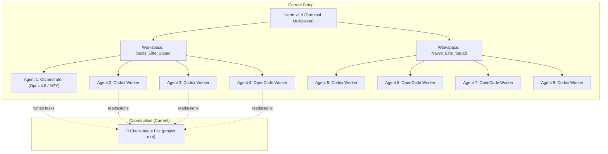
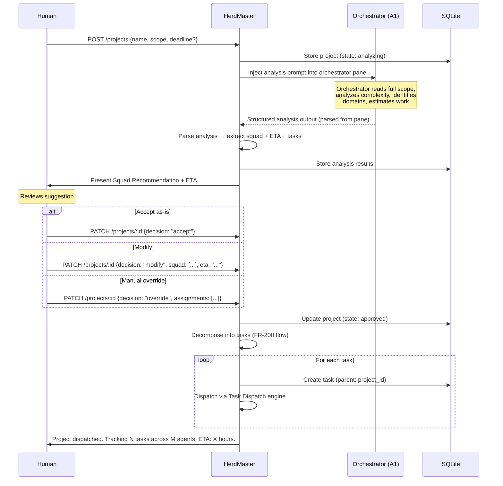
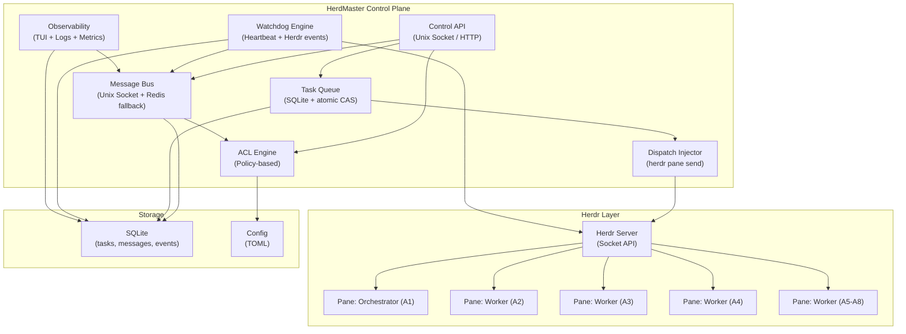
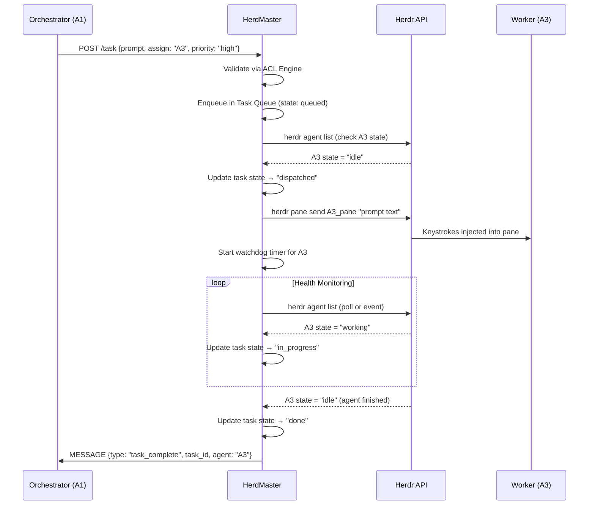
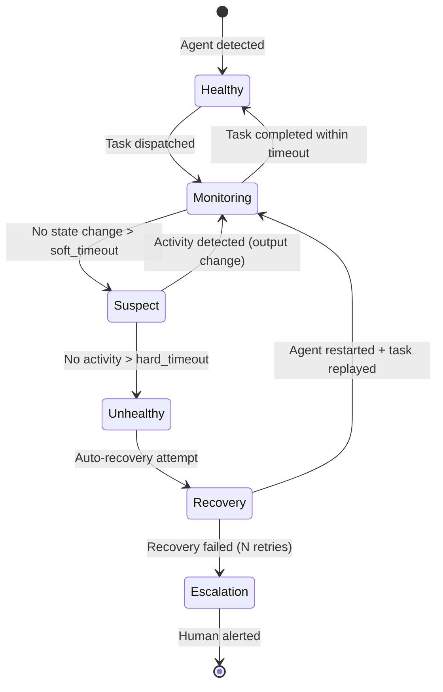
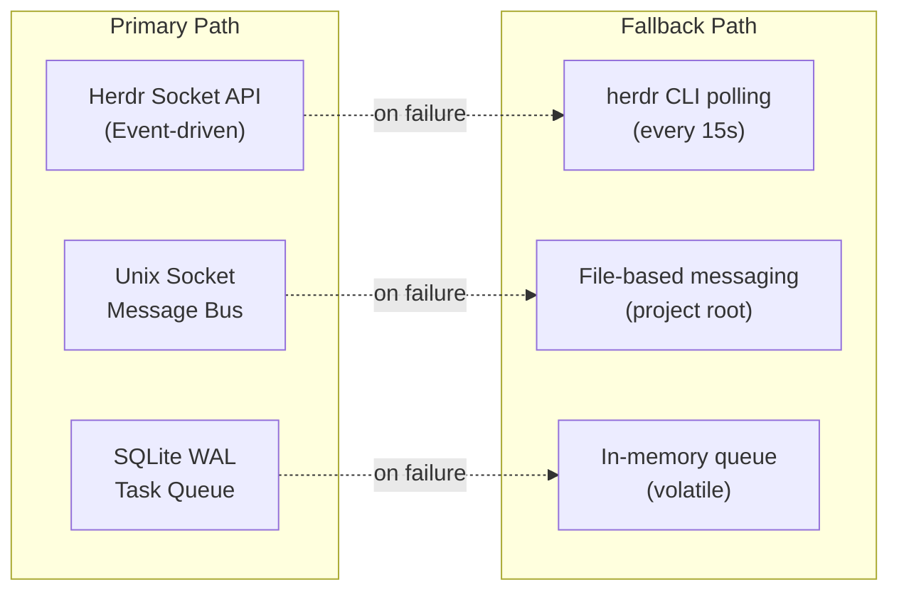

# HerdMaster — Multi-Agent Orchestration Control Plane
## Product Requirements Document (PRD) + System Design Specification

> **Version**: 1.1.0-draft  
> **Status**: RFC — Pending R&D Review  
> **Date**: 2026-06-21  
> **Author**: AI Solutions Architecture Team  
> **Stakeholders**: Sr. Product Management · Sr. Solutions Architect · Sr. Full-Stack Dev · Sr. QA · Sr. DevOps

---

## Table of Contents
1. [Executive Summary](#1-executive-summary)
2. [Current State Analysis](#2-current-state-analysis)
3. [Gap Analysis](#3-gap-analysis)
4. [Market & Competitive Landscape](#4-market--competitive-landscape)
5. [Product Vision & Goals](#5-product-vision--goals)
6. [Functional Requirements](#6-functional-requirements)
7. [Non-Functional Requirements](#7-non-functional-requirements)
8. [System Architecture](#8-system-architecture)
9. [Component Design](#9-component-design)
10. [API Contracts](#10-api-contracts)
11. [Data Model](#11-data-model)
12. [Failure Modes & Resilience](#12-failure-modes--resilience)
13. [Security & Access Control](#13-security--access-control)
14. [Deployment Strategy](#14-deployment-strategy)
15. [Testing Strategy](#15-testing-strategy)
16. [Success Metrics](#16-success-metrics)
17. [Risks & Mitigations](#17-risks--mitigations)
18. [Appendix: Competitive Analysis](#18-appendix-competitive-analysis)

---

## 1. Executive Summary

### Problem Statement
Our development team operates **8 concurrent AI coding agents** (Claude Code, Codex, OpenCode) managed through **Herdr** (terminal multiplexer). An orchestrator agent (Agent 1 / Opus 4.6) creates plans and assigns tasks to the other 7 agents. Currently, coordination relies on:

- **Manual file-based check-in/check-out** at the project root
- **Human intervention** to detect stuck/crashed agents
- **No real-time messaging** between orchestrator and workers
- **No automatic task injection** into agent panes

This is **amateur, fragile, and non-scalable**.

### Proposed Solution
**HerdMaster** — a lightweight, real-time orchestration control plane that runs alongside Herdr, providing:

| Capability | Mechanism |
|-----------|-----------|
| Real-time agent state monitoring | Event-driven via Herdr Socket API + heartbeat watchdog |
| Inter-agent messaging | Local message bus (Unix socket / Redis pub/sub) |
| **Project-level orchestration** | **Project Planner: scope analysis → squad suggestion → ETA → task decomposition** |
| Automatic task dispatch | Task queue with atomic claiming + direct pane injection |
| Failure detection & recovery | Watchdog with configurable health checks |
| Access control (who talks to whom) | Policy-based ACL engine |
| Orchestrator dashboard | Real-time TUI + optional web dashboard |

### Key Design Principles
1. **Herdr-native** — builds ON TOP of Herdr, never replaces it
2. **Zero-agent-modification** — agents don't need to know HerdMaster exists
3. **Failure-first design** — every component has a fallback
4. **Local-first** — no cloud dependency, runs on a single machine
5. **Protocol-agnostic** — works with any CLI-based agent (Claude, Codex, OpenCode, Gemini)

---

## 2. Current State Analysis

### 2.1 Infrastructure Stack



### 2.2 Current Workflow

| Step | Actor | Action | Mechanism |
|------|-------|--------|-----------|
| 1 | Orchestrator (A1) | Creates implementation plan | Writes to shared file |
| 2 | Orchestrator (A1) | Generates prompts for each agent | Creates prompt files (CX1.md, CX2.md...) |
| 3 | Human | Copies prompts to each agent pane | Manual paste into Herdr panes |
| 4 | Workers (A2-A8) | Sign in to check-in file | Write to project root file |
| 5 | Workers (A2-A8) | Execute their assigned task | Work in their Herdr pane |
| 6 | Workers (A2-A8) | Sign out of check-in file | Write completion to file |
| 7 | Human | Monitors for stuck/crashed agents | Visual inspection of Herdr sidebar |

### 2.3 What Herdr Provides (Per Official Docs)

| Capability | Available | Mechanism |
|-----------|-----------|-----------|
| Agent state detection | ✅ | `herdr agent list` — idle/working/blocked/done |
| Read pane output | ✅ | `herdr pane read <id>` |
| Send input to pane | ✅ | `herdr pane send <id> "text"` |
| Wait for agent state | ✅ | `herdr agent wait <id> --state done` |
| Event subscriptions | ✅ | Socket API event stream |
| Task routing | ❌ | Not a feature |
| Message bus | ❌ | Not a feature |
| Watchdog/failover | ❌ | Not a feature |
| Task queue | ❌ | Not a feature |
| ACL/permissions | ❌ | Not a feature |

> [!NOTE]
> Source: [herdr.dev/docs/socket-api/](https://herdr.dev/docs/socket-api/), [herdr.dev/agent-guide.md](https://herdr.dev/agent-guide.md), [SKILL.md](https://raw.githubusercontent.com/ogulcancelik/herdr/master/SKILL.md)

---

## 3. Gap Analysis

### 3.1 Critical Gaps

| ID | Gap | Impact | Severity |
|----|-----|--------|----------|
| G-001 | No real-time agent-to-agent messaging | Orchestrator can't notify workers of new tasks | 🔴 Critical |
| G-002 | No automatic task dispatch to idle agents | Human must manually paste prompts | 🔴 Critical |
| G-003 | No crash/stuck detection with auto-recovery | Stuck agents waste time until human notices | 🔴 Critical |
| G-004 | File-based check-in/out is unreliable | Race conditions, stale data, no atomicity | 🟡 High |
| G-005 | No access control for inter-agent communication | Any agent can write to any file | 🟡 High |
| G-006 | No centralized task queue with state tracking | No visibility into task lifecycle | 🟡 High |
| G-007 | No heartbeat/health monitoring | Can't distinguish "working slowly" from "crashed" | 🟡 High |
| G-008 | No audit trail of agent actions | No forensics when something goes wrong | 🟠 Medium |
| G-009 | No metrics/observability | Can't measure agent productivity | 🟠 Medium |

### 3.2 The "Why Can't They Just..." Question

> *"If they share the same Herdr infrastructure, why can't agents automatically pick up tasks?"*

**Answer (per Herdr official docs)**: Herdr is a **terminal multiplexer**, not a task dispatcher. Agents running in Herdr panes are isolated processes that:
1. Don't have awareness of other panes' content (unless they call `herdr pane read`)
2. Don't receive notifications when tasks are assigned to them
3. Don't have a concept of "task ownership" or "assignment"
4. Can only receive input via `herdr pane send` (raw keystrokes to their terminal)

**This gap is what HerdMaster fills.**

---

## 4. Market & Competitive Landscape

### 4.1 Existing Solutions (Research-Backed)

| Tool | Approach | Strengths | Weaknesses |
|------|----------|-----------|------------|
| **amux** (Mixpeek) | tmux control plane + watchdog + web dashboard | Self-healing watchdog, SQLite task queue, REST API | Python-only, tmux-specific, no Herdr integration |
| **CAO** (CLI Agent Orchestrator) | MCP-based supervisor-worker via tmux | Protocol-standard (MCP), flexible topology | Requires MCP setup, no built-in watchdog |
| **aid** (ai-dispatch) | Rust-based CLI team orchestrator | Fast, unified interface, cost tracking | Opinionated pipeline, less flexible |
| **AgentMux** | File-watching state machine + tmux | Deterministic pipeline, role-based | Sequential only, no real-time messaging |
| **dmux** | Git worktree + tmux per task | Branch isolation, lifecycle hooks | Task-centric, no inter-agent messaging |
| **Claude Agent Teams** | Native Anthropic feature | Built-in, shared task list | Claude-only, no Codex/OpenCode support |

### 4.2 HerdMaster Differentiators

| Feature | amux | CAO | aid | **HerdMaster** |
|---------|------|-----|-----|----------------|
| Herdr-native integration | ❌ | ❌ | ❌ | ✅ |
| Multi-agent-type support | Partial | ✅ | ✅ | ✅ |
| Real-time message bus | REST only | MCP | ❌ | ✅ (Unix socket + Redis fallback) |
| Watchdog with auto-recovery | ✅ | ❌ | ❌ | ✅ |
| Policy-based ACL | ❌ | ❌ | ❌ | ✅ |
| Direct pane injection | ❌ | Via MCP | ❌ | ✅ (via Herdr API) |
| Zero agent modification | ❌ | ❌ | ❌ | ✅ |
| Event-driven (not polling) | ❌ | Partial | ❌ | ✅ |

---

## 5. Product Vision & Goals

### 5.1 Vision Statement
> HerdMaster is the orchestration brain that makes Herdr's terminal infrastructure intelligent — enabling real-time, fault-tolerant, multi-agent coordination where the orchestrator agent can dispatch tasks, monitor health, and communicate with worker agents without human intervention.

### 5.2 Goals

| ID | Goal | Success Criteria |
|----|------|-----------------|
| OBJ-001 | Eliminate manual prompt pasting | 100% of tasks dispatched programmatically |
| OBJ-002 | Detect stuck/crashed agents within 30s | Watchdog fires within 30s of anomaly |
| OBJ-003 | Auto-recover crashed agents | 90% of crashes auto-recovered without human |
| OBJ-004 | Real-time orchestrator↔worker messaging | Message delivery latency < 500ms |
| OBJ-005 | Full task lifecycle visibility | Every task tracked: queued→assigned→in_progress→done/failed |
| OBJ-006 | Enforce communication policies | ACL prevents unauthorized agent interaction |
| OBJ-007 | Project-level orchestration with squad planning | Orchestrator receives full project → auto-suggests squad + ETA → decomposes into tasks |

### 5.3 Non-Goals (Explicit)
- ❌ Replace Herdr (we build ON TOP of it)
- ❌ Replace individual agents' intelligence (we dispatch, not decide)
- ❌ Cloud dependency (fully local, optionally networked)
- ❌ Agent-specific integrations (works with any CLI agent)

---

## 6. Functional Requirements

### 6.1 Message Bus (FR-100 series)

| ID | Requirement | Priority |
|----|-------------|----------|
| FR-101 | System SHALL provide a local message bus for agent-to-agent communication | P0 |
| FR-102 | Messages SHALL be typed: `task_assign`, `task_update`, `heartbeat`, `chat`, `alert` | P0 |
| FR-103 | Messages SHALL include sender, recipient(s), timestamp, payload, correlation_id | P0 |
| FR-104 | System SHALL support unicast (1:1), multicast (1:N), and broadcast (1:all) | P0 |
| FR-105 | System SHALL persist messages for audit trail (SQLite) | P1 |
| FR-106 | System SHALL support message TTL (auto-expire undelivered messages) | P1 |
| FR-107 | System SHALL provide message acknowledgment (delivered, read, acted_upon) | P1 |

### 6.2 Task Dispatch (FR-200 series)

| ID | Requirement | Priority |
|----|-------------|----------|
| FR-201 | Orchestrator SHALL be able to create tasks with: title, description, prompt, assigned_agent, priority, dependencies | P0 |
| FR-202 | System SHALL inject task prompts directly into agent panes via `herdr pane send` | P0 |
| FR-203 | Tasks SHALL have lifecycle states: `queued` → `assigned` → `dispatched` → `in_progress` → `done` / `failed` / `timeout` | P0 |
| FR-204 | System SHALL support atomic task claiming (prevent double-assignment) | P0 |
| FR-205 | System SHALL support task dependencies (Task B waits for Task A) | P1 |
| FR-206 | System SHALL support task priority levels: critical, high, normal, low | P1 |
| FR-207 | System SHALL auto-reassign failed/timed-out tasks to next available idle agent | P1 |
| FR-208 | System SHALL support task templates (reusable prompt patterns) | P2 |

### 6.3 Agent Health Monitoring (FR-300 series)

| ID | Requirement | Priority |
|----|-------------|----------|
| FR-301 | System SHALL monitor agent state via Herdr Socket API events (primary) | P0 |
| FR-302 | System SHALL implement heartbeat monitoring as fallback (secondary) | P0 |
| FR-303 | System SHALL detect "stuck" agents: agent in `working` state > configurable timeout | P0 |
| FR-304 | System SHALL detect "crashed" agents: no Herdr state change + no terminal output > timeout | P0 |
| FR-305 | System SHALL auto-restart crashed agents by respawning them in their Herdr pane | P1 |
| FR-306 | System SHALL replay the last dispatched task to a recovered agent | P1 |
| FR-307 | System SHALL escalate to human (alert) after N consecutive auto-recovery failures | P0 |
| FR-308 | System SHALL log all health events with timestamps | P0 |

### 6.4 Access Control (FR-400 series)

| ID | Requirement | Priority |
|----|-------------|----------|
| FR-401 | System SHALL enforce communication policies: who can send messages to whom | P0 |
| FR-402 | Policies SHALL support roles: `orchestrator`, `worker`, `reviewer`, `observer` | P0 |
| FR-403 | Orchestrator role SHALL be able to send to all agents | P0 |
| FR-404 | Worker role SHALL only reply to orchestrator (by default) | P0 |
| FR-405 | Policies SHALL be configurable via TOML/YAML config file | P1 |
| FR-406 | System SHALL support dynamic role changes at runtime | P2 |

### 6.5 Observability (FR-500 series)

| ID | Requirement | Priority |
|----|-------------|----------|
| FR-501 | System SHALL provide a real-time TUI dashboard showing all agents + tasks | P0 |
| FR-502 | Dashboard SHALL show: agent name, state, current task, uptime, last heartbeat | P0 |
| FR-503 | System SHALL emit structured logs (JSON) for all events | P1 |
| FR-504 | System SHALL track metrics: tasks/agent, avg completion time, failure rate | P1 |
| FR-505 | System SHALL optionally expose a web dashboard (localhost) | P2 |

### 6.6 Project Mode (FR-600 series)

> [!IMPORTANT]
> **Project Mode** operates at a higher level than Task Dispatch. Instead of dispatching individual tasks, the user submits a **full project scope** to the orchestrator agent. The orchestrator analyzes the scope, suggests an optimal squad composition, provides an ETA, decomposes the project into tasks, and dispatches them — all through a structured pipeline.

#### 6.6.1 Operational Modes

HerdMaster supports two operational modes:

| Mode | Scope | Input | Output |
|------|-------|-------|--------|
| **Task Mode** (FR-200) | Individual task | Single prompt + assignment | Task dispatched to 1 agent |
| **Project Mode** (FR-600) | Full project | Project spec document | Squad suggestion + ETA + N tasks auto-decomposed |

#### 6.6.2 Project Mode Requirements

| ID | Requirement | Priority |
|----|-------------|----------|
| FR-601 | System SHALL support a `project` entity with: name, description, full_scope_prompt, complexity_tier, deadline (optional) | P0 |
| FR-602 | Orchestrator agent SHALL receive the full project scope via pane injection and be instructed to produce a structured analysis | P0 |
| FR-603 | Orchestrator's analysis output SHALL be parsed to extract: squad recommendation, ETA estimate, and task breakdown | P0 |
| FR-604 | Squad recommendation SHALL include: suggested agents (by type/capability), role assignments (lead, implementer, reviewer), and rationale | P0 |
| FR-605 | ETA estimate SHALL be computed based on: number of agents assigned, historical avg task completion time per agent type, task dependency chain depth, complexity tier | P0 |
| FR-606 | System SHALL present the squad recommendation + ETA to the human for approval or override | P0 |
| FR-607 | Human SHALL be able to: accept suggestion as-is, modify squad composition, modify ETA, or reject and provide manual assignments | P0 |
| FR-608 | Upon approval, system SHALL auto-decompose the project into individual tasks and enqueue them following Task Dispatch (FR-200) flow | P0 |
| FR-609 | Each task generated from a project SHALL reference its parent `project_id` | P1 |
| FR-610 | System SHALL track project-level progress: % of child tasks completed, overall project state | P1 |
| FR-611 | System SHALL support project templates for common project types (feature, bugfix, refactor, migration) | P2 |
| FR-612 | System SHALL maintain a historical knowledge base of past projects for improved ETA accuracy over time | P2 |

#### 6.6.3 Project Mode Flow



#### 6.6.4 Squad Recommendation Engine

The orchestrator agent produces squad suggestions based on a structured prompt. HerdMaster provides context to the orchestrator:

**Context injected into orchestrator's analysis prompt**:
```
You are the Tech Lead orchestrator. Analyze the following project scope and produce a structured plan.

PROJECT SCOPE:
{full_scope_text}

AVAILABLE AGENTS:
- A2: Codex (idle) — strengths: fast execution, good at boilerplate
- A3: Codex (working) — ETA to idle: ~15 min
- A4: OpenCode (idle) — strengths: creative solutions, complex logic
- A5: Codex (idle) — strengths: fast execution, testing
- A6: OpenCode (idle) — strengths: refactoring, architecture
- A7: OpenCode (working) — ETA to idle: ~30 min
- A8: Codex (idle) — strengths: documentation, API design

HISTORICAL METRICS:
- Avg task completion (Codex): 25 min
- Avg task completion (OpenCode): 35 min
- Avg tasks per project of similar complexity: 12

Produce your response in EXACTLY this JSON format:
{
  "complexity_tier": "S|M|L|XL",
  "squad": [
    {"agent": "A2", "role": "implementer", "rationale": "..."},
    {"agent": "A4", "role": "lead_implementer", "rationale": "..."},
    {"agent": "A6", "role": "reviewer", "rationale": "..."}
  ],
  "eta_hours": 2.5,
  "eta_rationale": "12 tasks, 3 agents, avg 25 min/task, with parallelism...",
  "tasks": [
    {"title": "...", "description": "...", "prompt": "...", "assigned_to": "A2", "depends_on": [], "priority": "high"},
    ...
  ]
}
```

#### 6.6.5 ETA Calculation Model

| Input | Source | Weight |
|-------|--------|--------|
| Number of tasks decomposed | Orchestrator analysis | Primary |
| Number of agents assigned | Squad recommendation | Primary |
| Historical avg completion time per agent type | `tasks` table analytics | Secondary |
| Task dependency chain depth (critical path) | Dependency graph analysis | Primary |
| Complexity tier (S/M/L/XL) | Orchestrator assessment | Multiplier |
| Agent current availability | Herdr agent states | Adjustment |

**Formula (simplified)**:
```
critical_path_depth = longest_dependency_chain(tasks)
parallelism_factor = min(available_agents, max_independent_tasks)
avg_task_time = weighted_avg(agent_type_historical_times)
complexity_multiplier = {S: 0.8, M: 1.0, L: 1.3, XL: 1.8}

eta_hours = (critical_path_depth * avg_task_time * complexity_multiplier) / parallelism_factor
```

> [!NOTE]
> The ETA is explicitly labeled as **high-level / initial estimate**. It is presented as a range (optimistic / expected / pessimistic) rather than a single number. Historical data improves accuracy over time (FR-612).

---

## 7. Non-Functional Requirements

| ID | Requirement | Target |
|----|-------------|--------|
| NFR-001 | Message delivery latency | < 500ms (99th percentile) |
| NFR-002 | Watchdog detection time | < 30 seconds from anomaly |
| NFR-003 | Memory footprint | < 50MB RSS for control plane |
| NFR-004 | CPU overhead | < 2% single core at steady state |
| NFR-005 | Startup time | < 3 seconds cold start |
| NFR-006 | Max concurrent agents | 32 (initial), 128 (future) |
| NFR-007 | Message throughput | > 1000 msg/sec sustained |
| NFR-008 | Data persistence | SQLite, WAL mode, < 100ms write |
| NFR-009 | Graceful degradation | If HerdMaster crashes, Herdr continues unaffected |
| NFR-010 | Platform support | Linux (primary), macOS, WSL2 |

---

## 8. System Architecture

### 8.1 High-Level Architecture



### 8.2 Communication Flow



### 8.3 Watchdog Flow (Failure Detection)



### 8.4 Technology Stack

| Layer | Technology | Rationale |
|-------|-----------|-----------|
| **Language** | **Python 3.12+** | Team expertise, rapid iteration, rich async stdlib, `.venv` already in project |
| **Async Runtime** | `asyncio` | Stdlib, handles socket server + watchdog + message bus concurrently |
| **Message Bus** | Unix domain socket (primary) | Zero-network, lowest latency, Python `asyncio` native |
| **Message Bus Fallback** | Redis pub/sub (optional) | Networked environments, multi-machine |
| **Task Queue** | SQLite (WAL mode) + CAS | `sqlite3` stdlib, atomic, embedded, zero-dependency |
| **Config** | TOML | `tomllib` stdlib (3.11+), Herdr uses TOML — consistency |
| **TUI** | `textual` or `rich` | Python-native, rapid development, beautiful output |
| **Web Dashboard** | Optional: FastAPI + Vite | P2 feature, localhost only |
| **Logging** | `structlog` (JSON) | Structured, async-safe, production-grade |
| **CLI** | `click` or `typer` | Elegant CLI with auto-generated help |
| **Integration** | Herdr Socket API + CLI | `subprocess` for CLI, `asyncio` streams for socket |
| **Packaging** | `pip install` / `pipx` / PyInstaller | Easy install, optional single binary via PyInstaller |

> [!NOTE]
> **Why not Rust?** Rust solves performance problems we don't have (8-32 agents, <100 msg/sec). Python gives us 2-3x faster time-to-market with the team's existing expertise. If HerdMaster scales to 128+ agents with latency-critical paths, a targeted Rust rewrite of the hot path (message bus) can be considered — but not before shipping v1.0.

---

## 9. Component Design

### 9.1 Message Bus

**Purpose**: Reliable, low-latency message delivery between agents.

**Design**:
- Unix domain socket at `~/.config/herdmaster/herdmaster.sock`
- JSON-RPC 2.0 protocol (same as Herdr's socket API for consistency)
- Pub/sub channels per agent + broadcast channel
- Message persistence to SQLite for audit trail
- Configurable message TTL (default: 5 minutes)

**Message Schema**:
```json
{
  "id": "uuid-v7",
  "type": "task_assign | task_update | heartbeat | chat | alert | state_change",
  "from": "agent_id",
  "to": "agent_id | broadcast | group:workers",
  "correlation_id": "uuid (for request-response pairing)",
  "timestamp": "ISO-8601",
  "ttl_seconds": 300,
  "payload": { }
}
```

### 9.2 Task Queue

**Purpose**: Durable, atomic task lifecycle management.

**Design**:
- SQLite database with WAL mode for concurrent reads
- Compare-And-Swap (CAS) for atomic task claiming
- Task states: `queued` → `assigned` → `dispatched` → `in_progress` → `done` | `failed` | `timeout` | `cancelled`
- Dependency graph: tasks can declare `depends_on: [task_id]`
- Priority queue: critical > high > normal > low

### 9.3 Dispatch Injector

**Purpose**: Bridge between Task Queue and Herdr panes.

**Design**:
- Reads task from queue
- Resolves agent's Herdr pane ID via `herdr agent list --json`
- Checks agent state is `idle` before injection
- Calls `herdr pane send <pane_id> "<prompt>"` to inject
- If agent is not idle, queues for retry with exponential backoff
- Records dispatch event with timestamp

**Prompt Injection Strategy**:
```bash
# Step 1: Ensure agent is at prompt (idle state)
herdr agent wait <agent_id> --state idle --timeout 60

# Step 2: Inject the task prompt
herdr pane send <pane_id> "Task: <task_prompt>"

# Step 3: Confirm injection (press Enter)
herdr pane send <pane_id> $'\n'
```

### 9.4 Watchdog Engine

**Purpose**: Detect and recover from agent failures.

**Design (Dual-Layer)**:

| Layer | Mechanism | Detection Time | Fallback |
|-------|-----------|---------------|----------|
| **Primary** | Herdr Socket API event subscription (agent state changes) | Real-time (< 1s) | Falls back to Secondary |
| **Secondary** | Periodic polling: `herdr agent list` + `herdr pane read` output diff | Configurable (default 15s) | Falls back to Tertiary |
| **Tertiary** | Terminal output hash comparison (detect frozen terminal) | 30s | Escalate to human |

**Health Check Logic**:
```
IF agent.state == "working" AND time_since_last_output_change > soft_timeout:
    mark as SUSPECT
    
IF agent.state == SUSPECT AND time_since_last_output_change > hard_timeout:
    mark as UNHEALTHY
    trigger auto_recovery()

IF auto_recovery_attempts > max_retries:
    escalate_to_human(agent)
```

**Auto-Recovery Procedure**:
1. Kill the hung agent process in the pane
2. Respawn the agent (e.g., `herdr pane run <pane_id> "codex"`)
3. Wait for agent to reach `idle` state
4. Replay the last dispatched task
5. Reset watchdog timers

### 9.5 ACL Engine

**Purpose**: Policy-based access control for inter-agent communication.

**Config Example** (`herdmaster.toml`):
```toml
[acl]
# Default policy: deny all, then allow explicitly
default_policy = "deny"

[[acl.roles]]
name = "orchestrator"
agents = ["A1"]
can_send_to = ["*"]          # Can message anyone
can_receive_from = ["*"]     # Can receive from anyone
can_dispatch_tasks = true
can_reassign_tasks = true

[[acl.roles]]
name = "worker"
agents = ["A2", "A3", "A4", "A5", "A6", "A7", "A8"]
can_send_to = ["orchestrator"]    # Can only reply to orchestrator
can_receive_from = ["orchestrator"]
can_dispatch_tasks = false
can_reassign_tasks = false

[[acl.roles]]
name = "peer_reviewer"
agents = ["A2", "A3"]        # These two can also talk to each other
can_send_to = ["orchestrator", "peer_reviewer"]
can_receive_from = ["orchestrator", "peer_reviewer"]
```

---

## 10. API Contracts

### 10.1 Control API (Unix Socket / Optional HTTP)

#### Project Management (Project Mode)
```
POST   /projects              - Create a new project (triggers orchestrator analysis)
GET    /projects               - List all projects (with filters)
GET    /projects/:id           - Get project details + child tasks + progress
PATCH  /projects/:id           - Accept/modify/override squad recommendation
DELETE /projects/:id           - Cancel project + all child tasks
GET    /projects/:id/eta       - Get current ETA (recalculated live)
GET    /projects/:id/tasks     - List all tasks belonging to this project
POST   /projects/:id/approve   - Approve squad + ETA, trigger task decomposition & dispatch
```

**POST /projects — Request Body**:
```json
{
  "name": "User Authentication System",
  "scope": "Build a complete user auth system with JWT, OAuth2 (Google/GitHub), role-based access control, password reset flow, and email verification. Include API endpoints, middleware, database migrations, and unit tests.",
  "deadline": "2026-06-25T18:00:00Z",
  "preferred_agents": ["A2", "A4", "A6"],
  "complexity_hint": "L"
}
```

**GET /projects/:id — Response** (after analysis):
```json
{
  "id": "proj-001",
  "name": "User Authentication System",
  "state": "awaiting_approval",
  "analysis": {
    "complexity_tier": "L",
    "squad": [
      {"agent": "A4", "role": "lead_implementer", "rationale": "OpenCode excels at complex auth logic"},
      {"agent": "A2", "role": "implementer", "rationale": "Fast at API boilerplate and migrations"},
      {"agent": "A5", "role": "implementer", "rationale": "Strong at testing, will handle unit tests"},
      {"agent": "A6", "role": "reviewer", "rationale": "Architecture review capability"}
    ],
    "eta": {
      "optimistic_hours": 1.5,
      "expected_hours": 2.5,
      "pessimistic_hours": 4.0,
      "rationale": "14 tasks, 4 agents, critical path depth 4, avg 25 min/task with L complexity multiplier"
    },
    "tasks_preview": [
      {"title": "Database schema + migrations", "assigned_to": "A2", "priority": "critical"},
      {"title": "JWT auth middleware", "assigned_to": "A4", "priority": "high", "depends_on": ["schema"]},
      "... (14 tasks total)"
    ]
  },
  "progress": {
    "total_tasks": 14,
    "completed": 0,
    "in_progress": 0,
    "failed": 0,
    "percent_complete": 0
  }
}
```

#### Task Management
```
POST   /tasks              - Create a new task (standalone or under a project)
GET    /tasks               - List all tasks (with filters)
GET    /tasks/:id           - Get task details
PATCH  /tasks/:id           - Update task (reassign, cancel, etc.)
DELETE /tasks/:id           - Cancel/remove task
```

#### Agent Management
```
GET    /agents              - List all agents with state
GET    /agents/:id          - Get agent details + history
POST   /agents/:id/message  - Send message to agent
POST   /agents/:id/restart  - Trigger agent restart
GET    /agents/:id/health   - Get health status
GET    /agents/:id/metrics  - Get agent performance metrics (avg completion time, etc.)
```

#### Message Bus
```
POST   /messages            - Send a message
GET    /messages             - List messages (with filters)
WS     /messages/stream     - WebSocket stream for real-time messages
```

#### System
```
GET    /status              - System health + uptime
GET    /metrics             - Prometheus-compatible metrics
POST   /config/reload       - Hot-reload configuration
```

---

## 11. Data Model

### 11.1 SQLite Schema

```sql
-- Agents registry
CREATE TABLE agents (
    id          TEXT PRIMARY KEY,        -- "A1", "A2", etc.
    label       TEXT NOT NULL,           -- Human-readable name
    type        TEXT NOT NULL,           -- "claude", "codex", "opencode"
    role        TEXT NOT NULL,           -- "orchestrator", "worker"
    herdr_pane  TEXT,                    -- Current Herdr pane ID
    herdr_ws    TEXT,                    -- Current Herdr workspace
    state       TEXT DEFAULT 'unknown',  -- idle, working, blocked, done, unknown
    health      TEXT DEFAULT 'healthy',  -- healthy, suspect, unhealthy, recovering
    strengths   TEXT,                    -- JSON: ["fast execution", "testing", "complex logic"]
    avg_task_seconds INTEGER,            -- Rolling avg task completion time
    tasks_completed INTEGER DEFAULT 0,   -- Lifetime completed tasks
    last_heartbeat  DATETIME,
    last_output_hash TEXT,
    created_at  DATETIME DEFAULT CURRENT_TIMESTAMP,
    updated_at  DATETIME DEFAULT CURRENT_TIMESTAMP
);

-- Projects (Project Mode)
CREATE TABLE projects (
    id              TEXT PRIMARY KEY,        -- "proj-001"
    name            TEXT NOT NULL,
    scope           TEXT NOT NULL,            -- Full project scope/prompt
    state           TEXT DEFAULT 'submitted', -- submitted, analyzing, awaiting_approval, approved, in_progress, completed, failed, cancelled
    complexity_tier TEXT,                     -- S, M, L, XL (from orchestrator analysis)
    deadline        DATETIME,                -- Optional user-provided deadline
    
    -- Squad recommendation (from orchestrator)
    squad_recommendation TEXT,               -- JSON: [{agent, role, rationale}, ...]
    squad_approved       TEXT,               -- JSON: final approved squad (may differ from recommendation)
    
    -- ETA (from analysis + calculation)
    eta_optimistic_hours REAL,
    eta_expected_hours   REAL,
    eta_pessimistic_hours REAL,
    eta_rationale        TEXT,
    
    -- Analysis output
    orchestrator_analysis TEXT,              -- Raw JSON output from orchestrator
    human_decision        TEXT,              -- "accept", "modify", "override"
    human_notes           TEXT,              -- Human's modification notes
    
    -- Progress tracking
    total_tasks     INTEGER DEFAULT 0,
    completed_tasks INTEGER DEFAULT 0,
    failed_tasks    INTEGER DEFAULT 0,
    
    created_by      TEXT,                    -- Human or system identifier
    approved_at     DATETIME,
    completed_at    DATETIME,
    created_at      DATETIME DEFAULT CURRENT_TIMESTAMP,
    updated_at      DATETIME DEFAULT CURRENT_TIMESTAMP
);

-- Task queue
CREATE TABLE tasks (
    id          TEXT PRIMARY KEY,        -- UUID v7
    project_id  TEXT REFERENCES projects(id),  -- NULL for standalone tasks
    title       TEXT NOT NULL,
    description TEXT,
    prompt      TEXT NOT NULL,           -- The actual prompt to inject
    state       TEXT DEFAULT 'queued',   -- queued, assigned, dispatched, in_progress, done, failed, timeout, cancelled
    priority    INTEGER DEFAULT 2,       -- 0=critical, 1=high, 2=normal, 3=low
    assigned_to TEXT REFERENCES agents(id),
    depends_on  TEXT,                    -- JSON array of task IDs
    created_by  TEXT REFERENCES agents(id),
    dispatched_at DATETIME,
    completed_at  DATETIME,
    duration_seconds INTEGER,            -- Actual time taken (for ETA learning)
    error_message TEXT,
    retry_count INTEGER DEFAULT 0,
    max_retries INTEGER DEFAULT 3,
    timeout_seconds INTEGER DEFAULT 1800, -- 30 min default
    created_at  DATETIME DEFAULT CURRENT_TIMESTAMP,
    updated_at  DATETIME DEFAULT CURRENT_TIMESTAMP,
    version     INTEGER DEFAULT 1        -- For CAS (Compare-And-Swap)
);

-- Message log
CREATE TABLE messages (
    id          TEXT PRIMARY KEY,
    type        TEXT NOT NULL,
    from_agent  TEXT REFERENCES agents(id),
    to_agent    TEXT,                    -- NULL for broadcast
    correlation_id TEXT,
    payload     TEXT NOT NULL,           -- JSON
    delivered   BOOLEAN DEFAULT FALSE,
    acknowledged BOOLEAN DEFAULT FALSE,
    created_at  DATETIME DEFAULT CURRENT_TIMESTAMP,
    expires_at  DATETIME
);

-- Health events (audit trail)
CREATE TABLE health_events (
    id          INTEGER PRIMARY KEY AUTOINCREMENT,
    agent_id    TEXT REFERENCES agents(id),
    event_type  TEXT NOT NULL,           -- state_change, crash_detected, recovery_attempt, recovery_success, recovery_failed, escalation
    details     TEXT,                    -- JSON
    created_at  DATETIME DEFAULT CURRENT_TIMESTAMP
);

-- Project history (for ETA learning - FR-612)
CREATE TABLE project_history (
    id              INTEGER PRIMARY KEY AUTOINCREMENT,
    project_id      TEXT REFERENCES projects(id),
    complexity_tier TEXT,
    total_tasks     INTEGER,
    agents_used     INTEGER,
    estimated_hours REAL,
    actual_hours    REAL,
    accuracy_pct    REAL,               -- How close was the estimate
    completed_at    DATETIME DEFAULT CURRENT_TIMESTAMP
);

-- Indexes
CREATE INDEX idx_tasks_state ON tasks(state);
CREATE INDEX idx_tasks_assigned ON tasks(assigned_to);
CREATE INDEX idx_tasks_priority ON tasks(priority, state);
CREATE INDEX idx_tasks_project ON tasks(project_id);
CREATE INDEX idx_messages_to ON messages(to_agent, delivered);
CREATE INDEX idx_health_agent ON health_events(agent_id, created_at);
CREATE INDEX idx_projects_state ON projects(state);
CREATE INDEX idx_project_history_complexity ON project_history(complexity_tier);
```

---

## 12. Failure Modes & Resilience

### 12.1 Failure Scenarios

| Scenario | Detection | Recovery | Fallback |
|----------|-----------|----------|----------|
| **Agent crashes mid-task** | Herdr reports state → `unknown` + no output | Auto-restart agent, replay task | Escalate to human after 3 retries |
| **Agent hangs (infinite loop)** | Output hash unchanged > hard_timeout | Kill process, restart, replay | Reassign task to different agent |
| **Herdr Socket API unavailable** | Connection error to Herdr socket | Retry with exponential backoff | Fall back to CLI polling (`herdr agent list`) |
| **HerdMaster crashes** | N/A (Herdr continues unaffected) | Auto-restart via systemd/supervisor | Agents continue working, just uncoordinated |
| **SQLite corruption** | Write failure detected | WAL checkpoint + backup restore | Start fresh DB, rebuild from Herdr state |
| **Message bus deadlock** | Timeout on socket operations | Close + reopen socket | Fall back to file-based messaging (legacy mode) |
| **Network partition (multi-machine)** | Redis pub/sub timeout | Switch to local-only Unix socket | Queue messages for retry when reconnected |

### 12.2 Resilience Design



---

## 13. Security & Access Control

### 13.1 Threat Model

| Threat | Mitigation |
|--------|-----------|
| Rogue agent sends unauthorized commands | ACL engine enforces role-based permissions |
| Agent impersonation | Socket connections identified by Herdr pane ID (not spoofable) |
| Data leak via message bus | All communication is local (Unix socket), no network exposure |
| Task injection from outside | Control API bound to localhost only, optional auth token |
| Privilege escalation | Orchestrator role is the only role that can dispatch tasks |

### 13.2 Authentication Model
- **Local mode**: Agent identity derived from Herdr pane ID (trusted, kernel-enforced)
- **Network mode** (optional): Bearer token in HTTP header for remote API access
- **Admin access**: Config file owns the ACL; only human can edit it

---

## 14. Deployment Strategy

### 14.1 Installation

```bash
# Option 1: Single binary (preferred)
curl -fsSL https://herdmaster.dev/install.sh | sh

# Option 2: From source
git clone https://github.com/org/herdmaster
cd herdmaster && cargo build --release

# Option 3: As Herdr plugin
herdr plugin install herdmaster
```

### 14.2 Runtime

```bash
# Start alongside Herdr
herdmaster start

# Or as a systemd service (recommended)
systemctl --user enable herdmaster
systemctl --user start herdmaster

# Verify
herdmaster status
```

### 14.3 Configuration

```
~/.config/herdmaster/
├── config.toml          # Main configuration
├── herdmaster.db        # SQLite database
├── herdmaster.log       # Structured log file
└── herdmaster.sock      # Unix domain socket
```

---

## 15. Testing Strategy

### 15.1 Test Levels

| Level | Scope | Tools | Coverage Target |
|-------|-------|-------|----------------|
| **Unit Tests** | Individual components (ACL, TaskQueue, MessageBus) | `pytest` + `pytest-asyncio` | > 80% line coverage |
| **Integration Tests** | Component interactions (TaskQueue + Dispatch + Herdr) | `pytest` + mock Herdr socket | > 70% |
| **E2E Tests** | Full workflow: create task → dispatch → monitor → complete | Real Herdr instance + test agents | Key flows |
| **Chaos Tests** | Failure scenarios: kill agents, corrupt DB, drop socket | Custom chaos scripts | All failure modes |
| **Load Tests** | 32 concurrent agents, 1000 tasks | `locust` or `pytest-benchmark` | NFR compliance |

### 15.2 Key Test Scenarios

| ID | Scenario | Expected Outcome |
|----|----------|-----------------|
| TC-001 | Orchestrator creates task, worker is idle | Task dispatched within 2s |
| TC-002 | Orchestrator creates task, worker is busy | Task queued, dispatched when worker goes idle |
| TC-003 | Worker crashes mid-task | Watchdog detects, restarts, replays task |
| TC-004 | 3 consecutive recovery failures | Human escalation alert fired |
| TC-005 | Worker tries to message another worker (ACL denied) | Message rejected, error logged |
| TC-006 | Herdr socket API goes down | System falls back to CLI polling |
| TC-007 | HerdMaster restarts | Recovers state from SQLite, resumes monitoring |
| TC-008 | 32 agents, 100 tasks dispatched simultaneously | All tasks assigned without duplication |
| TC-009 | Project submitted → orchestrator analyzes → squad suggested | Squad + ETA returned within 60s |
| TC-010 | Human modifies squad recommendation | Modified squad used for task dispatch |
| TC-011 | Project with 15 tasks, dependency chain depth 4 | Tasks dispatched respecting dependency order |
| TC-012 | ETA accuracy vs historical data | ETA within 30% of actual for M/L projects |

---

## 16. Success Metrics

### 16.1 Key Performance Indicators (KPIs)

| KPI | Baseline (Current) | Target (HerdMaster) | Measurement |
|-----|---------------------|---------------------|-------------|
| Time to dispatch task | ~5 min (manual paste) | < 5 seconds | Task queue timestamps |
| Stuck agent detection time | ~30 min (human notices) | < 30 seconds | Watchdog event logs |
| Agent crash recovery time | ~10 min (human restarts) | < 60 seconds | Health event logs |
| Task completion visibility | Binary (file exists or not) | Full lifecycle tracking | Dashboard + DB |
| Human intervention rate | ~50% of task cycles | < 10% | Escalation event count |
| Agent utilization | Unknown | > 80% active time | Metrics engine |

---

## 17. Risks & Mitigations

| Risk | Probability | Impact | Mitigation |
|------|-------------|--------|-----------|
| Herdr Socket API changes break integration | Medium | High | Pin to Herdr version; abstract behind adapter layer |
| `herdr pane send` unreliable for long prompts | Medium | High | Chunk prompts; use file-based prompt delivery as fallback |
| Agent doesn't respond to injected prompt | Low | Medium | Validate agent is at prompt before injection; retry logic |
| SQLite performance at scale (>10K tasks) | Low | Medium | Periodic archival; table partitioning by date |
| Watchdog false positives (agent thinking, not stuck) | Medium | Medium | Tunable timeouts per agent type; output diff heuristics |
| Herdr plugin ecosystem conflicts | Low | Low | Run as standalone process, not a Herdr plugin |

---

## 18. Appendix: Competitive Analysis

### 18.1 Detailed Feature Comparison

| Feature | Herdr (Alone) | amux | CAO | HerdMaster |
|---------|--------------|------|-----|------------|
| **Terminal multiplexer** | ✅ Native | tmux | tmux | Herdr (leverages) |
| **Agent state tracking** | ✅ Sidebar | ✅ Dashboard | ✅ MCP | ✅ Herdr API + Watchdog |
| **Task queue** | ❌ | ✅ SQLite | ❌ | ✅ SQLite CAS |
| **Task dispatch** | ❌ | Partial (REST) | ✅ MCP | ✅ Direct pane injection |
| **Watchdog** | ❌ | ✅ Self-healing | ❌ | ✅ Tri-layer |
| **Message bus** | ❌ | REST channels | MCP | ✅ Unix socket + Redis |
| **ACL/permissions** | ❌ | ❌ | ❌ | ✅ Policy-based |
| **Agent type agnostic** | ✅ | Partial | ✅ | ✅ |
| **Zero agent modification** | N/A | ❌ | ❌ | ✅ |
| **Fallback mechanisms** | N/A | ❌ | ❌ | ✅ Tri-layer |
| **Audit trail** | ❌ | Partial | ❌ | ✅ Full SQLite |
| **Web dashboard** | ❌ | ✅ | ❌ | ✅ (P2) |
| **TUI dashboard** | ✅ (Herdr itself) | ❌ | ❌ | ✅ Native |

### 18.2 Research Sources

| Source | URL | What was analyzed |
|--------|-----|-------------------|
| Herdr Official Docs | https://herdr.dev/docs/ | Full API surface, architecture, limitations |
| Herdr Socket API | https://herdr.dev/docs/socket-api/ | Integration capabilities |
| Herdr SKILL.md | github.com/ogulcancelik/herdr/SKILL.md | Agent-side capabilities |
| amux (Mixpeek) | github.com/mixpeek/amux | Watchdog, task queue, channels |
| CAO | GitHub (CLI Agent Orchestrator) | MCP-based orchestration |
| aid (ai-dispatch) | GitHub | Unified CLI dispatch |
| AgentMux | GitHub | File-watching state machine |
| dmux | GitHub | Git worktree isolation |
| ClawMux | GitHub | Scrum-style pipeline |
| Claude Agent Teams | Anthropic docs | Native multi-agent |
| MCP Specification | modelcontextprotocol.io | Protocol design |
| A2A Protocol | Google Agent-to-Agent | Inter-agent protocol |
| ACP | agentcommunicationprotocol.dev | Agent communication |
| LangGraph | langchain.com | Stateful graph orchestration |
| CrewAI | GitHub | Role-based agent teams |

---

> [!IMPORTANT]
> **Next Steps for R&D Team**:
> 1. **Review this PRD** — flag any missing requirements or incorrect assumptions
> 2. **Choose technology stack** — Rust (performance) vs Go (simplicity) vs Python (speed-to-market)
> 3. **Prioritize MVP scope** — Recommend: Message Bus + Task Dispatch + Basic Watchdog
> 4. **Spike on Herdr Socket API** — validate `herdr pane send` reliability for long prompts
> 5. **Architecture Decision Record (ADR)** — document stack choice and trade-offs
