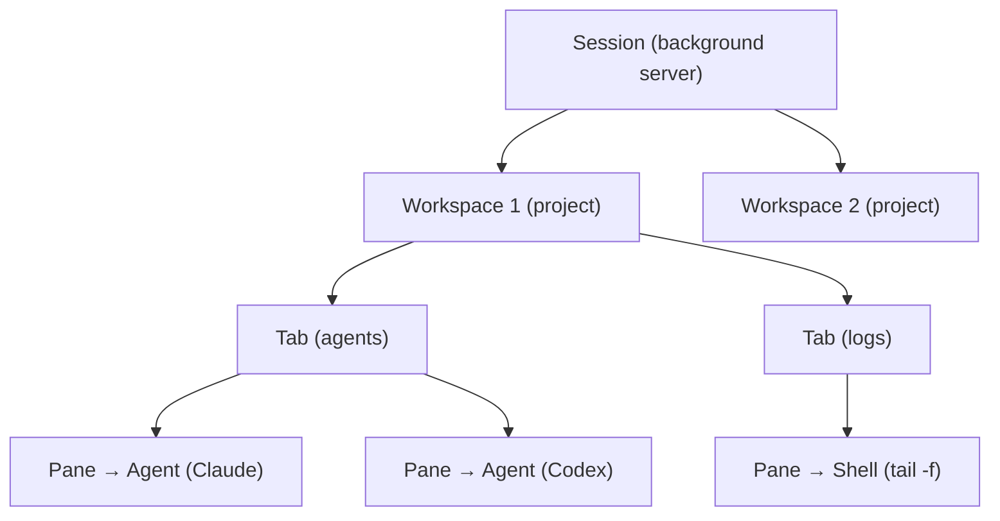

# Herdr Deep Research — Multi-Agent Orchestration Capabilities

> [!IMPORTANT]
> Every claim in this document is backed by official Herdr vendor documentation. Sources are cited inline.

---

## Your Core Question

> If agents share the same Herdr infrastructure and can see each other's communication, why can't an orchestrator agent (Agent 1) write a task to a shared file/folder and have the other agents automatically recognize "hey, this task is for you" and pick it up?

## The Answer (Backed by Official Docs)

**Herdr does NOT do this. By design.**

Herdr is explicitly **not an agent manager or task dispatcher**. It is a **terminal multiplexer** — the same category as tmux, but agent-aware.

> Source: [herdr.dev](https://herdr.dev) — *"Herdr is to coding agents what tmux is to terminals: a multiplexer that runs where your agents run."*

> Source: [herdr.dev/agent-guide.md](https://herdr.dev/agent-guide.md) — *"Herdr is a terminal workspace manager for AI coding agents. Like tmux, it is a multiplexer: a background server owns real terminal processes, and clients attach to render them."*

> Source: [herdr.dev homepage comparison](https://herdr.dev) — *"Most agent managers are apps. Herdr is a multiplexer."*

---

## What Herdr Actually Does (Official Architecture)

### The Concept Model
Source: [agent-guide.md](https://herdr.dev/agent-guide.md)



| Concept | What it is | Source |
|---------|-----------|--------|
| **Session** | Persistent background server namespace | agent-guide.md |
| **Workspace** | Project-level container. Owns tabs/panes. Sidebar rolls up agent states per workspace | agent-guide.md |
| **Tab** | Layout inside a workspace | agent-guide.md |
| **Pane** | A **real terminal**. Survives client detach | agent-guide.md |
| **Agent** | A process Herdr **recognizes** inside a pane. States: `working`, `blocked`, `done`, `idle`, `unknown` | agent-guide.md, SKILL.md |

### What "Agent-Aware" Actually Means

Herdr **detects** agents running in panes and tracks their **state** — that's it.

> Source: [SKILL.md](https://raw.githubusercontent.com/ogulcancelik/herdr/master/SKILL.md) — *"`agent_status` — `idle`, `working`, `blocked`, `done`, `unknown`. `done` means the agent finished, but you have not looked at that finished pane yet."*

> Source: [agent-guide.md](https://herdr.dev/agent-guide.md) — *"Herdr detects coding agents running inside panes and shows each one's state in a sidebar, so the human can see across all their projects which agent is `working`, which is `blocked` waiting for input, and which is `done`."*

**Key point**: Herdr shows status. It does NOT route messages, assign tasks, or trigger agents.

---

## What the Socket API Can and Cannot Do

### ✅ CAN DO (Official API capabilities)
Source: [herdr.dev/docs/socket-api/](https://herdr.dev/docs/socket-api/)

| Capability | CLI Command | What it does |
|-----------|-------------|-------------|
| Create workspaces | `herdr workspace create` | Create a new workspace for a project |
| List agents | `herdr agent list` | See all agents and their states |
| Read pane output | `herdr pane read <id>` | Read what a pane's terminal shows |
| Send input to a pane | `herdr pane send <id> "text"` | Type text into any pane |
| Wait for agent state | `herdr agent wait <id> --state done` | Block until an agent reaches a state |
| Wait for output | `herdr pane wait <id> --match "pattern"` | Block until output matches |
| Split panes | `herdr pane split <id>` | Create new terminal splits |
| Subscribe to events | Socket event subscriptions | Get notified on state changes |
| Spawn agents | Via pane run | Start a new agent in a pane |
| Report custom state | From hooks/plugins | Tell Herdr your agent's state |

### ❌ CANNOT DO (Not in the product)

| What you want | Reality |
|--------------|---------|
| Agent auto-discovers assigned tasks | **NOT a Herdr feature** |
| Orchestrator broadcasts "this task is for Agent X" | **NOT a Herdr feature** |
| Agents read a shared queue and self-assign | **NOT a Herdr feature** |
| Automatic task routing based on agent name | **NOT a Herdr feature** |
| Inter-agent message passing | **NOT built-in** — agents can only read each other's *terminal output* via `herdr pane read` |

---

## What "Agents Can See Each Other" Actually Means

From the SKILL.md (the official instruction file for agents running inside Herdr):

> Source: [SKILL.md](https://raw.githubusercontent.com/ogulcancelik/herdr/master/SKILL.md) — *"this means you can: see what other panes and agents are doing, create tabs for separate subcontexts, split panes and run commands in them, wait for specific output before continuing, wait for another agent to finish, spawn more agent instances"*

This means:
1. **Agent A** can run `herdr pane read <pane_id_of_B>` to see Agent B's terminal output
2. **Agent A** can run `herdr agent wait <B> --state done` to wait for Agent B to finish
3. **Agent A** can run `herdr pane send <pane_id_of_B> "some text"` to type into Agent B's pane

But this is **read/send at the terminal level** — not a task queue, not a message bus, not a work dispatcher.

---

## Why Your Current Approach (File-Based Check-in/out) Is Actually the Right Pattern

Based on the official docs, Herdr provides the **infrastructure** (shared terminal session, agent visibility, programmatic control via CLI/socket) but leaves **orchestration logic to you**.

The official integration model is:

> Source: [herdr.dev/docs/socket-api/](https://herdr.dev/docs/socket-api/) — Integration layers table:

| Layer | Use it for |
|-------|-----------|
| **Agent skill** | Teaching a coding agent how to use Herdr from inside a pane |
| **CLI wrappers** | Shell scripts, simple orchestration, and human debugging |
| **Raw socket API** | Custom tools, protocol clients, and event subscribers |

Your file-based checkin/checkout is essentially a **custom orchestration layer** on top of Herdr — which is the intended usage pattern.

---

## What You COULD Build Using Herdr's Official APIs

Based on the Socket API capabilities, here's what's architecturally possible:

### Option 1: Orchestrator uses `herdr pane send` to dispatch
```bash
# Orchestrator (Agent 1) sends a prompt directly to Agent 3's pane
herdr pane send <agent3_pane_id> "Implement the login API endpoint per spec in /shared/tasks/task-003.md"
```

> [!WARNING]
> This sends raw keystrokes to the pane. The agent must be in an idle/waiting state to receive input. If the agent is mid-execution, the text goes to its input buffer and may get lost or misinterpreted.

### Option 2: Orchestrator waits for agents to finish, then dispatches next task
```bash
# Wait for Agent 2 to finish
herdr agent wait <agent2_id> --state done

# Then send next task to Agent 2
herdr pane send <agent2_pane_id> "Next task: implement feature X"
```

### Option 3: Plugin-based orchestration
Source: [herdr.dev/docs/plugins/](https://herdr.dev/docs/plugins/) — *"Author local executable workflow plugins with manifest actions and event hooks."*

You could write a Herdr plugin that:
- Subscribes to agent state change events
- When an agent goes `idle` or `done`, checks a task queue
- Sends the next task to that agent's pane

---

## The Gap Between Your Vision and Herdr's Design

| What you envision | Herdr's design | Gap |
|---|---|---|
| Agent recognizes its name in a shared plan and auto-takes the task | Herdr doesn't monitor shared files or route tasks | **Large gap** — requires custom orchestration layer |
| Shared communication channel between all agents | Agents share a terminal session, not a message bus | **Medium gap** — `pane read`/`pane send` exists but is terminal-level |
| Orchestrator assigns tasks and agents auto-start | Herdr tracks state but doesn't trigger agents | **Medium gap** — `herdr pane send` can inject prompts |
| Crash/stuck detection triggers reassignment | Herdr shows `blocked` state but takes no action | **Small gap** — `herdr agent wait` + scripting can handle this |

---

## Recommendation

Based on the official docs, the closest you can get to your vision **using only Herdr's built-in features** is:

1. **Use `herdr agent list --json`** in your orchestrator to poll agent states
2. **Use `herdr agent wait <id> --state idle`** to detect when agents finish
3. **Use `herdr pane send <id> "prompt text"** to inject tasks directly into agent panes
4. **Write a Herdr plugin** (if you want event-driven instead of polling) that listens to state change events and dispatches tasks

Your current file-based checkin/checkout system is **not wrong** — it fills a gap that Herdr intentionally does not cover. Herdr is the terminal infrastructure; orchestration is your layer on top.

---

## Official Documentation Sources Used

| Source | URL | What it covers |
|--------|-----|---------------|
| Homepage | https://herdr.dev | Product positioning, comparison table |
| Agent Guide | https://herdr.dev/agent-guide.md | Concept model, setup, diagnosis |
| SKILL.md | https://github.com/ogulcancelik/herdr/master/SKILL.md | Agent-facing capabilities |
| Socket API | https://herdr.dev/docs/socket-api/ | Full API reference |
| Plugins | https://herdr.dev/docs/plugins/ | Plugin authoring |
| Agents docs | https://herdr.dev/docs/agents/ | Agent detection, integrations |
| GitHub repo | https://github.com/ogulcancelik/herdr | README, architecture |
