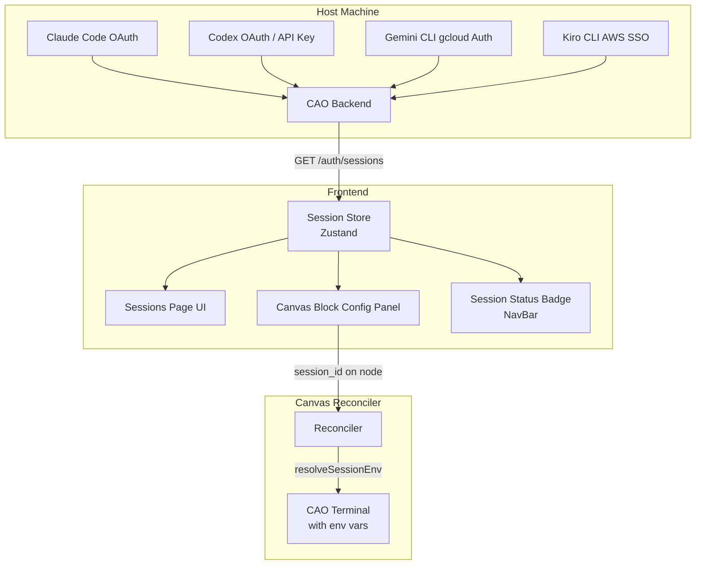
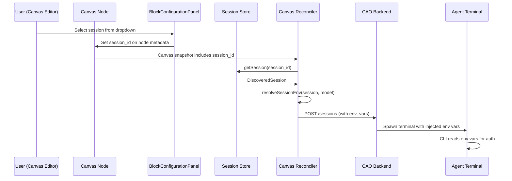

# Session Management

> Multi-CLI OAuth session discovery, routing, and lifecycle management for the Autonomous Agentic Orchestrator.

---

## 1. Overview

The **Session Management** feature enables the Agentic Orchestrator to discover, store, and route OAuth sessions across multiple CLI agent providers. Rather than requiring users to manually configure credentials for each agent terminal, the system automatically detects active CLI sessions on the host machine and makes them available through a unified UI and API layer.

**Key capabilities:**

- **Auto-discovery** of OAuth sessions from Claude Code, Codex, Gemini CLI, and Kiro CLI
- **Session routing** — each canvas agent node can be assigned a specific session
- **Env var injection** — session credentials are passed to agent terminals via scoped environment variables
- **Lifecycle monitoring** — real-time status badges (active / expiring / expired) with automatic refresh
- **Revoke support** — users can revoke sessions directly from the UI

---

## 2. Architecture

Sessions flow through three layers: **Discovery → Store → Routing**.



### Data Flow

1. **Discovery**: The CAO backend scans config directories for each CLI provider, detecting active OAuth tokens.
2. **Storage**: The frontend fetches discovered sessions via `GET /auth/sessions` and stores them in a Zustand store (`useSessionStore`).
3. **Routing**: When a canvas node has a `session_id`, the reconciler calls `resolveSessionEnv()` to map the session to provider-specific environment variables, which are injected into the terminal process.

---

## 3. Per-CLI Authentication

Each CLI provider uses a different authentication mechanism and environment variable contract:

| Provider | Config Env Var | Model Env Var | Auth Method |
|----------|---------------|---------------|-------------|
| **Claude Code** | `CLAUDE_CONFIG_DIR` | `ANTHROPIC_MODEL` | OAuth token stored in config dir |
| **Codex** | — | `OPENAI_MODEL` | API key or OAuth |
| **Gemini CLI** | — | `GEMINI_MODEL` | `gcloud` application-default credentials |
| **Kiro CLI** | `KIRO_HOME` | — | AWS SSO via Kiro home dir |

### Claude Code

Claude Code stores OAuth credentials in a per-profile config directory. Setting `CLAUDE_CONFIG_DIR` tells the CLI which credential set to use, enabling multi-account support.

### Codex

Codex uses either an API key (stored in the key store) or an OAuth flow. The `OPENAI_MODEL` env var selects the model for the session.

### Gemini CLI

Gemini CLI delegates authentication to `gcloud auth application-default login`. The `GEMINI_MODEL` env var controls model selection.

### Kiro CLI

Kiro CLI uses AWS SSO credentials stored under `KIRO_HOME`. Setting this env var points Kiro to the correct credential profile.

---

## 4. Session ID Flow

The `session_id` travels through the system from the canvas editor to the terminal process:



### Step-by-step

1. **Canvas UI**: The user opens the Block Configuration Panel and selects an OAuth session from the dropdown.
2. **Node metadata**: The `session_id` is stored on the canvas node's metadata.
3. **Snapshot**: The reconciler generates a canvas snapshot containing all node metadata, including `session_id`.
4. **Env resolution**: `resolveSessionEnv()` maps the session to provider-specific env vars (e.g., `CLAUDE_CONFIG_DIR`, `OPENAI_MODEL`).
5. **Terminal spawn**: The reconciler includes `env_vars` in the `CreateSessionInput` payload sent to the CAO backend.
6. **Process isolation**: Each terminal process receives only its own env vars — no cross-contamination between agents.

---

## 5. Security Considerations

### No Tokens in Frontend

The frontend **never** handles raw OAuth tokens, API keys, or credentials directly. All sensitive data remains on the CAO backend. The frontend only receives:

- Session metadata (id, provider, email, status, expiry)
- Masked display data (via `maskEmail()`, `maskConfigDir()`)

### Environment Variable Isolation

Each agent terminal receives only the environment variables specific to its assigned session. There is no shared credential state between terminals.

### Config Directory Sandboxing

Config directories (e.g., `CLAUDE_CONFIG_DIR`, `KIRO_HOME`) are scoped per-session. Multiple OAuth accounts for the same provider can coexist without interference.

### Credential Sanitization

The `sanitizeForLog()` utility ensures that any session data logged for debugging has sensitive keys redacted (tokens, secrets, keys, passwords, credentials).

### Session Expiry Monitoring

The `useSessionMonitor` hook periodically refreshes session state and checks for expiring sessions via `isExpiringSoon()`, alerting users before credentials expire.

---

## 6. UI Guide

### Sessions Page

Navigate to **Sessions** from the sidebar. The page displays:

- **Provider sections**: Sessions grouped by CLI provider (Claude Code, Codex, Gemini CLI, Kiro CLI)
- **Session cards**: Each card shows:
  - Masked email (`jo***@example.com`)
  - Auth method badge (OAuth, SSO, gcloud, API Key)
  - Status indicator (active / expiring / expired)
  - Subscription type (if available)
  - Config directory (masked for security)
- **Add Session button**: Opens the OAuth login dialog for the selected provider
- **Revoke button**: Removes a session after confirmation

### Config Panel Dropdown

In the **Canvas Builder**, select any agent node and open the Block Configuration Panel. The **Auth Session** dropdown lists all discovered sessions for the node's provider, allowing you to assign a specific OAuth identity.

### Status Badge (NavBar)

The navbar displays a **Session Status Badge** showing a summary of active sessions. The badge color changes based on session health:

- 🟢 **Green**: All sessions active
- 🟡 **Yellow**: One or more sessions expiring soon
- 🔴 **Red**: Expired sessions detected

---

## 7. API Endpoints

### `GET /auth/sessions`

Discover all available OAuth sessions on the host machine.

**Response:**

```json
[
  {
    "id": "claude_code:profile-1",
    "cli_provider": "claude_code",
    "account_email": "john.doe@example.com",
    "config_dir": "/home/user/.claude-profile-1",
    "status": "active",
    "expires_at": "2026-06-01T00:00:00Z",
    "subscription_type": "pro",
    "auth_method": "oauth"
  }
]
```

### `POST /auth/login`

Trigger an OAuth login flow for a specific CLI provider.

**Request body:**

```json
{
  "provider": "claude_code",
  "config_dir": "/home/user/.claude-new-profile"
}
```

**Response:** `200 OK` on success, `4xx/5xx` on failure.

### `DELETE /auth/sessions/:id`

Revoke an active OAuth session.

**Request body:**

```json
{
  "provider": "claude_code",
  "config_dir": "/home/user/.claude-profile-1"
}
```

**Response:** `200 OK` if the session was successfully revoked.

---

## 8. Troubleshooting

### Session not discovered

- Ensure the CLI tool is installed and has been authenticated at least once.
- Check that the CAO backend is running (`GET /health` returns `{ "status": "ok" }`).
- For Claude Code, verify the config directory exists and contains valid OAuth tokens.
- For Gemini CLI, run `gcloud auth application-default login` first.

### Session shows "expired"

- Re-authenticate with the CLI provider's login command.
- Use the **Add Session** button on the Sessions page to trigger a new OAuth flow.
- Check if the token's TTL has been shortened by an admin policy.

### Env vars not injected into terminal

- Confirm the canvas node has a `session_id` set in the Block Configuration Panel.
- Verify the session is in `active` status (not expired).
- Check the reconciler logs for `resolveSessionEnv` output.

### Revoke button not working

- Ensure the CAO backend supports `DELETE /auth/sessions/:id`.
- Check network connectivity between the frontend and CAO backend.
- Inspect the browser console for error details.

### Multiple accounts for same provider

- Each config directory represents a separate OAuth profile.
- Use the **Add Session** dialog with a custom config directory to create a new profile.
- Assign different sessions to different canvas agent nodes via the Block Configuration Panel.
